Crypto:

1.RSA

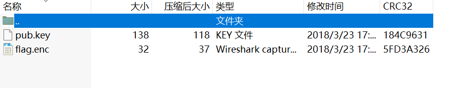

得到题目，两个文件都无法正常打开，将其都改成文档格式查看

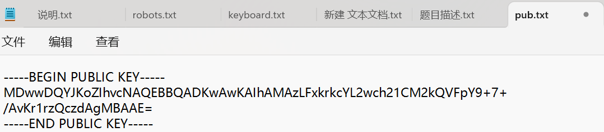

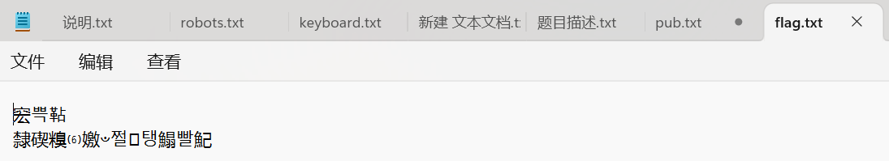

根据pub.txt可以得出这一共是个公钥使用工具进行解码

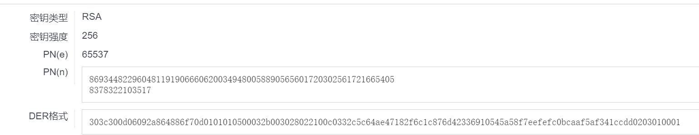

得到了n和e，然后这个是一个RSA，知道n后可以实用工具解出质数q和p（http://www.factordb.com/）

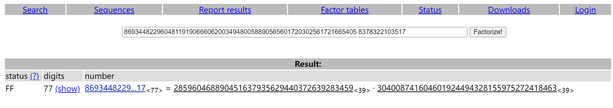

知道q、p、n、e之后就可以通过脚本来解出flag

```
import gmpy2
import rsa

e=65537
p=285960468890451637935629440372639283459
q=304008741604601924494328155975272418463

phi_n = (p-1)*(q-1)
d = gmpy2.invert(e,phi_n)
key = rsa.PrivateKey(p*q,e,d,p,q)

with open("flag.txt",'rb')as file:
    file = file.read()
    print(rsa.decrypt(file.key))
```

*一定要先将flag.txt和脚本放在同一路径下，才能成功运行*

运行后得到flag

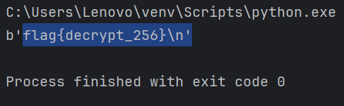

本题考察RSA，本题中打不开原本题目同上周周报一样修改格式，提取出题目中所给的信息，然后再去一步步解码得出我们计算所需要的条件（如果不修改格式也可以将两个文件拖入kali中，使用openssl 来打开，会得到一串字符，将其转换成十进制后，也能得出n）当q、p和e都得到后，在使用脚本得出flag

2.Vigenère

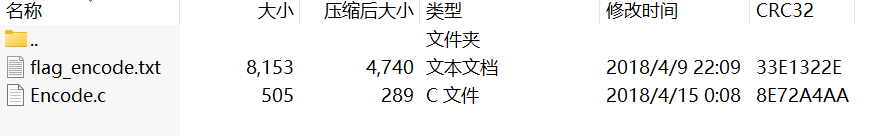

打开得到两个部分第一个是文档第二个是c程序根据这个题目其实可以猜测到大概与什么有关。

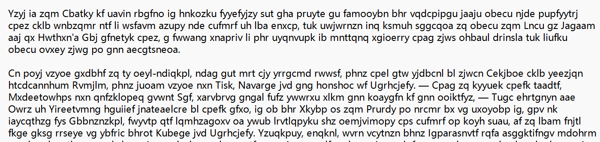

打开第一个文档，很明显的Vigenère（维吉尼亚）密码，不妨先使用工具暴力破解一下试试（https://www.guballa.de/vigenere-solver）

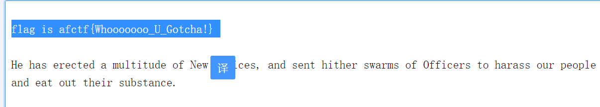

没想到居然找到了flag，那么第二个c程序就没有使用到。

本题就是Vigenère密码的解码，这个密码其实就是使用一系列凯撒密码组成密码字母表的加密算法，除了使用工具也可以用代码程序来进行加密解密。

3.yxx

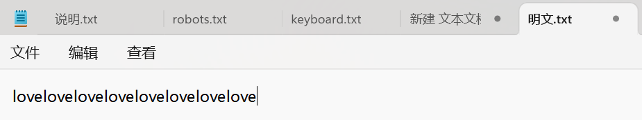

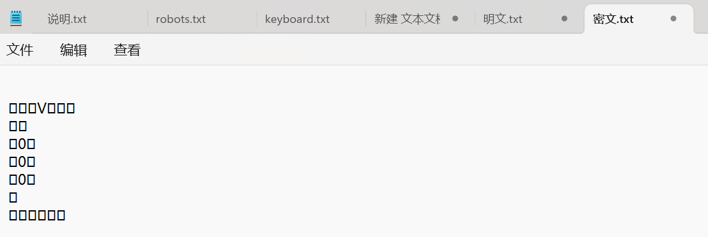

打开得到题目，一个明文一个密文，这个形式确实有点眼熟，但是不确定是哪种，题目yxx也不太懂什么意思，就上百度搜索了一下，也没搜出啥。但是在使用输入法打的时候突然反应过来这个像上周做的那个异性相吸的题目，然后就尝试把两个都转化成二进制


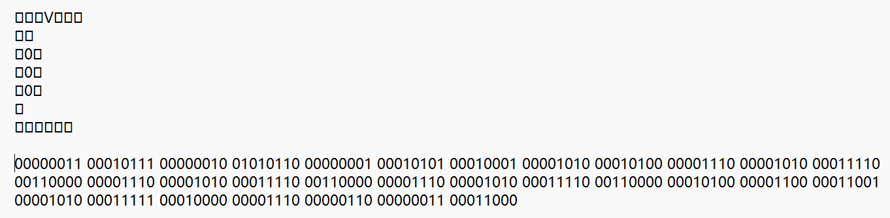

然后把转化后的二进制进行异或，上次使用的是c程序，这次使用python

```
a='0110110001101111011101100110010101101100011011110111011001100101011011000110111101110110011001010110110001101111011101100110010101101100011011110111011001100101011011000110111101110110011001010110110001101111011101100110010101101100011011110111011001100101'
b='0000101000000011000101110000001001010110000000010001010100010001000010100001010000001110000010100001111000110000000011100000101000011110001100000000111000001010000111100011000000010100000011000001100100001101000111110001000000001110000001100000001100011000'
c=''

for i in range(len(a)):
	if(a[i]==b[i]):
		c+='0'
	else:
		c+='1'
print(c)
```

运行后得到一串新的二进制

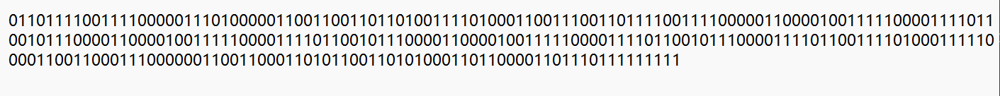

在使用工具将二进制转化一下，得到flag

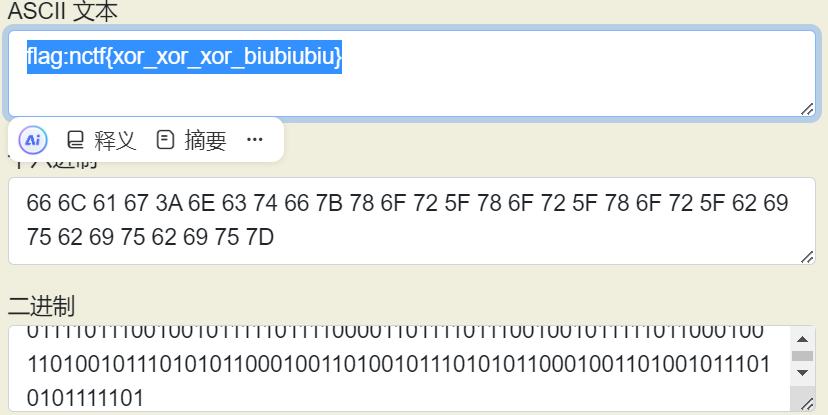

本题主要考察了二进制的转换，以及二进制的异或，如果觉得这种转换来转换去麻烦的话，还可以使用工具010editor打开，在里面的视图中可以转换成二进制。

4.佛系青年

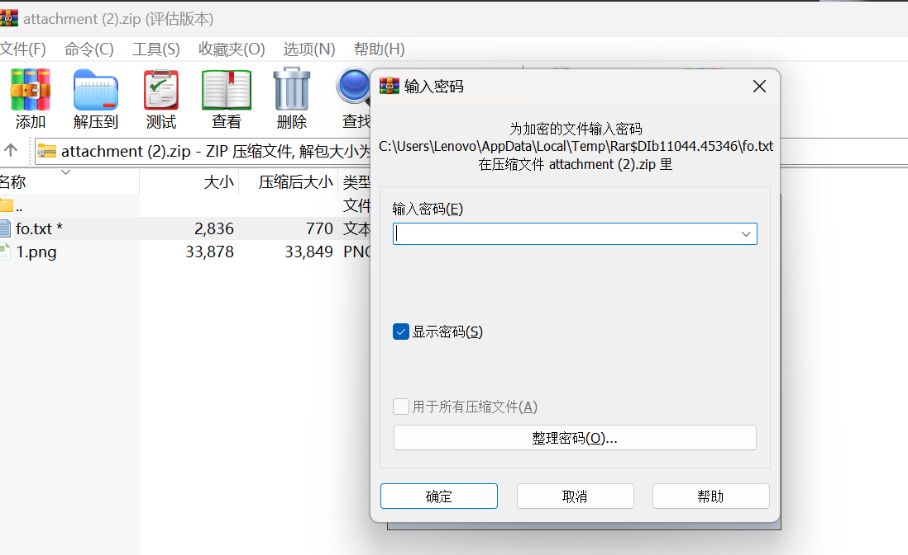

打开题目有一个图片（没有一点用）还有一个加密的文件，这种加密是很明显的伪加密，在我尝试使用暴力破解无果后，就搜寻工具，使用010editor打开，可以发现一段特殊颜色的字符

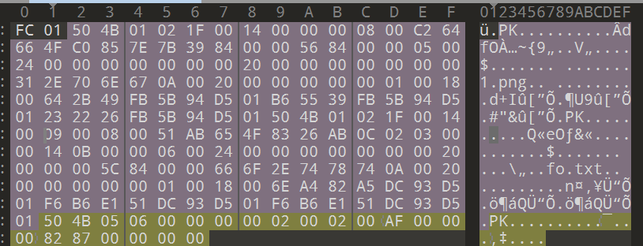

通过观察，发现这里有些不同，将09改成00保存试试

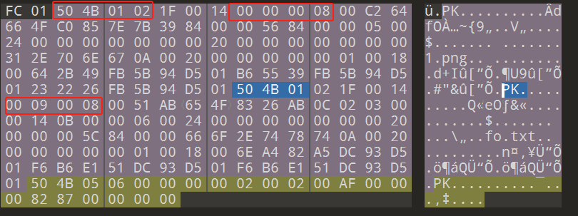

可以看到加密的文档已经可以打开

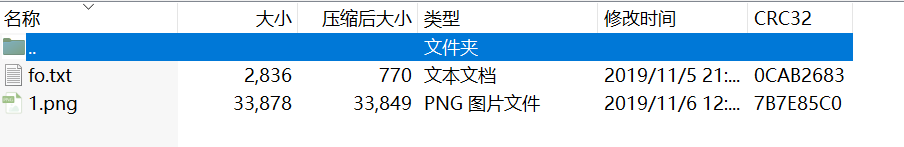

得到一串新佛曰密码，通过工具解密（https://ctf.bugku.com/tool/todousharp）

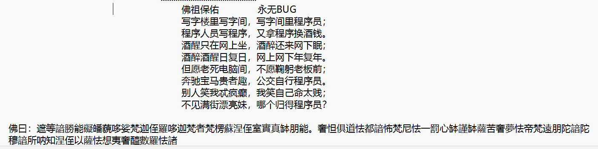

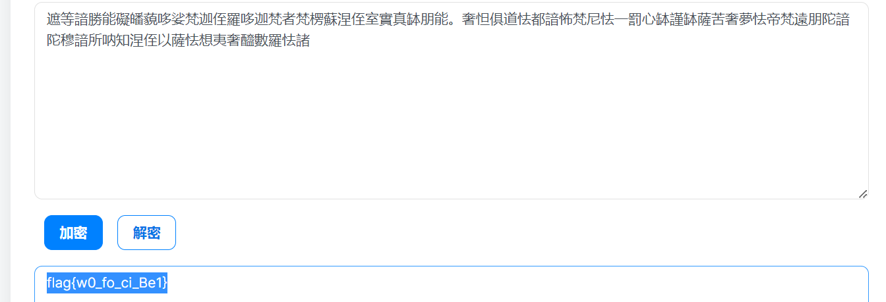

得到flag

本题提到了zip的伪加密，这里使用了工具010editor，但经过我的查询如果使用的解压软件是7z的话，是会直接无视这种伪加密，解压后可以直接打开文档。

Web

5.Warm up

  

打开看到一个表情包图片，查看源代码发现一个php文件，/source.php查看一下

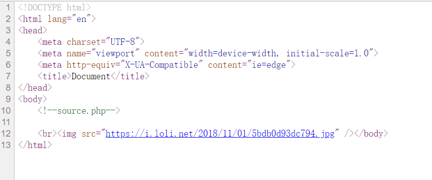

再次查看后看到还有一个与source.php类似的hint.php文件，再次查看

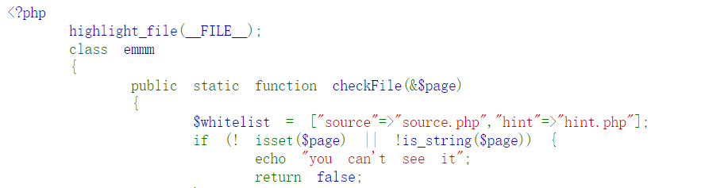

说flag在ffffllllaaaagggg中，我们再次查看

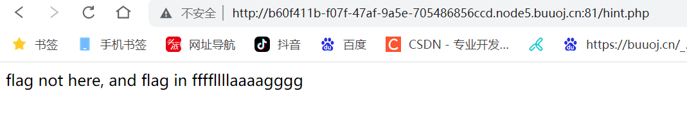

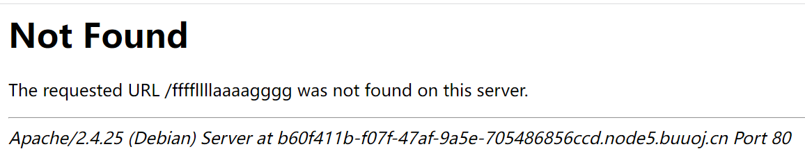

反馈错误，再返回去看上一步的源代码发现这可能不是一个网页，看下是否在这个文件中（/source.php?file=hint.php?ffffllllaaaagggg）

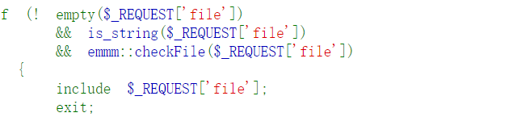

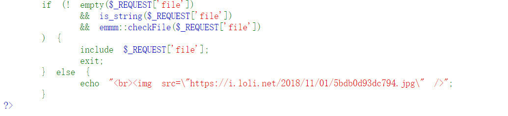

没有找到flag，但是我们发现图片没有了，说明我们的方向没有问题

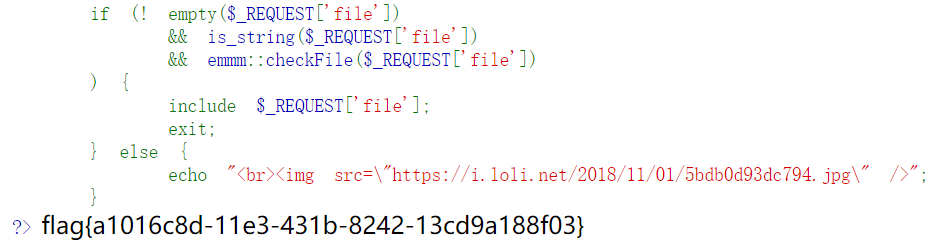

我们不知道他的目录是多少，使用../来查看，成功得到flag（/source.php?file=hint.php?../../../../../ffffllllaaaagggg）

本题主要考察的是代码审计，需要我们对PHP语法要有了解，要能看懂源代码中包含的信息学会变通，多尝试。


