Crypto：

1.rot

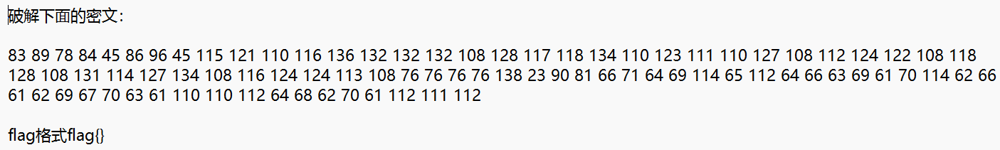

得到题目，只有二位数和三位数，结合题目推测应该是十进制或者ASCII码并且是要经过移位得到铭文

使用python脚本来进行移位

```
<!--先移位-->
c='83 89 78 84 45 86 96 45 115 121 110 116 136 132 132 132 108 128 117 118 134 110 123 111 110 127 108 112 124 122 108 118 128 108 131 114 127 134 108 116 124 124 113 108 76 76 76 76 138 23 90 81 66 71 64 69 114 65 112 64 66 63 69 61 70 114 62 66 61 62 69 67 70 63 61 110 110 112 64 68 62 70 61 112 111 112'
l=c.split('')
<!--转ASCII码-->
for i in range(1,14):
s=''
for j in range(len(l)):
s+chr(int(l[j])-i)
print(s)
```

运行后得到不完整的flag和一串MD5，想到未知的几位应该与这串MD5有关

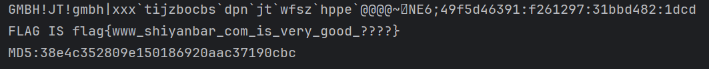

```
import hashlib
s='flag{www_shiyanbar_com_is_very_good_????}'
m='38e4c352809e150186920aac37190cbc'

def revmd5():
 for i in range(33,127):
     for j in range(33,127):
         for k in range(33,127):
             for n in range(33,127):
             a=s+chr(i)+chr(j)+chr(k)+chr(n)+'}'
             ha=hashlib.md5(a.encode()).hexdigest()
             if(ha == m)
             print(a)
             return
 revmd5()
```

运行得到flag


本题主要考察了rot的位移和MD5的密码爆破，很常见的题目。本题有两个知识点，一个是rot的移位，通过移位来求解原本的字符串（步骤一也可以是在rot13的原理上对每位数字都减13之后在转换ASCII码）另一个是MD5的爆破，用ASCII码转换后的字符，拼接字符串，用python模块和函数对MD5的值进行破解，进而成功获得未知的几位密码

2.异性相吸

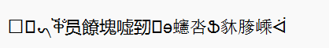

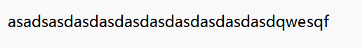

打开题目得到密文（上）和key(下)，根据题目中的给出的“异性”可以推测出这个“异”是不是想表达的是二进制，因此我们可以向这个方向摸索首先使用工具将密文和key都转化成二进制（工具地址：https://www.bchrt.com/tools/ascii-converter/）

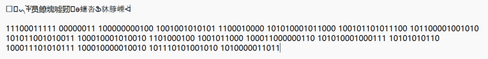

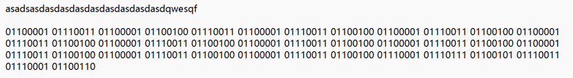

转换后发现两个得到的二进制数的位数相同，在回过去看题目，”相吸“猜测是不是同或或者异或，尝试一般会使用的异或，用C来写

```
#include <bits/stdc++.h>
using namespace std;

int main(){
    string miwen="11100011111 00000011 100000000100 1001001010101 1100010000 101010001011000 100101101011100 101100001001010 101011001010011 100010001010010 1101000100 1001011000 100011000000110 101010001000111 10101010110 100011101010111 100010000010010 101110101001010 1010000011011"
    string key="01101010 11000110 10011101 10110001 10101011 00011101 01101010 11000111 01011010 10110001 11010110 10101100 01110101 10101011 00011101 01101010 11000111 01011010 10110001 11010110 10101100 01110101 10101011 00011101 10101011 00000111 10101100 10101001"
    for (int i=0;i<miwen.length();i++)
    {
      if (miwen[i] == key[i]) cout<<"0";
      else cout<<"1";
    }
    return 0;
    }
```

运行得出一串新的二进制数，在使用工具转换，得到flag

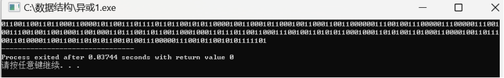

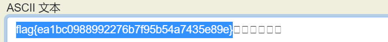本题主要考察了二进制的转换，以及二进制的异或。本题最重要的一点就是要理解题目并且能够结合题目去思考，可以灵活使用工具，另一个就是异或，可以理解异或的脚本并且使用在不同的题目中，帮助找寻flag。

3.天干地支+甲子

得到题目

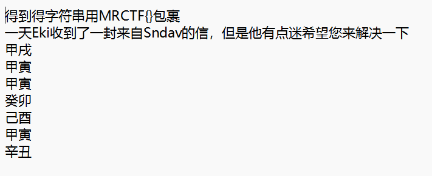

根据题目名字可以得知，肯定与天干地支有关系，根据天干地支表找出对应的数字

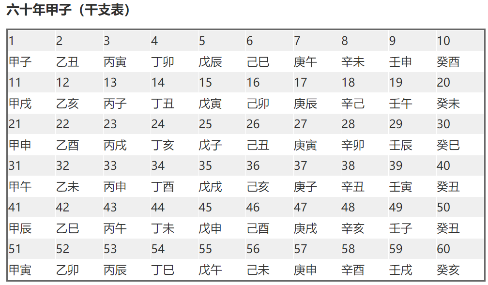

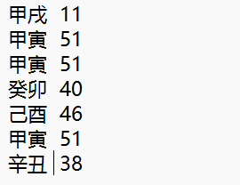

根据题目可知，加甲子，甲子在这里应该是60，再给每个数字都加60


得到新的数字，十进制的可以尝试转换为ASCII码

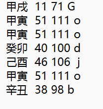

得到flag{Goodjob}

本题考察的是天干地支和甲子的应用。本题的知识点是对天干地支的数字对照表要有了解，同时还要能反应到甲子是加多少，在看到ASCII码的范围内的数字可以及时想到是否可以用ASCII来转换，一步一步循序渐进得到flag

Misc:

4.N种方法解决

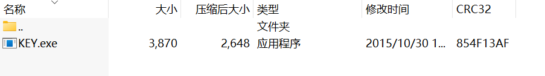

得到题目，是一个应用程序，但是无法打开，思考是不是格式有问题，试着转换成文本

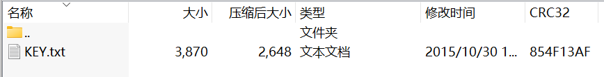

成功打开

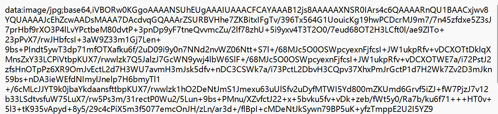

开头可以看出有个/jpg得出应该是和图片有关系，后面还跟着一个base64，并且浏览下来整个文档是符合base64的编码的，既有图片又有base64，可以使用工具来进行转换（http://www.yzcopen.com/img/imgbase64）


转换后得到一个二维码，扫了之后得到flag

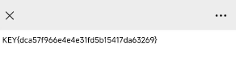

本题主要考察的是base64的图片转换。涉及到的知识点有当我们得到的题目不能顺利打开时，就要考虑是不是格式有问题，可以多修改几个格式进行尝试，再就是要熟悉base64的编码特征（既有大小写字母，也有数字和符号+、/，并且结尾一般都有“==”号）还有要有熟知base64的转化工具（图片、数字等）

5.wireshark

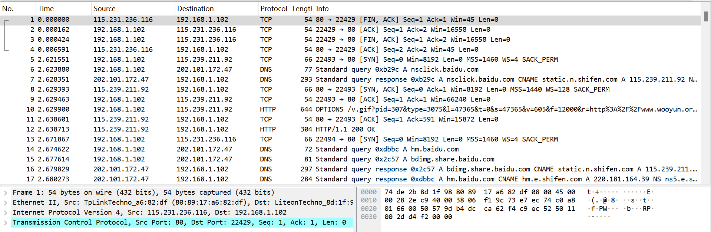

打开得到题目，可以先尝试筛选一下flag试试

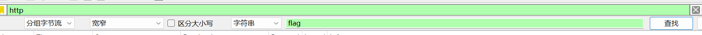


好的查找无果，回过头再看，根据题目的提示可以得知这个flag是一个管理员登录网站时的密码，了解到这个应该是一个post类型的请求

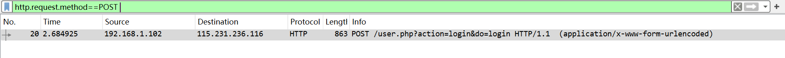

再次筛选，最后可以通过追踪流找到flag

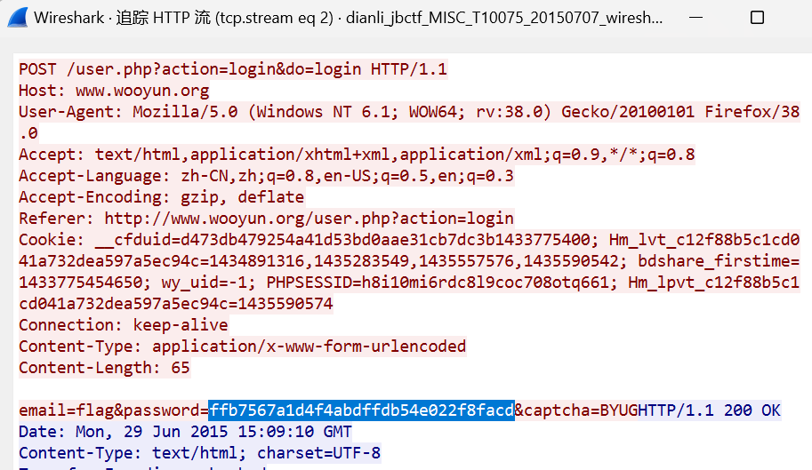

或者通过工具直接滤出post请求的数据，找到flag及password

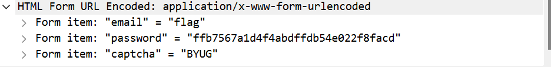

本题主要考察在wireshark中如何分析请求类型并且进行过滤，找到对应的请求数据从而获得我们想要的信息。本题的知识点有请求的类型（提交登录的用户名和密码，可能就是post请求，获取一个页面资源，应该就是get请求）还有就是在追踪流中我们可以看到一个完整的连接请求（粉色代表客户端发送的请求，紫色为响应部分）
