## easy_tornado


点进去后发现三个文件，依次点开后发现，flag在/fllllllllllllag中，第二个文件中发现render函数

```
render是python中的一个渲染函数，也就是一种模板，通过调用的参数不同，生成不同的网页 ，如果用户对render内容可控，不仅可以注入XSS代码，而且还可以通过{{}}进行传递变量和执行简单的表达式。
Tornado是一种 Web 服务器软件的开源版本。Tornado 和现在的主流 Web 服务器框架（包括大多数 Python 的框架）有着明显的区别：它是非阻塞式服务器，而且速度相当快。
```

```
在tornado模板中，存在一些可以访问的快速对象,这里用到的是handler.settings，handler指向RequestHandler，而RequestHandler.settings又指向self.application.settings，所以handler.settings就指向RequestHandler.application.settings了，这里面就是我们的一些环境变量
```

构造payload：**/error?msg={{handler.settings}}**

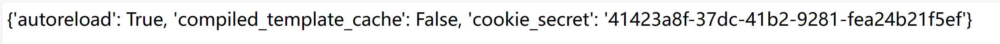

将得到的cookie_secret+filenameMD5加密后得到：75b13064ca1269d1a7c3631c6d04e0a6

构造payload：**/file?filename=/fllllllllllllag&filehash=75b13064ca1269d1a7c3631c6d04e0a6**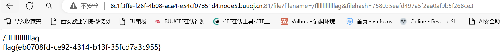


## cisp-pte:14-01

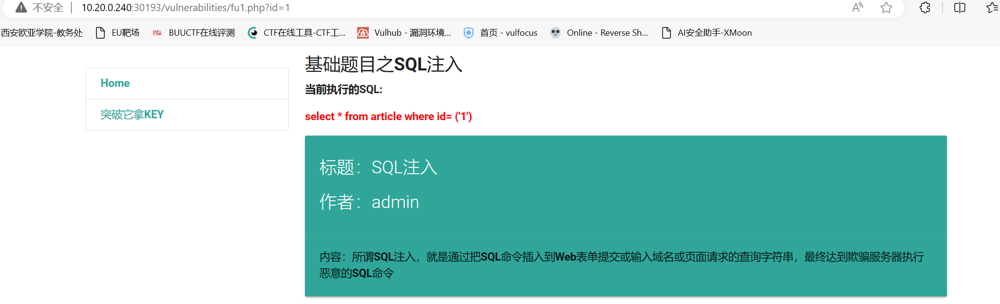

发现是个get型，先检查闭合点发现是')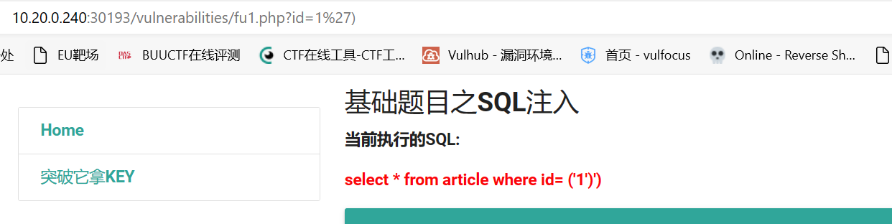

注释时发现#被过滤了，用%23进行一个替换页面回显正常

直接联合查询时发现，union，空格被过滤了，这里可以双写和/**/绕过，然后再跟着查询字段数，发现为4个字段

2,3,4均为回显点，这里配合load_file进行一个key的读取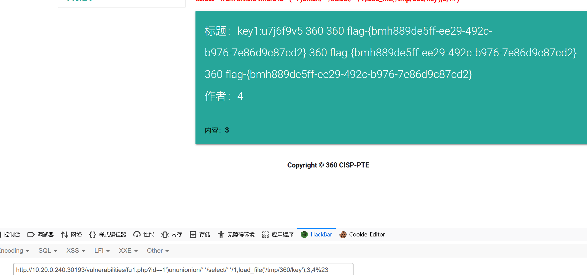


## cisp-pte:14-02


上传一个图片🐎，通过burp将后缀名改为.pht后上传成功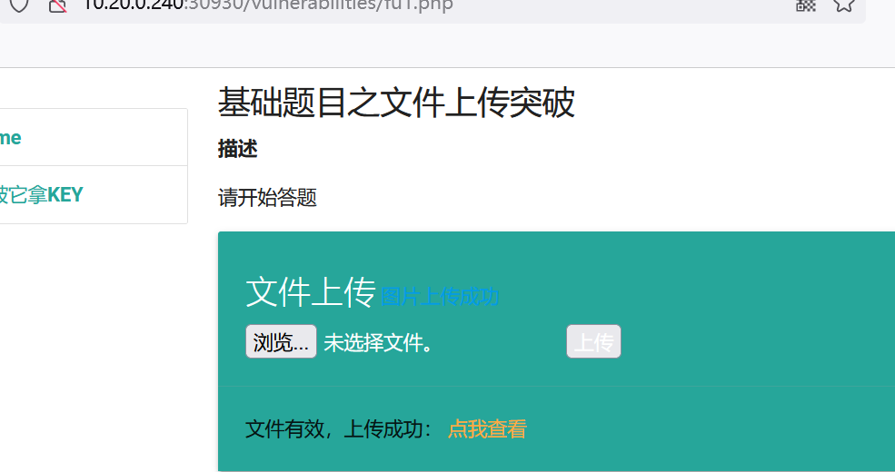


在tmp目录下找到flag

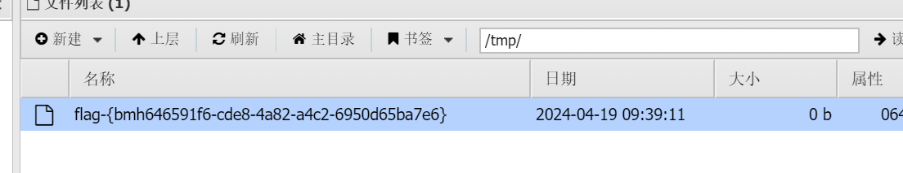


## cisp-pte:14-03

打开网站进入答题后到这个界面，发现存在file读取


于是我们试着看能不能直接读取到key，用伪协议去读取php文件，构造payload：file=php://filter/read=convert.base64-encode/resource=../key.php（这里也可以通过data协议写🐎，然后通过蚁剑进行连接）


进行解码后得到了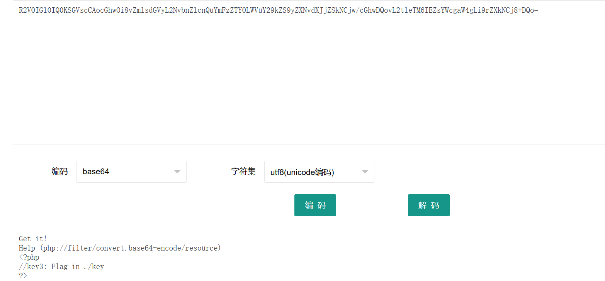

提示在./key

解密后得到flag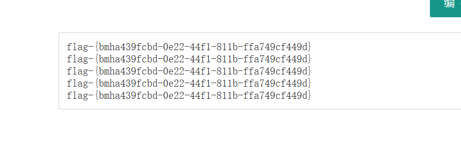

##  cisp-pte:14-04

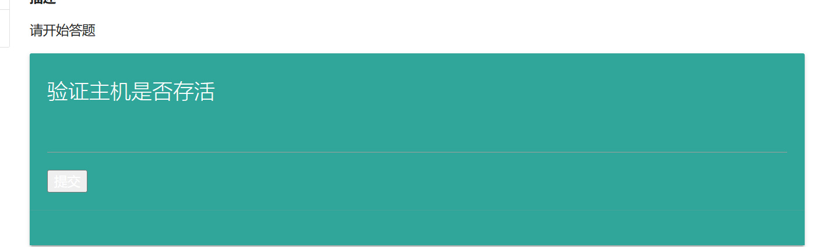
查看根目录下有哪些文件

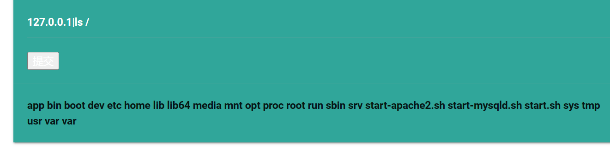
查看tmp下的flag和key.php
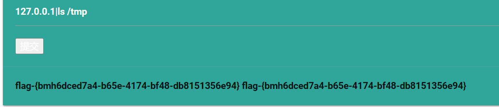

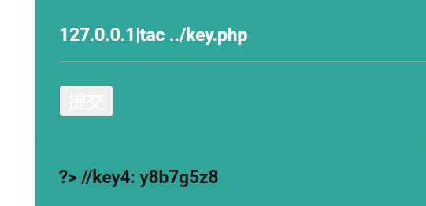


## 一次内网渗透

​	首先挂上vpn保证能互通，进入相关网站并上传一句话木马。打开上线cs，监听所选定的ip，然后生成一个可执行的.exe的通过蚁剑进行上传，切换到终端去运行此程序，这时候cs就上线了，然后可以通过fscan，去探测内网的存活主机（还有另一个插件也可以探测到内网的存活主机），拿到ip后，进行一个socks4代理，然后上fox挂代理访问对应ip,进入到dvwa靶场中，这里要登录，我们拿默认的账号密码登录后，随便选一关然拿根目录下的flag

## 应急响应

### 前置

top #命令可以直接看到进程实时情况。
ps aux --sort=pcpu | head -10 # 查看cpu占用率前十的进程，有时候可以发现top发现不了的东西
netstat -anpl  # 检查当前存在的连接与监听端口
ps -ef #查看当前系统上运行的所有进程与其使用的命令
w # 查看活动用户
who # 查看当前登录用户（tty 本地登陆  pts 远程登录） /var/log/utmp
last # 查看用户登录日志，查看我们系统的成功登录、关机、重启等情况 /var/log/wtmp
lastb # 查看登陆失败的用户日志 /var/log/btmp
lastlog # 查看所有用户登陆日志 /var/log/lastlog
lsof -i :3306 # 查看谁在使用某个端口
lsof -nPi 查看内部对外的网络连接
Strace 集诊断、调试、统计一体的工具。  `strace -f -p pid` 查看进行的行为
busybox是应急常用的工具。 如果系统命令被替换了可以使用此命令来查看系统相关信息
stat /etc/passwd #查看密码文件上一次修改的时间，如果最近被修改过，那就可能存在问题。
cat /etc/passwd | grep -v nologin #查看除了不可登录以外的用户都有哪些，有没有新增的
cat /etc/passwd | grep x:0 #查看哪些用户为root权限，有没有新增的
cat /etc/passwd | grep /bin/bash #查看哪些用户使用shell
grep -oE "\b([0-9]{1,3}\.){3}[0-9]{1,3}\b" nohup.out  使用grep命令结合正则表达式来提取日志文本文件中的所有IP地址。（如果需要去重，可以使用`sort`和`uniq`命令）

### linux-1

前景需要：小王急匆匆地找到小张，小王说"李哥，我dev服务器被黑了",快救救我！！

挑战内容：1.黑客的IP地址 2.遗留下的三个flag	

打开vm进入靶机中并切换到root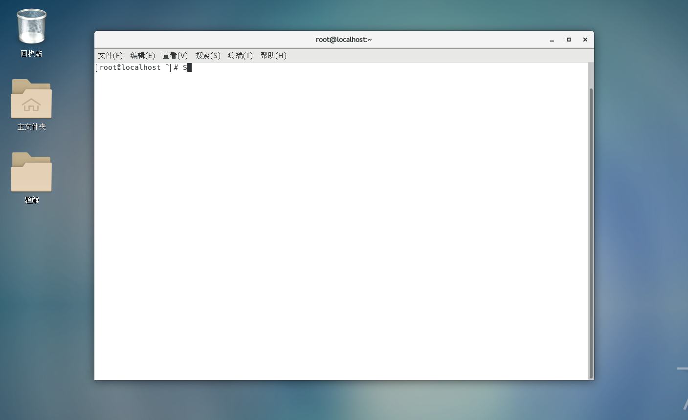

首先我们进行一个连接日志的查询，看看能否获得黑客的ip地址（这个是看最近用户的登录情况： grep "Accepted " /var/log/secure*）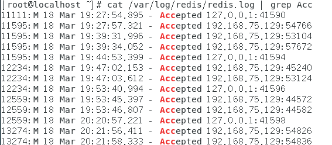

接着进行一个命令的检查看看有没有更改一些命令

这里获得第一个flag
观察发现对rc.local这个文件有过一些操作，打开这个文件后获得第二个flag

同时发现对redis的配置文件修改过查看后发现第三个flag（这还有另一种思路）


思路二：可以查看哪些文件被修改过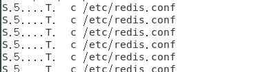

同样可以看到redis的配置文件被修改过

我们再来查看有没有新添加的可疑用户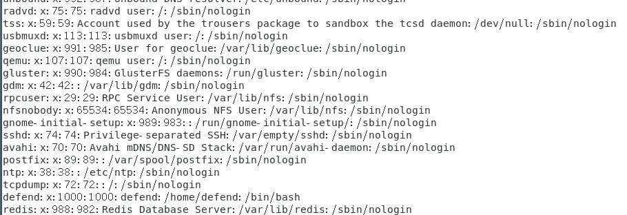

找了一圈后发现似乎没有

接下来查看下有没有可疑的进程


发现没有，接着进行下一步的查询，想到了刚才查看`passwd`文件时，最后一个用户是`redis`用户，说明该机器上存在`redis`服务，于是查看网络连接，看看`6379`端口是否开放，发现并没有开放。到这结束了


