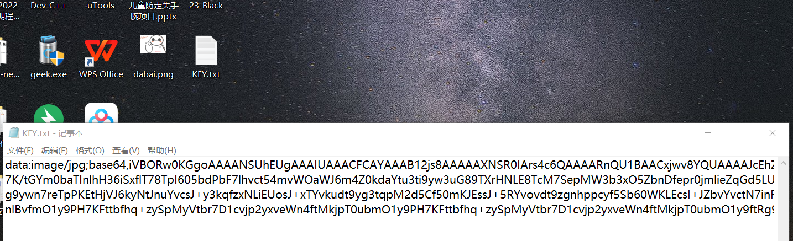
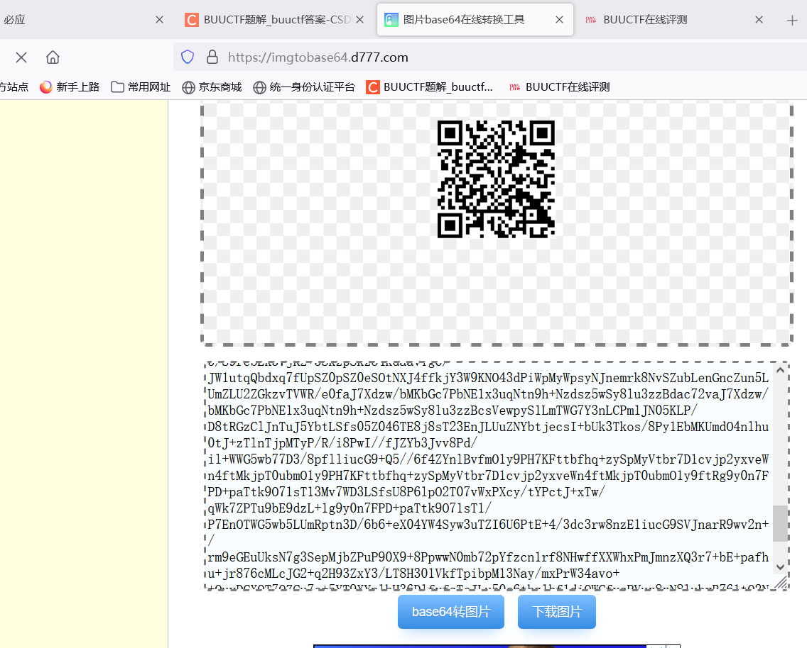

# N种方法解决

下载题目中的文件于本地,将文件改为txt格式，打开文件

鉴定为base64转图片

利用在线转换网站：图片base64在线转换工具，发现是个二维码，扫描后可得到
KEY{dca57f966e4e4e31fd5b15417da63269}

注意题目要求：得到的 flag 请包上 flag{} 提交

flag{dca57f966e4e4e31fd5b15417da63269}