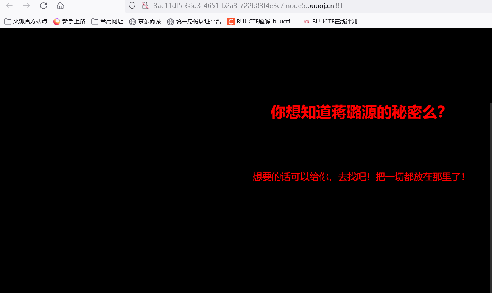
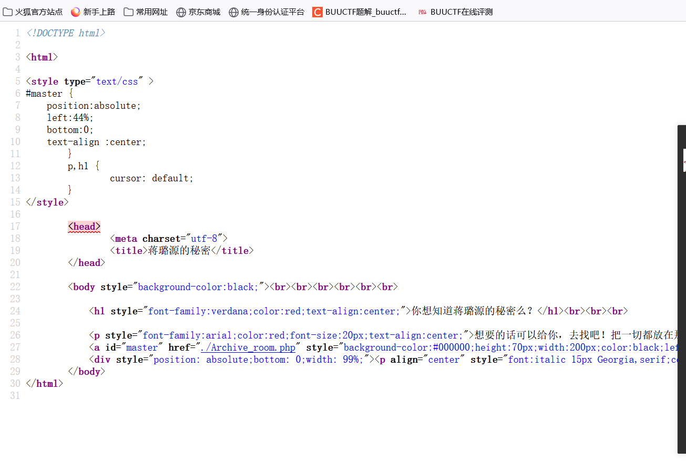
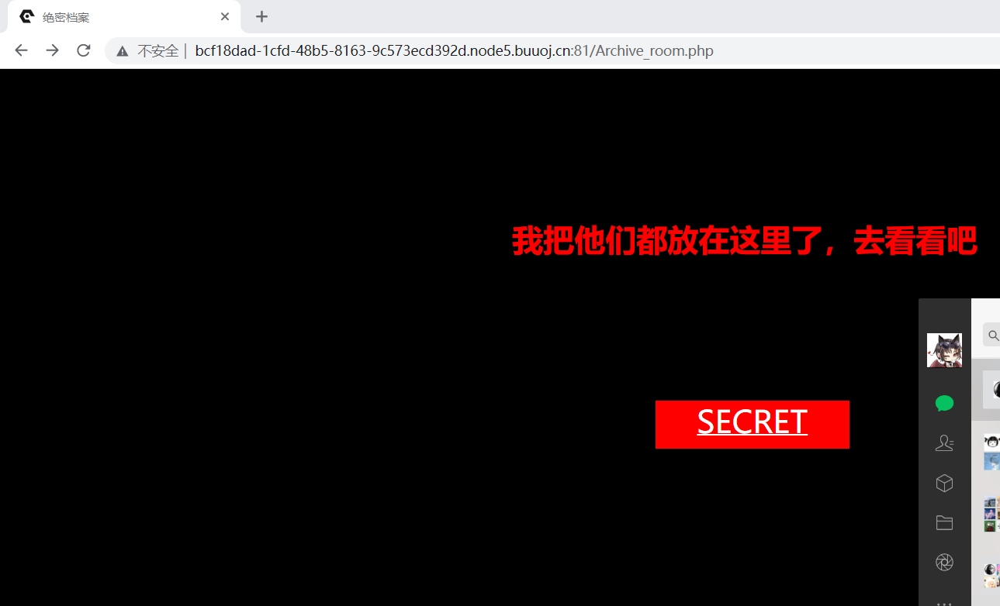
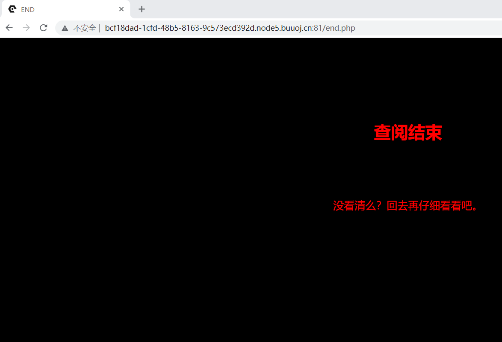
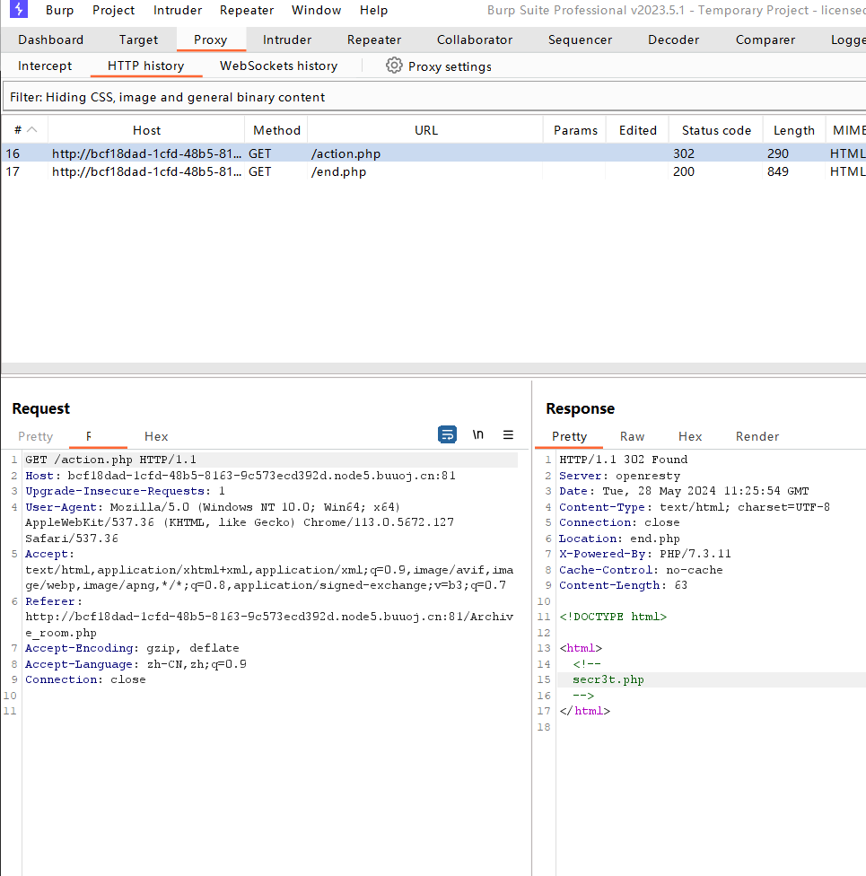
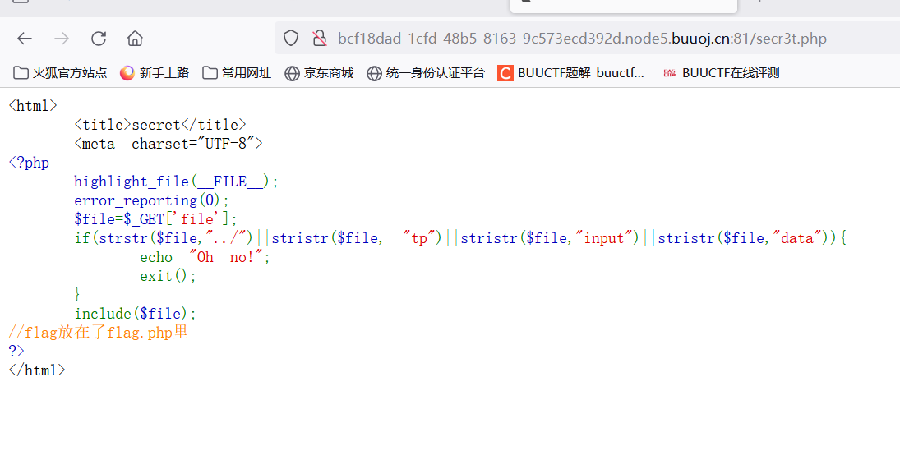
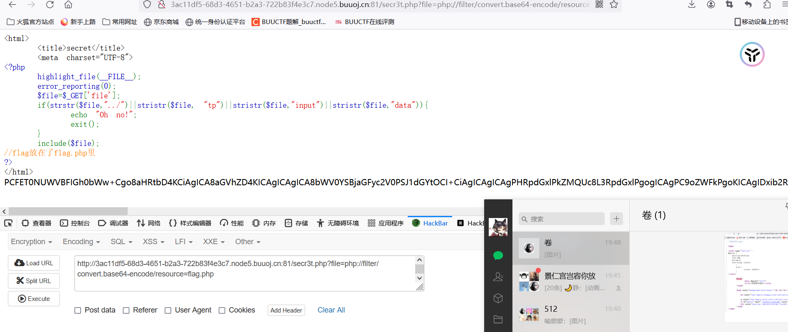
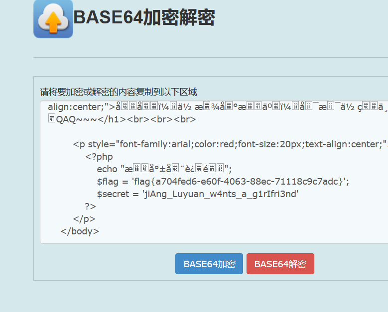

# [极客大挑战 2019]Secret File

点击题目链接查看题目详情

F12查看源代码

发现链接Archive_room.php，访问链接

从这个页面开始打开BP抓包页面

这里再次点击SECRET

通过抓包，找到了secr3t.php

直接对其进行访问

发现这个没有过滤file

直接使用php伪协议

secr3t.php?file=php://filter/convert.base64-encode/resource=flag.php

直接解码获得flag

