# Tw1t-周报

*不要局限于眼前，否则你就会被困在现在*


## 1. [GXYCTF2019]luck_guy

*熟悉的re起手*

### 本题知识点：

```
小端序和大端序，字符串与16进制的转换,memset()函数

小端序存储：
即最低地址存放的最低字节
ELF文件通常使用小端序存储
IDA会把内存中的数据自动转化为大端序存储

```

附件下载地址:https://files.buuoj.cn/files/c4ae5d67227e2354c3b512d6bd8b180a/attachment.zip

RE第一步，查壳


64位应用，无壳。

拖入ida_x64中进行静态逆向分析

打开字符串窗口后，第一眼就看到了疑似flag结构的东西。

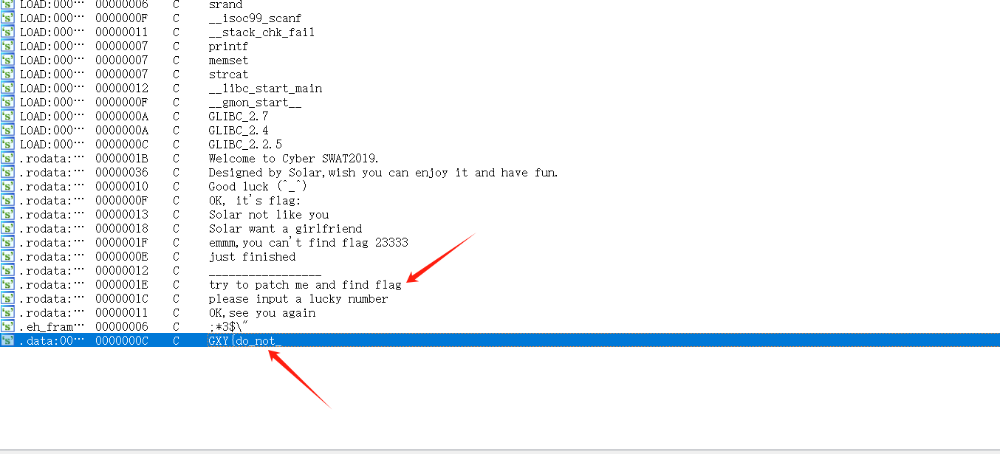

双击跟进，ctrl+x对该段查调用

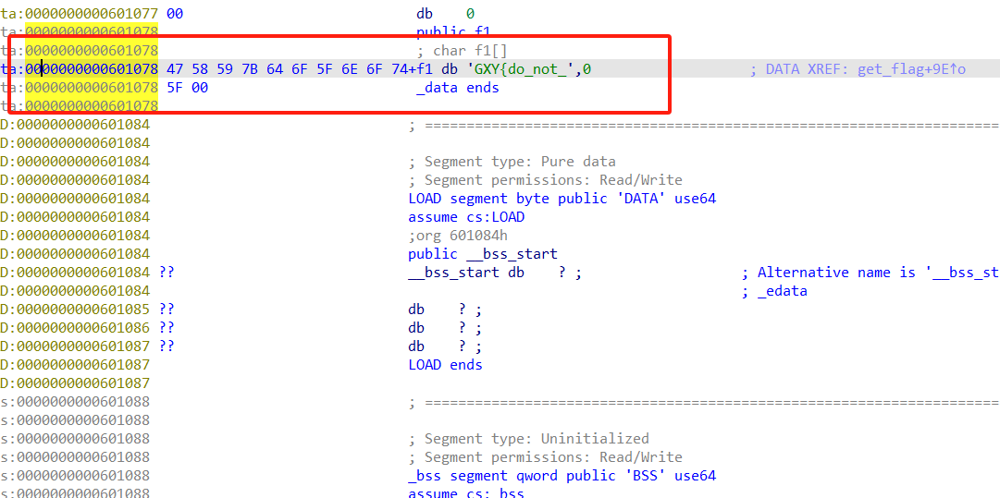

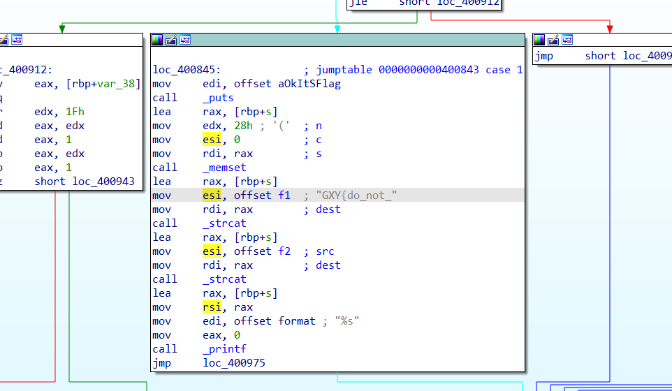

F5反编译成伪c代码进行分析

可以看到有几个熟悉的操作

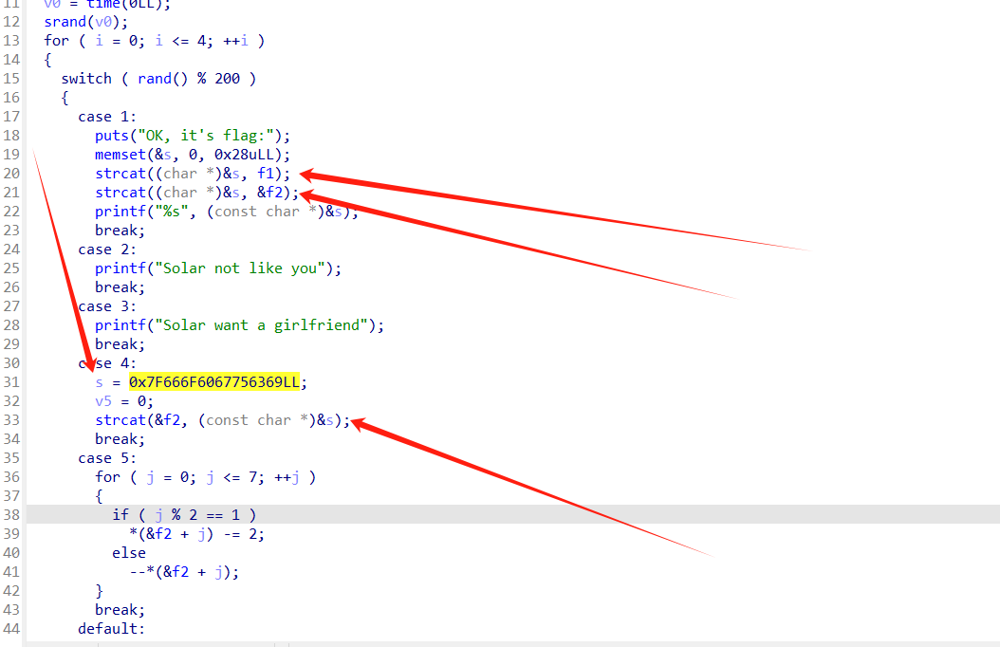

strcat()函数：字符串拼接；s=0x7F666F6067756369LL:赋值操作

本题的主要不同点就是有了switch（）函数和memset()函数

switch()函数

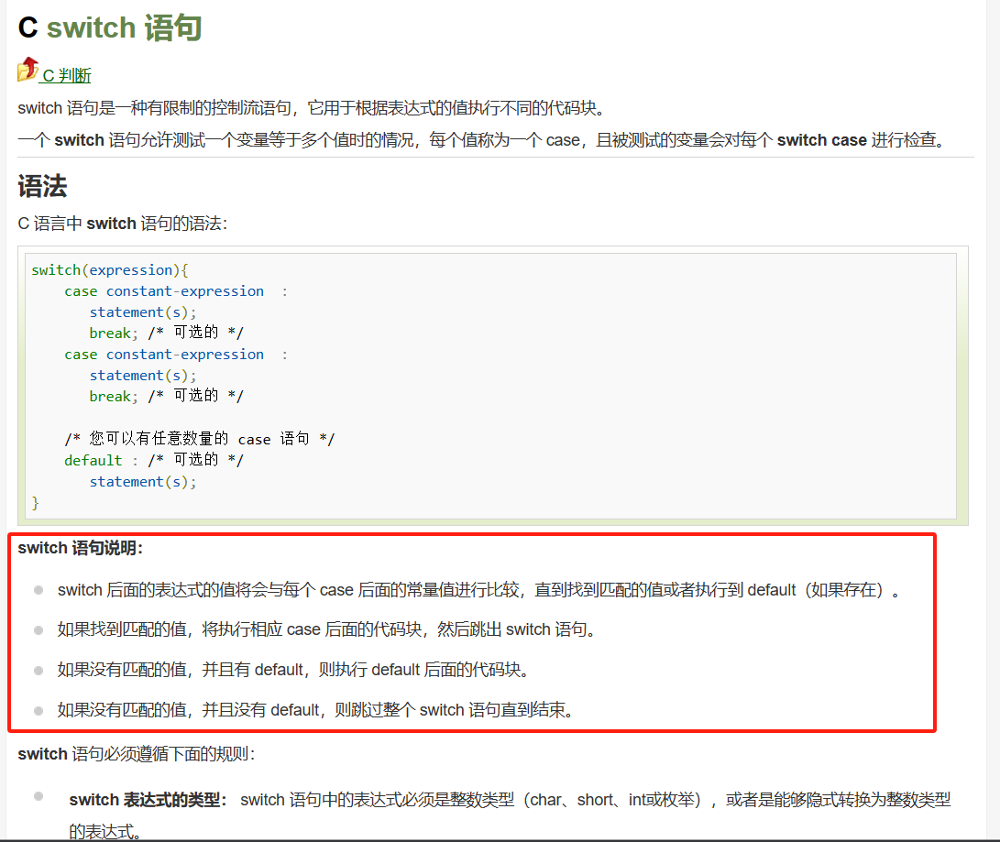

memset()函数

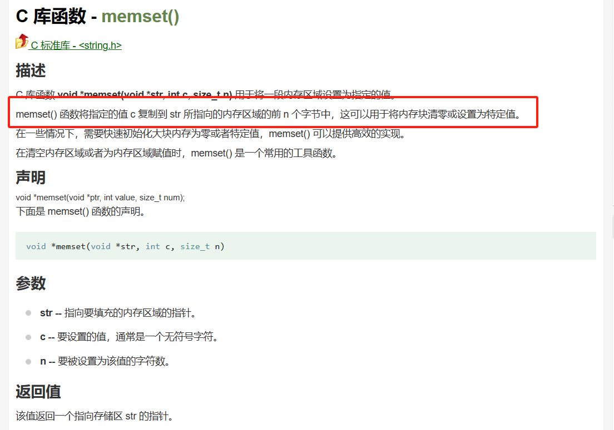

简单来说就是将函数第二个参数的值复制到第一个参数所指向的内存区域的前n(第三个参数)个字节， __有点类似于插队还把被插队的人退出的的意思。__

搞明白函数的意思后，再来看这段伪c代码

```c#
 for ( i = 0; i <= 4; ++i )
  {
    switch ( rand() % 200 )
    {
      case 1:
        puts("OK, it's flag:");   /*从这里可以看到，输出了it's flag:  推测下面有关于对flag的变量进行调用*/
        memset(&s, 0, 0x28uLL);   /* 这里把变量s的前0x28ull位变成了0*/
        strcat((char *)&s, f1);   /*这里把f1拼接到字符串s的后面*/
        strcat((char *)&s, &f2);  /*同理，把f2拼接到字符串s的后面*/
        printf("%s", (const char *)&s);/*这里输出了字符串s，由此结合前面的分析可以推测s就是flag*/
        break;
      case 2:
        printf("Solar not like you");
        break;
      case 3:
        printf("Solar want a girlfriend");
        break;
      case 4:
        s = 0x7F666F6067756369LL; /*s赋值为0x7F666F6067756369LL*/
        v5 = 0;
        strcat(&f2, (const char *)&s);/*把s拼接到f2的后面*/
        break;
      case 5:
        for ( j = 0; j <= 7; ++j )
        {
          if ( j % 2 == 1 )
            *(&f2 + j) -= 2; /* 如果j是奇数，f2+j-=2*/
          else
            --*(&f2 + j);/*如果j是偶数，f2+j*/
        }
        break;
      default: /*没有进入switch循环则输出emmm,you can't find flag 23333*/
        puts("emmm,you can't find flag 23333");
        break;
    }
  }
  return __readfsqword(0x28u) ^ v6;/*不重要*/
}
```

通过对这段代码的详细分析，我们应该了解到的信息

1.s是flag

2.s是由f1和f2拼接形成的

双击跟进找f1

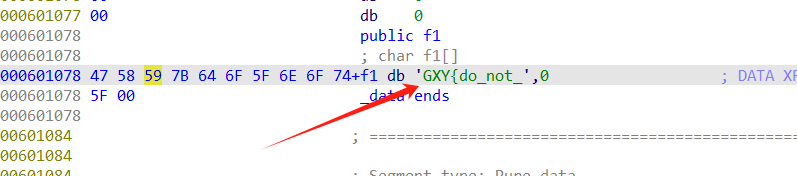

```
f1=GXY{do_not_
```

现在只要我们找到f2是什么，他俩进行一个拼接就可以得到flag了

直接点击f2跟进查看f2的值 ，发现是空值。

但是显然空值和f1拼不到一个完整的flag。

那么我们就该分析switch（）函数了。

主要难点在于switch（）函数里的参数是rand（）函数生成的，我们并不清楚他的case语句是如何进行的。

> 这里设计一个rand（）伪随机的知识点,只要种子不变，随机数就不会改变。

这里我们可以进行一个推理，

case1→输出ok this is flag 

case2/3→输出一个字符串，没有对flag里的任何参数进行操作

case4→对s进行了赋值，把s拼到了f2后面

case5→对f2进行操作。

现在我们需要进行一个逻辑上的梳理：程序肯定是要输出最后的正确的flag的。

抛开case2/3输出两段没用的话。

1直接输出了ok this is flag 所以他应该在最后

__5是对f2进行处理，4是s拼到f2.__

所以4应该在5前面。

ok，那么顺序应该就是c4→c5→c1。

```
s = 0x7F666F6067756369LL
```

```C#
case 5:
        for ( j = 0; j <= 7; ++j )
        {
          if ( j % 2 == 1 )
            *(&f2 + j) -= 2; /* 如果j是奇数，f2+j-=2*/
          else
            --*(&f2 + j);/*如果j是偶数，f2+j*/
        }
        break;
```

搞清楚这一点后，我们开始尝试还原flag

```python
flag = 'GXY{do_not_'
s = [0x69,0x63,0x75,0x67,0x60,0x6F,0x66,0x7F]  # 这里的s是倒叙过的，涉及大小端存储问题，知识点有总结。
f2 = ''
for i in range(8):
    if i % 2 == 1:
        f2 = chr(int(s[i]) - 2)
    else:
        f2 = chr(int(s[i]) - 1)
    flag += f2
print(flag)
```


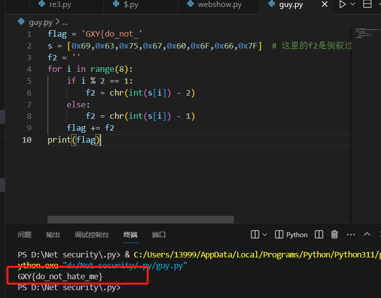

*最后把GXY改为flag就可以了。*

## 2.[Buuctf]-简单注册器

*活着就很累了，不要和不开心的人和事纠缠*

### 本题知识点

```
1.jadx工具基本使用
2.c语言基本的代码阅读能力,c语言头文件。
```

拖入jadx反编译

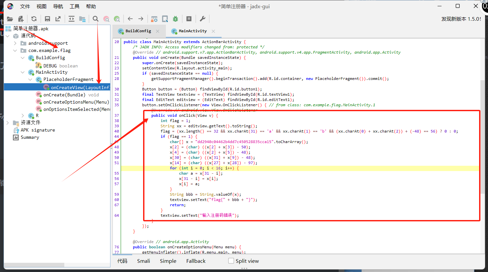

通过跟进flag找到关键代码

```c++
public void onClick(View v) {
                int flag = 1;
                String xx = editview.getText().toString();
                flag = (xx.length() == 32 && xx.charAt(31) == 'a' && xx.charAt(1) == 'b' && (xx.charAt(0) + xx.charAt(2)) + (-48) == 56) ? 0 : 0;
                if (flag == 1) {
                    char[] x = "dd2940c04462b4dd7c450528835cca15".toCharArray();
                    x[2] = (char) ((x[2] + x[3]) - 50);
                    x[4] = (char) ((x[2] + x[5]) - 48);
                    x[30] = (char) ((x[31] + x[9]) - 48);
                    x[14] = (char) ((x[27] + x[28]) - 97);
                    for (int i = 0; i < 16; i++) {
                        char a = x[31 - i];
                        x[31 - i] = x[i];
                        x[i] = a;
                    }
                    String bbb = String.valueOf(x);
                    textview.setText("flag{" + bbb + "}");
                    return;
                }
```

通过代码分析，提炼出关键的flag处理代码

```C++
if (flag == 1) {
                    char[] x = "dd2940c04462b4dd7c450528835cca15".toCharArray();
                    x[2] = (char) ((x[2] + x[3]) - 50);
                    x[4] = (char) ((x[2] + x[5]) - 48);
                    x[30] = (char) ((x[31] + x[9]) - 48);
                    x[14] = (char) ((x[27] + x[28]) - 97);
                    for (int i = 0; i < 16; i++) {
                        char a = x[31 - i];
                        x[31 - i] = x[i];
                        x[i] = a;
```

这段代码处理了flag，我们只需要运行一下就可以得到flag，为了让其正常显示，我们加一个printf()，引用一下头文件;

```c++
#include<stdio.h>
#include<string.h>
int main() {
	char x[]= "dd2940c04462b4dd7c450528835cca15";
	x[2] = ((x[2] + x[3]) - 50);
	x[4] = ((x[2] + x[5]) - 48);
	x[30] = (char)((x[31] + x[9]) - 48);
	x[14] = (char)((x[27] + x[28]) - 97);
	for (int i = 0; i < 16; i++) {
		char a = x[31 - i];
		x[31 - i] = x[i];
		x[i] = a;
	}
	printf("flag{%s}", x);
	return 0;
}

```

运行直接拿到flag

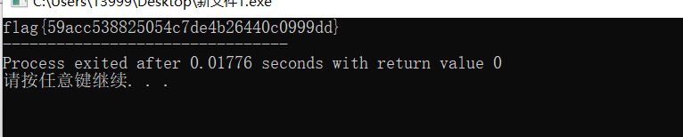

## 3.[Buuctf]-Java逆向解密 1

### 本题知识点

```
1.java程序基本分析
2.jadx使用
```

老实说，看不懂一点java.....

先拖入jadx

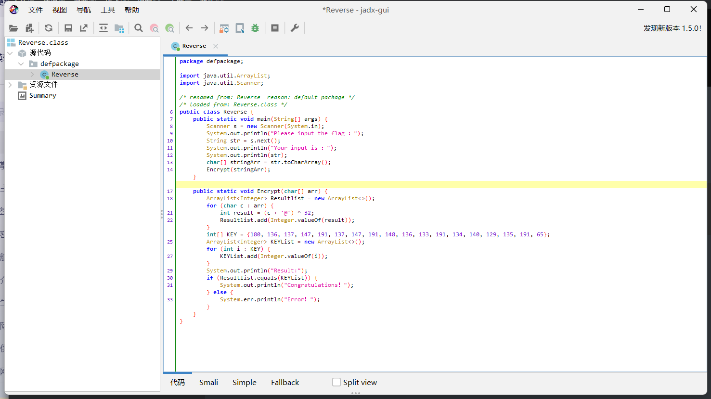

还是从字符串入手


看到有congratulations!

推测前面应该有一个涉及flag的比较，根据题目提示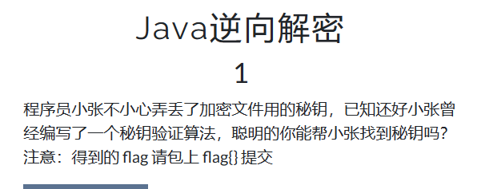

这是一个密钥验证算法，所以推测比较就是密钥和输入的比较，这点和之前做的题目都类似，只要我们找到密钥就是flag。

看不懂java代码没关系，AI看得懂

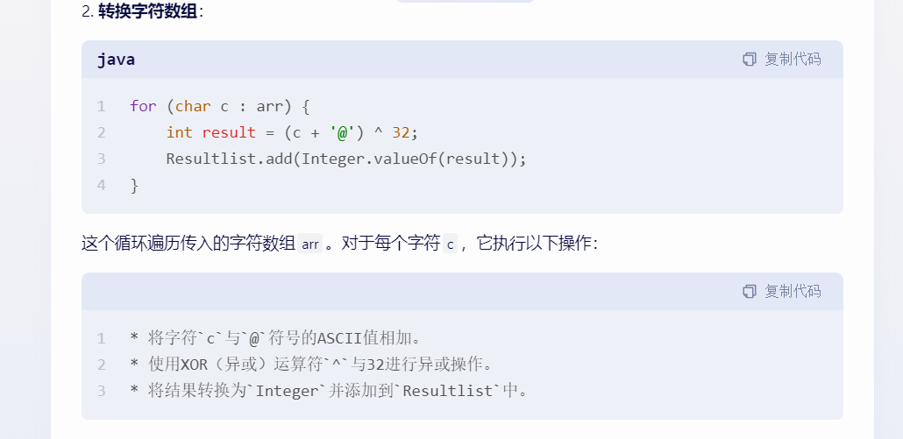

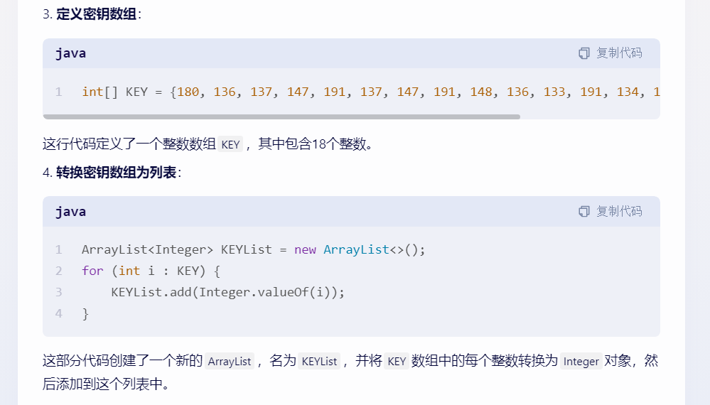

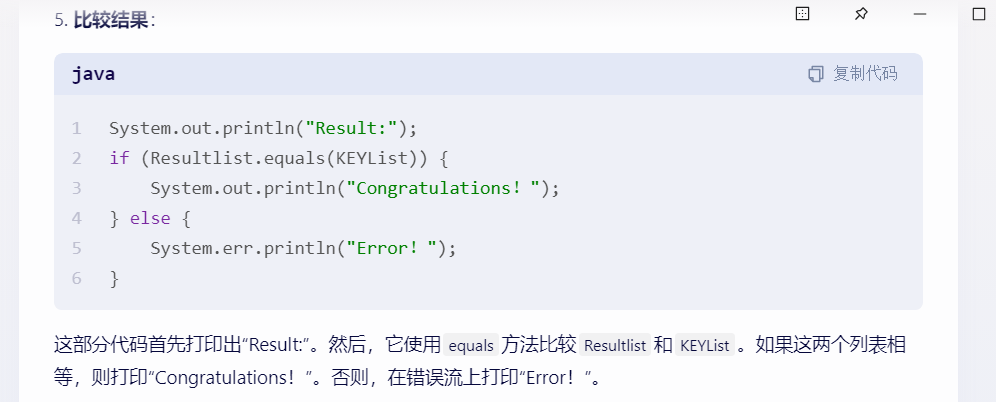

借助AI帮助我们理解程序，可以大致看到，是Resultlist 和KEY KEYList进行比较。

`KEYList`是数组`KEY`中每个整数转化为integer对象后存储的

`Resultlist`是转化之后再将结果转为`Integer`存储的。

理清楚后就可以开始编写还原程序了

```python
KEY = [180, 136, 137, 147, 191, 137, 147, 191, 148, 136, 133, 191, 134, 140, 129, 135, 191, 65]    
# 创建一个空列表来存储转换后的字符  
cArr = []   
# 遍历KEY中的每个整数  
for i in range(len(KEY)):  
    # 通过异或运算和字符与ASCII码之间的转换，得到原始的字符  
    # 这里使用 ((KEY[i] ^ 32) - ord('@')) 是为了逆转之前的转换操作 (c + '@') ^ 32  
    char = chr(((KEY[i] ^ 32) - ord('@')))  
    # 将字符添加到cArr列表中  
    cArr.append(char)  
# 将cArr列表中的字符连接成一个字符串并打印出来  
print(''.join(cArr))

```

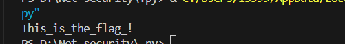

## 4.[Buuctf]-刮开有奖

*下一张，谢谢惠顾。*

### 本题知识点

```
1.DialogBoxParamA（）函数
2.基本的伪c改造成c代码
3.数组寻址公式。
```

终于回到熟悉的exe文件了，.exe RE第一步查壳子！

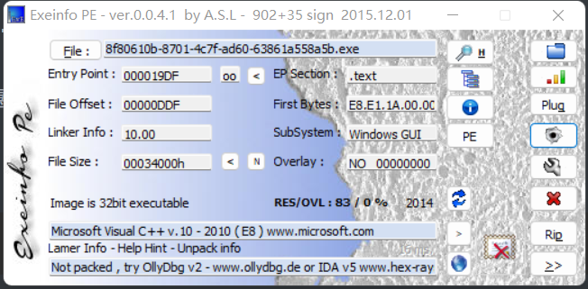

32位，无壳！

打开软件看看有什么有用的吗？

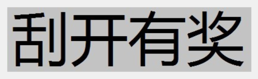

iad_32看程序，字符串窗口

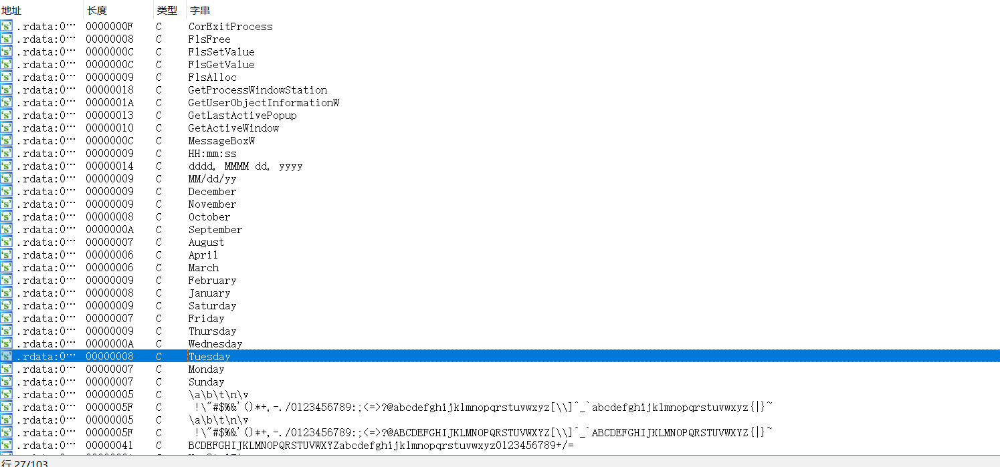

看了一下没有有用的信息

那就直接从主函数开始看起

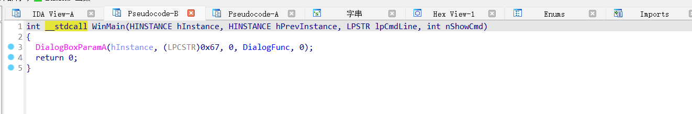

调用了DialogBoxParamA（）函数

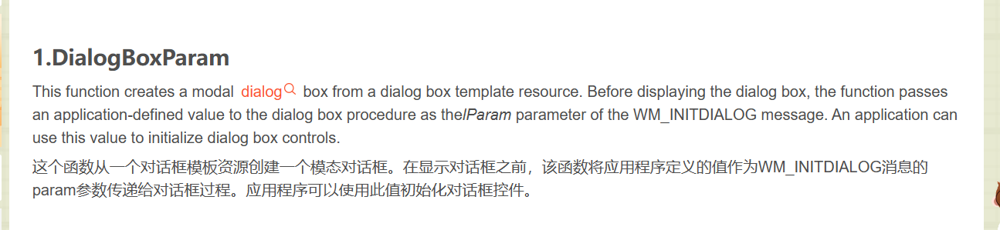

创建对话框的一个函数

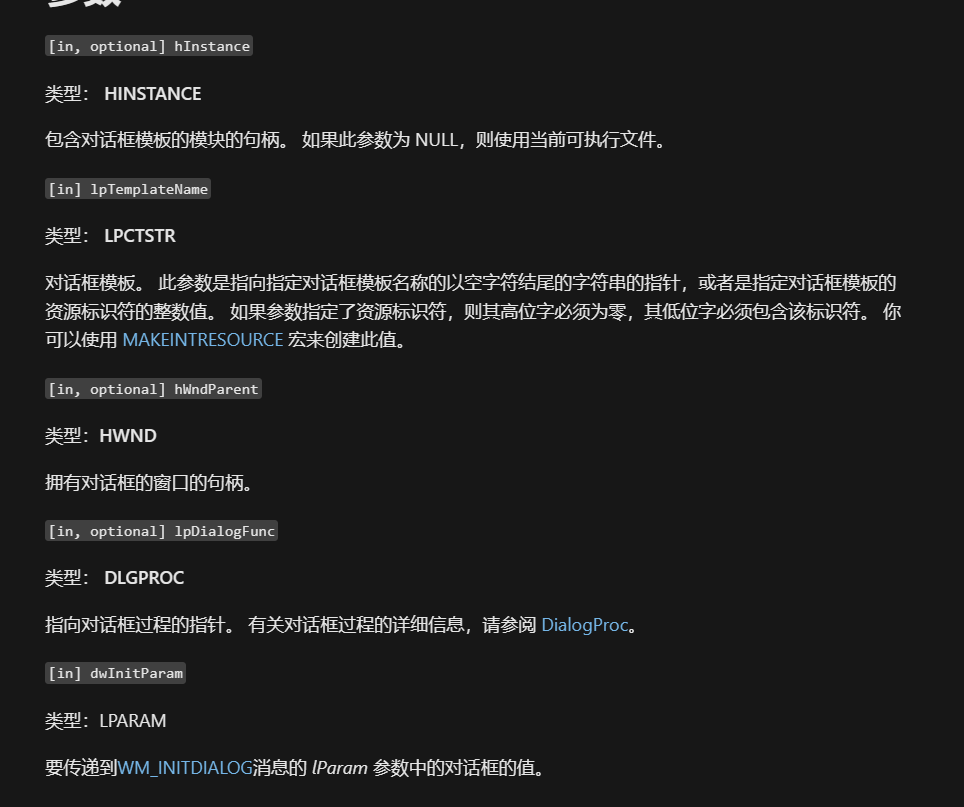

跟进查看参数：DialogFunc

跟进去查看详细的函数

```C#
INT_PTR __stdcall DialogFunc(HWND hDlg, UINT a2, WPARAM a3, LPARAM a4)
{
  const char *v4; // esi
  const char *v5; // edi
  int v7[2]; // [esp+8h] [ebp-20030h] BYREF
  int v8; // [esp+10h] [ebp-20028h]
  int v9; // [esp+14h] [ebp-20024h]
  int v10; // [esp+18h] [ebp-20020h]
  int v11; // [esp+1Ch] [ebp-2001Ch]
  int v12; // [esp+20h] [ebp-20018h]
  int v13; // [esp+24h] [ebp-20014h]
  int v14; // [esp+28h] [ebp-20010h]
  int v15; // [esp+2Ch] [ebp-2000Ch]
  int v16; // [esp+30h] [ebp-20008h]
  CHAR String[65536]; // [esp+34h] [ebp-20004h] BYREF
  char v18[65536]; // [esp+10034h] [ebp-10004h] BYREF

  if ( a2 == 272 )
    return 1;
  if ( a2 != 273 )
    return 0;
  if ( (_WORD)a3 == 1001 )
  {
    memset(String, 0, 0xFFFFu);
    GetDlgItemTextA(hDlg, 1000, String, 0xFFFF);
    if ( strlen(String) == 8 )
    {
      v7[0] = 90;
      v7[1] = 74;
      v8 = 83;
      v9 = 69;
      v10 = 67;
      v11 = 97;
      v12 = 78;
      v13 = 72;
      v14 = 51;
      v15 = 110;
      v16 = 103;
      sub_4010F0(v7, 0, 10);
      memset(v18, 0, 0xFFFFu);
      v18[0] = String[5];
      v18[2] = String[7];
      v18[1] = String[6];
      v4 = (const char *)sub_401000(v18, strlen(v18));
      memset(v18, 0, 0xFFFFu);
      v18[1] = String[3];
      v18[0] = String[2];
      v18[2] = String[4];
      v5 = (const char *)sub_401000(v18, strlen(v18));
      if ( String[0] == v7[0] + 34
        && String[1] == v10
        && 4 * String[2] - 141 == 3 * v8
        && String[3] / 4 == 2 * (v13 / 9)
        && !strcmp(v4, "ak1w")
        && !strcmp(v5, "V1Ax") )
      {
        MessageBoxA(hDlg, "U g3t 1T!", "@_@", 0);
      }
    }
    return 0;
  }
  if ( (_WORD)a3 != 1 && (_WORD)a3 != 2 )
    return 0;
  EndDialog(hDlg, (unsigned __int16)a3);
  return 1;
}
```


```
#include <stdio.h>
int  sub_4010F0(char* a1, int a2, int a3)
{
  int result; // eax
  int i; // esi
  int v5; // ecx
  int v6; // edx

  result = a3;
  for ( i = a2; i <= a3; a2 = i )
  {
    v5 = i;
    v6 = i[a1];
    if ( a2 < result && i < result )
    {
      do
      {
        if ( v6 > a1[result]) 
        {
          if ( i >= result )
            break;
          ++i;
          a1[v5] = a1[result];
          if ( i >= result )
            break;
          while ( a1[i] <= v6 )
          {
            if ( ++i >= result )
              goto LABEL_13;
          }
          if ( i >= result )
            break;
          v5 = i;
         a1[result] = a1[i];
        }
        --result;
      }
      while ( i < result );
    }
LABEL_13:
    a1[result] = v6 ;
    sub_4010F0(a1, a2, i - 1);
    result = a3;
    ++i;
  }
  return result;
}

int main()
{
	char str[] = "ZJSECaNH3ng";
	sub_4010F0(str,0,10);
	printf("%s", str);
	return 0;
}

```

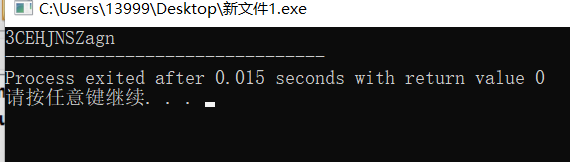

3CEHJNSZagn

拿到加密后的字符串

```C#
 memset(v18, 0, 0xFFFFu);
      v18[0] = String[5];
      v18[2] = String[7];
      v18[1] = String[6];
      v4 = (const char *)sub_401000(v18, strlen(v18));
      memset(v18, 0, 0xFFFFu);
      v18[1] = String[3];
      v18[0] = String[2];
      v18[2] = String[4];
      v5 = (const char *)sub_401000(v18, strlen(v18));
```

v4定义了 

v5 = sub_401000()函数处理，跟进看看

```c#
_BYTE *__cdecl sub_401000(int a1, int a2)
{
  int v2; // eax
  int v3; // esi
  size_t v4; // ebx
  _BYTE *v5; // eax
  _BYTE *v6; // edi
  int v7; // eax
  _BYTE *v8; // ebx
  int v9; // edi
  int v10; // edx
  int v11; // edi
  int v12; // eax
  int i; // esi
  _BYTE *result; // eax
  _BYTE *v15; // [esp+Ch] [ebp-10h]
  _BYTE *v16; // [esp+10h] [ebp-Ch]
  int v17; // [esp+14h] [ebp-8h]
  int v18; // [esp+18h] [ebp-4h]

  v2 = a2 / 3;
  v3 = 0;
  if ( a2 % 3 > 0 )
    ++v2;
  v4 = 4 * v2 + 1;
  v5 = malloc(v4);
  v6 = v5;
  v15 = v5;
  if ( !v5 )
    exit(0);
  memset(v5, 0, v4);
  v7 = a2;
  v8 = v6;
  v16 = v6;
  if ( a2 > 0 )
  {
    while ( 1 )
    {
      v9 = 0;
      v10 = 0;
      v18 = 0;
      do
      {
        if ( v3 >= v7 )
          break;
        ++v10;
        v9 = *(unsigned __int8 *)(v3 + a1) | (v9 << 8);
        ++v3;
      }
      while ( v10 < 3 );
      v11 = v9 << (8 * (3 - v10));
      v12 = 0;
      v17 = v3;
      for ( i = 18; i > -6; i -= 6 )
      {
        if ( v10 >= v12 )
        {
          *((_BYTE *)&v18 + v12) = (v11 >> i) & 0x3F;
          v8 = v16;
        }
        else
        {
          *((_BYTE *)&v18 + v12) = 64;
        }
        *v8++ = byte_407830[*((char *)&v18 + v12++)];
        v16 = v8;
      }
      v3 = v17;
      if ( v17 >= a2 )
        break;
      v7 = a2;
    }
    v6 = v15;
  }
  result = v6;
  *v8 = 0;
  return result;
}
```

再跟进byte_407830

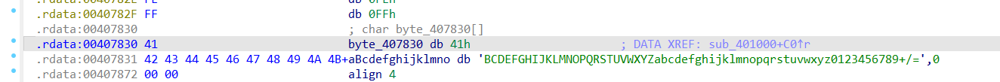

推测是将，v4 = ak1w，v5 = V1Ax，两个字符串base64加密。

对v4和v5进行base解码

加密之后，v4 = jMp，v5 = WP1.

最后分析最后一段if语句

```c#
 if ( String[0] == v7[0] + 34
        && String[1] == v10
        && 4 * String[2] - 141 == 3 * v8
        && String[3] / 4 == 2 * (v13 / 9)
        && !strcmp(v4, "ak1w")
        && !strcmp(v5, "V1Ax") )
      {
        MessageBoxA(hDlg, "U g3t 1T!", "@_@", 0);
      }
    }
    return 0;
  }
  if ( (_WORD)a3 != 1 && (_WORD)a3 != 2 )
    return 0;
  EndDialog(hDlg, (unsigned __int16)a3);
```

最后，我们看到最后的if语句，

第一句：String[0] == v7[0] + 34，这里的v7【0】，就是上面10个字符的第一个字符，我们通过加密函数之后，v7【0】由一开始的Z变成了，v7【0】 = 3.

3的ASCII码是51，51 + 34 = 85，85ASCII码对应的是大写的 U。flag第一个字符得到。

第二句：String[1] == v10，v10在之前没加密的时候，是排第五位，我们看看加密之后的第五位是谁，3CEHJNSZagn，可以看到，加密之后的第五位是 J。flag第二个字符得到。

第三句：4 * String[2] - 141 == 3 * v8，v8在没加密之前，是排第三位，先看看加密之后的第三位是谁，可以看到是E，E的ASCII码是69，所以3*69 + 141 / 4 = 87 ,ASCII为W,flag第三个字符得到。

第四句：String[3] / 4 == 2 * (v13 / 9)，看到v13没加密之前排到数第四位，看看加密之后的到数第四位是谁，是Z，Z的ASCII是90，所以2*（90/9）*4 = 80 ,ASCII为P，flag第四个字符得到。

后面四个字符，就是base64加密的那几个，可以看到第三第四字符已经是WP了，说明，WP1在前，jMp在后。

将他们拼接在一起，得到，UJWP1jMp。

**带上flag{}，得到flag{UJWP1jMp}。**

## 5.[第十五届蓝桥杯]rc4

*热爱一件事很简单，坚持一件事很难*

### 本题知识点

```
1.RC4加解密基本方法。
```

由于是赛题，所以本题解题过程较粗略

首先exe文件，查壳

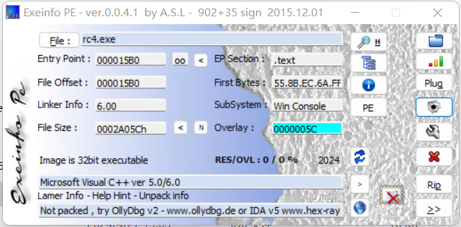

无壳，32位程序，拖入ida_32进行静态反编译查询

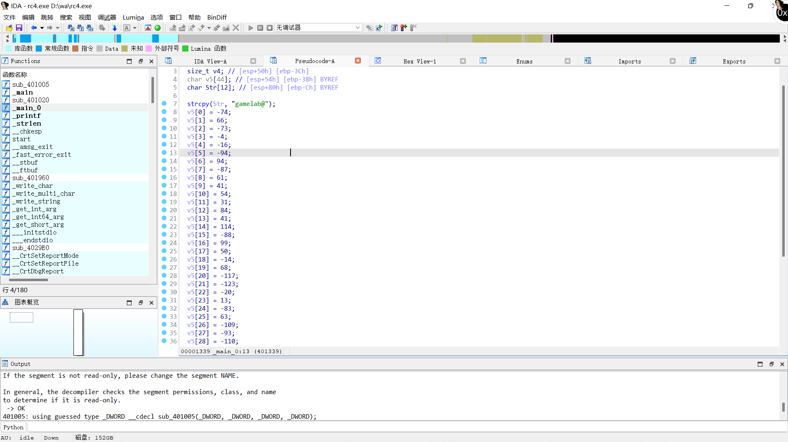

追踪到_main_0函数

发现加密代码。

#### 加解密原理

```
RC4 由伪随机数生成器和异或运算组成（由于异或运算的对合性，RC4 加密解密使用同一套算法）。RC4 的密钥长度可变，范围是[1,255]。RC4 一个字节一个字节地加解密。给定一个密钥，伪随机数生成器接受密钥并产生一个 S 盒。S 盒用来加密数据，而且在加密过程中 S 盒会变化。
```

提取出加密后的密文

```
a=[0xB6,0x42,0xB7,0xFC,0xF0,0xA2,0x5E,0xA9,0x3D,0x29,0x36,0x1F,0x54,0x29,0x72,0xA8,0x63,0x32,0xF2,0x44,0x8B,0x85,0xEC,0xD,0xAD,0x3F,0x93,0xA3,0x92,0x74,0x81,0x65,0x69,0xEC,0xE4,0x39,0x85,0xA9,0xCA,0xAF,0xB2,0xC6]
```

密钥是 gamelab@

编写解密脚本

```python
import base64
def rc4_main(key = "init_key", message = "init_message"):
    print("RC4解密主函数调用成功")
    print('\n')
    s_box = rc4_init_sbox(key)
    crypt = rc4_excrypt(message, s_box)
    return crypt
    
def rc4_init_sbox(key):
    s_box = list(range(256)) 
    print("原来的 s 盒：%s" % s_box)
    print('\n')
    j = 0
    for i in range(256):
        j = (j + s_box[i] + ord(key[i % len(key)])) % 256
        s_box[i], s_box[j] = s_box[j], s_box[i]
    print("混乱后的 s 盒：%s"% s_box)
    print('\n')
    return s_box
    
def rc4_excrypt(plain, box):
    print("调用解密程序成功。")
    print('\n')
    plain = base64.b64decode(plain.encode('utf-8'))
    plain = bytes.decode(plain)
    res = []
    i = j = 0
    for s in plain:
        i = (i + 1) % 256
        j = (j + box[i]) % 256
        box[i], box[j] = box[j], box[i]
        t = (box[i] + box[j]) % 256
        k = box[t]
        res.append(chr(ord(s) ^ k))
    cipher = "".join(res)
    print("解密后的字符串是：%s" %cipher)
    print('\n')

    return  cipher

a=[0xB6,0x42,0xB7,0xFC,0xF0,0xA2,0x5E,0xA9,0x3D,0x29,0x36,0x1F,0x54,0x29,0x72,0xA8,0x63,0x32,0xF2,0x44,0x8B,0x85,0xEC,0xD,0xAD,0x3F,0x93,0xA3,0x92,0x74,0x81,0x65,0x69,0xEC,0xE4,0x39,0x85,0xA9,0xCA,0xAF,0xB2,0xC6]
s=""
for i in a:
    s+=chr(i)

s=str(base64.b64encode(s.encode('utf-8')), 'utf-8')

rc4_main("gamelab@", s)

```

------

5LuK5aSp5Lmf5piv5LiN5oOz5YaZ5ZGo5oql55qE5LiA5aSpCgrkvaDkuLrku4DkuYjov5jopoHop6Plr4bov5nmrrViYXNl5Luj56CB77yM5L2g5Lmf5b6I5peg6IGK5ZCX77yfCgrlkajmiqXph4znmoTpopjnm67kvaDpg73nnIvnmoTmh4LlkJfvvJ8KCuaXoueEtuS9oOmDvei0ueWKsuino+WHuuadpeS6hu+8jOmCoy4uLi4uLgoK5L2g5pei54S25peg6IGK77yM5Y675om+R1BU6IGK6IGK5ZCnOmh0dHBzOi8vY2hhdC5vcGVuYWkuY29tLwoKCgoK

