打开发现是注入题

在bp中输入user={{7*7}}

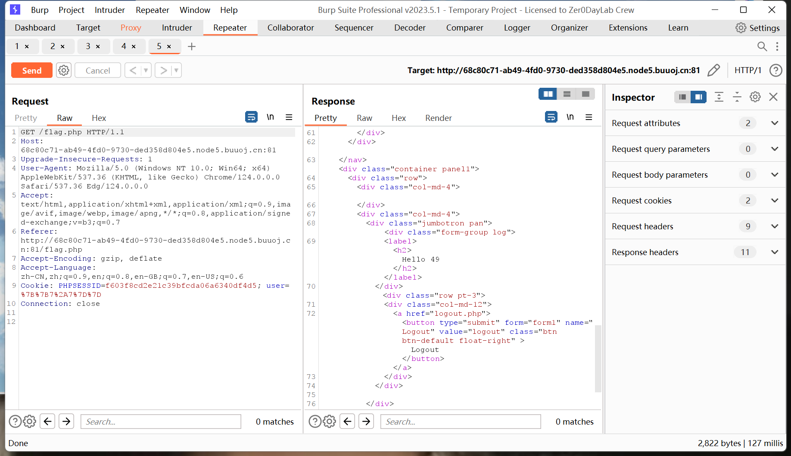

发现成功出现 49

根据下图  推断出为Twig模块

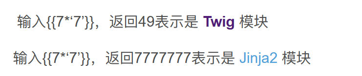

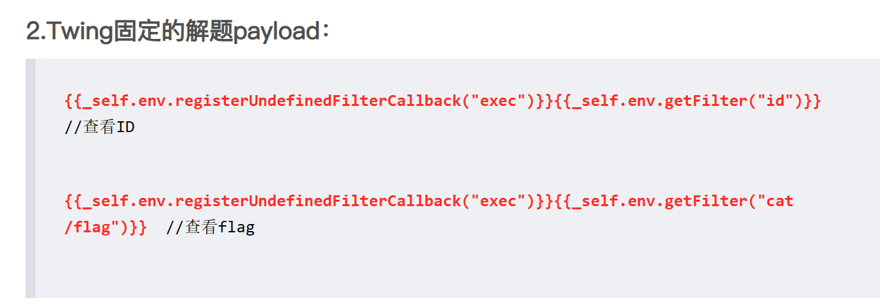

根据上面的模板 得到flag

第二题

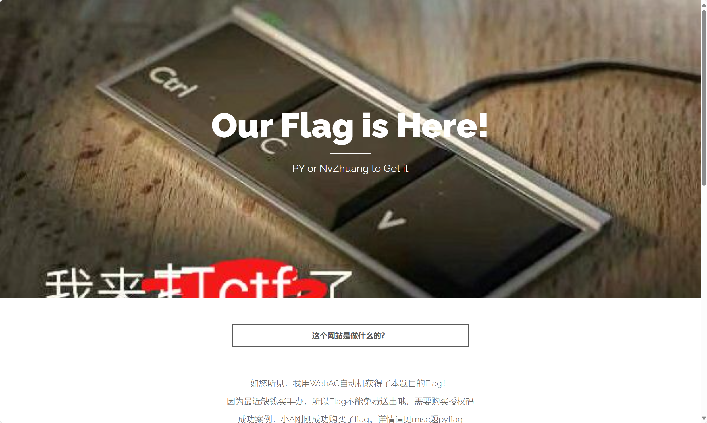

打开题目 没有什么信息 f12

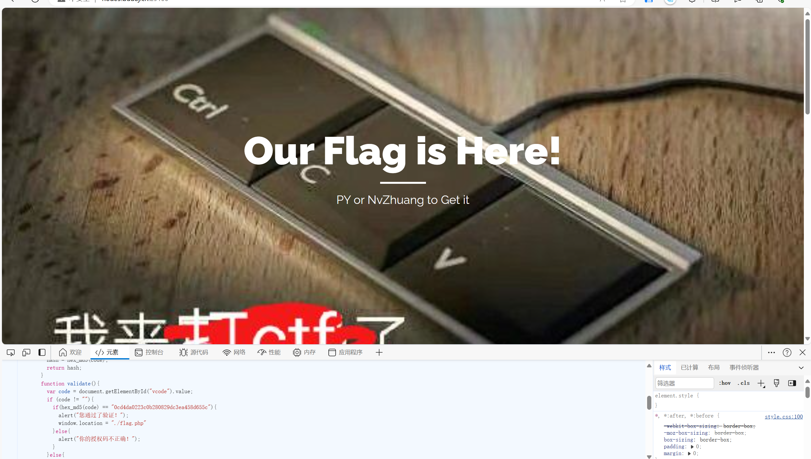

发现flag.php 打开 并f12

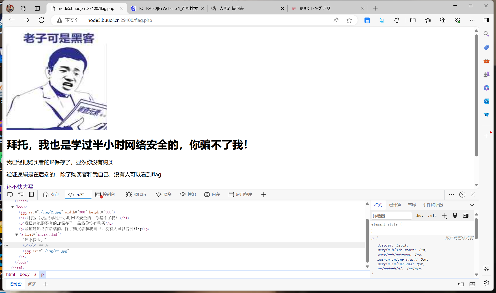

看到题目描述只有购买者和自己能看到 上网查到与了X-Forwarded-For有关

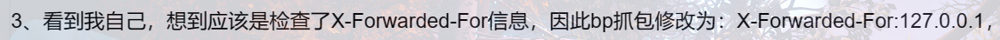

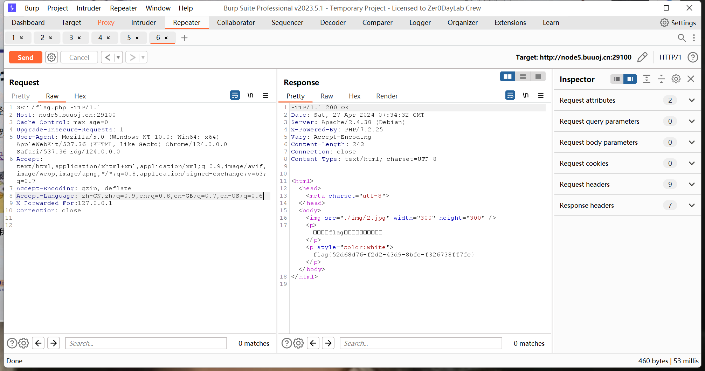

最终得到flag

第三题

打开源代码发现

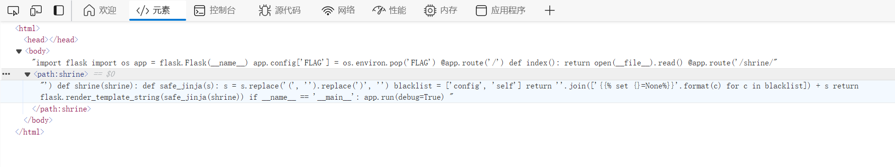

代码审计

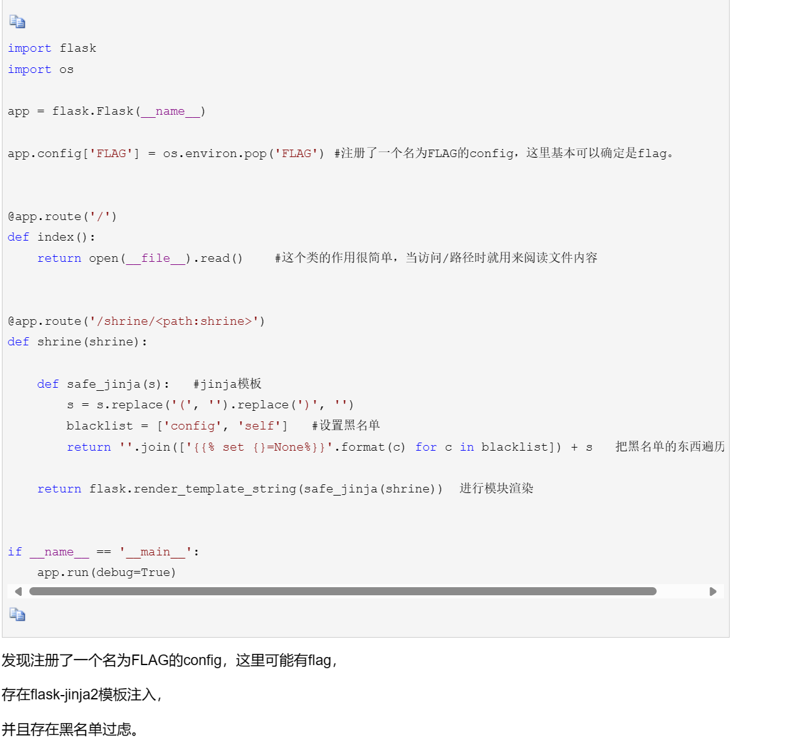

输入shrine/{{7*7}}

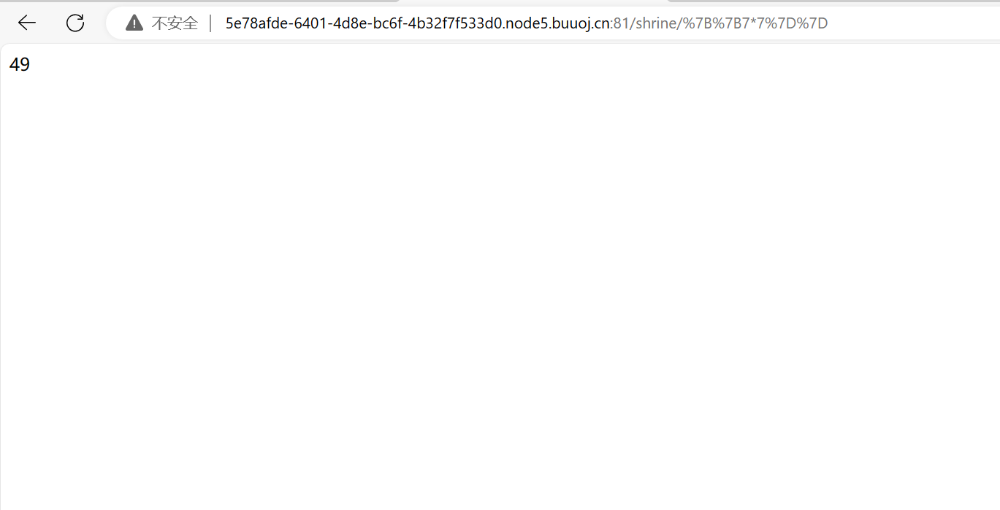

发现成功 

通过url_for()与globals()函数，绕过黑名单    /shrine/{{url_for.__globals__}}

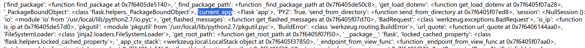

得到current app()

打开得到flag

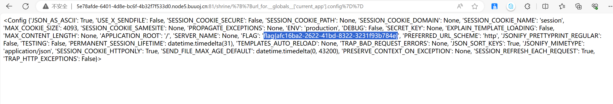

第四题

打开发现是一张 jpg 使用kali binwalk进行扫描

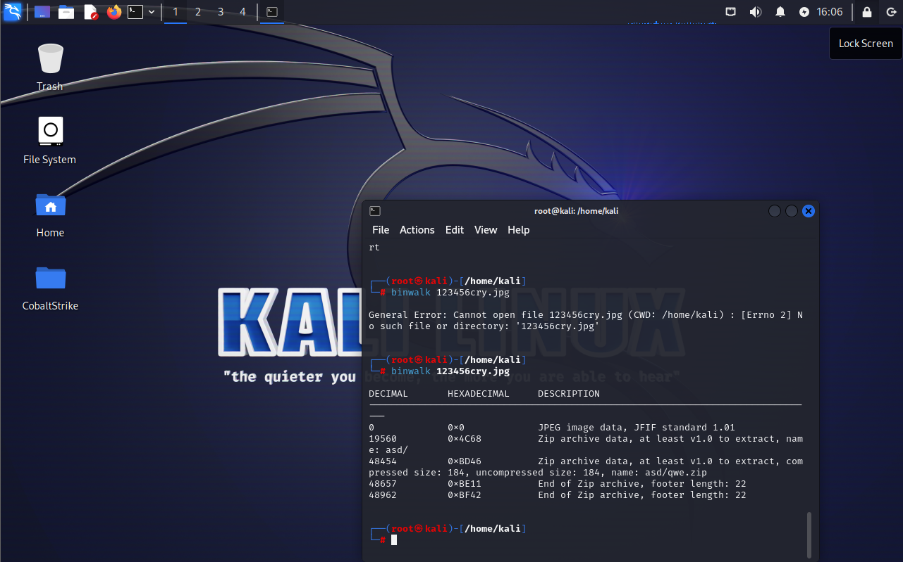

再使用foremost 进行分离

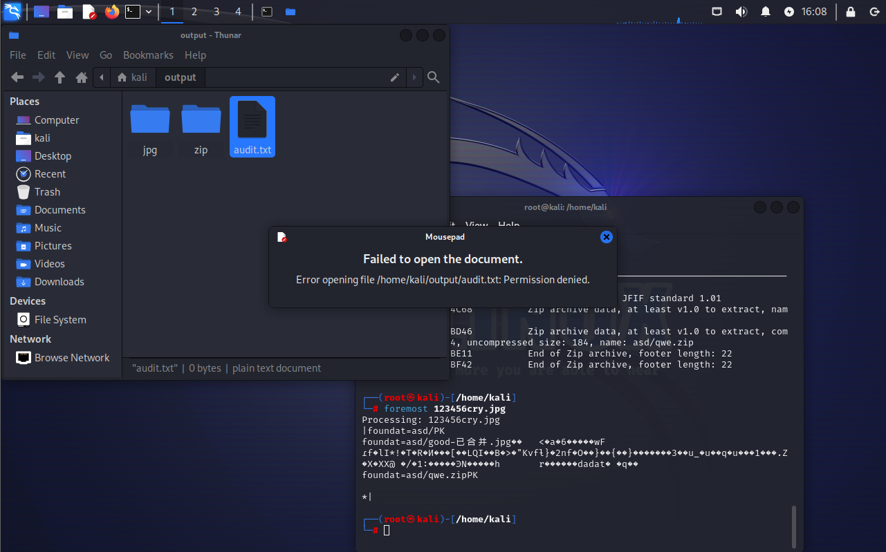

发现需要密码

使用steghide 

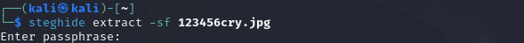

得到密码

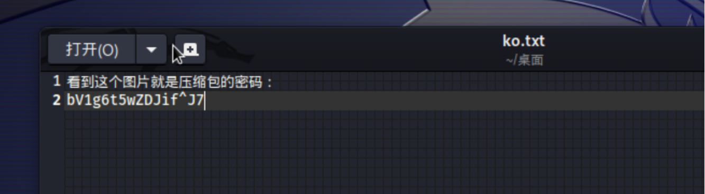

打开flag.txt得到flag

第五题

解压发现是

双击无法打开

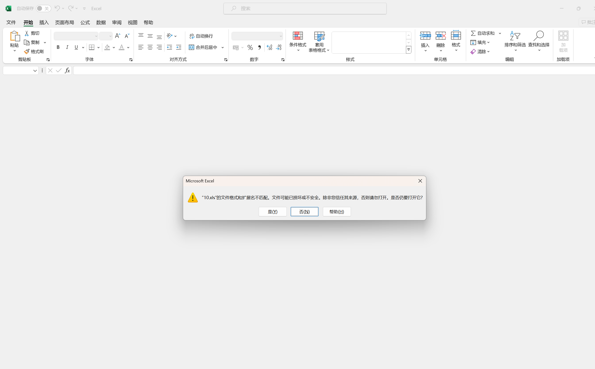

拖进010

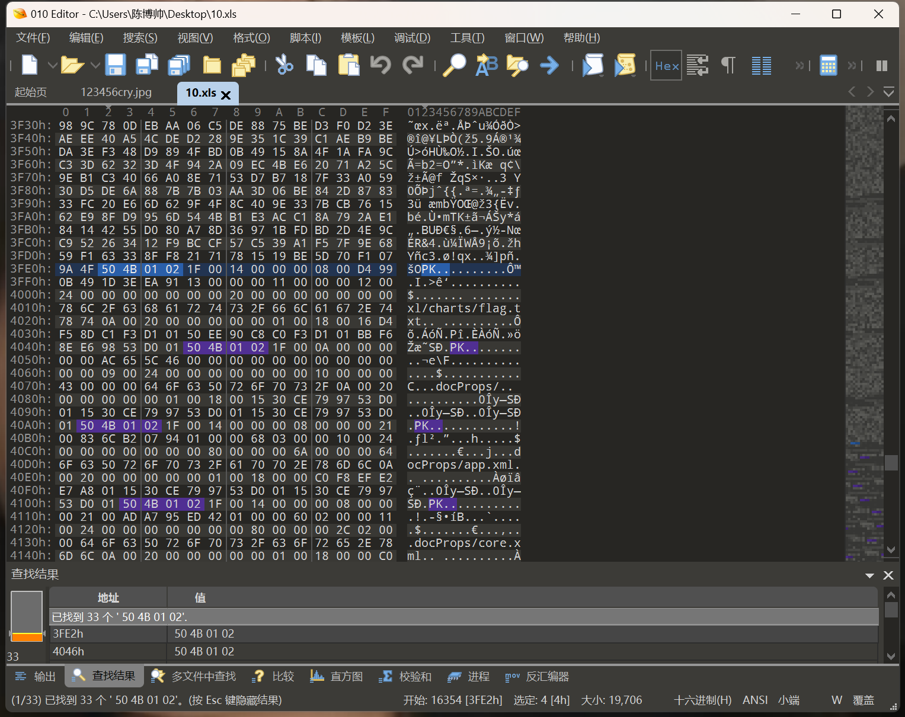

发现含有pk文件头 怀疑是zip文件 将文件后缀改为.zip

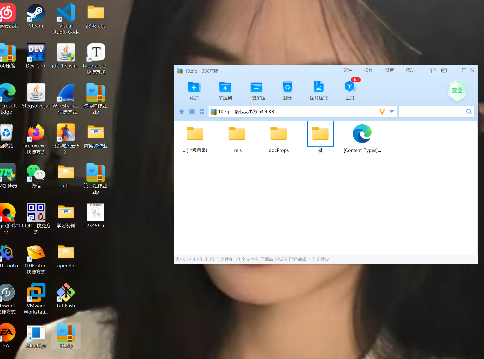

打开xl文件夹 在charts文件夹中发现flag.txt

打开后得到flag