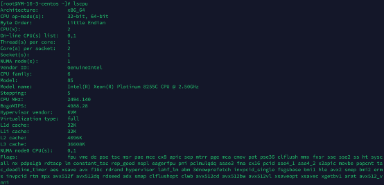
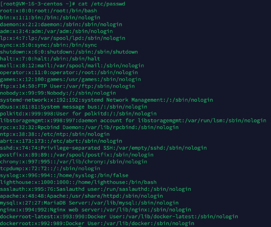
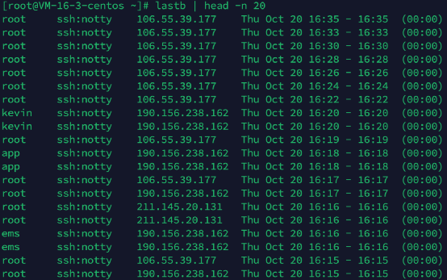
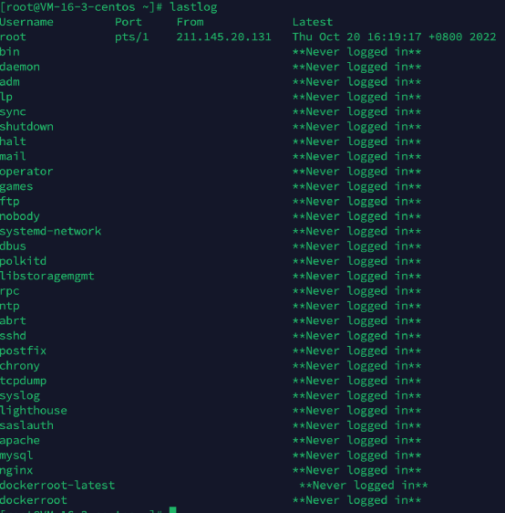
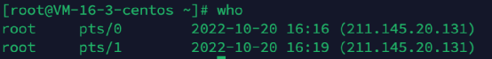

title: Linux 应急响应命令总结（未完工）
author: John Doe
date: 2022-11-17 13:44:58
tags:
---
# CPU 信息

CPU 信息：lscpu

# 操作系统信息

操作系统信息：uname -a

操作系统信息：cat /proc/version

# 模块信息

模块信息：lsmod

# 账户信息

系统所有账户

系统所有账户：cat /etc/passwd

超级权限账户

超级权限账户：awk -F: '{if($3==0)print $1}' /etc/passwd

可登录账户

可登录账户：cat /etc/passwd | grep '/bin/bash'

最近20条登录失败信息

最近20条登录失败信息：lastb | head -n 20

所有账号最后登录信息

所有账号最后登录信息：lastlog

最近20条登录信息

最近20条登录信息：last | head -n 20

当前登录账号信息

当前登录账号信息：who

空口令账号

空口令账号：awk -F: '{if($2==0)print $1}' /etc/shadow

启动项

启动项：ls -lat /etc/init.d/

启动项：cat /etc/init.d/rc.local

启动项：cat /etc/rc.local

计划任务

当前计划任务

当前计划任务：crontab -l

# Linux Crontab 计划任务

