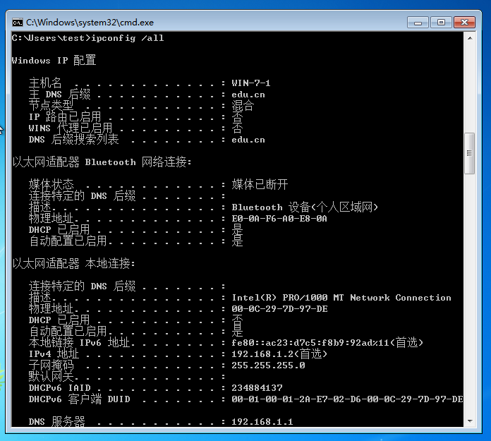
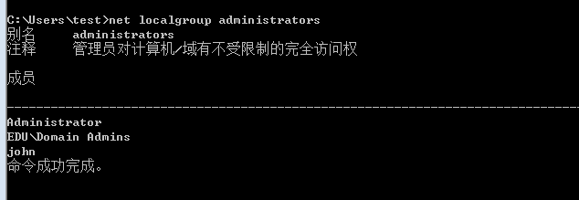
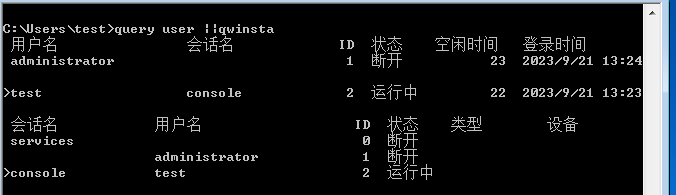
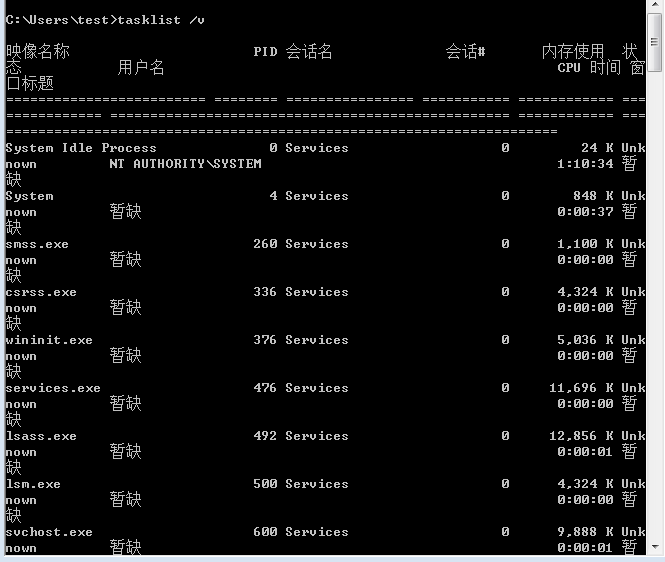
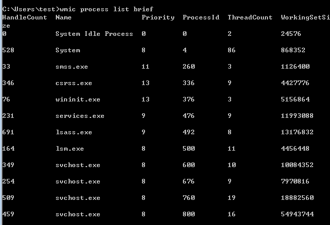
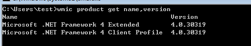
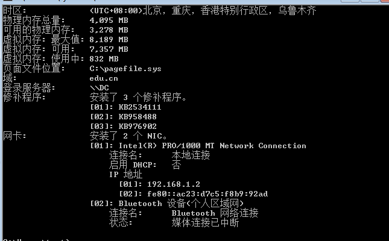
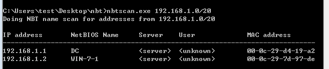
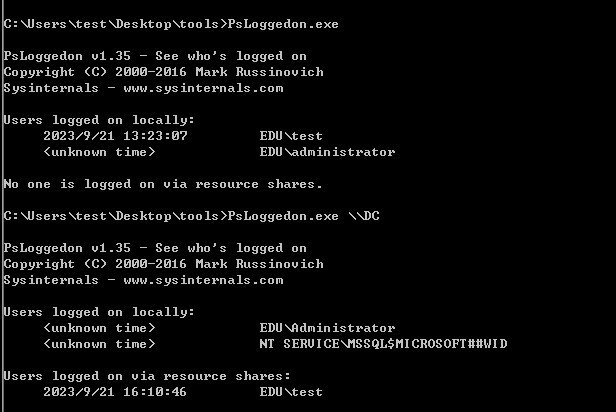
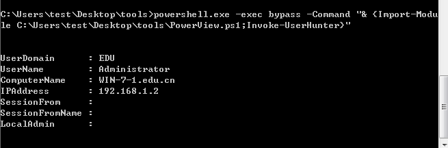

title: 内网渗透-前渗透
author: John Doe
date: 2023-09-21 13:49:55
tags:
---
# 内网信息收集

## 查询域
`ipconfig /all`

`net view`

`net localgroup administrators`

`query user ||qwinsta`

## 查询进程

`tasklist /v`

`wmic process list brief`

## 本机系统收集

`systeminfo | findstr /B /C:"OS 名称" /C:"OS 版本"`

`wmic product get name,version`

`powershell "Get-WmiObgect -class Win32_Product |Select-Object -Property name,version"`

`netstat -ano`

`systeminfo`

`net share`

<b>关闭防火墙</b>
win2003之前系统：`netsh firewall set opmode disable`
win2003之后系统：`netsh advfirewall set allprofiles state off`

`whoami /all`

## 域内存活主机探测

### 使用nbtscan.exe进行扫描

### 使用icmp探测

`for /L %I in(1,1,254) DO @ping -w 1 -n 1 192.162.1.%I |findstr "TTL="`

### 使用arp探测

### fscan大法

# 定位域管理员

## 一些工具
<li>psloggedon.exe
<li>PVEFindADUser.exe
<li>netview.exe
<li>netsess.exe
<li>Nmap的NSE脚本
<li>PowerView脚本-Invoke-UserHunter
<li>Empire下user_hunter模块

`psloggedon.exe`

可以看到域控或其它用户的登录时间

`PVEFindADUser.exe --current`
找到域内所有的计算机登录用户

`netsess.exe`
查询链接主机会话时间

`PowerView脚本-Invoke-UserHunter`
<b>powershell绕过隐藏使用</b>
`powershell.exe -exec bypass -Command "& {Import-Module C:\PowerView.ps1;Invoke-UserHunter}"`

# 查找域管理进程

## 本机检查

获取域管理员列表
`net group "domain amdins" /domain`

可以用`tasklist /v`看本机进程是什么权限

## 查询域控制器的域用户会话

收集域控制器列表
`net group "Domain Controllers" /domain`

收集域管理员列表
`net group "Domain Admins" /domain `

然后可以使用Netsess.exe查询每个域控制器，使用-h收集

# BloodHound

