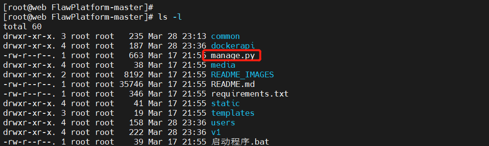
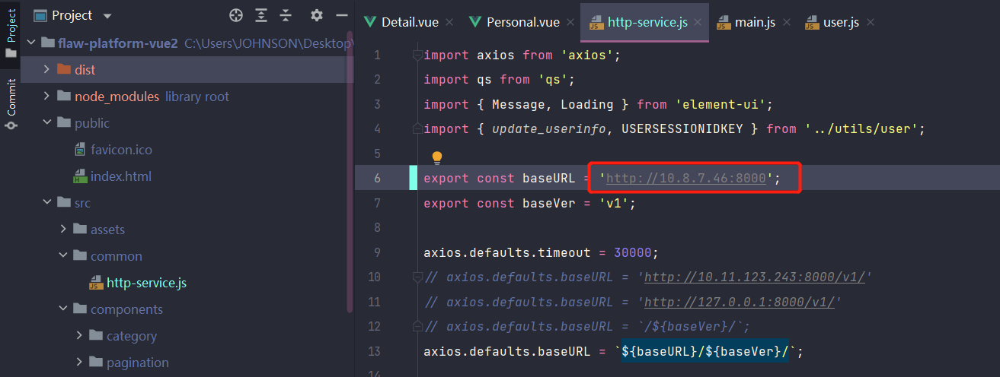

title: FlawPlatform 漏洞靶场安装
author: John Jue
tags: []
categories: []
date: 2023-10-19 14:29:00
---
经过多次安装领悟出来的安装顺序
项目地址：
https://github.com/S2eTo/FlawPlatform
项目开启dockerapi端口，布置到公网有风险
全文使用centos7.9操作系统

# 安装python3
首先安装依赖
```
yum -y install zlib-devel bzip2-devel openssl-devel ncurses-devel sqlite-devel readline-devel tk-devel gdbm-devel db4-devel libpcap-devel xz-devel gcc libffi-devel 
```
下载 python 3.7.1。若出现 command not found 的错误，通过命令 yum -y install wget 安装 wget 即可
```
wget https://www.python.org/ftp/python/3.7.1/Python-3.7.1.tgz
```
创建安装目录
```
mkdir -p /usr/local/python3
```
解压安装包
```
tar -zxvf Python-3.7.1.tgz
```
安装 gcc
```
yum install gcc -y
```
安装python3依赖环境
```
yum install libffi-devel -y
```
进入解压后的 Python 3 安装包目录
```
cd Python-3.7.1
```
生成编译脚本
```
./configure --prefix=/usr/local/python3
```
编译安装
```
make && make install
```
测试安装是否成功
```
/usr/local/python3/bin/python3
```
创建软连接（冲突就把原来的删了）
```
ln -s /usr/local/python3/bin/pip3 /usr/bin/pip3
ln -s /usr/local/python3/bin/python3 /usr/bin/python3
```
安装所需依赖
```
yum install python-devel -y
yum install zlib-devel -y
yum install libjpeg-turbo-devel -y
```
# 安装docker

```
yum-config-manager --add-repo http://mirrors.aliyun.com/docker-ce/linux/centos/docker-ce.repo
yum install docker-ce -y
```
修改dockerapi端口
```
vim /usr/lib/systemd/system/docker.service
```
将原本的ExecStart那一行注释掉，添加下面的
```
ExecStart=/usr/bin/dockerd -H tcp://0.0.0.0:2375 -H unix://var/run/docker.sock
```
重启docker
```
systemctl daemon-reload
systemctl restart docker
```
使用`netstat -ano|grep 2375`检查是否开启

# SQLite3 数据库配置

下载 Sqlite 最新版安装包
```
wget https://www.sqlite.org/2022/sqlite-autoconf-3380200.tar.gz
```
解压安装包
```
tar zxvf sqlite-autoconf-3380200.tar.gz
```
进入解压后的安装包目录
```
cd sqlite-autoconf-3380200
```
生成编译脚本
```
./configure --prefix=/usr/local/sqlite3
```
编译安装
```
make && make install
```
检查安装是否成功
```
/usr/local/sqlite3/bin/sqlite3 --version
```
检查旧版本
```
/usr/bin/sqlite3 --version
```
将旧版本更换名字
```
mv /usr/bin/sqlite3  /usr/bin/sqlite3_old
```
设置新版本软连接
```
ln -s /usr/local/sqlite3/bin/sqlite3 /usr/bin/sqlite3
```
检查 sqlite3 版本
```
sqlite3 --version
```
编辑环境变量文件 $HOME/.bash_profile 添加下列变量
```
export LD_LIBRARY_PATH="$LD_LIBRARY_PATH:/usr/local/sqlite3/lib"
```
重新加载环境变量
```
source $HOME/.bash_profile
```


# 迁移数据库
解压项目压缩文件后，cd 切换工作目录到项目文件夹中，与 manage.py 同级
先安装python所需库
```
pip3 install -r requirements.txt -i http://pypi.douban.com/simple/

pip install urllib3==1.25.11
```


创建迁移记录
```
python3 manage.py makemigrations
```
迁移创建数据库
```
python3 manage.py migrate
```
# 配置 Django Docker Remote API 信息
cd 切换工作目录到项目文件夹中，与 manage.py 同级


编辑 common/settings.py 文件
```
vim common/settings.py
```
修改EXTERNAL_URL为你的服务器IP
```
DOCKER_API = {
    'URL': 'tcp://0.0.0.0:2375',
    
    # 2.外部映射地址, 只起到显示作用。同时是提供外部访问容器端口的地址
    'EXTERNAL_URL': '10.8.7.46',
    
    # 2.随机 Flag 设置的环境变量名称，建议默认
    'FLAG_ENVIRONMENT_NAME': 'RANDOM_FLAG',
    
    # 2.自动删除容器/靶机时间如: +1 为一小时后自动关闭
    'AUTO_REMOVE_CONTAINER': +1
}
```
# 配置邮件服务器
```
vim common/settings.py
```
# 启动服务
设置管理员账号密码
```
python3 manage.py createsuperuser
```
启动
```
python3 manage.py runserver 0:8000
```
# 部署前端
下载前端
打开项目文件`src/common/http-service.js`根据后端部署的地址和端口进行设置


在项目目录文件夹下 使用`npm run build`进行打包，注意与`package.json 同目录

打包完成后回生成一个 dist 目录


安装 httpd 服务
```
yum -y install httpd
```
将dist目录里的东西放到httpd根目录即可